# Diagramme visuel de l’écosystème documentaire

```mermaid
flowchart TD
    subgraph CentralCoordinator[Central Coordinator]
        CC[Supervision, Monitoring, Arbitrage]
    end
    subgraph IntegratedManager[Integrated Manager]
        IM[Orchestration opérationnelle]
        BM[Branch Manager]
        CM[Cache Manager]
        CMM[Context Memory Manager]
        FMAO[FMAO Manager]
        NM[Notification Manager]
        SM[Security Manager]
        MM[Metrics Manager]
        SCHM[Scheduler Manager]
        DOCM[DocManager]
        CSM[ConfigurableSyncRuleManager]
        SMM[SmartMergeManager]
        SHM[SyncHistoryManager]
        CONFM[ConflictManager]
        EXT[ExtensibleManagerType]
        N8N[N8NManager]
        ERRM[ErrorManager]
        SCRM[ScriptManager]
        STORM[StorageManager]
        MONM[MonitoringManager]
        MAINTM[MaintenanceManager]
        MIGM[MigrationManager]
        NOTIFM[NotificationManagerImpl]
        CHANM[ChannelManagerImpl]
        ALERTM[AlertManagerImpl]
        SVSM[SmartVariableSuggestionManager]
    end
    subgraph Orchestrator[Orchestrator]
        ORCH[Distribution, Exécution, Suivi des jobs]
    end
    ORCH --> IM
    IM --> BM
    IM --> CM
    IM --> CMM
    IM --> FMAO
    IM --> NM
    IM --> SM
    IM --> MM
    IM --> SCHM
    IM --> DOCM
    IM --> CSM
    IM --> SMM
    IM --> SHM
    IM --> CONFM
    IM --> EXT
    IM --> N8N
    IM --> ERRM
    IM --> SCRM
    IM --> STORM
    IM --> MONM
    IM --> MAINTM
    IM --> MIGM
    IM --> NOTIFM
    IM --> CHANM
    IM --> ALERTM
    IM --> SVSM
    CC --> IM
    CC -.-> ORCH
    CC -.-> BM
    CC -.-> CM
    CC -.-> CMM
    CC -.-> FMAO
    CC -.-> NM
    CC -.-> SM
    CC -.-> MM
    CC -.-> SCHM
    CC -.-> DOCM
    CC -.-> CSM
    CC -.-> SMM
    CC -.-> SHM
    CC -.-> CONFM
    CC -.-> EXT
    CC -.-> N8N
    CC -.-> ERRM
    CC -.-> SCRM
    CC -.-> STORM
    CC -.-> MONM
    CC -.-> MAINTM
    CC -.-> MIGM
    CC -.-> NOTIFM
    CC -.-> CHANM
    CC -.-> ALERTM
    CC -.-> SVSM
```

---

- **L’orchestrator** distribue et suit les jobs, envoie les tâches à l’integrated-manager.
- **L’integrated-manager** orchestre tous les managers métiers.
- **Le central-coordinator** supervise, collecte, arbitre, et peut piloter tout ou partie de l’écosystème.

Pour la légende et les détails, voir [ecosystem-overview.md](ecosystem-overview.md) et [INDEX.md](../MANAGERS/INDEX.md).
