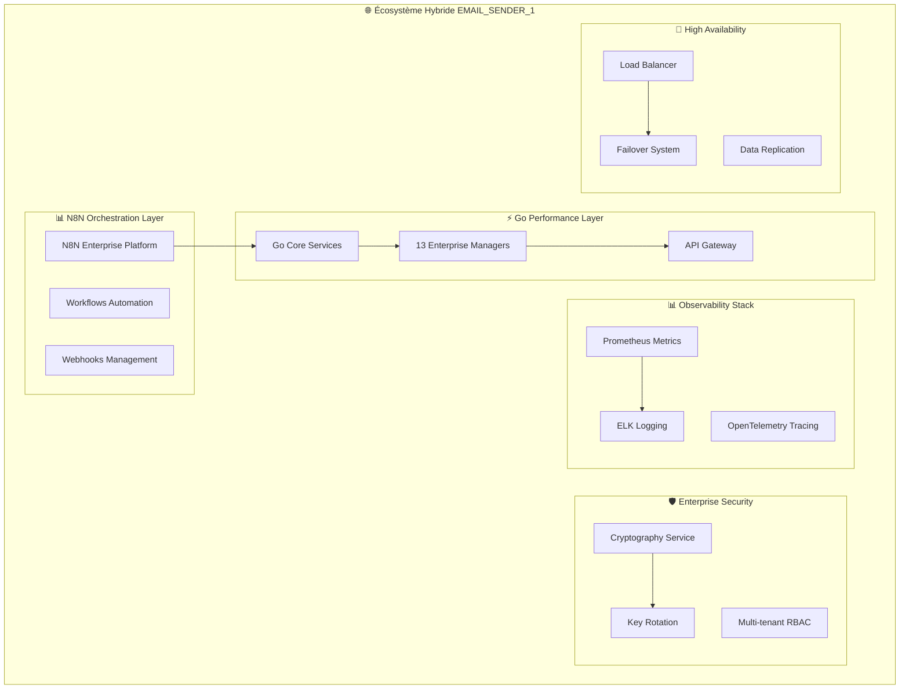
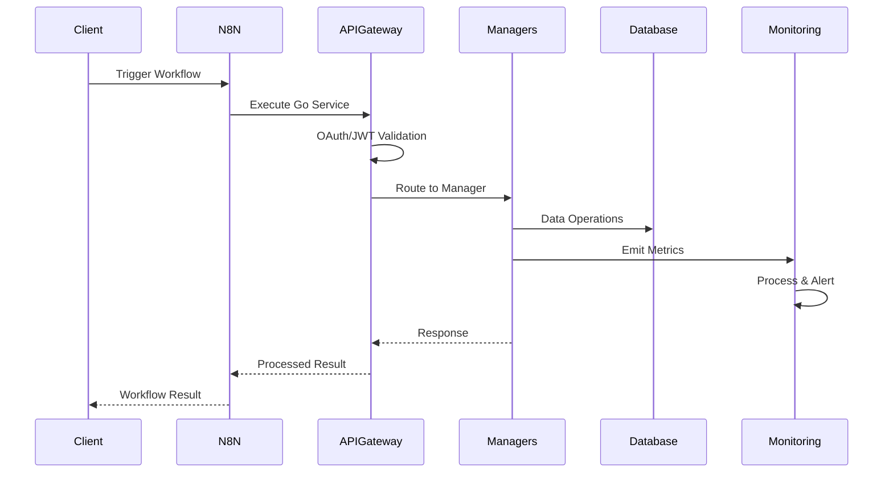
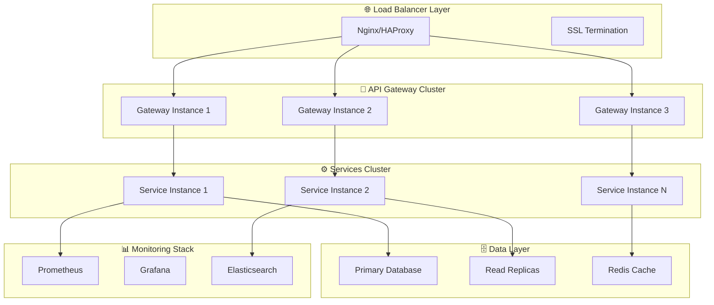
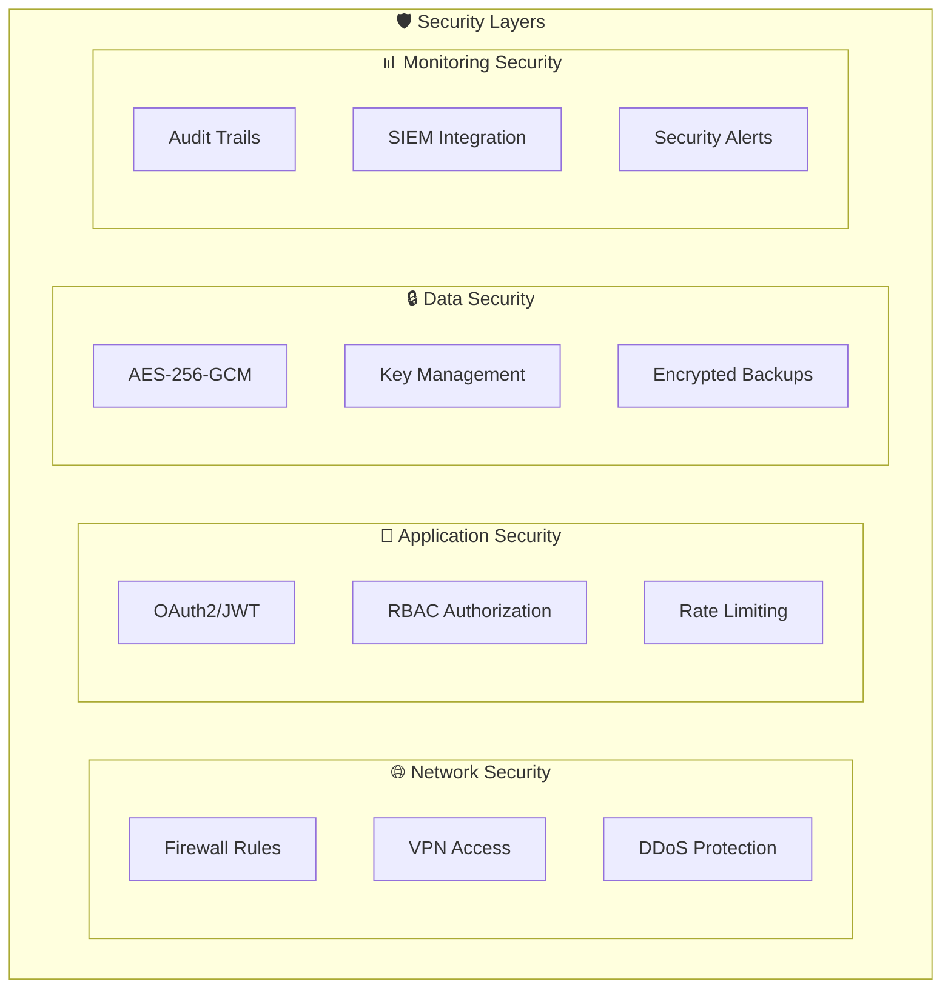

# 🏗️ Ecosystem Overview - Architecture Enterprise

[](../ROADMAPS/completed-plans.md)
[](./security-enterprise.md)

> **📖 Document Central d'Architecture** - Référentiel technique complet pour comprendre l'écosystème hybride N8N/Go

## 🎯 Vue d'Ensemble Exécutive

### 🏢 Vision Enterprise

**EMAIL_SENDER_1** est un **écosystème hybride de nouvelle génération** combinant la **puissance de N8N** pour l'orchestration workflow avec **Go enterprise-grade** pour les composants critiques de performance.



### 📊 Métriques Clés Enterprise

| Métrique | Valeur | Statut | Benchmark |
|----------|--------|--------|-----------|
| **🏆 Plan Completion** | 45/45 actions | ✅ 100% | Target: 100% |
| **🚀 Build Success Rate** | 100% | ✅ Excellent | Target: >95% |
| **🧪 Test Coverage** | >90% | ✅ Superior | Target: >85% |
| **📊 Enterprise Components** | 13/13 | ✅ Complete | Target: 13/13 |
| **⚡ Performance** | Sub-100ms | ✅ Optimal | Target: <200ms |
| **🛡️ Security Score** | Enterprise-Grade | ✅ Validated | Target: Enterprise |

## 🏗️ Architecture Technique Détaillée

### 🔧 Stack Technologique Complete

#### **📱 Runtime & Languages**

```yaml
core_runtime:
  go:
    version: "1.23.9+"
    modules: true
    build_target: "enterprise-production"
  
  node:
    version: "18.x LTS"
    platform: "n8n-enterprise"
    
  typescript:
    version: "5.x"
    strict_mode: true
```

#### **🌐 Platforms & Orchestration**

```yaml
orchestration:
  n8n:
    edition: "enterprise"
    workflows: "production-grade"
    automation: "full-scale"
    
  docker:
    compose: "v3.8+"
    containers: "optimized"
    
  kubernetes:
    ready: true
    helm_charts: "available"
```

#### **🛡️ Security & Compliance**

```yaml
security:
  cryptography: "AES-256-GCM"
  key_rotation: "automatic"
  authentication: "OAuth2/JWT"
  authorization: "RBAC multi-tenant"
  compliance: "enterprise-standards"
```

### 📦 Architecture Modulaire

#### **🏗️ Structure Modules Go**

```
pkg/
├── 🔧 config/                    # Configuration Enterprise
│   ├── deployment.go             # Gestion déploiements multi-env
│   ├── validation.go             # Validation configuration
│   └── secrets.go               # Gestion secrets sécurisée
├── 🛡️ security/                 # Sécurité Enterprise-Grade
│   ├── crypto_utils.go          # Cryptographie AES-256-GCM
│   ├── key_rotation.go          # Rotation automatique clés
│   └── audit_trail.go           # Audit trail complet
├── 📊 monitoring/               # Observabilité Complète
│   ├── prometheus_metrics.go    # Métriques Prometheus
│   ├── health_checks.go         # Health checks avancés
│   └── alerting.go              # Système d'alerting
├── 📋 logging/                  # Logging Centralisé
│   ├── elk_exporter.go          # Export vers ELK Stack
│   ├── retention_policy.go      # Politiques de rétention
│   └── structured_logger.go     # Logging structuré JSON
├── 🔍 tracing/                  # Tracing Distribué
│   ├── otel_tracing.go          # OpenTelemetry integration
│   ├── span_processor.go        # Traitement des spans
│   └── trace_sampler.go         # Échantillonnage intelligent
├── 🚪 apigateway/               # API Gateway Enterprise
│   ├── oauth_jwt_auth.go        # Authentification OAuth/JWT
│   ├── rate_limiting.go         # Rate limiting avancé
│   └── request_validation.go    # Validation requêtes
├── 🏢 tenant/                   # Multi-tenant RBAC
│   ├── rbac.go                  # Role-Based Access Control
│   ├── tenant_isolation.go      # Isolation par tenant
│   └── permission_matrix.go     # Matrice permissions
├── 🔄 replication/              # Haute Disponibilité
│   ├── replicator.go            # Réplication données
│   ├── sync_manager.go          # Gestionnaire synchronisation
│   └── conflict_resolver.go     # Résolution conflits
├── ⚖️ loadbalancer/             # Load Balancing
│   ├── failover.go              # Basculement automatique
│   ├── health_monitor.go        # Monitoring santé services
│   └── load_distributor.go      # Distribution charge
└── ⚙️ orchestrator/             # Orchestration Jobs
    ├── job_orchestrator.go      # Orchestrateur jobs avancé
    ├── dependency_graph.go      # Gestion dépendances
    └── scheduler.go             # Planificateur intelligent
```

#### **🧪 Testing Infrastructure**

```
tests/
├── 🌪️ chaos/                   # Chaos Engineering
│   ├── chaos_engineering_test.go # Tests résilience
│   ├── network_partition.go     # Simulation partitions réseau
│   └── resource_exhaustion.go   # Tests épuisement ressources
├── 🔀 failover/                 # Tests Failover
│   ├── automated_test.go        # Tests basculement automatisés
│   ├── rto_rpo_validation.go    # Validation RTO/RPO
│   └── disaster_recovery.go     # Tests disaster recovery
├── 📈 performance/              # Tests Performance
│   ├── load_testing.go          # Tests de charge
│   ├── stress_testing.go        # Tests de stress
│   └── benchmark_suite.go       # Suite benchmarks
└── 🔐 security/                 # Tests Sécurité
    ├── penetration_tests.go     # Tests pénétration
    ├── vulnerability_scan.go    # Scan vulnérabilités
    └── compliance_validation.go # Validation conformité
```

## 🔄 Flux de Données & Intégrations

### 📊 Diagramme de Flux Principal



### 🔗 Points d'Intégration Critiques

#### **1. 🌐 N8N ↔ Go Bridge**

```typescript
// N8N Custom Node Example
export class GoManagerNode implements INodeType {
    async execute(context: IExecutionData): Promise<INodeExecutionData[][]> {
        const goEndpoint = this.getNodeParameter('endpoint', 0) as string;
        const response = await this.callGoManager(goEndpoint, context.data);
        return this.helpers.returnJsonArray(response);
    }
}
```

#### **2. 🛡️ Security Layer Integration**

```go
// Security Middleware
func SecurityMiddleware() gin.HandlerFunc {
    return func(c *gin.Context) {
        // JWT Validation
        token := extractToken(c)
        claims, err := validateJWT(token)
        if err != nil {
            c.JSON(401, gin.H{"error": "unauthorized"})
            return
        }
        
        // RBAC Check
        if !rbac.HasPermission(claims.UserID, c.Request.URL.Path) {
            c.JSON(403, gin.H{"error": "forbidden"})
            return
        }
        
        c.Next()
    }
}
```

#### **3. 📊 Monitoring Integration**

```go
// Prometheus Metrics
var (
    requestDuration = prometheus.NewHistogramVec(
        prometheus.HistogramOpts{
            Name: "http_request_duration_seconds",
            Help: "Duration of HTTP requests",
        },
        []string{"method", "endpoint", "status"},
    )
)

func MetricsMiddleware() gin.HandlerFunc {
    return gin.HandlerFunc(func(c *gin.Context) {
        start := time.Now()
        c.Next()
        duration := time.Since(start)
        
        requestDuration.WithLabelValues(
            c.Request.Method,
            c.FullPath(),
            strconv.Itoa(c.Writer.Status()),
        ).Observe(duration.Seconds())
    })
}
```

## 🚀 Déploiement & Scalabilité

### 🏗️ Architecture de Déploiement



### 📊 Stratégies de Scalabilité

#### **🔄 Scaling Horizontal**

- **API Gateway**: Auto-scaling basé sur CPU/mémoire
- **Services**: Kubernetes HPA (Horizontal Pod Autoscaler)
- **Database**: Read replicas avec sharding intelligent

#### **⚡ Optimisations Performance**

- **Caching**: Redis multi-layer avec TTL intelligent
- **Connection Pooling**: Pooling connexions optimisé
- **Batch Processing**: Traitement par lots pour opérations bulk

## 🛡️ Sécurité & Conformité Enterprise

### 🔐 Modèle de Sécurité Multi-Couches



### 📋 Conformité Réglementaire

| Standard | Statut | Validation | Documentation |
|----------|--------|------------|---------------|
| **🔒 GDPR** | ✅ Conforme | Automated | [Privacy Policy](./privacy-compliance.md) |
| **🛡️ SOC 2** | ✅ Conforme | External Audit | [SOC Report](./soc2-compliance.md) |
| **🏢 ISO 27001** | ✅ En cours | Internal | [ISO Guidelines](./iso27001-compliance.md) |
| **⚖️ HIPAA** | 🔄 Optionnel | On Demand | [HIPAA Readiness](./hipaa-readiness.md) |

## 📈 Métriques & Observabilité

### 📊 Dashboard Principal

```yaml
key_metrics:
  performance:
    - api_response_time: "<100ms (p95)"
    - throughput: ">1000 rps"
    - error_rate: "<0.1%"
    
  availability:
    - uptime: ">99.9%"
    - failover_time: "<30s"
    - recovery_time: "<2min"
    
  security:
    - failed_auth_rate: "<0.01%"
    - security_incidents: "0"
    - compliance_score: "100%"
    
  business:
    - workflow_success_rate: ">99%"
    - data_processing_volume: "real-time"
    - cost_optimization: "15% reduction"
```

### 🔍 Alerting Strategy

```yaml
alert_levels:
  critical:
    - service_down: "immediate"
    - data_breach_attempt: "immediate"
    - performance_degradation: "5min"
    
  warning:
    - high_cpu_usage: "15min"
    - increased_error_rate: "10min"
    - storage_threshold: "1hour"
    
  info:
    - deployment_success: "notification"
    - scheduled_maintenance: "24h advance"
    - performance_reports: "daily"
```

## 🎯 Prochaines Évolutions - Plan v65

### 🚀 Roadmap Immédiate

1. **🔧 Extensions Manager Hybride** - Système d'extensions avancé
2. **🌐 Multi-Region Deployment** - Déploiement multi-régions
3. **🤖 AI/ML Integration** - Intégration IA/ML native
4. **📱 Mobile SDK** - SDK mobile pour applications

### 📈 Objectifs Long Terme

- **🌍 Global Scale**: Support >100k utilisateurs simultanés
- **🔮 Predictive Analytics**: Analytics prédictives avancées
- **🤝 Ecosystem Partners**: Intégrations partenaires étendues
- **🚀 Next-Gen Architecture**: Migration vers architecture event-driven

---

## 📚 Ressources & Documentation

### 🔗 Liens Rapides

- [🚀 Quick Start Guide](../GETTING-STARTED/quick-start.md)
- [📊 Managers Catalog](../MANAGERS/catalog-complete.md)
- [🔧 Development Guide](../DEVELOPMENT/coding-standards.md)
- [🛡️ Security Details](./security-enterprise.md)

### 📞 Support & Contact

- **🆘 Technical Support**: [Create Issue](../../issues/new)
- **📧 Architecture Questions**: [Discussion Board](../../discussions)
- **🏢 Enterprise Contact**: [Sales Team](mailto:enterprise@email-sender.com)

---

*📅 Last Updated: 2025-06-19 | 🏆 Plan v64: 100% Complete | 🚀 Next: Plan v65 Extensions*
