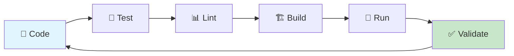

# 🚀 Quick Start Guide - Démarrage Rapide

[](./dev-environment.md)
[](#)

> **🎯 Objectif** : Démarrer le développement sur EMAIL_SENDER_1 en moins de **5 minutes** chrono !

## ⚡ Setup Express (< 5 minutes)

### 🔥 Prérequis Rapides

```bash
# Vérification environnement
go version      # ✅ Go 1.23.9+ requis
node --version  # ✅ Node.js 18+ requis  
git --version   # ✅ Git 2.30+ requis
```

**❌ Pas installé ?** → [Installation Rapide](#-installation-express-prérequis)

### 🚀 Clone & Setup (2 minutes)

```bash
# 1. Clone le repository
git clone https://github.com/your-org/EMAIL_SENDER_1.git
cd EMAIL_SENDER_1

# 2. Setup Go environment
go mod download
go mod tidy

# 3. Vérification build
go build ./...
```

### ⚙️ Configuration Minimale (1 minute)

```bash
# Copier configuration par défaut
cp .env.example .env

# Variables essentielles (ajuster selon votre environnement)
echo "ENV=development" >> .env
echo "LOG_LEVEL=info" >> .env
echo "PORT=8080" >> .env
```

### 🧪 Test de Validation (1 minute)

```bash
# Test que tout fonctionne
go test ./... -short

# Démarrage serveur test
go run cmd/server/main.go &
curl http://localhost:8080/health
```

**✅ Réponse `{"status": "ok"}` ?** → **BRAVO ! Vous êtes prêt ! 🎉**

---

## 🎯 Premiers Pas Développement

### 📁 Structure Projet (Navigation Rapide)

```bash
EMAIL_SENDER_1/
├── 🏗️ pkg/                    # 13 Managers Enterprise
│   ├── config/                 # → Configuration centralisée
│   ├── security/              # → Sécurité & cryptographie
│   └── orchestrator/          # → Orchestration jobs
├── 🚀 cmd/                    # Points d'entrée applications
├── 🧪 tests/                  # Tests (chaos, failover, perf)
├── 📚 .github/docs/           # Documentation complète
└── 🔧 scripts/                # Scripts d'automatisation
```

### 🔥 Commandes Essentielles

```bash
# 🏗️ Build complet
go build ./...

# 🧪 Tests rapides
go test ./... -short

# 🧪 Tests complets avec couverture
go test ./... -cover -race

# 📊 Linter (qualité code)
golangci-lint run

# 🚀 Démarrage serveur développement
go run cmd/server/main.go

# 📋 Voir les logs en temps réel
tail -f logs/application.log
```

### 🎯 Workflow Développement Type



## 🔧 Configuration Avancée (Optionnel)

### 🌍 Environnements Multiples

```bash
# Développement
export ENV=development

# Staging
export ENV=staging  

# Production (attention !)
export ENV=production
```

### 📊 Monitoring Local

```bash
# Démarrage stack monitoring (Docker)
docker-compose -f docker/monitoring.yml up -d

# Accès interfaces
# Prometheus: http://localhost:9090
# Grafana: http://localhost:3000 (admin/admin)
```

### 🔗 Intégration N8N

```bash
# Installation N8N local
npm install -g n8n

# Démarrage N8N
n8n start

# Interface N8N: http://localhost:5678
```

---

## 📖 Ressources Développement

### 🎯 Documentation Essentielle

| 📚 Resource | 🎯 Usage | ⏱️ Temps Lecture |
|-------------|----------|-----------------|
| [🏗️ Ecosystem Overview](../ARCHITECTURE/ecosystem-overview.md) | Compréhension architecture | 10 min |
| [📊 Managers Catalog](../MANAGERS/catalog-complete.md) | APIs & fonctionnalités | 15 min |
| [🔧 Coding Standards](../DEVELOPMENT/coding-standards.md) | Standards développement | 5 min |
| [🧪 Testing Strategy](../DEVELOPMENT/testing-strategy.md) | Stratégie tests | 5 min |

### 🚀 Exemples Code Rapides

#### **🔧 Configuration Manager**

```go
package main

import "github.com/your-org/EMAIL_SENDER_1/pkg/config"

func main() {
    cfg := config.NewManager()
    cfg.Load("development")
    
    port := cfg.GetString("server.port", "8080")
    fmt.Printf("Server starting on port %s\n", port)
}
```

#### **🛡️ Security Manager**

```go
package main

import "github.com/your-org/EMAIL_SENDER_1/pkg/security"

func main() {
    sec := security.NewCryptoService()
    
    // Chiffrement
    encrypted := sec.Encrypt("sensitive data")
    
    // Déchiffrement
    decrypted := sec.Decrypt(encrypted)
}
```

#### **📊 Monitoring Metrics**

```go
package main

import "github.com/your-org/EMAIL_SENDER_1/pkg/monitoring"

func main() {
    monitor := monitoring.NewPrometheusManager()
    
    // Compteur custom
    monitor.Counter("api_requests_total").
        WithLabelValues("GET", "/api/v1/health").
        Inc()
}
```

### 🔍 Debugging Tips

```bash
# 🐛 Debug avec Delve
go install github.com/go-delve/delve/cmd/dlv@latest
dlv debug cmd/server/main.go

# 📊 Profiling performance
go tool pprof http://localhost:8080/debug/pprof/profile

# 📋 Logs structurés avec jq
tail -f logs/app.log | jq '.'

# 🔍 Recherche dans les logs
grep -r "ERROR" logs/ | tail -20
```

---

## 🚨 Troubleshooting Rapide

### ❌ Problèmes Courants

#### **🔧 Build Errors**

```bash
# Problème: "package not found"
go clean -modcache
go mod download
go mod tidy

# Problème: "permission denied"
chmod +x scripts/*.sh
```

#### **🌐 Network Issues**

```bash
# Problème: "port already in use"
lsof -ti:8080 | xargs kill -9

# Problème: "connection refused"
netstat -tlnp | grep :8080
```

#### **📊 Performance Issues**

```bash
# CPU high usage
go tool pprof http://localhost:8080/debug/pprof/profile

# Memory leaks
go tool pprof http://localhost:8080/debug/pprof/heap
```

### 🆘 Support Rapide

| 🚨 Urgence | 📞 Contact | ⏱️ Réponse |
|-----------|-----------|-----------|
| **Critical** | [🔥 Emergency](https://github.com/your-org/EMAIL_SENDER_1/issues/new?template=critical.md) | < 1h |
| **Bug** | [🐛 Bug Report](https://github.com/your-org/EMAIL_SENDER_1/issues/new?template=bug.md) | < 4h |
| **Question** | [❓ Discussion](https://github.com/your-org/EMAIL_SENDER_1/discussions) | < 24h |

---

## 🎯 Next Steps

### 📚 Approfondissement (Recommandé)

1. **🏗️ Architecture** → [Ecosystem Overview](../ARCHITECTURE/ecosystem-overview.md)
2. **🔧 Dev Environment** → [Complete Setup](./dev-environment.md)
3. **📊 Managers APIs** → [Catalog Complete](../MANAGERS/catalog-complete.md)
4. **🧪 Testing** → [Testing Strategy](../DEVELOPMENT/testing-strategy.md)

### 🚀 Premiers Développements

```bash
# 1. Créer une nouvelle fonctionnalité
git checkout -b feature/my-awesome-feature

# 2. Développement avec tests
go test ./... -watch

# 3. Validation avant commit
make pre-commit

# 4. Push et Pull Request
git push origin feature/my-awesome-feature
```

### 🌟 Contributions

```yaml
contribution_workflow:
  1: "🔍 Lire CONTRIBUTING.md"
  2: "🐛 Identifier un issue"  
  3: "🔀 Fork et développer"
  4: "🧪 Tests complets"
  5: "📝 Pull Request"
  6: "👀 Code Review"
  7: "🎉 Merge !"
```

---

## 📊 Métriques Setup Success

### ✅ Checklist Validation

- [ ] ✅ Go 1.23.9+ installé et fonctionnel
- [ ] ✅ Repository cloné et dépendances téléchargées
- [ ] ✅ Build complet réussi (`go build ./...`)
- [ ] ✅ Tests de base passent (`go test ./... -short`)
- [ ] ✅ Serveur démarre et répond (`curl localhost:8080/health`)
- [ ] ✅ Configuration `.env` adaptée
- [ ] ✅ Documentation architecture lue
- [ ] ✅ Premier commit/branch créé

**🎉 8/8 ? PARFAIT ! Vous maîtrisez EMAIL_SENDER_1 !**

### 📈 Temps Setup Typical

```yaml
developer_profiles:
  expert_go:
    setup_time: "2-3 minutes"
    first_contribution: "same day"
    
  intermediate:
    setup_time: "3-5 minutes"  
    first_contribution: "1-2 days"
    
  beginner:
    setup_time: "5-10 minutes"
    first_contribution: "1 week"
```

---

## 🔗 Liens Utiles

### 📚 Documentation Rapide

- [🏗️ Architecture](../ARCHITECTURE/) - Vue d'ensemble technique
- [📊 Managers](../MANAGERS/) - Catalogue des 13 managers
- [🔧 Development](../DEVELOPMENT/) - Standards et processus
- [🧪 Testing](../DEVELOPMENT/testing-strategy.md) - Stratégie tests

### 🛠️ Outils Développement

- [Go](https://golang.org/doc/install) - Installation Go
- [N8N](https://docs.n8n.io/getting-started/installation/) - Installation N8N
- [Docker](https://docs.docker.com/get-docker/) - Installation Docker
- [VS Code](https://code.visualstudio.com/) - IDE recommandé

### 🌐 Communauté

- [📧 Team Contact](mailto:dev-team@email-sender.com)
- [💬 Slack](https://email-sender.slack.com)
- [📝 Wiki](https://github.com/your-org/EMAIL_SENDER_1/wiki)

---

*⚡ Setup en < 5min | 🏆 Enterprise Ready | 🚀 Production Grade | 📅 Updated: 2025-06-19*
