# 📧 Intégration Gmail

## 1. Présentation

Ce guide décrit la configuration, l’utilisation et les bonnes pratiques pour l’intégration Gmail dans l’écosystème Email Sender.

---

## 2. Configuration

- **Prérequis** : Compte Google, accès à la Google Cloud Console, activation de l’API Gmail, création d’un projet OAuth 2.0.
- **Étapes** :
  1. Créer un projet sur <https://console.cloud.google.com/>
  2. Activer l’API Gmail
  3. Créer des identifiants OAuth 2.0 (client ID/secret)
  4. Ajouter les scopes nécessaires (ex : `https://mail.google.com/`)
  5. Configurer les identifiants dans `.env` ou via l’interface n8n

---

## 3. Utilisation

- **Fonctionnalités principales** :
  - Lecture et envoi d’emails automatisés
  - Extraction de pièces jointes
  - Déclenchement de workflows sur réception d’email

- **Exemple de scénario** :
  - Envoi automatique d’un email de suivi après prospection

---

## 4. Exemples de scénarios

```mermaid
flowchart TD
    A[Prospection terminée] --> B[Déclenchement n8n]
    B --> C[Envoi email Gmail]
    C --> D[Archivage email]
```



- **Logs d’exécution** :

  ```
  [2025-06-23 15:02:11] Gmail: Email envoyé à contact@exemple.com
  [2025-06-23 15:02:12] Gmail: Email archivé
  ```

---

## 5. Prérequis & Limitations

- API Gmail : quotas d’envoi, limitations sur les pièces jointes
- OAuth : renouvellement du token périodique requis

---

## 6. Cas d’erreur courants

- **Erreur 401** : Token OAuth expiré ou invalide
- **Erreur 403** : Permissions insuffisantes sur le compte Gmail
- **Erreur 429** : Limite de requêtes atteinte

---

## 7. FAQ

- **Q : Comment renouveler le token OAuth ?**
  - R : Suivre la procédure de renouvellement dans la Google Cloud Console ou via n8n.
- **Q : Comment ajouter des scopes supplémentaires ?**
  - R : Modifier la configuration OAuth dans la console Google.

---

## 8. Ressources

- [Documentation officielle Gmail API](https://developers.google.com/gmail/api)
- [Exemples de workflows n8n](../../workflows/PROSPECTION.md)
