# 📅 Intégration Google Calendar

## 1. Présentation

Ce guide explique la configuration, l’utilisation et les bonnes pratiques pour l’intégration Google Calendar dans l’écosystème Email Sender.

---

## 2. Configuration

- **Prérequis** : Compte Google, accès Google Cloud Console, activation de l’API Calendar, projet OAuth 2.0.
- **Étapes** :
  1. Créer un projet sur <https://console.cloud.google.com/>
  2. Activer l’API Google Calendar
  3. Créer des identifiants OAuth 2.0 (client ID/secret)
  4. Ajouter les scopes nécessaires (ex : `https://www.googleapis.com/auth/calendar`)
  5. Configurer les identifiants dans `.env` ou via l’interface n8n

---

## 3. Utilisation

- **Fonctionnalités principales** :
  - Création et modification d’événements
  - Synchronisation de calendriers
  - Déclenchement de workflows sur nouvel événement

- **Exemple de scénario** :
  - Création automatique d’un événement suite à la réception d’un email

---

## 4. Exemples de scénarios

```mermaid
flowchart TD
    A[Email reçu] --> B[Déclenchement n8n]
    B --> C[Création événement Google Calendar]
    C --> D[Confirmation envoyée]
```



- **Logs d’exécution** :

  ```
  [2025-06-23 15:30:01] Google Calendar: Événement créé (ID: abcdef123)
  [2025-06-23 15:30:02] Email: Confirmation envoyée
  ```

---

## 5. Prérequis & Limitations

- API Calendar : quotas d’utilisation, limitations sur les champs supportés
- OAuth : renouvellement du token périodique requis

---

## 6. Cas d’erreur courants

- **Erreur 401** : Token OAuth expiré ou invalide
- **Erreur 403** : Permissions insuffisantes sur le calendrier
- **Erreur 429** : Limite de requêtes atteinte

---

## 7. FAQ

- **Q : Comment partager un calendrier avec l’intégration ?**
  - R : Partager le calendrier cible avec l’adresse de service OAuth.
- **Q : Comment gérer les conflits d’événements ?**
  - R : Utiliser les options de gestion des conflits dans la configuration n8n.

---

## 8. Ressources

- [Documentation officielle Google Calendar API](https://developers.google.com/calendar/api)
- [Exemples de workflows n8n](../../workflows/PROSPECTION.md)
