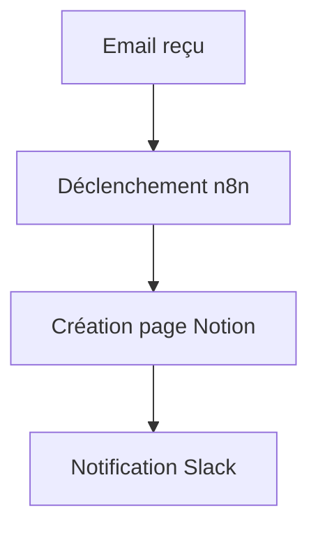

# 📒 Intégration Notion

## 1. Présentation

Ce guide détaille la configuration, l’utilisation et les bonnes pratiques pour l’intégration Notion dans l’écosystème Email Sender.

---

## 2. Configuration

- **Prérequis** : Compte Notion, accès API, clé d’intégration.
- **Étapes** :
  1. Créer une intégration dans Notion (<https://www.notion.so/my-integrations>)
  2. Récupérer la clé API secrète
  3. Partager les pages/bases avec l’intégration
  4. Configurer la clé dans `.env` ou via l’interface n8n

---

## 3. Utilisation

- **Fonctionnalités principales** :
  - Lecture/écriture de bases de données Notion
  - Automatisation de la création de pages
  - Synchronisation avec d’autres outils (Gmail, Google Calendar…)

- **Exemple de scénario** :
  - Ajout automatique d’un prospect dans Notion après réception d’un email

---

## 4. Exemples de scénarios



- **Logs d’exécution** :

  ```
  [2025-06-23 14:12:01] Notion: Création page OK (ID: 1234-5678)
  [2025-06-23 14:12:02] Slack: Notification envoyée
  ```

---

## 5. Prérequis & Limitations

- API Notion : quotas de requêtes, limitations sur les types de blocs supportés
- Permissions : l’intégration doit avoir accès aux pages concernées

---

## 6. Cas d’erreur courants

- **Erreur 401** : Clé API invalide ou permissions insuffisantes
- **Erreur 429** : Limite de requêtes atteinte (rate limit)
- **Erreur 404** : Page ou base introuvable

---

## 7. FAQ

- **Q : Comment vérifier les permissions de l’intégration ?**
  - R : Vérifier dans Notion que l’intégration a accès à la page/base cible.
- **Q : Où renseigner la clé API ?**
  - R : Dans le fichier `.env` ou via la configuration n8n.

---

## 8. Ressources

- [Documentation officielle Notion API](https://developers.notion.com/)
- [Exemples de workflows n8n](../../workflows/PROSPECTION.md)
