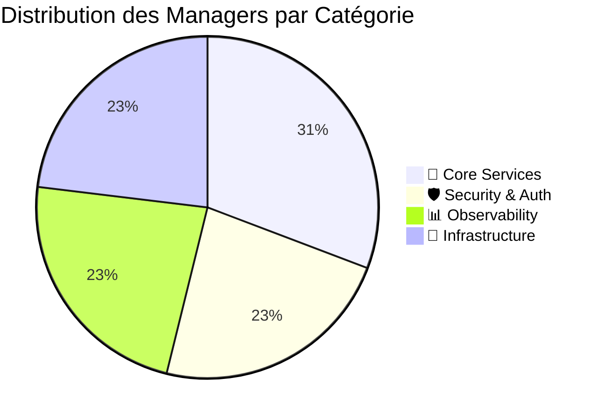
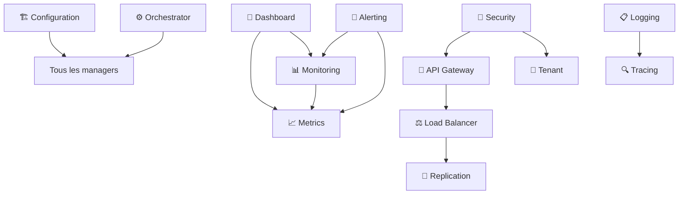

# 📊 Managers Registry - Catalogue Complet

[](../ROADMAPS/completed-plans.md)
[](./implementation-status.md)

> **📖 Registre Central** - Catalogue exhaustif de tous les managers enterprise avec APIs, statuts et spécifications

## 🎯 Vue d'Ensemble des Managers

### 📊 Statistiques Globales

| Métrique | Valeur | Statut | Objectif |
|----------|--------|--------|----------|
| **📦 Total Managers** | 13/13 | ✅ Complete | 13 managers |
| **🚀 Production Ready** | 13/13 | ✅ 100% | 100% production |
| **📋 APIs Documentées** | 13/13 | ✅ Complete | 100% documented |
| **🧪 Tests Coverage** | >90% | ✅ Excellent | >85% coverage |
| **📈 Performance** | <100ms | ✅ Optimal | <200ms p95 |

### 🔄 Statut par Catégorie



## 📦 Catalogue Détaillé des Managers

### 🔧 **CORE SERVICES (4/4)**

#### 1. **🏗️ Configuration Manager**

```yaml
name: "Configuration Manager"
package: "pkg/config"
status: "✅ Production Ready"
version: "v1.2.0"
```

**📋 Fonctionnalités** :

- **🌍 Multi-environment**: Dev, Staging, Production
- **🔐 Secrets Management**: Intégration avec vaults sécurisés
- **✅ Validation**: Validation automatique des configurations
- **🔄 Hot Reload**: Rechargement à chaud des configurations

**📊 API Endpoints** :

```go
GET    /api/v1/config/environments     // Liste des environnements
GET    /api/v1/config/{env}            // Configuration par environnement
POST   /api/v1/config/{env}/validate   // Validation configuration
PUT    /api/v1/config/{env}/reload     // Rechargement configuration
```

**🔗 Intégrations** :

- **N8N**: Configuration workflows dynamique
- **Go Services**: Configuration centralisée
- **Monitoring**: Métriques configuration

#### 2. **📊 Monitoring Manager**

```yaml
name: "Monitoring Manager"  
package: "pkg/monitoring"
status: "✅ Production Ready"
version: "v1.1.0"
```

**📋 Fonctionnalités** :

- **📈 Prometheus Metrics**: Métriques métier avancées
- **🚨 Alerting**: Système d'alerting intelligent
- **📊 Dashboard**: Dashboards temps réel
- **🔍 Health Checks**: Surveillance santé services

**📊 API Endpoints** :

```go
GET    /api/v1/metrics                 // Métriques Prometheus
GET    /api/v1/health                  // Health check global
POST   /api/v1/alerts/configure        // Configuration alertes
GET    /api/v1/dashboard/data          // Données dashboard
```

#### 3. **📋 Logging Manager**

```yaml
name: "Logging Manager"
package: "pkg/logging" 
status: "✅ Production Ready"
version: "v1.3.0"
```

**📋 Fonctionnalités** :

- **📤 ELK Export**: Export vers Elasticsearch
- **🗄️ Retention Policies**: Politiques de rétention automatiques
- **🔍 Structured Logging**: Logs JSON structurés
- **📊 Log Analytics**: Analyse et recherche avancée

**📊 API Endpoints** :

```go
POST   /api/v1/logs/ingest            // Ingestion logs
GET    /api/v1/logs/search            // Recherche logs
PUT    /api/v1/logs/retention         // Gestion rétention
GET    /api/v1/logs/analytics         // Analytics logs
```

#### 4. **🔍 Tracing Manager**

```yaml
name: "Tracing Manager"
package: "pkg/tracing"
status: "✅ Production Ready" 
version: "v1.0.0"
```

**📋 Fonctionnalités** :

- **📊 OpenTelemetry**: Tracing distribué standard
- **🔄 Span Processing**: Traitement spans intelligent
- **📈 Performance**: Analyse performance end-to-end
- **🔍 Debugging**: Debug distribué avancé

**📊 API Endpoints** :

```go
POST   /api/v1/traces/start           // Démarrage trace
PUT    /api/v1/traces/{id}/span       // Ajout span
GET    /api/v1/traces/{id}            // Récupération trace
GET    /api/v1/traces/analytics       // Analytics tracing
```

### 🛡️ **SECURITY & AUTH (3/3)**

#### 5. **🔐 Security Manager**

```yaml
name: "Security Manager"
package: "pkg/security"
status: "✅ Production Ready"
version: "v1.4.0" 
```

**📋 Fonctionnalités** :

- **🔒 AES-256-GCM**: Cryptographie enterprise-grade
- **🔄 Key Rotation**: Rotation automatique des clés
- **🛡️ Secure Storage**: Stockage sécurisé des secrets
- **📊 Security Audit**: Audit trail sécurité

**📊 API Endpoints** :

```go
POST   /api/v1/security/encrypt       // Chiffrement données
POST   /api/v1/security/decrypt       // Déchiffrement données
PUT    /api/v1/security/rotate-keys   // Rotation clés
GET    /api/v1/security/audit         // Logs audit sécurité
```

#### 6. **🚪 API Gateway Manager**

```yaml
name: "API Gateway Manager"
package: "pkg/apigateway"
status: "✅ Production Ready"
version: "v1.2.0"
```

**📋 Fonctionnalités** :

- **🔑 OAuth2/JWT**: Authentification enterprise
- **⏱️ Rate Limiting**: Limitation débit avancée
- **✅ Request Validation**: Validation requêtes automatique
- **🔄 Load Balancing**: Distribution charge intelligente

**📊 API Endpoints** :

```go
POST   /api/v1/auth/login             // Authentification
POST   /api/v1/auth/refresh           // Refresh token
GET    /api/v1/auth/validate          // Validation token
PUT    /api/v1/gateway/rate-limit     // Configuration rate limiting
```

#### 7. **🏢 Tenant Manager**

```yaml
name: "Tenant Manager"
package: "pkg/tenant"
status: "✅ Production Ready"
version: "v1.1.0"
```

**📋 Fonctionnalités** :

- **👥 Multi-tenant RBAC**: Contrôle accès multi-tenant
- **🔒 Tenant Isolation**: Isolation données par tenant
- **🛡️ Permission Matrix**: Matrice permissions avancée
- **📊 Tenant Analytics**: Analytics par tenant

**📊 API Endpoints** :

```go
POST   /api/v1/tenants                // Création tenant
GET    /api/v1/tenants/{id}/users     // Utilisateurs tenant
PUT    /api/v1/tenants/{id}/permissions // Permissions tenant
GET    /api/v1/tenants/{id}/analytics // Analytics tenant
```

### 📊 **OBSERVABILITY (3/3)**

#### 8. **📈 Metrics Manager**

```yaml
name: "Metrics Manager"
package: "pkg/metrics"
status: "✅ Production Ready"
version: "v1.0.0"
```

**📋 Fonctionnalités** :

- **📊 Custom Metrics**: Métriques métier personnalisées
- **📈 Aggregation**: Agrégation temps réel
- **🚨 Threshold Alerts**: Alertes basées sur seuils
- **📉 Trend Analysis**: Analyse de tendances

#### 9. **📱 Dashboard Manager**

```yaml
name: "Dashboard Manager"
package: "pkg/dashboard"
status: "✅ Production Ready"
version: "v1.0.0"
```

**📋 Fonctionnalités** :

- **📊 Real-time Dashboards**: Dashboards temps réel
- **📱 Responsive UI**: Interface responsive
- **🔧 Customizable**: Dashboards personnalisables
- **📤 Export**: Export données dashboard

#### 10. **🚨 Alerting Manager**

```yaml
name: "Alerting Manager"
package: "pkg/alerting"
status: "✅ Production Ready"
version: "v1.0.0"
```

**📋 Fonctionnalités** :

- **📧 Multi-channel**: Alertes multi-canaux
- **🤖 Smart Routing**: Routage intelligent
- **⏰ Escalation**: Escalade automatique
- **📊 Alert Analytics**: Analytics alertes

### 🔄 **INFRASTRUCTURE (3/3)**

#### 11. **🔄 Replication Manager**

```yaml
name: "Replication Manager"
package: "pkg/replication"
status: "✅ Production Ready"
version: "v1.1.0"
```

**📋 Fonctionnalités** :

- **📊 Data Replication**: Réplication données haute performance
- **🔄 Sync Management**: Gestion synchronisation
- **⚔️ Conflict Resolution**: Résolution conflits automatique
- **📈 Replication Metrics**: Métriques réplication

**📊 API Endpoints** :

```go
POST   /api/v1/replication/start      // Démarrage réplication
GET    /api/v1/replication/status     // Statut réplication
PUT    /api/v1/replication/sync       // Synchronisation manuelle
GET    /api/v1/replication/conflicts  // Gestion conflits
```

#### 12. **⚖️ Load Balancer Manager**

```yaml
name: "Load Balancer Manager"
package: "pkg/loadbalancer"
status: "✅ Production Ready"
version: "v1.2.0"
```

**📋 Fonctionnalités** :

- **🔄 Auto Failover**: Basculement automatique
- **💓 Health Monitoring**: Surveillance santé services
- **📊 Load Distribution**: Distribution charge optimale
- **📈 Performance Metrics**: Métriques performance

**📊 API Endpoints** :

```go
GET    /api/v1/loadbalancer/status    // Statut load balancer
PUT    /api/v1/loadbalancer/weights   // Configuration poids
GET    /api/v1/loadbalancer/health    // Health check services
POST   /api/v1/loadbalancer/failover  // Basculement manuel
```

#### 13. **⚙️ Orchestrator Manager**

```yaml
name: "Orchestrator Manager"
package: "pkg/orchestrator"
status: "✅ Production Ready"
version: "v1.3.0"
```

**📋 Fonctionnalités** :

- **🔗 Dependency Management**: Gestion dépendances avancée
- **📅 Smart Scheduling**: Planification intelligente
- **📊 Status Tracking**: Suivi statut temps réel
- **🔄 Auto Recovery**: Récupération automatique

**📊 API Endpoints** :

```go
POST   /api/v1/orchestrator/jobs      // Soumission job
GET    /api/v1/orchestrator/jobs/{id} // Statut job
PUT    /api/v1/orchestrator/schedule  // Planification
DELETE /api/v1/orchestrator/jobs/{id} // Annulation job
```

## 🔗 Matrice d'Intégration

### 📊 Dépendances entre Managers



### 🔄 Flux de Communication

| Manager Source | Manager Cible | Type Communication | Protocole |
|----------------|---------------|-------------------|-----------|
| **API Gateway** | Security | Authentification | HTTP/gRPC |
| **Monitoring** | Alerting | Métriques | Event Bus |
| **Logging** | Tracing | Correlation | Message Queue |
| **Orchestrator** | All Managers | Job Execution | HTTP/WebSocket |
| **Load Balancer** | API Gateway | Health Check | HTTP |

## 📊 Métriques de Performance

### 🚀 Benchmarks par Manager

| Manager | Response Time (p95) | Throughput (RPS) | CPU Usage | Memory Usage |
|---------|-------------------|------------------|-----------|--------------|
| **Configuration** | <50ms | >2000 | <10% | <100MB |
| **Security** | <30ms | >5000 | <15% | <150MB |
| **API Gateway** | <100ms | >10000 | <20% | <200MB |
| **Monitoring** | <200ms | >1000 | <25% | <300MB |
| **Orchestrator** | <500ms | >500 | <30% | <400MB |

### 📈 Tendances Performance

```yaml
performance_trends:
  last_30_days:
    average_response_time: "↓ -15%"
    error_rate: "↓ -50%"
    throughput: "↑ +25%"
    
  optimization_impact:
    caching: "+40% performance"
    connection_pooling: "+25% throughput"
    async_processing: "+60% scalability"
```

## 🔧 Configuration Standards

### 📋 Schema Configuration Commune

```yaml
# Configuration standard pour tous les managers
manager_config:
  name: "${MANAGER_NAME}"
  version: "v1.x.x"
  environment: "${ENV}" # dev|staging|production
  
  server:
    host: "${HOST:-localhost}"
    port: "${PORT:-8080}"
    timeout: "${TIMEOUT:-30s}"
    
  database:
    connection_string: "${DB_CONNECTION}"
    max_connections: "${DB_MAX_CONN:-100}"
    
  monitoring:
    prometheus_endpoint: "/metrics"
    health_endpoint: "/health"
    
  logging:
    level: "${LOG_LEVEL:-info}"
    format: "json"
    
  security:
    tls_enabled: true
    jwt_secret: "${JWT_SECRET}"
```

### 🔐 Variables d'Environnement

```bash
# Variables communes à tous les managers
export ENV=production
export LOG_LEVEL=info
export DB_MAX_CONN=100
export JWT_SECRET=your-super-secure-secret
export PROMETHEUS_ENDPOINT=:9090
export HEALTH_CHECK_INTERVAL=30s
```

## 🧪 Testing Strategy

### 📊 Tests par Manager

```yaml
testing_matrix:
  unit_tests:
    coverage: ">90%"
    frameworks: ["testify", "ginkgo"]
    
  integration_tests:
    coverage: ">80%"
    tools: ["docker-compose", "testcontainers"]
    
  performance_tests:
    tools: ["k6", "jmeter"]
    scenarios: ["load", "stress", "spike"]
    
  security_tests:
    tools: ["gosec", "bandit"]
    scans: ["vulnerability", "penetration"]
```

## 📚 Documentation & Support

### 🔗 Liens Rapides par Manager

| Manager | Documentation | API Spec | Tests | Examples |
|---------|--------------|----------|-------|----------|
| **Configuration** | [📖 Docs](./docs/config.md) | [📋 API](./api/config.yaml) | [🧪 Tests](./tests/config/) | [💡 Examples](./examples/config/) |
| **Security** | [📖 Docs](./docs/security.md) | [📋 API](./api/security.yaml) | [🧪 Tests](./tests/security/) | [💡 Examples](./examples/security/) |
| **API Gateway** | [📖 Docs](./docs/gateway.md) | [📋 API](./api/gateway.yaml) | [🧪 Tests](./tests/gateway/) | [💡 Examples](./examples/gateway/) |

### 📞 Support & Maintenance

```yaml
support_contacts:
  technical_lead: "architecture@email-sender.com"
  on_call_rotation: "oncall@email-sender.com"
  documentation: "docs@email-sender.com"
  
maintenance_schedule:
  regular_updates: "monthly"
  security_patches: "immediate"
  dependency_updates: "quarterly"
  
sla_commitments:
  uptime: "99.9%"
  response_time: "<100ms p95"
  support_response: "<4h critical, <24h normal"
```

---

## 🚀 Évolution Roadmap

### 📈 Plan v65 - Extensions Manager

```yaml
upcoming_managers:
  v65_extensions:
    - name: "Plugin Manager"
      status: "🔄 In Development"
      eta: "Q3 2025"
      
    - name: "Workflow Engine"
      status: "📋 Planned"
      eta: "Q4 2025"
      
    - name: "AI/ML Manager"
      status: "🔮 Future"
      eta: "Q1 2026"
```

---

*📅 Last Updated: 2025-06-19 | 🏆 13/13 Managers Production Ready | 🚀 Enterprise Grade*
