# 🚀 Workflow Prospection

## 1. Présentation

Ce workflow automatise la prospection par email, de la collecte de contacts à l’envoi initial.

---

## 2. Schéma de flux

```mermaid
flowchart TD
    A[Collecte contacts] --> B[Préparation email]
    B --> C[Envoi Gmail]
    C --> D[Ajout Notion]
    D --> E[Suivi Google Calendar]
```

---

## 3. Configuration

- **Déclencheur** : Ajout d’un nouveau contact ou événement planifié
- **Intégrations** : Gmail, Notion, Google Calendar
- **Paramètres** : Modèle d’email, délais de relance, logs d’exécution

---

## 4. Exemples d’exécution

- Ajout d’un contact → Email envoyé → Contact ajouté à Notion → Suivi planifié dans Google Calendar

---

## 5. Cas d’erreur courants

- Email non délivré (erreur SMTP)
- Contact déjà existant dans Notion
- Conflit de calendrier lors du suivi

---

## 6. FAQ

- **Q : Comment personnaliser le modèle d’email ?**
  - R : Modifier le paramètre `template` dans la configuration du workflow.
- **Q : Où consulter les logs d’exécution ?**
  - R : Voir la section logs dans n8n ou le fichier d’audit associé.

---

## 7. Ressources

- [Documentation Gmail](https://developers.google.com/gmail/api)
- [Documentation Notion](https://developers.notion.com/)
- [Documentation Google Calendar](https://developers.google.com/calendar/api)
