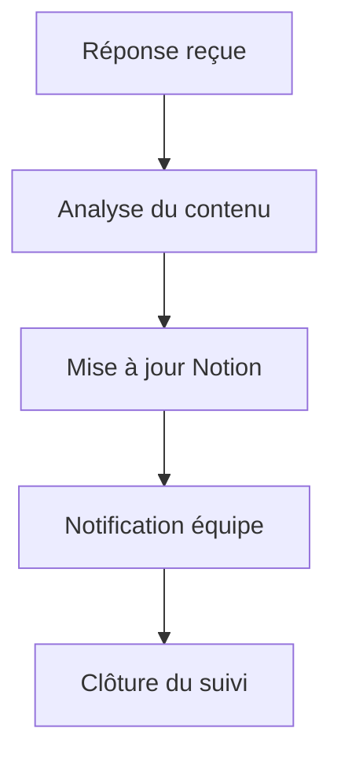

# 📬 Workflow Traitement des Réponses

## 1. Présentation

Ce workflow automatise le traitement des réponses reçues suite aux campagnes de prospection et de suivi.

---

## 2. Schéma de flux

---

## 3. Configuration

- **Déclencheur** : Réception d’une réponse email
- **Intégrations** : Gmail, Notion, Slack/Teams
- **Paramètres** : Règles d’analyse, notifications, logs d’exécution

---

## 4. Exemples d’exécution

- Réponse positive → Statut mis à jour dans Notion → Notification envoyée à l’équipe → Suivi clôturé

---

## 5. Cas d’erreur courants

- Email de réponse non détecté
- Mise à jour Notion échouée
- Notification non envoyée

---

## 6. FAQ

- **Q : Comment personnaliser les règles d’analyse de réponse ?**
  - R : Modifier les règles dans la configuration du workflow.
- **Q : Comment relancer un prospect après une réponse négative ?**
  - R : Planifier une nouvelle séquence dans n8n.

---

## 7. Ressources

- [Documentation Gmail](https://developers.google.com/gmail/api)
- [Documentation Notion](https://developers.notion.com/)
- [Documentation Slack](https://api.slack.com/)
