# 🔄 Workflow Suivi

## 1. Présentation

Ce workflow gère le suivi automatisé des prospects après la prospection initiale.

---

## 2. Schéma de flux

```mermaid
flowchart TD
    A[Prospection terminée] --> B[Planification relance]
    B --> C[Envoi email de suivi]
    C --> D[Mise à jour Notion]
    D --> E[Notification Google Calendar]
```

---

## 3. Configuration

- **Déclencheur** : Date de relance atteinte ou absence de réponse
- **Intégrations** : Gmail, Notion, Google Calendar
- **Paramètres** : Modèle de relance, fréquence, logs d’exécution

---

## 4. Exemples d’exécution

- Prospect non répondu → Email de suivi envoyé → Statut mis à jour dans Notion → Relance planifiée dans Google Calendar

---

## 5. Cas d’erreur courants

- Email de suivi non délivré
- Statut Notion non mis à jour
- Conflit de calendrier pour la relance

---

## 6. FAQ

- **Q : Comment ajuster la fréquence des relances ?**
  - R : Modifier le paramètre `fréquence` dans la configuration du workflow.
- **Q : Comment visualiser les prospects en attente ?**
  - R : Consulter la base Notion synchronisée.

---

## 7. Ressources

- [Documentation Gmail](https://developers.google.com/gmail/api)
- [Documentation Notion](https://developers.notion.com/)
- [Documentation Google Calendar](https://developers.google.com/calendar/api)
