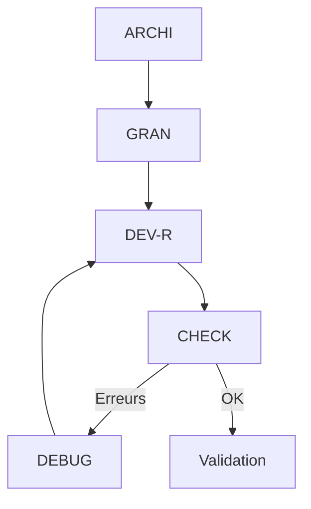

# Instructions Globales pour GitHub Copilot

## 🎯 Configuration Principale
```yaml
version: 1.0
project: EMAIL_SENDER_1
behavior:
  temperature: 0.3
  style: precise
  format: markdown
  verbosity: detailed
```

## 📊 Hiérarchie des Modes
1. **Mode ARCHI** (Architecture & Design)
   - Conception système
   - Validation architecturale
   - Documentation technique
   - Gestion des dépendances

2. **Mode GRAN** (Granularisation)
   - Décomposition des tâches
   - Planification détaillée
   - Gestion de la complexité

3. **Mode DEV-R** (Développement Récursif)
   - Implémentation itérative
   - Tests unitaires
   - Intégration continue

4. **Mode CHECK** (Vérification)
   - Validation qualité
   - Tests d'intégration
   - Revue de code

5. **Mode DEBUG** (Débogage)
   - Analyse des erreurs
   - Correction des bugs
   - Optimisation

## 🔄 Flux de Travail Standard


## 📋 Standards de Documentation
- Format Markdown strict
- Documentation inline
- Tests documentés
- Métriques de qualité