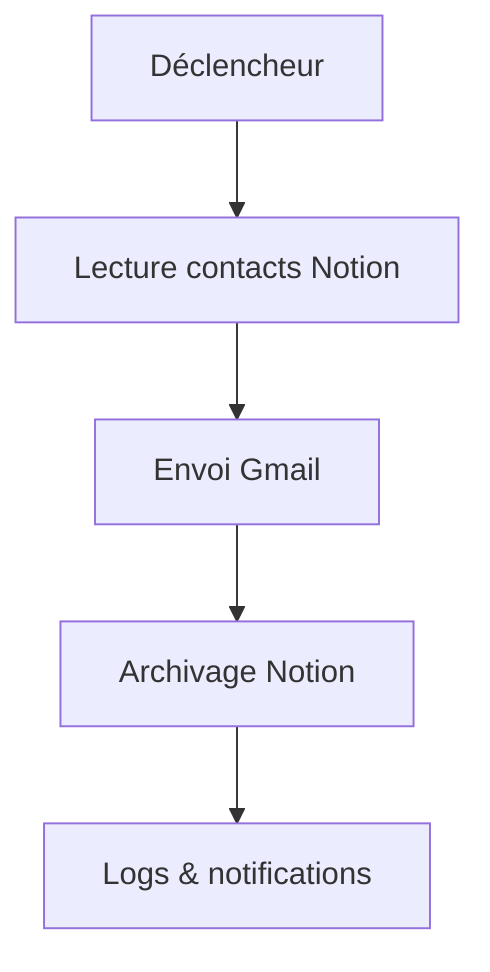

# ✉️ Tutoriel : Automatisation d’Emails

Ce guide explique comment automatiser l’envoi d’emails avec n8n, Gmail et Notion.

---

## 1. Objectif

Automatiser l’envoi d’emails personnalisés à partir d’une base de contacts, avec suivi et archivage.

---

## 2. Étapes pas-à-pas

### a. Préparer la base de contacts

- Importer les contacts dans Notion ou un fichier CSV
- Vérifier les champs requis (nom, email, statut)

### b. Créer le workflow n8n

- Ajouter un déclencheur (ex : horaire ou ajout de contact)
- Ajouter un nœud Gmail pour l’envoi d’email
- Ajouter un nœud Notion pour archiver l’action

### c. Configurer les paramètres

- Personnaliser le modèle d’email avec des variables (ex : prénom)
- Définir les conditions d’envoi (statut, date, etc.)

---

## 3. Schéma du workflow



---

## 4. Extrait de code (Node.js, envoi Gmail)

```js
const { google } = require('googleapis');
const gmail = google.gmail('v1');
// ... authentification ...
gmail.users.messages.send({ userId: 'me', requestBody: { /* ... */ } });
```

---

## 5. Bonnes pratiques

- Tester le workflow sur un petit échantillon avant production
- Utiliser les logs pour vérifier chaque étape
- Gérer les erreurs (emails invalides, quotas Gmail)

---

## 6. Ressources

- [Documentation Gmail API](https://developers.google.com/gmail/api)
- [Documentation n8n](https://docs.n8n.io/)
- [Guide Notion](../INTEGRATIONS/Notion.md)
