# 🚦 Guide de Démarrage Rapide

Ce guide vous accompagne pour installer, configurer et lancer vos premiers workflows avec Email Sender.

---

## 1. Installation

- Cloner le dépôt :  

  ```sh
  git clone <url-du-repo>
  ```

- Installer les dépendances requises (Node.js, Python, PowerShell, etc.)
- Copier `.env.example` en `.env` et renseigner les clés API nécessaires

---

## 2. Configuration

- Modifier les paramètres dans `.env` (Gmail, Notion, OpenRouter…)
- Vérifier les accès aux intégrations via les guides dédiés

---

## 3. Premier workflow n8n

- Lancer n8n :  

  ```sh
  n8n start
  ```

- Importer un workflow d’exemple (voir dossier WORKFLOWS/)
- Adapter les paramètres (emails, modèles, délais)

---

## 4. Exécution et logs

- Déclencher le workflow (manuellement ou automatiquement)
- Consulter les logs d’exécution dans l’interface n8n ou les fichiers de logs

---

## 5. Schéma d’ensemble

```mermaid
flowchart TD
    A[Installation] --> B[Configuration .env]
    B --> C[Lancement n8n]
    C --> D[Import workflow]
    D --> E[Exécution]
    E --> F[Logs & résultats]
```



---

## 6. Bonnes pratiques

- Toujours tester avec des données minimales avant production
- Documenter chaque intégration utilisée
- Mettre à jour les dépendances régulièrement

---

## 7. Ressources

- [Documentation n8n](https://docs.n8n.io/)
- [Guides d’intégration](../INTEGRATIONS/)
- [Workflows d’exemple](../WORKFLOWS/)
