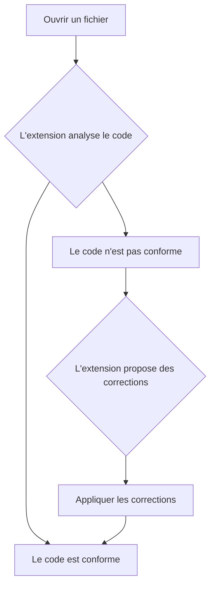
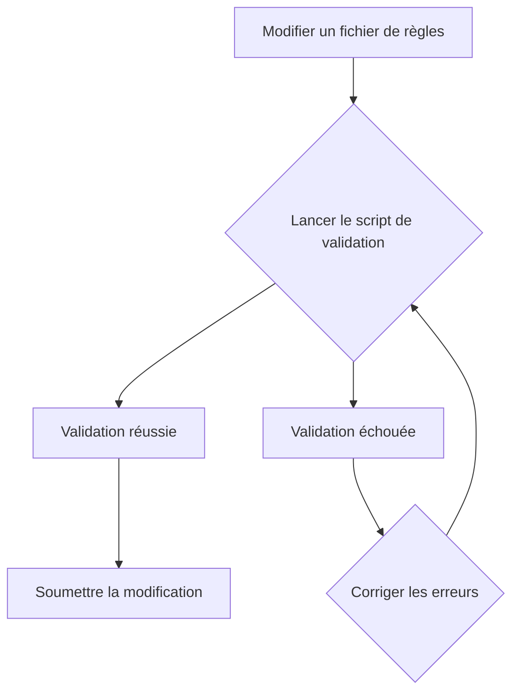
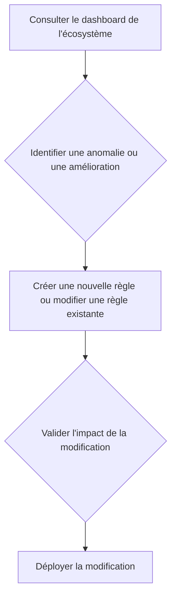

# Exemples d’usage Roo-Code : restrictions, extensions, traçabilité

## 🔒 Restrictions par mode Roo-Code

| Mode                | Édition autorisée                | Restrictions principales                   | Overrides spécifiques |
|---------------------|----------------------------------|--------------------------------------------|----------------------|
| Architect 🏗️        | Fichiers Markdown (.md)          | Impossible d’éditer du code source         | Todo-list séquencée obligatoire |
| Code 💻             | Code source (Go, TS, etc.)       | Impossible d’éditer la documentation seule | Respect des standards de dev |
| Documentation ✍️    | Docs, guides, README.md          | Impossible d’éditer le code                | Style Markdown, liens croisés |
| Debug 🪲            | Tous fichiers liés au diagnostic | Accès restreint aux outils système         | Checklist de débogage |
| PlanDev Engineer 🛠️| Tous fichiers et dossiers        | Aucune restriction d’extension             | Plan séquencé et validé |
| DevOps 🚀           | Configs CI/CD, scripts, manifests| Impossible d’éditer la documentation seule | Procédures critiques documentées |

> Voir la table complète dans [.roo/rules/rules.md](.roo/rules/rules.md:Inventaire des modes Roo-Code)

---

## 🧩 Points d’extension et overrides

- **PluginInterface** : Ajout dynamique de plugins, stratégies, managers ([rules-plugins.md](.roo/rules/rules-plugins.md:Convention de développement de plugins))
- **QualityGatePlugin** : Extension des quality gates CI/CD ([tools-registry.md](.roo/rules/tools-registry.md:Table des outils et commandes))
- **Overrides** : Chaque mode peut définir des règles spécifiques (ex : PlanDev Engineer peut tout éditer, Architect limité au Markdown).

Exemple d’extension :
```go
// Ajout d’un plugin de vectorisation documentaire
err := ExtensibleManagerType.RegisterPlugin(myVectorPlugin)
```

---

## 📋 Checklist synthétique de validation documentaire Roo-Code

- [ ] Vérifier la conformité aux restrictions du mode
- [ ] Respecter les points d’extension et interfaces (PluginInterface, etc.)
- [ ] Documenter explicitement le mode d’exécution pour chaque action critique
- [ ] Centraliser la gestion des erreurs via ErrorManager
- [ ] Valider la traçabilité documentaire (logs, rapports, statuts)
- [ ] Mettre à jour la documentation croisée et les liens de référence
- [ ] Appliquer les overrides et exceptions documentés
- [ ] Utiliser les workflows Mermaid pour illustrer les processus

---

## 🛠️ Workflows Mermaid illustratifs

### Workflow Développement



### Workflow Contribution



### Workflow Architecture



---

## 📚 Bonnes pratiques d’intégration et traçabilité

- Toujours transmettre le mode d’exécution lors d’une action critique ([rules.md](.roo/rules/rules.md:Règle de traçabilité du mode d’exécution Roo))
- Centraliser les logs et rapports via ErrorManager
- Documenter les exceptions, overrides et cas particuliers
- Utiliser les points d’extension pour enrichir les workflows
- Mettre à jour la documentation croisée à chaque évolution
