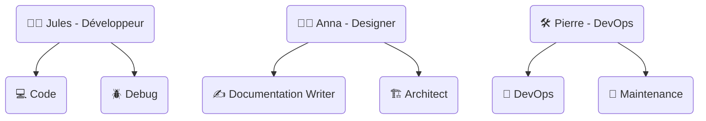
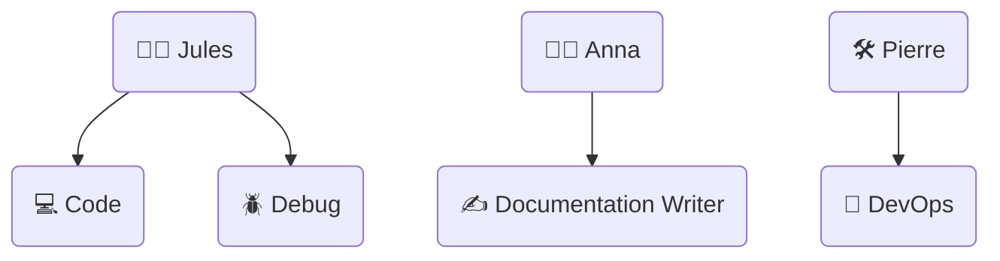

# Maintenance SOTA de l’inventaire des modes Roo-Code

## 1. Frontières et relations `.roo` vs `.github/docs/vsix/roo-code`

- **`.roo/`**  
  - **Source structurée** : fichiers YAML/Markdown de référence (`.roo/modes-inventory.md`, `.roo/personas.md`, mapping, règles, inventaires).
  - **Inventaire unique** : la vérité documentaire sur les modes, leurs attributs, leurs mappings.
  - **Mapping & règles** : liens personas ↔ modes, contraintes, modèles, scripts de génération.
  - **Édition et validation** : toute évolution commence ici.

- **`.github/docs/vsix/roo-code/`**  
  - **Documentation utilisateur** : guides, FAQ, maintenance, visualisation, onboarding.
  - **Génération** : synchronisée automatiquement à partir de `.roo/` (table, fiches, diagrammes, liens).
  - **Maintenance** : procédures, bonnes pratiques, auditabilité, traçabilité.
  - **Visualisation** : diagrammes Mermaid, tables dynamiques, liens croisés.

**Résumé** :  
`.roo/` = source unique, structurée, machine-first.  
`.github/docs/vsix/roo-code/` = documentation générée, human-first, synchronisée.

---

## 2. Processus automatisé d’évolution d’un mode Roo

### 1. Ajout/édition dans `.roo/modes-inventory.md`
- Modifier ou ajouter un mode dans [`modes-inventory.md`](../../../.roo/modes-inventory.md).
- Respecter la structure (slug, emoji, description, workflow, héritages, overrides, critères, FAQ…).

### 2. Synchronisation automatique
- **Script** : [`scripts/generate-modes-inventory.ts`](../../../scripts/generate-modes-inventory.ts)
- **Actions** :
  - Génère la table des modes, fiches détaillées, liens croisés, mapping personas ↔ modes.
  - Met à jour la doc utilisateur dans `.github/docs/vsix/roo-code/`.
  - Met à jour les diagrammes Mermaid et les liens dans la doc centrale.

### 3. Génération dynamique d’un diagramme Mermaid
- **Entrées** : `.roo/personas.md` et `.roo/modes-inventory.md`
- **Exemple** :


- **Automatisation** : le script de génération extrait les liens et met à jour le diagramme dans la doc.

### 4. Validation documentaire
- **Lint** : vérification de la structure et des champs obligatoires.
- **CI** : workflow GitHub Actions (ex : `.github/workflows/ci.yml`) pour valider la cohérence, lancer la génération, vérifier les diffs.
- **Hooks git** : pre-commit/pre-push pour empêcher toute modification non synchronisée ou non validée.
- **Checklist** :  
  - [ ] Mode ajouté/édité dans `.roo/modes-inventory.md`
  - [ ] Synchronisation lancée
  - [ ] Diagramme Mermaid à jour
  - [ ] CI verte
  - [ ] Documentation générée et validée

---

## 3. Exemples concrets

### Synchronisation automatique

- **Ajout d’un mode** :  
  1. Ajout dans `.roo/modes-inventory.md`
  2. Lancement du script :  
     ```bash
     node scripts/generate-modes-inventory.ts
     ```
  3. Vérification du diff dans `.github/docs/vsix/roo-code/`
  4. Commit + push (hook git valide la synchro)

### Diagramme Mermaid généré



### Workflow CI (extrait)

```yaml
name: Sync Modes Inventory
on:
  push:
    paths:
      - '.roo/modes-inventory.md'
      - 'scripts/generate-modes-inventory.ts'
jobs:
  sync:
    runs-on: ubuntu-latest
    steps:
      - uses: actions/checkout@v3
      - name: Install deps
        run: npm ci
      - name: Générer la doc modes
        run: node scripts/generate-modes-inventory.ts
      - name: Vérifier les changements
        run: git diff --exit-code
```

### Hook git (exemple shell)

```sh
#!/bin/sh
# .git/hooks/pre-commit
node scripts/generate-modes-inventory.ts
git diff --exit-code .github/docs/vsix/roo-code/ || {
  echo "Erreur : la doc modes n’est pas synchronisée."
  exit 1
}
```

---

## 4. Traçabilité, cohérence et complétude documentaire

- **Source unique** : `.roo/modes-inventory.md` (jamais éditer la doc générée à la main).
- **Synchronisation systématique** : script, CI, hooks.
- **Liens croisés** : chaque fiche mode, table, diagramme renvoient à la source et à la doc utilisateur.
- **Auditabilité** : historique git, logs de génération, CI.
- **Visualisation** : diagrammes Mermaid, tables dynamiques, mapping personas ↔ modes.
- **SOTA** : toute évolution doit passer par le process automatisé, validé par la CI.

---

## 5. FAQ & Bonnes pratiques

### FAQ

- **Q : Puis-je éditer directement la doc dans `.github/docs/vsix/roo-code/` ?**  
  R : Non. Toute modification doit passer par `.roo/modes-inventory.md` puis synchronisation.

- **Q : Comment ajouter un nouveau mode ?**  
  R : Ajouter dans `.roo/modes-inventory.md`, lancer la génération, vérifier la doc générée.

- **Q : Que faire si la CI échoue ?**  
  R : Corriger la source, relancer la génération, vérifier la structure et les champs.

- **Q : Comment garantir que le mapping personas ↔ modes est à jour ?**  
  R : Vérifier que le diagramme Mermaid et la table sont générés automatiquement à chaque synchro.

### Bonnes pratiques

- Toujours éditer la source unique `.roo/modes-inventory.md`.
- Lancer la génération avant chaque commit.
- Ne jamais modifier la doc générée à la main.
- Vérifier la CI et les hooks avant de merger.
- Documenter toute exception ou override dans la source.
- Utiliser les liens croisés pour naviguer entre source, doc, mapping et diagrammes.

---

## 6. Liens utiles

- [Modes Inventory Source](../../../.roo/modes-inventory.md)
- [Personas Source](../../../.roo/personas.md)
- [Script de génération](../../../scripts/generate-modes-inventory.ts)
- [CI Workflow](../../../.github/workflows/ci.yml)
- [Guide Roo-Code](guides/roo-code-fr.md)
