# README – Prompts Copilot

Ce dossier contient des prompts structurés pour guider Copilot dans différents contextes du projet EMAIL_SENDER_1.

## 📂 Structure des Prompts

```
prompts/
├── modes/                       # Prompts des modes opérationnels
│   ├── ARCHI-mode.prompt.md    # Architecture & Design
│   ├── DEBUG-mode.prompt.md    # Débogage avancé
│   ├── DEV-mode.prompt.md      # Développement récursif
│   ├── UNIT-TEST-mode.prompt.md # Tests unitaires cycliques
│   ├── N8N-mode.prompt.md      # Intégration n8n
│   ├── METRICS-mode.prompt.md   # Analyse métriques
│   ├── augment-mode.prompt.md  # Intégration IA
│   └── standard-mode.prompt.md # Standards projet
├── analysis/                   # Prompts d'analyse
│   └── analyse-standards.prompt.md
└── planning/                   # Prompts de planification
    └── plan-dev.prompt.md
```

## 🔄 Cycle de Vie des Modes

```mermaid
graph TD
    A[ARCHI] --> B[GRAN]
    B --> C[DEV-R]
    C --> D[UNIT-TEST]
    D --> E[CHECK]
    E --> F[N8N]
    F --> G[METRICS]
    G -- Amélioration --> A
    
    DEBUG -- Support --> C
    DEBUG -- Support --> D
    DEBUG -- Support --> F
```



## 📋 Standards d'Écriture des Prompts

1. **En-tête Obligatoire**
```yaml
---
title: "Nom du Mode"
description: "Description"
behavior:
  temperature: 0.2-0.3
  maxTokens: 1024-2048
tags: ["tag1", "tag2"]
---
```

2. **Sections Requises**
- Objectif
- Paramètres
- Workflow
- Métriques
- Intégration

## 🔗 Intégration des Modes
- Chaque mode peut être utilisé seul ou en combinaison
- Les transitions entre modes sont documentées
- Les dépendances sont explicites

Pour plus de détails, voir :
- [Guide des Méthodologies](../guides/methodologies/index.md)
- [Standards du Projet](../../docs/guides/standards/README.md)