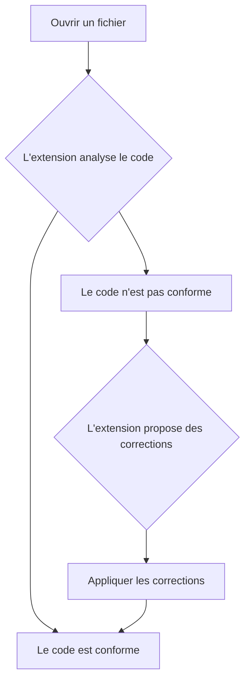
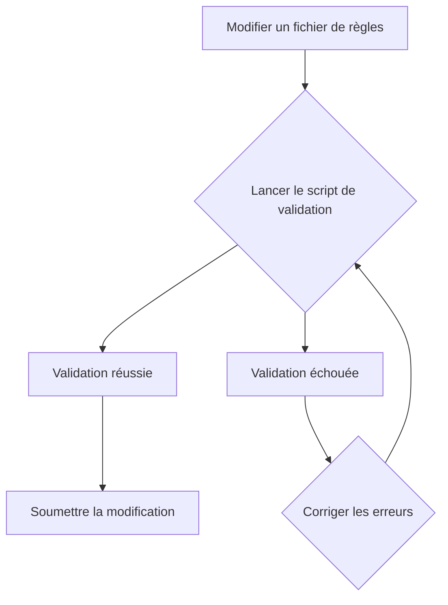
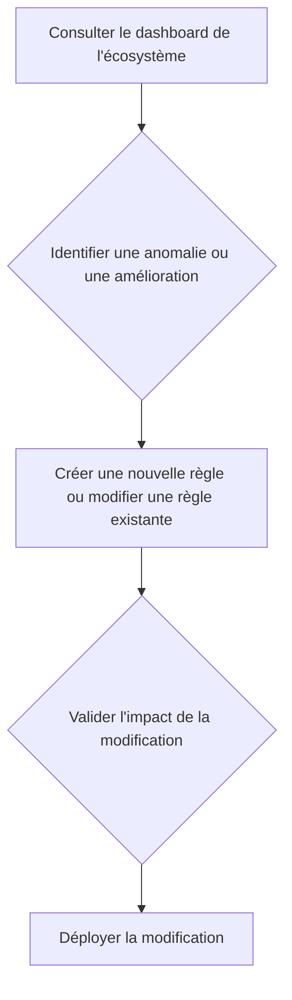

# Workflows Principaux de l'Extension Roo Code

Ce document présente les workflows principaux de l'extension Roo Code, en se concentrant sur les besoins des [personas](./personas.md).

---

## 1. Workflow de Développement (pour le Développeur)

Ce workflow décrit comment un développeur utilise l'extension pour intégrer les standards du projet.

**Points de friction potentiels :**

*   Les suggestions de correction ne sont pas claires.
*   L'analyse est trop lente.

---

## 2. Workflow de Contribution (pour le Contributeur)

Ce workflow décrit comment un contributeur modifie ou ajoute une règle.

**Points de friction potentiels :**

*   Le script de validation est complexe à utiliser.
*   Les erreurs de validation sont difficiles à comprendre.

---

## 3. Workflow d'Architecture (pour l'Architecte)

Ce workflow décrit comment un architecte supervise et fait évoluer l'écosystème.

**Points de friction potentiels :**

*   Le dashboard n'est pas fiable ou est incomplet.
*   Il est difficile d'évaluer l'impact d'une modification sur l'ensemble de l'écosystème.