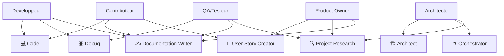

## Correspondance entre Personas et Modes Roo

<!-- ⚠️ Section générée automatiquement depuis .roo/modes-inventory.md. Ne pas modifier manuellement. -->

Chaque persona est associé à un ou plusieurs modes Roo selon ses besoins :  
- **Développeur** : implémentation, debug, documentation technique  
- **Contributeur** : contribution code, documentation, user stories  
- **Architecte** : planification, orchestration, recherche  
- **Product Owner** : user stories, recherche, documentation  
- **QA/Testeur** : debug, documentation, analyse

Voir la [matrice des workflows](rules/workflows-matrix.md) pour plus de détails.
