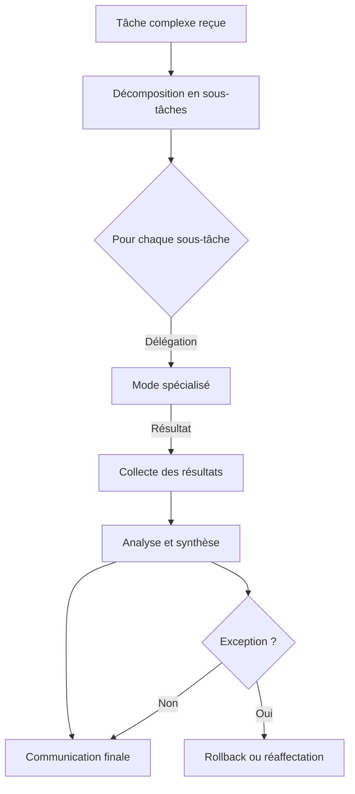

# Règles d’orchestration et workflows Roo-Code

Ce fichier est subordonné à [.roo/rules/rules.md](rules.md).  
Il détaille les conventions, modèles et bonnes pratiques pour l’orchestration des managers/agents et la gestion des workflows dans le projet Roo-Code, en intégrant les principes du mode Orchestrator.

---

## 1. Modèle de workflow Orchestrator Roo-Code

### Déroulement type :

1. **Réception d’une tâche complexe**
2. **Décomposition en sous-tâches logiques**
3. **Délégation à chaque mode spécialisé via `new_task`**
4. **Instructions précises pour chaque sous-tâche : contexte, périmètre, signalement de complétion**
5. **Suivi de l’avancement et collecte des résultats**
6. **Analyse des résultats et synthèse globale**
7. **Communication du résultat à l’utilisateur**
8. **Gestion des exceptions, rollback ou réaffectation si besoin**

### Diagramme Mermaid :

---

## 2. Conventions d’intégration

- Chaque workflow doit référencer les managers/agents concernés (voir [`AGENTS.md`](../AGENTS.md)).
- Les instructions de délégation doivent inclure : contexte, périmètre, consignes de signalement, et indiquer que ces instructions priment sur les consignes générales du mode cible.
- Utiliser des points d’extension pour personnaliser ou enrichir les workflows (plugins, stratégies).
- Documenter les critères d’acceptation et les cas limites.

---

## 3. Bonnes pratiques pour l’orchestration

- Toujours découper les tâches complexes en sous-tâches actionnables.
- Déléguer chaque sous-tâche au mode le plus adapté, avec instructions précises.
- Suivre et synthétiser les résultats pour garantir la cohérence globale.
- Documenter chaque étape, chaque exception et chaque adaptation.
- Mettre à jour ce fichier à chaque évolution des workflows ou des pratiques d’orchestration.
- Ajouter les nouveaux modèles ou diagrammes dans la documentation centrale.

---

_Tip : Un workflow d’orchestration bien documenté permet à l’équipe Roo de garantir la qualité, la traçabilité et l’efficacité des opérations complexes._