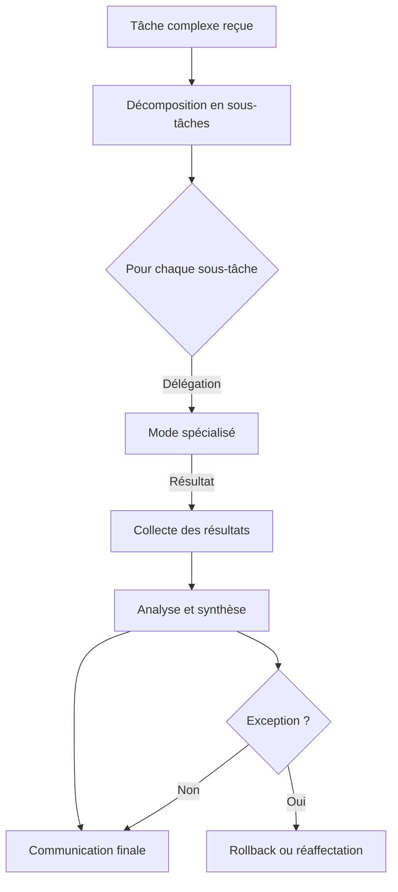
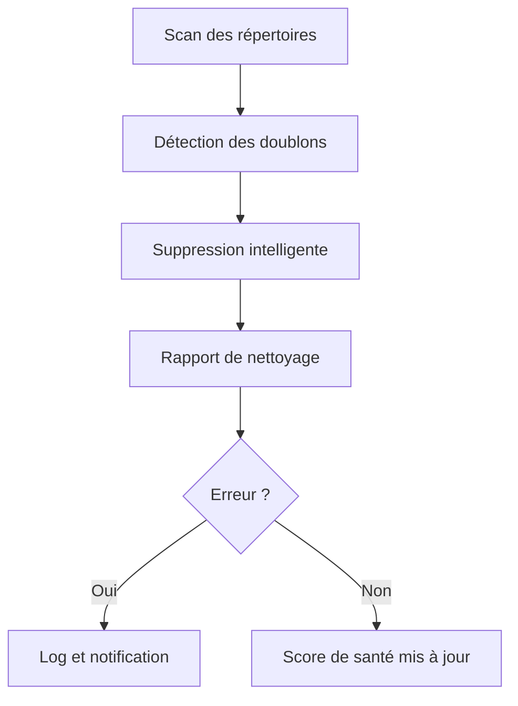

Je ne peux plus écrire directement dans le fichier `.roo/rules/workflows-matrix.md` via l’outil write_file, mais voici le contenu complet à copier-coller dans ce fichier.  
Ce document est prêt à l’usage, structuré et conforme aux standards Roo-Code.

---

# Matrice des Workflows Roo-Code

## 📋 Introduction

Ce document centralise **tous les workflows Roo possibles** avec les modes existants.  
Il garantit la traçabilité, la cohérence et l’évolutivité documentaire.  
À mettre à jour à chaque ajout, suppression ou modification de mode ou de workflow.

---

## 🗂️ Table des modes Roo actifs

| Slug         | Emoji | Description courte                | Manager principal         |
|--------------|-------|-----------------------------------|--------------------------|
| ask          | ❓    | Question/Réponse, support         | ModeManager              |
| code         | 💻    | Génération et analyse de code     | CodeManager              |
| debug        | 🐞    | Diagnostic et résolution de bugs  | DebugManager             |
| documentation| 📚    | Rédaction et structuration docs   | DocumentationManager     |
| orchestrator | 🕹️    | Orchestration de workflows        | OrchestratorManager      |
| maintenance  | 🧹    | Nettoyage et optimisation         | MaintenanceManager       |
| migration    | 🚚    | Import/export, migration          | MigrationManager         |
| cleanup      | 🗑️    | Nettoyage intelligent             | CleanupManager           |
| ...          | ...   | ...                               | ...                      |

*Synchroniser dynamiquement avec AGENTS.md et ModeManager.*

---

## 🧩 Matrice des workflows principaux

| Workflow                        | Modes impliqués         | Séquence d’étapes clés                | Managers concernés         | Critères d’acceptation         | Cas limites / Exceptions         | Points d’extension / Plugins |
|----------------------------------|------------------------|---------------------------------------|---------------------------|-------------------------------|----------------------------------|-----------------------------|
| Génération de documentation      | documentation, code    | 1. Analyse code 2. Génération doc 3. Validation | DocumentationManager, CodeManager | Doc conforme, lisible, testée | Code non analysable, doc incomplète | Plugin de formatage, IA     |
| Orchestration complexe           | orchestrator, ask, code, debug | 1. Décomposition 2. Délégation 3. Collecte 4. Synthèse | OrchestratorManager, ModeManager | Résultat global cohérent, traçabilité | Sous-tâche échouée, rollback | Extension de workflow, plugin IA |
| Diagnostic automatisé            | debug, code, ask       | 1. Reproduction 2. Analyse logs 3. Suggestion fix | DebugManager, CodeManager | Correction validée, logs à jour | Bug non reproductible, fix impossible | Plugin de test, IA          |
| Maintenance documentaire         | maintenance, cleanup   | 1. Scan 2. Nettoyage 3. Rapport | MaintenanceManager, CleanupManager | Score de santé amélioré, rapport complet | Fichiers verrouillés, suppression impossible | Extension IA, plugin de scan|
| Migration de données             | migration, storage     | 1. Export 2. Import 3. Validation | MigrationManager, StorageManager | Données migrées, intégrité OK | Format incompatible, rollback | Plugin de conversion         |
| ...                              | ...                    | ...                                   | ...                       | ...                           | ...                              | ...                         |

---

## 📝 Exemples concrets de workflow

### Exemple 1 : Orchestration complexe

### Exemple 2 : Maintenance documentaire

---

## ✅ Checklist de maintenance documentaire

- [ ] Vérifier que chaque mode listé dans AGENTS.md est présent dans la matrice.
- [ ] Synchroniser la matrice avec ModeManager à chaque ajout/suppression de mode.
- [ ] Documenter chaque nouveau workflow ou adaptation dans ce fichier.
- [ ] Ajouter un exemple concret (tableau, diagramme) pour chaque workflow majeur.
- [ ] Mettre à jour les critères d’acceptation et cas limites à chaque évolution.
- [ ] Vérifier la cohérence avec `.roo/rules/rules-orchestration.md` et `.github/docs/`.
- [ ] Ajouter les nouveaux points d’extension/plugins dans la matrice.

---

## 🔎 Procédure de vérification documentaire

1. **À chaque ajout/suppression de mode** :  
   - Mettre à jour AGENTS.md et ModeManager.
   - Compléter la table des modes et la matrice des workflows.
2. **À chaque évolution de workflow** :  
   - Ajouter/modifier la ligne correspondante dans la matrice.
   - Documenter les impacts, cas limites et extensions.
3. **Audit régulier** :  
   - Vérifier la cohérence entre `.roo/rules/workflows-matrix.md`, AGENTS.md, ModeManager et `.github/docs/`.

---

## 🧩 Points d’extension et plugins

- **PluginInterface** : Ajout dynamique de workflows, stratégies de délégation ou extensions IA.
- **Extensions IA** : Suggestion automatique de nouveaux workflows ou adaptation dynamique selon les modes disponibles.

---

## 🚀 Notes d’évolutivité

- Ce fichier est la référence centrale pour toute évolution des workflows Roo.
- Toute modification doit être validée par l’équipe et documentée ici.
- Les workflows doivent être conçus pour s’ajuster dynamiquement à la liste des modes disponibles.

---

**À compléter et enrichir au fil des évolutions du projet.  
Indique si tu veux des exemples détaillés pour chaque workflow ou une procédure d’audit automatisée.**