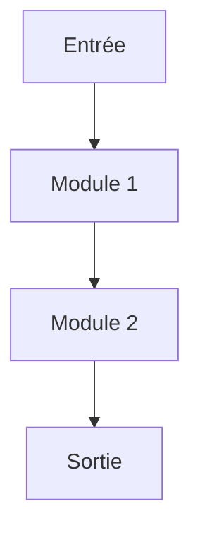

# ARCHITECTURE_TARGET_SPEC.md

## Spécification détaillée de l’architecture cible

- **Besoins utilisateurs/techniques** : voir `analysis/user-needs-phase3.json`
- **Date de génération** : 2025-06-25

## Diagrammes d’architecture (Mermaid, schémas, tableaux)

## Modules, API, conventions

| Module/API | Description | Langage | Signature/Interface | Tests | Documentation |
|------------|-------------|---------|---------------------|-------|---------------|
|            |             |         |                     |       |               |

## Sécurité, monitoring, CI/CD

-

---

**Critère de validation** : validation croisée (lead technique, dev, ops), conformité aux standards .clinerules/  
**Rollback** : conserver l’ancienne version
