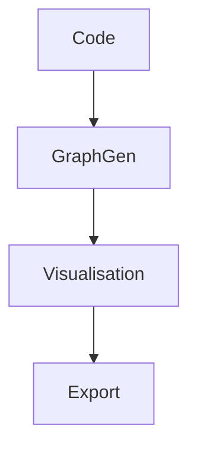

# GRAPHGEN_SPEC.md

## Spécification détaillée des modules de génération/visualisation de graphes

- **Besoins utilisateurs/techniques** : voir `analysis/user-needs-phase5.json`
- **Date de génération** : 2025-06-25

## Diagrammes, signatures, conventions



| Module | Fonction | Langage | Signature | Tests | Documentation |
|--------|----------|---------|-----------|-------|---------------|
|        |          |         |           |       |               |

## Exemples d’outputs

```json
[]
```

---

**Critère de validation** : validation croisée (lead technique, dev, ops), conformité aux standards .clinerules/  
**Rollback** : conserver l’ancienne version
