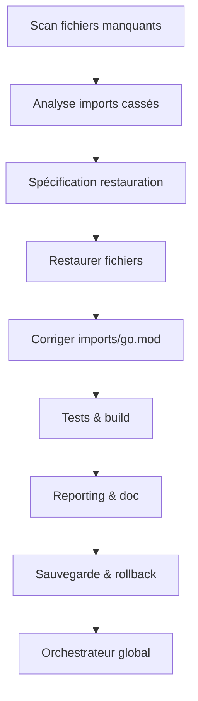

# 🛠️ Roadmap de Restauration & Sécurisation de la Branche `fix/restore-core-modules-broken-merge`

---

## 📝 CONTEXTE, ENJEUX & MOTIVATIONS

Suite à une série de merges et résolutions de conflits sur les branches de convergence, de nombreux fichiers critiques ont été supprimés ou vidés, provoquant une explosion d’erreurs de build et d’imports cassés sur la branche `dev`.  
L’objectif de cette roadmap est de restaurer l’intégrité du code, garantir la robustesse de la stack Go, et d’assurer une traçabilité et une automatisation maximales pour éviter toute récidive.

### Enjeux
- Rétablir la stabilité de la branche de développement.
- Garantir la reproductibilité et la traçabilité de chaque action.
- Sécuriser la stack Go et la cohérence des modules.
- Automatiser au maximum chaque étape pour fiabiliser le process.
- Permettre un rollback rapide et documenté en cas d’échec.

### Motivations
- Réduire le temps de résolution des incidents critiques.
- Améliorer la qualité du code et la couverture de tests.
- Faciliter la collaboration et la revue croisée.
- S’aligner sur les standards d’ingénierie avancée et les exigences CI/CD.

### Buts
- Restaurer tous les fichiers et modules critiques supprimés/vidés.
- Corriger tous les imports et dépendances cassés.
- Garantir un build et des tests 100% verts.
- Documenter et automatiser chaque étape pour la rendre traçable et reproductible.

---

## 🚨 CONSIGNES CRITIQUES DE VÉRIFICATION

### Avant CHAQUE étape

- [ ] **VÉRIFIER la branche actuelle** : `git branch` et `git status`
- [ ] **VÉRIFIER les imports** : cohérence des chemins relatifs/absolus
- [ ] **VÉRIFIER la stack** : `go mod tidy` et `go build ./...`
- [ ] **VÉRIFIER les fichiers requis** : présence de tous les composants
- [ ] **VÉRIFIER la responsabilité** : éviter la duplication de code
- [ ] **TESTER avant commit** : `go test ./...` doit passer à 100%

### À CHAQUE section majeure

- [ ] **COMMITTER sur la bonne branche** : vérifier correspondance
- [ ] **PUSHER immédiatement** : `git push origin [branch-name]`
- [ ] **DOCUMENTER les changements** : mise à jour du README
- [ ] **VALIDER l'intégration** : tests end-to-end

### Responsabilités par branche

- **main** : Code de production stable uniquement
- **dev** : Intégration et tests de l'écosystème unifié  
- **managers** : Développement des managers individuels
- **vectorization-go** : Migration Python→Go des vecteurs
- **consolidation-v57** : Branche dédiée pour ce plan

---

## 🏗️ SPÉCIFICATIONS TECHNIQUES GÉNÉRIQUES

### 📋 Stack Technique Complète

**Runtime et Outils**

- **Go Version** : 1.21+ requis (vérifier avec `go version`)
- **Module System** : Go modules activés (`go mod init/tidy`)
- **Build Tool** : `go build ./...` pour validation complète
- **Dependency Management** : `go mod download` et `go mod verify`

**Dépendances Critiques**

```go
// go.mod - dépendances requises
require (
    github.com/qdrant/go-client v1.7.0        // Client Qdrant natif
    github.com/google/uuid v1.6.0             // Génération UUID
    github.com/stretchr/testify v1.8.4        // Framework de test
    go.uber.org/zap v1.26.0                   // Logging structuré
    golang.org/x/sync v0.5.0                  // Primitives de concurrence
    github.com/spf13/viper v1.17.0            // Configuration
    github.com/gin-gonic/gin v1.9.1           // Framework HTTP (si APIs)
)
```

**Outils de Développement**

- **Linting** : `golangci-lint run` (configuration dans `.golangci.yml`)
- **Formatting** : `gofmt -s -w .` et `goimports -w .`
- **Testing** : `go test -v -race -cover ./...`
- **Security** : `gosec ./...` pour l'analyse de sécurité

### 🗂️ Structure des Répertoires Normalisée

```
EMAIL_SENDER_1/
├── cmd/                          # Points d'entrée des applications
│   ├── migration-tool/          # Outil de migration Python->Go
│   └── manager-consolidator/    # Outil de consolidation
├── internal/                    # Code interne non exportable
│   ├── config/                 # Configuration centralisée
│   ├── models/                 # Structures de données
│   ├── repository/             # Couche d'accès données
│   └── service/                # Logique métier
├── pkg/                        # Packages exportables
│   ├── vectorization/          # Module vectorisation Go
│   ├── managers/               # Managers consolidés
│   └── common/                 # Utilitaires partagés
├── api/                        # Définitions API (OpenAPI/Swagger)
├── scripts/                    # Scripts d'automatisation
├── docs/                       # Documentation technique
├── tests/                      # Tests d'intégration
└── deployments/                # Configuration déploiement
```

### 🎯 Conventions de Nommage Strictes

**Fichiers et Répertoires**

- **Packages** : `snake_case` (ex: `vector_client`, `email_manager`)
- **Fichiers Go** : `snake_case.go` (ex: `vector_client.go`, `manager_consolidator.go`)
- **Tests** : `*_test.go` (ex: `vector_client_test.go`)
- **Scripts** : `kebab-case.sh/.ps1` (ex: `build-and-test.sh`)

**Code Go**

- **Variables/Fonctions** : `camelCase` (ex: `vectorClient`, `processEmails`)
- **Constantes** : `UPPER_SNAKE_CASE` ou `CamelCase` selon contexte
- **Types/Interfaces** : `PascalCase` (ex: `VectorClient`, `EmailManager`)
- **Méthodes** : `PascalCase` pour export, `camelCase` pour privé

**Git et Branches**

- **Branches** : `kebab-case` (ex: `feature/vector-migration`, `fix/manager-consolidation`)
- **Commits** : Format Conventional Commits

  ```
  feat(vectorization): add Go native Qdrant client
  fix(managers): resolve duplicate interface definitions
  docs(readme): update installation instructions
  ```

### 🔧 Standards de Code et Qualité

**Formatage et Style**

- **Indentation** : Tabs (format Go standard)
- **Longueur de ligne** : 100 caractères maximum
- **Imports** : Groupés (standard, third-party, internal) avec lignes vides
- **Commentaires** : GoDoc format pour exports, inline pour logique complexe

**Architecture et Patterns**

- **Principe** : Clean Architecture avec dépendances inversées
- **Error Handling** : Types d'erreur explicites avec wrapping
- **Logging** : Structured logging avec Zap (JSON en prod, console en dev)
- **Configuration** : Viper avec support YAML/ENV/flags
- **Concurrence** : Channels et goroutines, éviter les mutexes sauf nécessaire

**Exemple de Structure d'Erreur**

```go
type VectorError struct {
    Operation string
    Cause     error
    Code      ErrorCode
}

func (e *VectorError) Error() string {
    return fmt.Sprintf("vector operation '%s' failed: %v", e.Operation, e.Cause)
}
```

### 🧪 Stratégie de Tests Complète

**Couverture et Types**

- **Couverture minimale** : 85% pour le code critique
- **Tests unitaires** : Tous les packages publics
- **Tests d'intégration** : Composants inter-dépendants
- **Tests de performance** : Benchmarks pour la vectorisation

**Conventions de Test**

```go
func TestVectorClient_CreateCollection(t *testing.T) {
    tests := []struct {
        name    string
        config  VectorConfig
        wantErr bool
    }{
        {
            name: "valid_collection_creation",
            config: VectorConfig{
                Host: "localhost",
                Port: 6333,
                CollectionName: "test_collection",
                VectorSize: 384,
            },
            wantErr: false,
        },
        // ... autres cas de test
    }
    
    for _, tt := range tests {
        t.Run(tt.name, func(t *testing.T) {
            // Test implementation
        })
    }
}
```

**Mocking et Test Data**

- **Interfaces** : Toujours définir des interfaces pour le mocking
- **Test fixtures** : Données de test dans `testdata/`
- **Setup/Teardown** : `TestMain` pour setup global

### 🔒 Sécurité et Configuration

**Gestion des Secrets**

- **Variables d'environnement** : Pas de secrets dans le code
- **Configuration** : Fichiers YAML pour le dev, ENV pour la prod
- **Qdrant** : Authentification via token si configuré

**Variables d'Environnement Requises**

```bash
# Configuration Qdrant
QDRANT_HOST=localhost
QDRANT_PORT=6333
QDRANT_API_KEY=optional_token

# Configuration Application
LOG_LEVEL=info
ENV=development
CONFIG_PATH=./config/config.yaml

# Migration
PYTHON_DATA_PATH=./data/vectors/
BATCH_SIZE=1000
```

### 📊 Performance et Monitoring

**Critères de Performance**

- **Vectorisation** : < 500ms pour 10k vecteurs
- **API Response** : < 100ms pour requêtes simples
- **Memory Usage** : < 500MB en utilisation normale
- **Concurrence** : Support 100 requêtes simultanées

**Métriques à Tracker**

```go
// Exemple de métriques avec Prometheus
var (
    vectorOperationDuration = prometheus.NewHistogramVec(
        prometheus.HistogramOpts{
            Name: "vector_operation_duration_seconds",
            Help: "Duration of vector operations",
        },
        []string{"operation", "status"},
    )
)
```

### 🔄 Workflow Git et CI/CD

**Workflow de Développement**

1. **Créer branche** : `git checkout -b feature/task-name`
2. **Développer** : Commits atomiques avec tests
3. **Valider** : `go test ./...` + `golangci-lint run`
4. **Push** : `git push origin feature/task-name`
5. **Merger** : Via PR après review

**Definition of Done**

- [ ] Code implémenté selon les spécifications
- [ ] Tests unitaires écrits et passants (>85% coverage)
- [ ] Linting sans erreurs (`golangci-lint run`)
- [ ] Documentation GoDoc mise à jour
- [ ] Tests d'intégration passants
- [ ] Performance validée (benchmarks si critique)
- [ ] Code review approuvé
- [ ] Branch mergée et nettoyée

---

# 🛠️ Roadmap de Restauration & Sécurisation de la Branche `fix/restore-core-modules-broken-merge`

## 1. Recensement & Analyse d’Écart
- [ ] **Lister tous les fichiers critiques supprimés/vidés**  
  - Livrable : rapport Markdown/CSV des fichiers impactés  
  - Script Go : `scan_missing_files.go`  
  - Commande : `go run scripts/scan_missing_files.go > missing_files_report.md`  
  - Format : Markdown/CSV  
  - Validation : Diff avec un commit sain, revue humaine  
  - Rollback : backup automatique du rapport  
  - CI/CD : Génération du rapport à chaque PR  
  - Documentation : README du script

- [ ] **Comparer la structure actuelle avec un commit sain**  
  - Livrable : diff arborescence, rapport d’écart  
  - Commande : `git diff --name-status <commit_sain> HEAD`  
  - Validation : revue croisée  
  - Traçabilité : log du diff

## 2. Recueil des Besoins & Spécification
- [ ] **Identifier les modules/imports cassés**  
  - Livrable : liste des imports cassés (JSON/Markdown)  
  - Script Go : `find_broken_imports.go`  
  - Commande : `go run scripts/find_broken_imports.go > broken_imports.md`  
  - Validation : CI/CD, badge de build  
  - Documentation : guide d’usage du script

- [ ] **Spécifier les restaurations nécessaires**  
  - Livrable : plan de restauration (Markdown)  
  - Validation : revue humaine  
  - Traçabilité : versionné dans le repo

## 3. Développement & Restauration
- [ ] **Restaurer les fichiers supprimés/vidés**  
  - Livrable : fichiers restaurés  
  - Script Go/Bash : `restore_files_from_commit.go`  
  - Commande : `go run scripts/restore_files_from_commit.go --from <commit_sain>`  
  - Validation : diff, tests unitaires  
  - Rollback : backup `.bak` avant écrasement  
  - CI/CD : job de restauration  
  - Documentation : README du script

- [ ] **Corriger les imports et go.mod/go.work**  
  - Livrable : fichiers go.mod/go.work corrigés  
  - Script Go : `fix_imports_and_mod.go`  
  - Commande : `go run scripts/fix_imports_and_mod.go`  
  - Validation : `go mod tidy`, build sans erreur  
  - CI/CD : badge build vert  
  - Documentation : guide d’usage

## 4. Tests & Validation
- [ ] **Lancer tous les tests unitaires et d’intégration**  
  - Livrable : rapport de tests (HTML/Markdown)  
  - Commande : `go test ./... -v | tee test_report.md`  
  - Validation : badge de couverture, CI/CD  
  - Rollback : backup du rapport  
  - Documentation : README tests

- [ ] **Vérifier la compilation complète**  
  - Livrable : binaire compilé, rapport de build  
  - Commande : `go build ./...`  
  - Validation : build sans erreur  
  - CI/CD : job de build

## 5. Reporting & Documentation
- [ ] **Générer un rapport final de restauration**  
  - Livrable : rapport Markdown/HTML  
  - Script Go : `generate_restore_report.go`  
  - Commande : `go run scripts/generate_restore_report.go`  
  - Validation : revue humaine  
  - CI/CD : archivage du rapport  
  - Documentation : README du script

- [ ] **Mettre à jour la documentation technique**  
  - Livrable : README, guides, changelog  
  - Validation : revue croisée  
  - Traçabilité : commit dédié

## 6. Rollback & Sécurisation
- [ ] **Sauvegarder tous les fichiers modifiés avant chaque étape**  
  - Livrable : fichiers `.bak`  
  - Script Bash/Go  
  - Commande : `cp file.go file.go.bak`  
  - Validation : présence des backups  
  - CI/CD : job de backup

- [ ] **Procédure de rollback automatisée**  
  - Livrable : script de restauration  
  - Script Go/Bash  
  - Commande : `go run scripts/rollback_restore.go`  
  - Documentation : guide rollback

## 7. Orchestration & CI/CD



- [ ] **Créer/adapter un orchestrateur global (`auto-roadmap-runner.go`)**  
  - Exécute toutes les étapes, logs, reporting, notifications  
  - Intégration CI/CD (GitHub Actions, badges, triggers, archivage)

## 8. Critères de validation & traçabilité

- [ ] **Tests automatisés pour chaque script**  
- [ ] **Badges de build, couverture, lint**  
- [ ] **Archivage automatique des rapports et logs**  
- [ ] **Validation humaine pour chaque étape critique**  
- [ ] **Historique des outputs et feedback automatisé**

---

### Exemples de scripts Go minimalistes

- `scan_missing_files.go` :
```go
package main
import ("os"; "fmt"; "io/fs"; "path/filepath")
func main() {
  filepath.Walk(".", func(path string, info fs.FileInfo, err error) error {
    if err == nil && info.Size() == 0 { fmt.Println("VIDE:", path) }
    return nil
  })
}
```

- `restore_files_from_commit.go` :
```go
// go run restore_files_from_commit.go --from <commit>