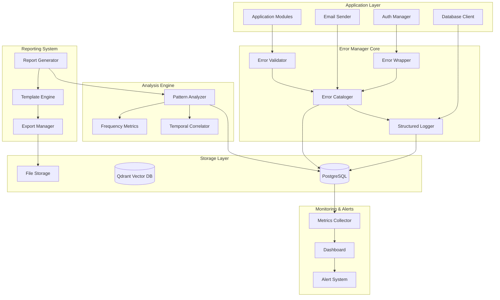
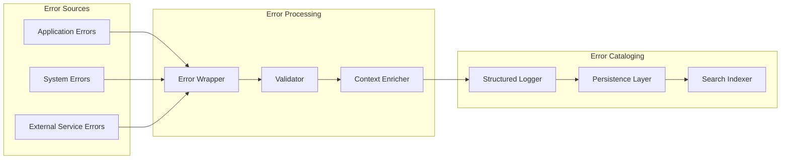
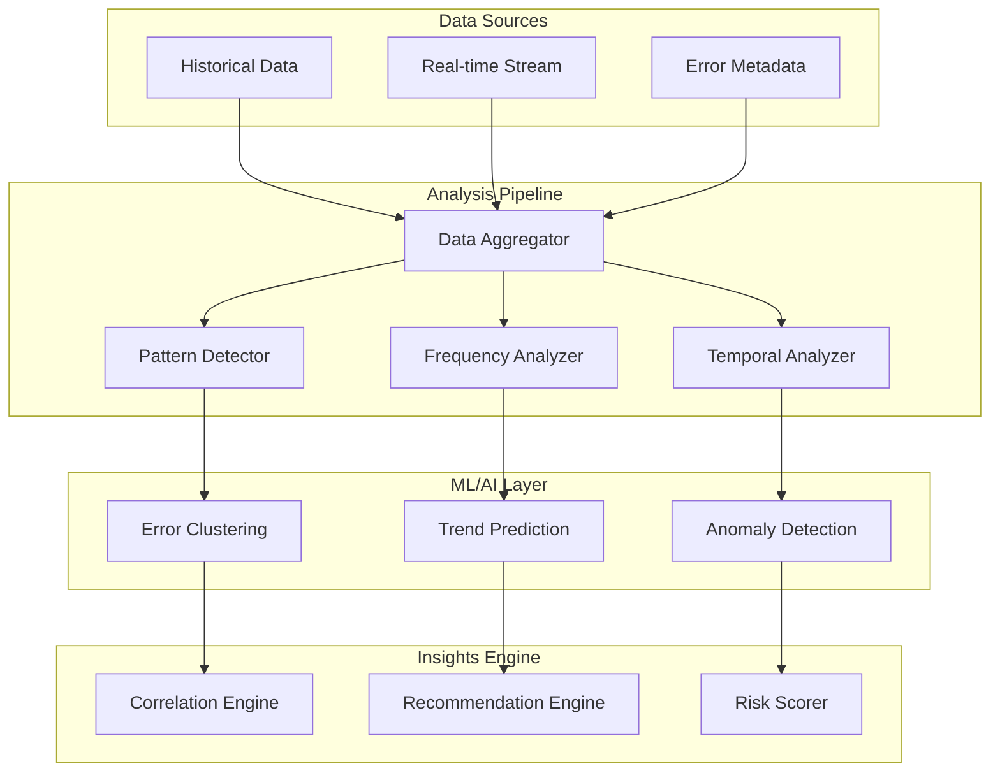
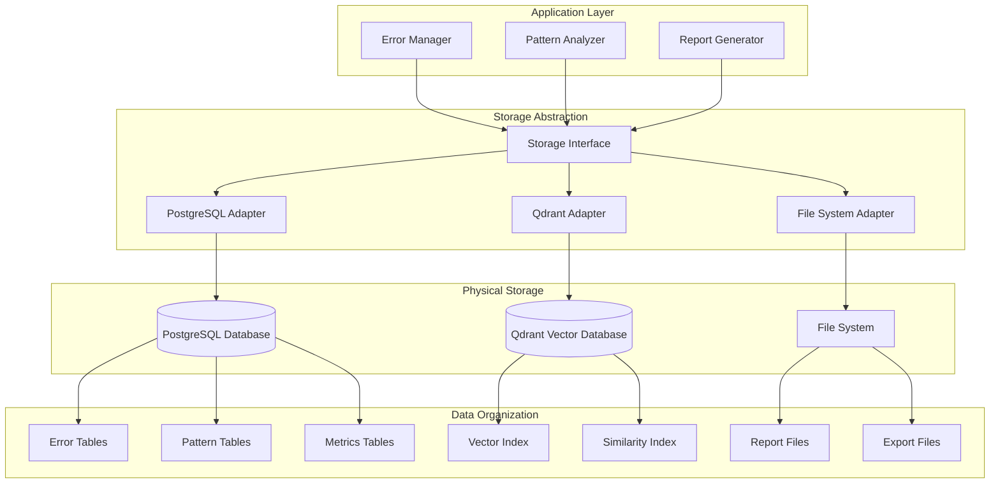
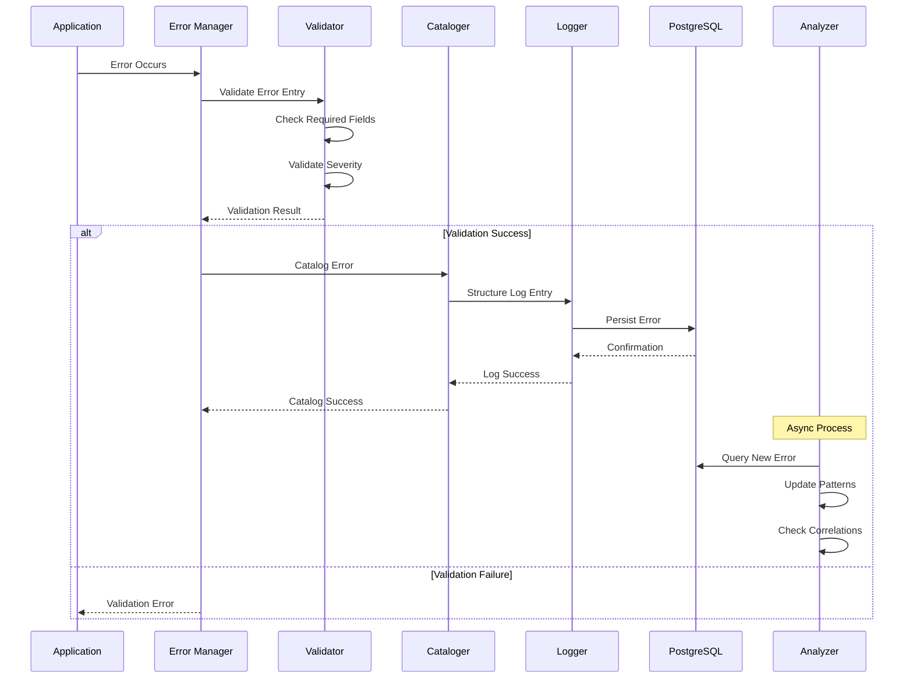
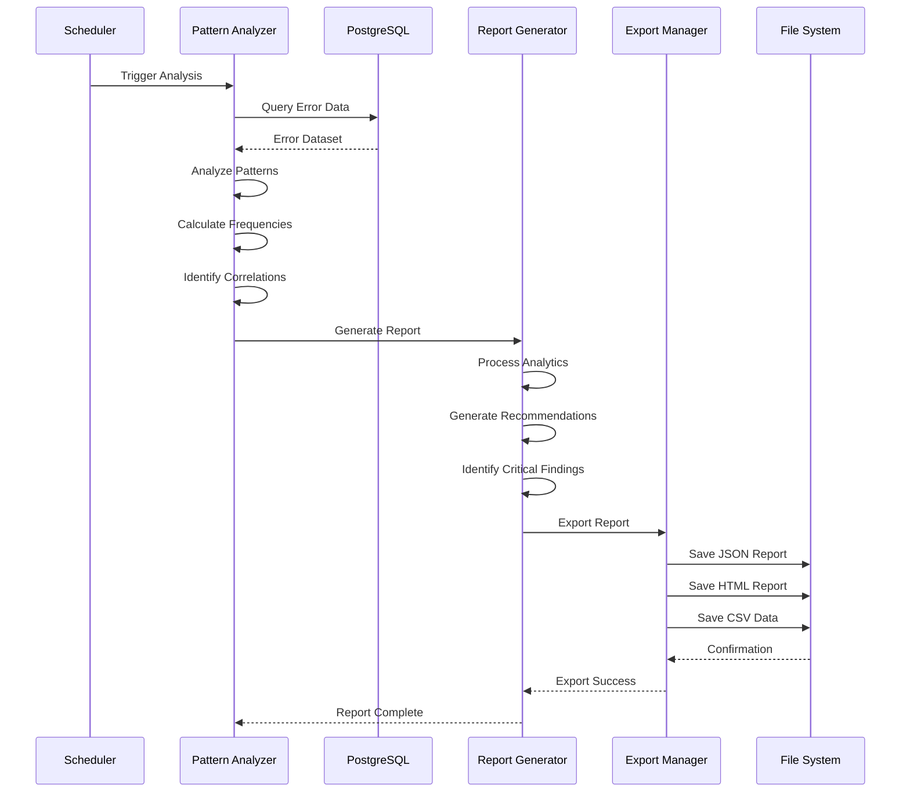
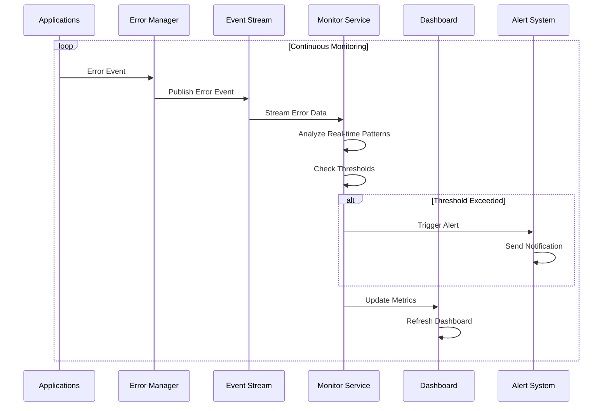
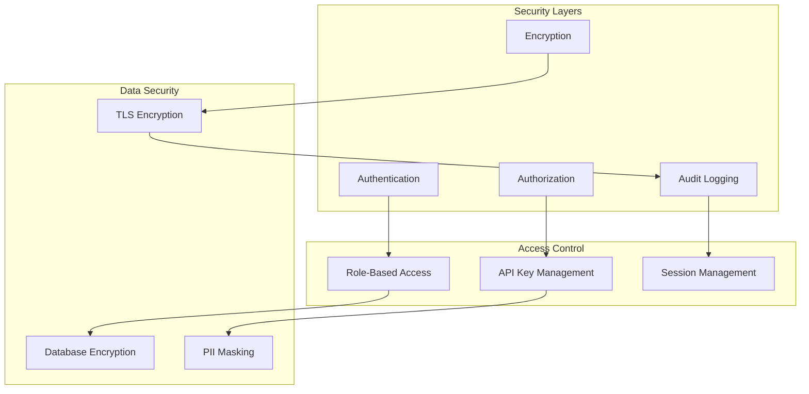
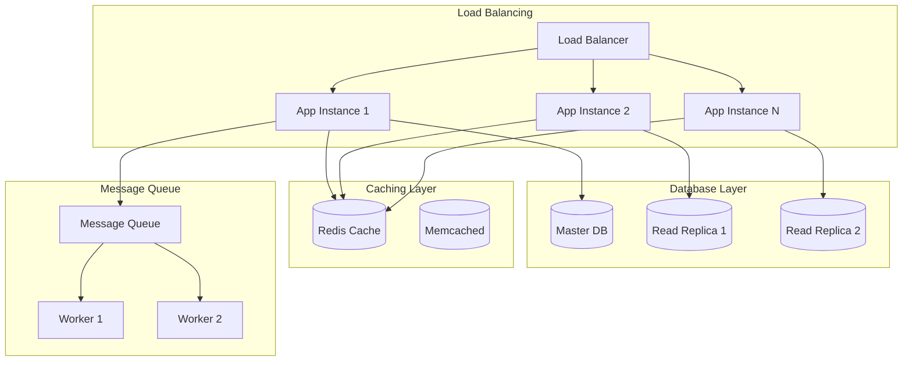
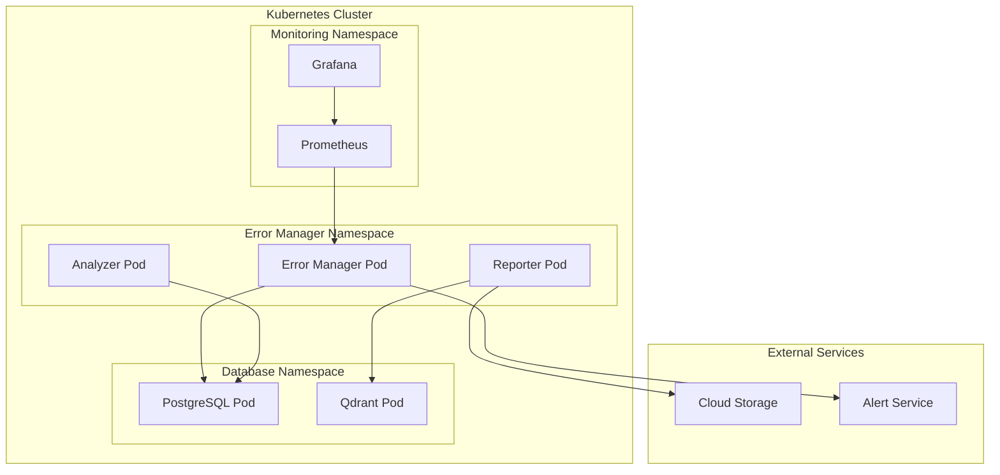

# Error Manager Architecture Documentation

## System Architecture Overview

The Error Manager is a comprehensive error handling and analysis system designed with a modular architecture that supports real-time error cataloging, pattern analysis, and intelligent reporting.

## High-Level Architecture Diagram



## Component Architecture

### 1. Error Collection Layer



### 2. Pattern Analysis Architecture



### 3. Storage Architecture



## Data Flow Diagrams

### 1. Error Processing Flow



### 2. Pattern Analysis Flow



### 3. Real-time Monitoring Flow



## Database Schema

### PostgreSQL Schema

```sql
-- Main errors table
CREATE TABLE project_errors (
    id UUID PRIMARY KEY,
    timestamp TIMESTAMPTZ NOT NULL,
    message TEXT NOT NULL,
    stack_trace TEXT,
    module VARCHAR(100) NOT NULL,
    error_code VARCHAR(50) NOT NULL,
    manager_context TEXT,
    severity VARCHAR(20) NOT NULL,
    created_at TIMESTAMPTZ DEFAULT NOW(),
    
    -- Indexing for performance
    INDEX idx_timestamp (timestamp),
    INDEX idx_module (module),
    INDEX idx_error_code (error_code),
    INDEX idx_severity (severity),
    INDEX idx_module_code (module, error_code)
);

-- Pattern analysis cache
CREATE TABLE error_patterns (
    id SERIAL PRIMARY KEY,
    pattern_hash VARCHAR(64) UNIQUE,
    module VARCHAR(100),
    error_code VARCHAR(50),
    frequency INTEGER,
    first_seen TIMESTAMPTZ,
    last_seen TIMESTAMPTZ,
    severity VARCHAR(20),
    metadata JSONB,
    created_at TIMESTAMPTZ DEFAULT NOW(),
    updated_at TIMESTAMPTZ DEFAULT NOW()
);

-- Correlation analysis results
CREATE TABLE error_correlations (
    id SERIAL PRIMARY KEY,
    error_code_1 VARCHAR(50),
    error_code_2 VARCHAR(50),
    module_1 VARCHAR(100),
    module_2 VARCHAR(100),
    correlation_score DECIMAL(5,4),
    time_window_seconds INTEGER,
    occurrence_gap_seconds INTEGER,
    created_at TIMESTAMPTZ DEFAULT NOW()
);

-- Report metadata
CREATE TABLE analysis_reports (
    id SERIAL PRIMARY KEY,
    report_type VARCHAR(50),
    generated_at TIMESTAMPTZ,
    total_errors INTEGER,
    unique_patterns INTEGER,
    file_path TEXT,
    status VARCHAR(20),
    metadata JSONB
);
```

## Technology Stack

### Core Technologies

- **Language**: Go 1.19+
- **Database**: PostgreSQL 14+
- **Vector Database**: Qdrant
- **Logging**: Zap (uber-go/zap)
- **Error Handling**: pkg/errors
- **Testing**: Go standard testing + testify

### External Dependencies

```go
// Core dependencies
github.com/lib/pq              // PostgreSQL driver
go.uber.org/zap               // Structured logging
github.com/pkg/errors         // Enhanced error handling
github.com/google/uuid        // UUID generation

// Analysis dependencies
github.com/qdrant/go-client   // Qdrant vector database
encoding/json                 // JSON processing
html/template                 // Report templating
time                         // Time handling
```

## Security Architecture

### Data Protection



### Security Measures

1. **Data Encryption**
   - TLS 1.3 for data in transit
   - AES-256 for sensitive data at rest
   - PostgreSQL native encryption

2. **Access Control**
   - Role-based access control (RBAC)
   - API key authentication
   - Session-based authorization

3. **Data Privacy**
   - PII detection and masking
   - Configurable data retention policies
   - GDPR compliance features

4. **Audit Trail**
   - Complete access logging
   - Modification tracking
   - Security event monitoring

## Performance Architecture

### Scalability Design



### Performance Optimizations

1. **Database Optimization**
   - Strategic indexing on frequently queried columns
   - Connection pooling for efficient resource usage
   - Read replicas for analytics queries
   - Partitioning for large datasets

2. **Caching Strategy**
   - Redis for frequently accessed patterns
   - In-memory caching for recent error data
   - Report result caching

3. **Asynchronous Processing**
   - Queue-based pattern analysis
   - Background report generation
   - Non-blocking error logging

4. **Resource Management**
   - Connection pooling
   - Memory-efficient data structures
   - Garbage collection optimization

## Deployment Architecture

### Container Deployment



## Integration Points

### API Interfaces

1. **REST API**
   - Error submission endpoints
   - Pattern query endpoints
   - Report generation endpoints

2. **gRPC Services**
   - High-performance error streaming
   - Real-time pattern analysis
   - Bulk data operations

3. **Message Queue Integration**
   - Kafka for high-volume error streams
   - RabbitMQ for reliable delivery
   - Redis Streams for real-time processing

### External System Integration

1. **Monitoring Systems**
   - Prometheus metrics export
   - Grafana dashboard integration
   - DataDog APM integration

2. **Alert Systems**
   - PagerDuty integration
   - Slack notifications
   - Email alert delivery

3. **CI/CD Integration**
   - GitHub Actions integration
   - Jenkins pipeline hooks
   - Docker registry integration

---

## Architecture Decision Records (ADRs)

### ADR-001: Database Choice
**Decision**: Use PostgreSQL as primary database
**Rationale**: ACID compliance, JSON support, mature ecosystem
**Status**: Accepted

### ADR-002: Vector Database
**Decision**: Use Qdrant for similarity search
**Rationale**: High performance, Go client availability, cloud-native
**Status**: Accepted

### ADR-003: Logging Framework
**Decision**: Use Zap for structured logging
**Rationale**: High performance, structured output, Uber ecosystem
**Status**: Accepted

### ADR-004: Error Wrapping
**Decision**: Use pkg/errors for error enhancement
**Rationale**: Stack trace preservation, context addition, community standard
**Status**: Accepted
