# Jules Bot Manual Review & Approval Process

## Overview

This document outlines the complete manual review and approval workflow for Jules Bot contributions, bridging the gap between automated bot contributions and main development integration.

## 🔄 Workflow Architecture

### Process Flow

```mermaid
graph TD
    A[Jules Bot Contribution] --> B[Auto-redirect to jules-google/*]
    B --> C[Quality Gates Assessment]
    C --> D{Quality Score}
    D -->|≥80| E[Fast-track Review]
    D -->|60-79| F[Standard Review]
    D -->|<60| G[Enhanced Review]
    E --> H[Human Approval]
    F --> H
    G --> H
    H -->|Approved| I[Auto-merge to dev]
    H -->|Changes Requested| J[Back to Bot]
    H -->|Rejected| K[Close PR]
    I --> L[Standard dev workflow]
```


### Branch Integration
```
main
├── dev (production-ready development)
│   ├── contextual-memory (AI system enhancements)
│   └── jules-google (bot contribution staging)
│       ├── auto-YYYYMMDD-HHMMSS (timestamped bot contributions)
│       ├── features (bot feature implementations)
│       ├── fixes (bot bug fixes)
│       └── experiments (bot experimental changes)
```

## 🚦 Quality Gates System

### Automated Assessment Criteria

| Check | Weight | Criteria | Pass Threshold |
|-------|--------|----------|----------------|
| **File Count** | 15% | Number of modified files | ≤10 files |
| **File Size** | 10% | Large file detection | No files >1MB |
| **Security** | 25% | Sensitive content scan | No credentials/keys |
| **Commit Quality** | 20% | Commit count and messages | ≤5 commits, clear messages |
| **Configuration** | 15% | Config file changes | Safe modifications only |
| **Documentation** | 15% | Docs completeness | Updated if needed |

### Quality Score Calculation
```javascript
qualityScore = (
  fileCountScore * 0.15 +
  fileSizeScore * 0.10 +
  securityScore * 0.25 +
  commitQualityScore * 0.20 +
  configScore * 0.15 +
  docsScore * 0.15
) * 100
```

### Score Interpretation
- **🟢 80-100:** High Quality - Fast-track eligible, minimal review needed
- **🟡 60-79:** Good Quality - Standard review process
- **🔴 <60:** Needs Attention - Enhanced review required

## 👥 Review Process

### Reviewer Assignment Logic

```yaml
Quality Score ≥80:
  - Primary: Lead Developer
  - Backup: Senior Developer
  
Quality Score 60-79:
  - Primary: Domain Expert (based on files changed)
  - Secondary: Code Quality Reviewer
  
Quality Score <60:
  - Primary: Lead Developer
  - Secondary: Security Reviewer
  - Tertiary: Domain Expert
```

### Review Commands

| Command | Syntax | Action | Requirements |
|---------|--------|--------|--------------|
| **Approve** | `@jules-bot approve` | Approve and auto-merge | Reviewer permissions |
| **Approve with Comment** | `@jules-bot approve-with-comment "reason"` | Conditional approval | Reviewer permissions |
| **Request Changes** | `@jules-bot request-changes "feedback"` | Request modifications | Any reviewer |
| **Request Testing** | `@jules-bot needs-testing` | Flag for testing | Any reviewer |
| **Close** | `@jules-bot close "reason"` | Reject contribution | Lead/Senior reviewer |
| **Emergency Stop** | `@jules-bot emergency-stop` | Halt all bot activity | Admin only |

### Review Timeline

| Quality Score | Review SLA | Auto-escalation |
|---------------|------------|-----------------|
| 80-100 | 4 hours | 8 hours |
| 60-79 | 24 hours | 48 hours |
| <60 | 48 hours | 72 hours |

## 📋 Review Checklist

### Technical Review
- [ ] **Code Quality**
  - Follows project coding standards
  - Proper naming conventions
  - Adequate commenting
  - No code duplication
  
- [ ] **Architecture**
  - Consistent with project architecture
  - Proper separation of concerns
  - No unnecessary complexity
  
- [ ] **Security**
  - No hardcoded secrets
  - Input validation present
  - No SQL injection vulnerabilities
  - Proper authentication/authorization

### Functional Review
- [ ] **Functionality**
  - Feature works as intended
  - Edge cases handled
  - Error handling implemented
  - Performance acceptable
  
- [ ] **Integration**
  - Compatible with existing features
  - No breaking changes (or properly documented)
  - Dependencies properly managed
  
- [ ] **Testing**
  - Adequate test coverage
  - Tests pass locally
  - Manual testing completed

### Process Review
- [ ] **Documentation**
  - README updated if needed
  - API documentation current
  - Change log entry added
  
- [ ] **Configuration**
  - Environment variables documented
  - Configuration changes safe
  - Backward compatibility maintained

## 🔧 Configuration & Customization

### Quality Thresholds
```yaml
# .github/workflows/jules-review-approval.yml
quality_thresholds:
  fast_track: 80
  standard: 60
  enhanced: 0
  
review_timeouts:
  fast_track: 4h
  standard: 24h
  enhanced: 48h
  
file_limits:
  max_files: 10
  max_file_size: 1MB
  max_commits: 5
```

### Reviewer Configuration
```yaml
# .github/CODEOWNERS
# Jules Bot specific reviewers
/jules-google/ @lead-developer @senior-developer

# Domain-specific reviewers
*.js @frontend-team
*.py @backend-team
*.md @docs-team
*config* @devops-team
```

## 🚨 Emergency Procedures

### Emergency Stop
If critical issues are detected:
1. Use `@jules-bot emergency-stop` command
2. All bot activity pauses
3. Incident escalated to leads
4. Manual investigation initiated

### Rollback Process
For approved changes causing issues:
1. Create hotfix branch from `dev`
2. Revert problematic changes
3. Emergency deploy to `main`
4. Update bot training data

## 📊 Metrics & Monitoring

### Key Metrics
- **Review Velocity:** Time from submission to approval
- **Quality Trends:** Score distribution over time
- **Approval Rate:** Percentage of contributions approved
- **Error Rate:** Post-merge issues per contribution

### Monitoring Dashboard
```yaml
Metrics to Track:
  - Average quality score
  - Review time by score range
  - Reviewer workload distribution
  - Bot contribution frequency
  - Integration success rate
```

## 🔗 Integration Points

### Contextual Memory Manager
- **Connection:** Reviews update bot learning context
- **Feedback Loop:** Approval/rejection patterns inform future decisions
- **Quality Improvement:** Failed reviews trigger retraining

### Error Handling System
- **Integration:** Review failures logged systematically
- **Recovery:** Automatic retry mechanisms for transient failures
- **Escalation:** Critical errors trigger human intervention

### Notification System
- **Slack Integration:** Real-time review notifications
- **Email Alerts:** SLA breach warnings
- **Dashboard Updates:** Live status updates

## 🎯 Success Criteria

### Process Goals
- **Review Time:** 95% of contributions reviewed within SLA
- **Quality Gate:** 90% accuracy in quality assessment
- **Approval Rate:** 70-80% of contributions approved
- **Zero Incidents:** No security/stability issues from approved changes

### Continuous Improvement
- **Weekly Reviews:** Process effectiveness assessment
- **Monthly Analysis:** Quality trend analysis
- **Quarterly Updates:** Threshold and criteria adjustments
- **Annual Overhaul:** Complete process review and optimization

---

## Quick Reference

### For Bot Contributors
1. Contributions auto-redirect to `jules-google/*`
2. Quality assessment runs automatically
3. Review assignment based on score
4. Approval integrates to `dev` branch

### For Reviewers
1. Check PR quality score and assessment
2. Review code using standard checklist
3. Use bot commands for approval/feedback
4. Monitor integration success

### For Administrators
1. Monitor review metrics
2. Adjust quality thresholds as needed
3. Update reviewer assignments
4. Handle emergency escalations

---

*Last Updated: [Current Date] | Version: 2.0 | Owner: Development Team*
