# Architecture du Gateway-Manager (v77 - Go Natif)

Ce document décrit l'architecture du Gateway-Manager après sa migration vers une implémentation 100% Go natif.

## 1. Vue d'ensemble

Le Gateway-Manager est conçu pour être un point d'orchestration centralisé, facilitant la communication et l'intégration entre divers services et managers de l'écosystème. L'architecture est modulaire, favorisant la scalabilité, la maintenabilité et la testabilité.

## 2. Diagramme d'Architecture

Voici une représentation visuelle de l'architecture du Gateway-Manager et de ses interactions :

```mermaid
graph TD
    A[Gateway-Manager] --> B(cmd/)
    A --> C(internal/)
    A --> D(pkg/)
    A --> E(api/)
    A --> F(configs/)
    A --> G(docs/)
    A --> H(tests/)

    B --> B1(gateway-manager-cli/)
    B1 --> B1_1(main.go)
    B --> B2(migration-tools/)
    B2 --> B2_1(auto-integrate-gateway/)
    B2_1 --> B2_1_1(main.go)
    B2 --> B2_2(rollback-gateway-migration/)
    B2_2 --> B2_2_1(main.go)

    C --> C1(core/)
    C1 --> C1_1(interfaces.go)
    C1 --> C1_2(models.go)
    C1 --> C1_3(logic.go)
    C --> C2(adapters/)
    C2 --> C2_1(cache/)
    C2 --> C2_2(lwm/)
    C2 --> C2_3(memorybank/)
    C2 --> C2_4(rag/)
    C --> C3(utils/)
    C3 --> C3_1(logging.go)
    C3 --> C3_2(monitoring.go)
    C3 --> C3_3(errors.go)

    D --> D1(handlers/)
    D1 --> D1_1(http_handlers.go)
    D1 --> D1_2(grpc_handlers.go)
    D --> D2(services/)
    D2 --> D2_1(gateway_service.go)
    D --> D3(middleware/)
    D3 --> D3_1(auth.go)
    D3 --> D3_2(logging.go)

    E --> E1(http/)
    E1 --> E1_1(routes.go)
    E1 --> E1_2(server.go)
    E --> E2(grpc/)
    E2 --> E2_1(grpc_server.go)
    E2 --> E2_2(gateway.proto)

    F --> F1(config.yaml)
    F --> F2(env.go)

    G --> G1(README.md)
    G --> G2(architecture.md)

    H --> H1(unit/)
    H1 --> H1_1(core_test.go)
    H --> H2(integration/)
    H2 --> H2_1(gateway_integration_test.go)
```

## 3. Composants Clés

*   **`cmd/`** : Contient les exécutables principaux, y compris les outils de migration et le CLI du Gateway-Manager.
*   **`internal/`** : Contient la logique métier interne, les adaptateurs pour les services externes (Cache, LWM, Memory Bank, RAG), et les utilitaires partagés (logging, monitoring, gestion des erreurs).
*   **`pkg/`** : Contient les packages réutilisables, tels que les handlers d'API, les services et les middlewares.
*   **`api/`** : Définit les interfaces API (HTTP et gRPC) exposées par le Gateway-Manager.
*   **`configs/`** : Gère la configuration de l'application.
*   **`docs/`** : Contient la documentation du projet.
*   **`tests/`** : Contient tous les tests unitaires et d'intégration.

## 4. Principes de Conception

*   **Modularité** : Chaque composant est autonome et communique via des interfaces bien définies.
*   **Inversion de Contrôle** : Utilisation d'interfaces pour découpler les dépendances et faciliter les tests.
*   **Observabilité** : Intégration de mécanismes de logging et de monitoring pour une meilleure visibilité de l'état du système.
*   **Robustesse** : Gestion rigoureuse des erreurs et procédures de rollback automatisées.

---

**Note** : Ce document est une représentation de l'architecture cible et sera mis à jour avec les détails d'implémentation au fur et à mesure de l'avancement.
