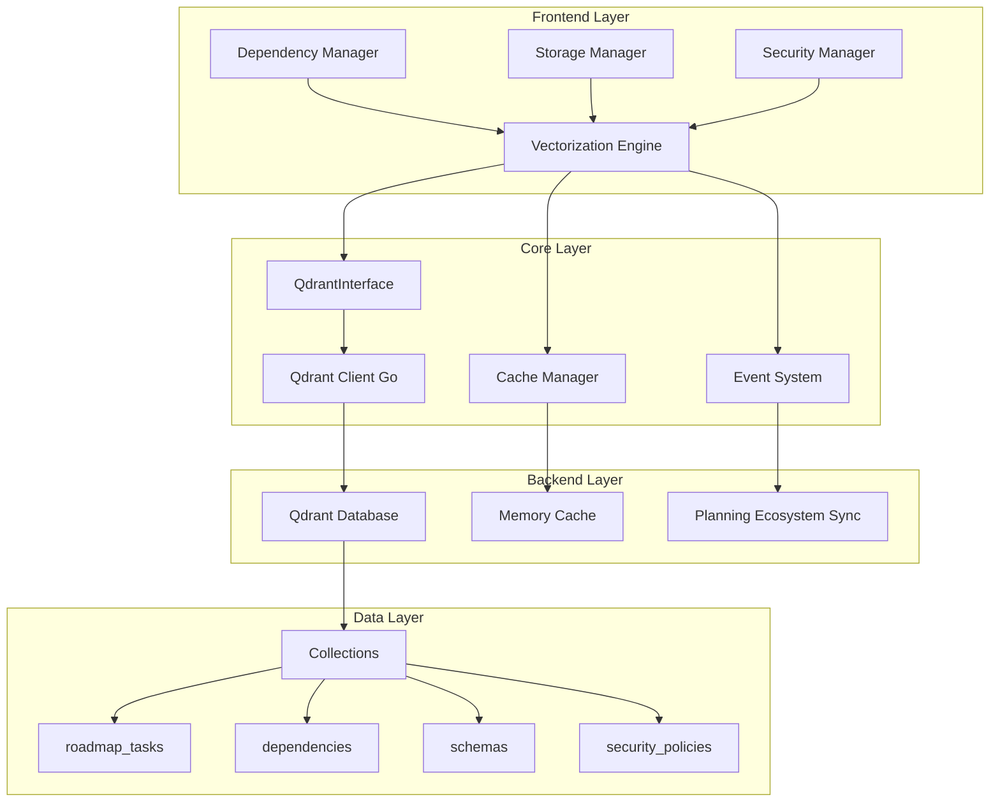
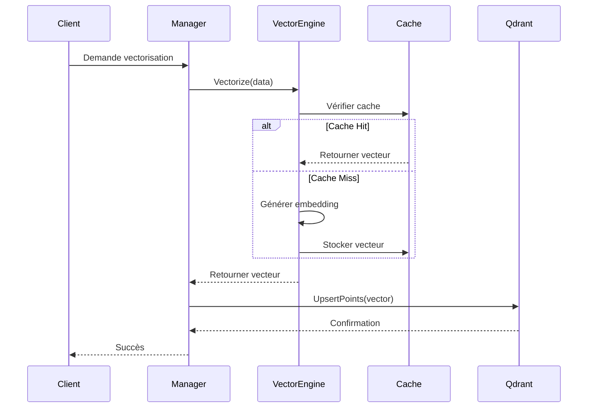
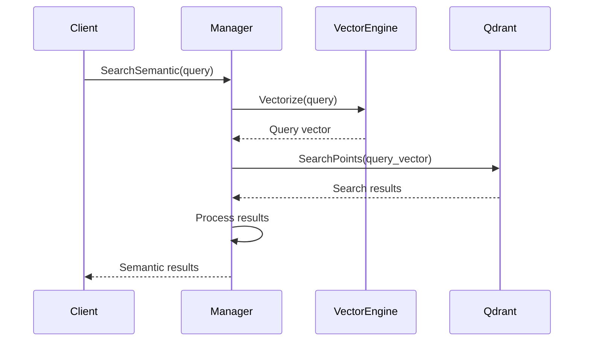
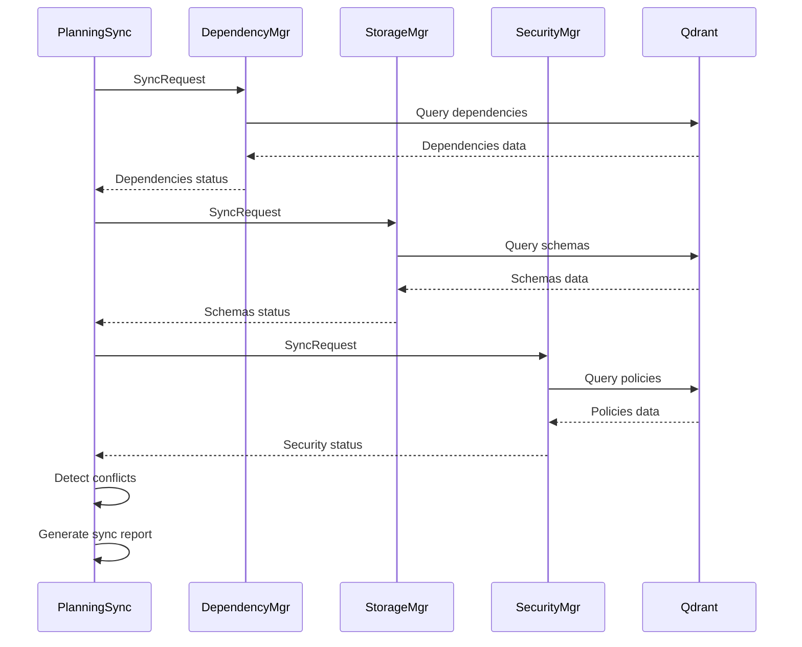

# Guide d'Architecture - Système Unifié de Vectorisation Go

## Vue d'ensemble

Ce document décrit l'architecture du système unifié de vectorisation Go implémenté dans le cadre de la migration Phase 4-6 du plan de développement v56.

## Table des matières

1. [Architecture Globale](#architecture-globale)
2. [Interface QdrantInterface](#interface-qdrantinterface)
3. [Patterns de Vectorisation](#patterns-de-vectorisation)
4. [Intégration avec les Managers](#intégration-avec-les-managers)
5. [Flux de Données](#flux-de-données)
6. [Sécurité et Performance](#sécurité-et-performance)

## Architecture Globale

### Composants Principaux



### Principes Architecturaux

#### 1. **Inversion de Contrôle (IoC)**

- Tous les composants dépendent d'interfaces, pas d'implémentations concrètes
- Injection de dépendances via constructeurs et interfaces

#### 2. **Single Responsibility Principle (SRP)**

- Chaque manager a une responsabilité unique et bien définie
- Séparation claire entre logique métier et infrastructure

#### 3. **Open/Closed Principle (OCP)**

- Extensible via interfaces sans modification du code existant
- Support de multiples implémentations (mock, prod, test)

## Interface QdrantInterface

### Définition de l'Interface

```go
// QdrantInterface interface unifiée pour toutes les opérations Qdrant
type QdrantInterface interface {
    // Connection Management
    Connect(ctx context.Context, config QdrantConfig) error
    Disconnect() error
    HealthCheck(ctx context.Context) error
    
    // Collection Management
    CreateCollection(ctx context.Context, name string, config CollectionConfig) error
    DeleteCollection(ctx context.Context, name string) error
    GetCollectionInfo(ctx context.Context, name string) (*CollectionInfo, error)
    ListCollections(ctx context.Context) ([]string, error)
    
    // Point Operations
    UpsertPoints(ctx context.Context, collection string, points []Point) error
    SearchPoints(ctx context.Context, collection string, query SearchQuery) ([]SearchResult, error)
    GetPoint(ctx context.Context, collection string, id string) (*Point, error)
    DeletePoints(ctx context.Context, collection string, ids []string) error
    CountPoints(ctx context.Context, collection string) (int64, error)
    
    // Batch Operations
    BatchUpsert(ctx context.Context, collection string, batches [][]Point) error
    BatchSearch(ctx context.Context, queries []BatchSearchQuery) ([][]SearchResult, error)
    
    // Advanced Operations
    CreateIndex(ctx context.Context, collection string, field string, indexType IndexType) error
    OptimizeCollection(ctx context.Context, collection string) error
    BackupCollection(ctx context.Context, collection string, path string) error
    RestoreCollection(ctx context.Context, collection string, path string) error
}
```

### Types de Configuration

```go
// QdrantConfig configuration de connexion Qdrant
type QdrantConfig struct {
    Host            string        `json:"host"`
    Port            int           `json:"port"`
    ApiKey          string        `json:"api_key,omitempty"`
    Timeout         time.Duration `json:"timeout"`
    RetryAttempts   int           `json:"retry_attempts"`
    RetryDelay      time.Duration `json:"retry_delay"`
    EnableTLS       bool          `json:"enable_tls"`
    PoolSize        int           `json:"pool_size"`
    MaxIdleConns    int           `json:"max_idle_conns"`
    EnableMetrics   bool          `json:"enable_metrics"`
}

// CollectionConfig configuration de collection
type CollectionConfig struct {
    VectorSize      int                    `json:"vector_size"`
    Distance        DistanceType           `json:"distance"`
    ReplicationFactor int                  `json:"replication_factor"`
    ShardNumber     int                    `json:"shard_number"`
    OnDiskPayload   bool                   `json:"on_disk_payload"`
    Quantization    *QuantizationConfig    `json:"quantization,omitempty"`
    HnswConfig      *HnswConfig           `json:"hnsw_config,omitempty"`
}
```

### Implémentation Concrète

```go
// QdrantClient implémentation concrète de QdrantInterface
type QdrantClient struct {
    client      *grpc.ClientConn
    config      QdrantConfig
    collections map[string]*CollectionInfo
    metrics     *MetricsCollector
    logger      *Logger
    cache       CacheInterface
    mutex       sync.RWMutex
}

// NewQdrantClient constructeur avec injection de dépendances
func NewQdrantClient(config QdrantConfig, cache CacheInterface, logger *Logger) QdrantInterface {
    return &QdrantClient{
        config:      config,
        collections: make(map[string]*CollectionInfo),
        metrics:     NewMetricsCollector(),
        logger:      logger,
        cache:       cache,
    }
}
```

## Patterns de Vectorisation

### 1. **Pattern Factory**

Création d'instances de vectorisation selon le type de données:

```go
// VectorizationFactory factory pour créer des engines de vectorisation
type VectorizationFactory struct {
    engines map[string]VectorizationEngine
    config  FactoryConfig
}

func (f *VectorizationFactory) CreateEngine(dataType string) (VectorizationEngine, error) {
    switch dataType {
    case "markdown":
        return NewMarkdownVectorizationEngine(f.config.MarkdownConfig), nil
    case "code":
        return NewCodeVectorizationEngine(f.config.CodeConfig), nil
    case "schema":
        return NewSchemaVectorizationEngine(f.config.SchemaConfig), nil
    case "policy":
        return NewPolicyVectorizationEngine(f.config.PolicyConfig), nil
    default:
        return NewGenericVectorizationEngine(f.config.GenericConfig), nil
    }
}
```

### 2. **Pattern Strategy**

Différentes stratégies de vectorisation selon le contexte:

```go
// VectorizationStrategy interface pour les stratégies de vectorisation
type VectorizationStrategy interface {
    Vectorize(ctx context.Context, data interface{}) ([]float32, error)
    GetVectorSize() int
    GetCacheKey(data interface{}) string
}

// MarkdownStrategy stratégie pour les documents Markdown
type MarkdownStrategy struct {
    model      EmbeddingModel
    parser     MarkdownParser
    cache      CacheInterface
    vectorSize int
}

// CodeStrategy stratégie pour le code source
type CodeStrategy struct {
    analyzer   CodeAnalyzer
    tokenizer  CodeTokenizer
    model      EmbeddingModel
    vectorSize int
}
```

### 3. **Pattern Observer**

Notification d'événements de vectorisation:

```go
// VectorizationObserver observateur d'événements de vectorisation
type VectorizationObserver interface {
    OnVectorizationStarted(ctx context.Context, event VectorizationEvent)
    OnVectorizationCompleted(ctx context.Context, event VectorizationEvent)
    OnVectorizationFailed(ctx context.Context, event VectorizationEvent, err error)
}

// EventManager gestionnaire d'événements
type EventManager struct {
    observers []VectorizationObserver
    mutex     sync.RWMutex
}

func (em *EventManager) NotifyObservers(ctx context.Context, event VectorizationEvent) {
    em.mutex.RLock()
    defer em.mutex.RUnlock()
    
    for _, observer := range em.observers {
        go observer.OnVectorizationCompleted(ctx, event)
    }
}
```

### 4. **Pattern Decorator**

Ajout de fonctionnalités (cache, métriques, logging):

```go
// CachedVectorizationEngine décorateur avec cache
type CachedVectorizationEngine struct {
    engine VectorizationEngine
    cache  CacheInterface
    ttl    time.Duration
}

func (c *CachedVectorizationEngine) Vectorize(ctx context.Context, data interface{}) ([]float32, error) {
    key := c.engine.GetCacheKey(data)
    
    // Vérifier le cache
    if cached, found := c.cache.Get(key); found {
        return cached.([]float32), nil
    }
    
    // Vectoriser et mettre en cache
    vector, err := c.engine.Vectorize(ctx, data)
    if err != nil {
        return nil, err
    }
    
    c.cache.Set(key, vector, c.ttl)
    return vector, nil
}

// MetricsVectorizationEngine décorateur avec métriques
type MetricsVectorizationEngine struct {
    engine  VectorizationEngine
    metrics *MetricsCollector
}

func (m *MetricsVectorizationEngine) Vectorize(ctx context.Context, data interface{}) ([]float32, error) {
    start := time.Now()
    defer func() {
        m.metrics.RecordVectorizationDuration(time.Since(start))
    }()
    
    m.metrics.IncrementVectorizationCount()
    return m.engine.Vectorize(ctx, data)
}
```

## Intégration avec les Managers

### Dependency Manager Integration

```go
// DependencyManagerVectorization extension vectorisation pour DependencyManager
type DependencyManagerVectorization struct {
    vectorEngine VectorizationEngine
    qdrant      QdrantInterface
    config      DependencyVectorizationConfig
}

// AutoVectorize vectorise automatiquement les dépendances
func (dmv *DependencyManagerVectorization) AutoVectorize(ctx context.Context, deps []Dependency) error {
    collection := "dependencies"
    
    var points []Point
    for _, dep := range deps {
        // Créer le texte descriptif
        text := dmv.createDependencyText(dep)
        
        // Générer le vecteur
        vector, err := dmv.vectorEngine.Vectorize(ctx, text)
        if err != nil {
            return fmt.Errorf("vectorization failed for %s: %w", dep.Name, err)
        }
        
        // Créer le point
        point := Point{
            ID:     fmt.Sprintf("dep_%s_%s", dep.Name, dep.Version),
            Vector: vector,
            Payload: map[string]interface{}{
                "name":        dep.Name,
                "version":     dep.Version,
                "type":        dep.Type,
                "description": dep.Description,
                "metadata":    dep.Metadata,
                "timestamp":   time.Now(),
            },
        }
        
        points = append(points, point)
    }
    
    // Insertion batch dans Qdrant
    return dmv.qdrant.UpsertPoints(ctx, collection, points)
}
```

### Storage Manager Integration

```go
// StorageManagerVectorization extension vectorisation pour StorageManager
type StorageManagerVectorization struct {
    vectorEngine VectorizationEngine
    qdrant      QdrantInterface
    schemaAnalyzer SchemaAnalyzer
}

// VectorizeSchema vectorise un schéma de données
func (smv *StorageManagerVectorization) VectorizeSchema(ctx context.Context, schema Schema) ([]float32, error) {
    // Analyser le schéma
    analysis := smv.schemaAnalyzer.Analyze(schema)
    
    // Créer la représentation textuelle
    text := smv.createSchemaText(schema, analysis)
    
    // Générer le vecteur
    vector, err := smv.vectorEngine.Vectorize(ctx, text)
    if err != nil {
        return nil, fmt.Errorf("schema vectorization failed: %w", err)
    }
    
    // Stocker dans Qdrant
    point := Point{
        ID:     fmt.Sprintf("schema_%s_%s", schema.Name, schema.Version),
        Vector: vector,
        Payload: map[string]interface{}{
            "name":        schema.Name,
            "version":     schema.Version,
            "fields":      schema.Fields,
            "constraints": schema.Constraints,
            "analysis":    analysis,
            "timestamp":   time.Now(),
        },
    }
    
    err = smv.qdrant.UpsertPoints(ctx, "schemas", []Point{point})
    if err != nil {
        return nil, err
    }
    
    return vector, nil
}
```

### Security Manager Integration

```go
// SecurityManagerVectorization extension vectorisation pour SecurityManager
type SecurityManagerVectorization struct {
    vectorEngine   VectorizationEngine
    qdrant        QdrantInterface
    policyAnalyzer PolicyAnalyzer
    threatDetector ThreatDetector
}

// VectorizePolicy vectorise une politique de sécurité
func (smv *SecurityManagerVectorization) VectorizePolicy(ctx context.Context, policy SecurityPolicy) ([]float32, error) {
    // Analyser la politique
    analysis := smv.policyAnalyzer.Analyze(policy)
    
    // Créer la représentation textuelle
    text := smv.createPolicyText(policy, analysis)
    
    // Générer le vecteur
    vector, err := smv.vectorEngine.Vectorize(ctx, text)
    if err != nil {
        return nil, fmt.Errorf("policy vectorization failed: %w", err)
    }
    
    // Stocker dans Qdrant avec métadonnées de sécurité
    point := Point{
        ID:     fmt.Sprintf("policy_%s", policy.ID),
        Vector: vector,
        Payload: map[string]interface{}{
            "id":          policy.ID,
            "name":        policy.Name,
            "rules":       policy.Rules,
            "conditions":  policy.Conditions,
            "actions":     policy.Actions,
            "priority":    policy.Priority,
            "analysis":    analysis,
            "risk_level":  analysis.RiskLevel,
            "timestamp":   time.Now(),
        },
    }
    
    return vector, smv.qdrant.UpsertPoints(ctx, "security_policies", []Point{point})
}
```

## Flux de Données

### 1. **Flux de Vectorisation**



### 2. **Flux de Recherche Sémantique**



### 3. **Flux de Synchronisation**



## Sécurité et Performance

### Sécurité

#### 1. **Authentification et Autorisation**

```go
// SecurityContext contexte de sécurité pour les opérations
type SecurityContext struct {
    UserID      string
    Roles       []string
    Permissions []Permission
    SessionID   string
    IPAddress   string
}

// Authorize vérifie les autorisations pour une opération
func (sc *SecurityContext) Authorize(operation string, resource string) error {
    for _, perm := range sc.Permissions {
        if perm.Operation == operation && perm.Resource == resource {
            return nil
        }
    }
    return ErrUnauthorized
}
```

#### 2. **Chiffrement des Données Sensibles**

```go
// EncryptedPayload payload chiffré pour données sensibles
type EncryptedPayload struct {
    Data      []byte `json:"data"`
    IV        []byte `json:"iv"`
    Algorithm string `json:"algorithm"`
}

// EncryptSensitiveData chiffre les données sensibles avant stockage
func (smv *SecurityManagerVectorization) EncryptSensitiveData(data interface{}) (*EncryptedPayload, error) {
    jsonData, err := json.Marshal(data)
    if err != nil {
        return nil, err
    }
    
    encrypted, iv, err := smv.encryptor.Encrypt(jsonData)
    if err != nil {
        return nil, err
    }
    
    return &EncryptedPayload{
        Data:      encrypted,
        IV:        iv,
        Algorithm: "AES-GCM",
    }, nil
}
```

### Performance

#### 1. **Optimisations de Cache**

```go
// MultiLevelCache cache multi-niveaux pour optimiser les performances
type MultiLevelCache struct {
    l1Cache LRUCache    // Cache mémoire rapide
    l2Cache RedisCache  // Cache distribué
    l3Cache FileCache   // Cache persistant
}

func (mlc *MultiLevelCache) Get(key string) (interface{}, bool) {
    // L1: Cache mémoire
    if value, found := mlc.l1Cache.Get(key); found {
        return value, true
    }
    
    // L2: Cache Redis
    if value, found := mlc.l2Cache.Get(key); found {
        mlc.l1Cache.Set(key, value, time.Minute) // Promote to L1
        return value, true
    }
    
    // L3: Cache fichier
    if value, found := mlc.l3Cache.Get(key); found {
        mlc.l2Cache.Set(key, value, time.Hour)   // Promote to L2
        mlc.l1Cache.Set(key, value, time.Minute) // Promote to L1
        return value, true
    }
    
    return nil, false
}
```

#### 2. **Pool de Connexions**

```go
// ConnectionPool pool de connexions Qdrant optimisé
type ConnectionPool struct {
    connections chan QdrantInterface
    config      PoolConfig
    metrics     *PoolMetrics
}

func (cp *ConnectionPool) GetConnection(ctx context.Context) (QdrantInterface, error) {
    select {
    case conn := <-cp.connections:
        return conn, nil
    case <-ctx.Done():
        return nil, ctx.Err()
    case <-time.After(cp.config.Timeout):
        return nil, ErrPoolTimeout
    }
}
```

#### 3. **Traitement par Batch**

```go
// BatchProcessor processeur par lot pour optimiser les opérations
type BatchProcessor struct {
    batchSize   int
    flushTimer  *time.Timer
    buffer      []Point
    mutex       sync.Mutex
    qdrant      QdrantInterface
    collection  string
}

func (bp *BatchProcessor) AddPoint(point Point) error {
    bp.mutex.Lock()
    defer bp.mutex.Unlock()
    
    bp.buffer = append(bp.buffer, point)
    
    if len(bp.buffer) >= bp.batchSize {
        return bp.flush()
    }
    
    return nil
}

func (bp *BatchProcessor) flush() error {
    if len(bp.buffer) == 0 {
        return nil
    }
    
    err := bp.qdrant.UpsertPoints(context.Background(), bp.collection, bp.buffer)
    if err != nil {
        return err
    }
    
    bp.buffer = bp.buffer[:0] // Reset buffer
    return nil
}
```

## Conclusion

Cette architecture offre:

1. **Flexibilité**: Interfaces et patterns permettent l'extensibilité
2. **Performance**: Optimisations de cache, pooling, et traitement par batch
3. **Sécurité**: Chiffrement, authentification, et contrôle d'accès
4. **Maintenabilité**: Séparation des responsabilités et code modulaire
5. **Testabilité**: Interfaces permettent les mocks et tests unitaires

L'architecture est conçue pour supporter l'évolution future du système tout en maintenant les performances et la sécurité requises pour un environnement de production.
