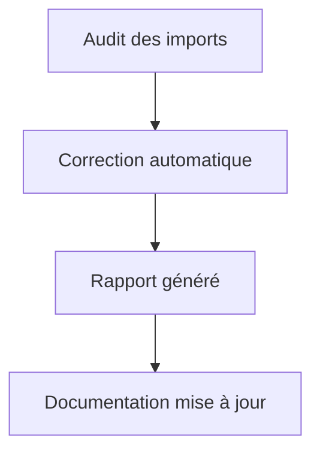

# Documentation technique – Gapanalyzer

## Nouvelle structure

La structure du projet Gapanalyzer a été réorganisée pour améliorer la gestion des imports et la maintenabilité :
- Correction des imports cassés
- Mise en place de bonnes pratiques d’import
- Génération automatique des rapports d’audit et de migration

## Guides disponibles

- [`import_guide.md`](./import_guide.md) : Guide des bonnes pratiques d’import
- [`import_fix_report.md`](./import_fix_report.md) : Rapport de correction des imports
- Diagrammes Mermaid : Voir section dédiée

## Diagrammes Mermaid

## Index des rapports et guides

| Fichier                   | Description                           |
|---------------------------|---------------------------------------|
| README.md                 | Documentation technique générale      |
| import_guide.md           | Guide des bonnes pratiques d’import   |
| import_fix_report.md      | Rapport de correction des imports     |

## Archivage

Les versions précédentes de la documentation sont archivées dans `/backup/gapanalyzer/`.
## Fonctions exportées et CLI

Les fonctions suivantes sont désormais exportées dans le package `core/gapanalyzer` :
- `LoadRepositoryStructure(path string)`: charge la structure du dépôt.
- `GetExpectedModules()`: retourne la liste des modules attendus.
- `AnalyzeGaps(repoStructure, expectedModules)`: analyse les écarts entre modules attendus et présents.
- `SaveGapAnalysis(ga, filepath)`: sauvegarde l’analyse au format JSON.
- `GenerateMarkdownReport(ga)`: génère un rapport Markdown.
- `SaveMarkdownReport(report, filepath)`: sauvegarde le rapport Markdown.

Le CLI (`cmd/gapanalyzer/gapanalyzer.go`) utilise ces fonctions pour automatiser l’audit, la génération et l’archivage des rapports.

### Traçabilité et automatisation

- Tous les scripts et workflows CI/CD sont mis à jour pour garantir la traçabilité des corrections et l’archivage automatique des rapports.
- Les tests unitaires couvrent chaque fonction exportée.
- Les corrections et refactorings sont archivés dans `/backup/gapanalyzer/`.

