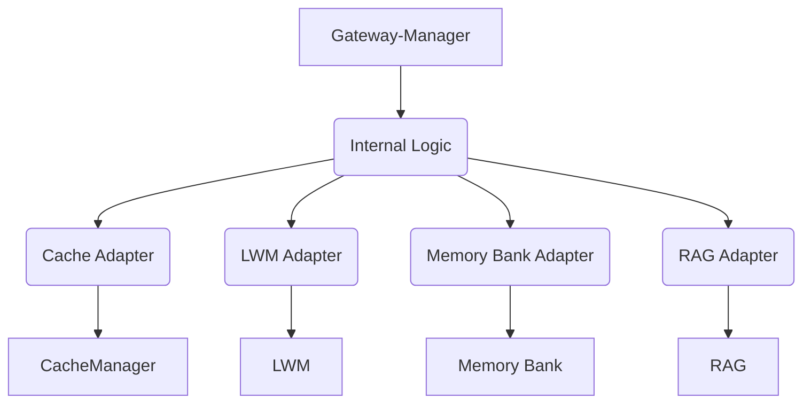

# Documentation du Gateway-Manager (v77 - Go Natif)

Ce document fournit une vue d'ensemble du nouveau Gateway-Manager, implémenté en Go natif dans le cadre de la feuille de route v77.

## 1. Vue d'ensemble

Le Gateway-Manager est un composant clé de l'écosystème, responsable de la gestion des interactions et de l'orchestration des flux de données entre les différents managers. Cette version v77 est entièrement réécrite en Go pour améliorer la performance, la fiabilité et la maintenabilité.

## 2. Architecture

Le Gateway-Manager suit une architecture modulaire, avec une séparation claire des préoccupations.



## 3. Interfaces Clés

Le Gateway-Manager interagit avec les autres managers via des interfaces bien définies.

*   **CacheManagerInterface** : Pour la gestion du cache.
*   **LWMInterface** : Pour le déclenchement et le suivi des workflows.
*   **MemoryBankAPI** : Pour le stockage et la récupération de données.
*   **RAGInterface** : Pour la génération de contenu.

## 4. Configuration

La configuration du Gateway-Manager est gérée via `configs/config.yaml` et peut être surchargée par des variables d'environnement.

## 5. Utilisation

Pour démarrer le Gateway-Manager, exécutez :

```bash
go run cmd/gateway-manager-cli/main.go
```

## 6. Tests

*   **Tests Unitaires** : Situés dans `development/managers/gateway-manager/gateway_test.go`.
*   **Tests d'Intégration** : Situés dans `tests/integration/gateway_manager_integration_test.go`.

## 7. Rapports

Les rapports d'automatisation sont générés dans `migration/gateway-manager-v77/report.html`.

## 8. Procédure de Rollback

En cas de problème, une procédure de rollback automatisée est disponible via `cmd/rollback-gateway-migration/main.go`.

---

**Note** : Ce document sera mis à jour au fur et à mesure de l'avancement du projet.
