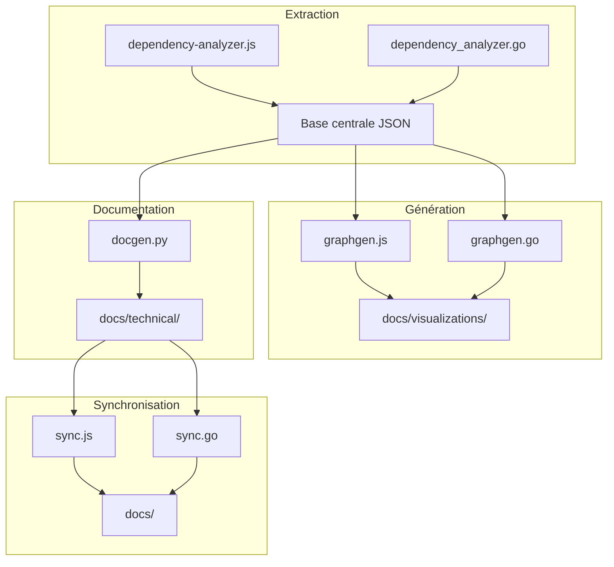

# Architecture cible – Doc-Manager & Code-Graph RAG (Phase 3)

## 1. Vue d’ensemble

- Stack hybride : Go (core/docmanager), Node.js (scripts/), Python (docgen, tests)
- Intégration centralisée des modules d’analyse, extraction, génération de graphes, synchronisation documentaire
- Visualisation interactive (web/ ou docs/visualizations/)

## 2. Schéma d’architecture (Mermaid)



## 3. Interfaces et API

### 3.1. API d’accès centralisé (exemple OpenAPI)

```yaml
openapi: 3.0.0
info:
  title: DocManager API
  version: 1.0.0
paths:
  /extract:
    get:
      summary: Extraction des dépendances
      responses:
        '200':
          description: Extraction réussie
  /graph:
    get:
      summary: Génération de graphe
      responses:
        '200':
          description: Graphe généré
  /sync:
    post:
      summary: Synchronisation documentaire
      responses:
        '200':
          description: Synchronisation réussie
```

### 3.2. Interfaces Go

```go
type Extractor interface {
    ExtractDependencies(path string) ([]Dependency, error)
}
type GraphGenerator interface {
    GenerateGraph(deps []Dependency) (Graph, error)
}
type SyncManager interface {
    SyncDocs(source, target string) error
}
```

### 3.3. Interfaces Node.js

```js
class Extractor {
  extractDependencies(path) { /* ... */ }
}
class GraphGenerator {
  generateGraph(deps) { /* ... */ }
}
class SyncManager {
  syncDocs(source, target) { /* ... */ }
}
```

## 4. Pipeline d’extraction centralisée

- Extraction automatisée via scripts (Go/Node.js)
- Stockage des outputs dans une base JSON commune (`core/docmanager/outputs/`)
- Génération de graphes et documentation à partir de cette base
- Synchronisation documentaire automatisée (CI/CD)

### Exemple de commande

```bash
node scripts/dependency-analyzer.js --scan-all > core/docmanager/outputs/dependencies.json
go run core/docmanager/graphgen.go --input core/docmanager/outputs/dependencies.json --output docs/visualizations/graph.svg
python scripts/docgen.py --source core/docmanager/outputs/dependencies.json --output docs/technical/ARCHITECTURE.md
node scripts/sync.js --docs docs/ --output docs/technical/ARCHITECTURE.md
```

## 5. Critères de validation

- Architecture validée par le lead technique et 2 reviewers
- Tests unitaires sur chaque module (Go, JS, Python)
- Génération automatique des outputs (JSON, SVG, Markdown)
- Intégration CI/CD (GitHub Actions, scripts/validate-plan-coherence.ps1)
- Documentation synchronisée et versionnée

## 6. Rollback

- Sauvegarde de l’ancienne architecture dans `docs/technical/ARCHITECTURE.bak.md`
- Versionnement des scripts et outputs à chaque itération

---
