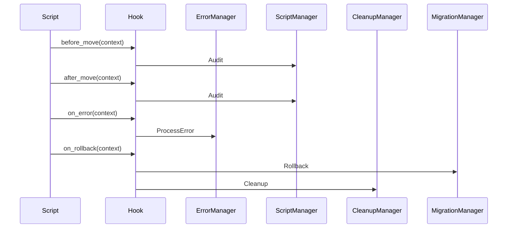

# Interface d’intégration multi-langage — Hooks & Événements pour scripts de déplacement documentaire

## Objectif

Définir une interface standard de hooks/événements pour l’orchestration documentaire multi-langage (PowerShell, JS, Bash, Python), permettant :
- L’audit centralisé (log, reporting)
- Le rollback transactionnel
- La gestion d’erreur structurée
- L’intégration avec les managers Roo (`ScriptManager`, `ErrorManager`, `CleanupManager`, `MigrationManager`)

---

## Événements standards

| Événement         | Description                                      | Contexte transmis (exemple)                |
|-------------------|--------------------------------------------------|--------------------------------------------|
| before_move       | Avant déplacement d’un fichier                   | `{src, dst, timestamp}`                    |
| after_move        | Après déplacement réussi                         | `{src, dst, status: "ok", timestamp}`      |
| on_error          | Sur erreur (déplacement, permission, etc.)       | `{src, dst, error, timestamp}`             |
| on_rollback       | Lors d’une opération de rollback                 | `{src, dst, status: "rollback", timestamp}`|
| after_all         | À la fin du traitement (succès ou échec global)  | `{summary, timestamp}`                     |

---

## Format du contexte (JSON/YAML)

```yaml
event: before_move
src: /chemin/source.txt
dst: /chemin/destination.txt
timestamp: 2025-08-01T12:00:00Z
```

```json
{
  "event": "on_error",
  "src": "/chemin/source.txt",
  "dst": "/chemin/destination.txt",
  "error": "Permission denied",
  "timestamp": "2025-08-01T12:01:00Z"
}
```

---

## Convention d’appel (pseudo-code universel)

```pseudo
on_event(event, context):
    # Appelé à chaque étape clé
    # Peut logger, notifier, déclencher un manager Roo
    if event == "on_error":
        ErrorManager.ProcessError(context)
    elif event == "before_move":
        ScriptManager.ExecuteScript("audit", context)
    # etc.
```

---

## Exemples d’intégration (extraits)

### PowerShell

```powershell
function On-Event($event, $context) {
    # Appel à ErrorManager, ScriptManager, etc.
    # $context est un objet PSObject ou JSON
}
```

### Node.js

```js
function onEvent(event, context) {
  // Intégration ErrorManager, ScriptManager, etc.
}
```

### Bash

```bash
on_event() {
  event="$1"
  context="$2" # JSON/YAML
  # Appel à un script d’audit ou log
}
```

### Python

```python
def on_event(event, context):
    # context = dict
    # Appel ErrorManager, ScriptManager, etc.
```

---

## Checklist d’intégration Roo

- [x] Chaque script appelle le hook à chaque événement clé
- [x] Le contexte est sérialisé en JSON ou YAML
- [x] Les erreurs sont transmises à ErrorManager
- [x] Les audits sont centralisés via ScriptManager
- [x] Le rollback est notifié à MigrationManager/CleanupManager
- [x] La structure respecte ce document

---

## Diagramme Mermaid



---

## Références

- [`AGENTS.md`](AGENTS.md)
- [`rules-orchestration.md`](.roo/rules/rules-orchestration.md)
- [`file-moves.schema.yaml`](file-moves.schema.yaml)
- [`README.file-moves.md`](README.file-moves.md)
