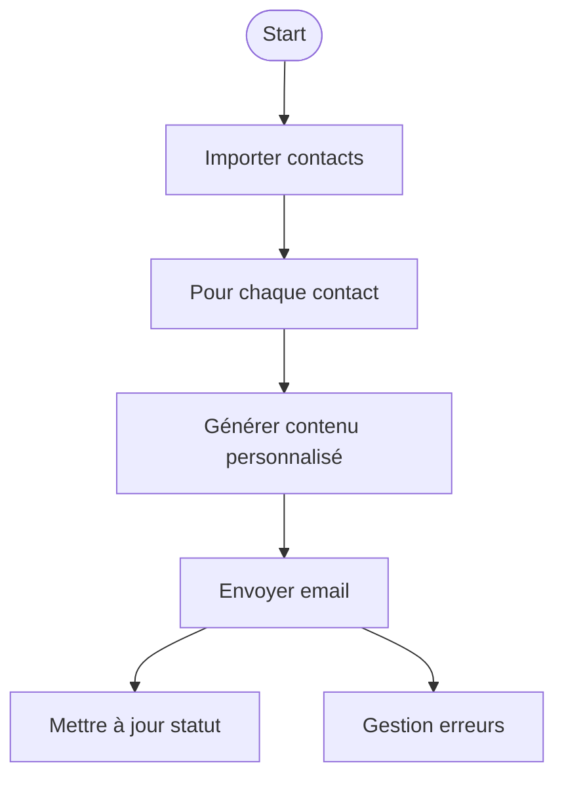

# Tutoriel pas-à-pas — Automatisation de l’envoi d’emails

## 1. Objectif

Automatiser l’envoi d’emails personnalisés à partir d’une liste de contacts, avec suivi des statuts via n8n.

## 2. Préparation

- Vérifier la configuration SMTP dans `.env`
- Préparer un fichier CSV ou Google Sheet avec les contacts
- S’assurer que le workflow n8n « Email Sender » est importé ou créé

## 3. Étapes principales

1. Importer la liste de contacts dans n8n (Noeud « Read CSV » ou « Google Sheets »)
2. Boucler sur chaque contact
3. Générer le contenu personnalisé (Noeud « Set » ou « Function »)
4. Envoyer l’email (Noeud « Gmail », « SMTP » ou « Outlook »)
5. Mettre à jour le statut (Noeud « Update Sheet » ou « Write CSV »)
6. Gérer les erreurs (Noeud « IF », logs, alertes)

## 4. Schéma mermaid du workflow



## 5. Exemple d’extrait de code (Noeud Function JS)

```javascript
// Génération du contenu personnalisé
return {
  json: {
    subject: `Bonjour ${$json["prenom"]}`,
    body: `Cher ${$json["prenom"]},\nVoici votre offre personnalisée...`
  }
};
```

## 6. Bonnes pratiques et pièges à éviter

- Tester le workflow sur un petit échantillon avant envoi massif
- Utiliser des variables d’environnement pour les credentials
- Gérer les erreurs et les bounces (emails non délivrés)
- Documenter chaque étape du workflow dans n8n
- Sauvegarder les logs d’envoi pour audit

## 7. Ressources complémentaires

- [Guide de démarrage rapide](./QUICKSTART.md)
- [FAQ](../FAQ.md)
- [DOC_COVERAGE.md](../DOC_COVERAGE.md)
