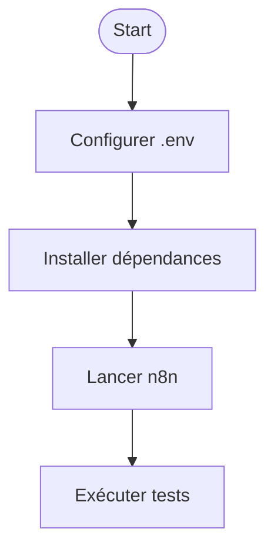

# Guide de démarrage rapide — Email Sender Écosystème

## 1. Installation

### Prérequis

- Node.js ≥ 18.x
- Python ≥ 3.11
- PowerShell 7
- Accès à un compte Notion, Google, Gmail (pour intégrations)
- Cloner le dépôt :

```sh
git clone <repo-url>
cd <repo>
```

### Dépendances

```sh
npm install
pip install -r requirements.txt
```

## 2. Configuration

- Copier `.env.example` en `.env` et renseigner les variables (API keys, tokens, emails…)
- Adapter les fichiers de configuration dans `config/` si besoin

## 3. Lancement et premiers tests

- Démarrer les workflows n8n :

```sh
npm run n8n
```

- Lancer les tests unitaires :

```sh
node src/n8n/nodes/tests/run-all-tests.js
```

- Vérifier l’intégration Notion/Gmail/Google Calendar via les workflows dédiés

## 4. Bonnes pratiques

- Toujours valider la configuration avant de lancer un workflow
- Utiliser des branches pour toute modification
- Documenter chaque ajout de workflow ou d’intégration
- Vérifier la couverture documentaire dans `DOC_COVERAGE.md` avant toute release

## 5. Exemple de schéma mermaid



## 6. Ressources complémentaires

- [FAQ](../FAQ.md)
- [Onboarding contributeur](../onboarding/README.md)
- [DOC_COVERAGE.md](../DOC_COVERAGE.md)
