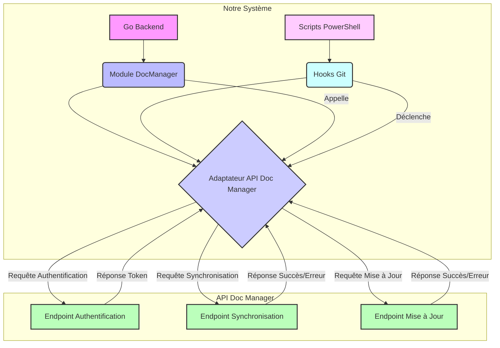

# Schéma d'intégration de l'API du Doc Manager

## Introduction
Ce schéma visualise les points d'intégration clés entre notre système et l'API du Doc Manager.

## Schéma Mermaid

## Points d'intégration identifiés

- **Authentification:** Notre système (via l'adaptateur Go) se connectera à l'endpoint d'authentification pour obtenir un jeton.
- **Synchronisation:** Le module `DocManager` Go, potentiellement déclenché par des hooks Git via PowerShell, enverra des requêtes de synchronisation.
- **Mise à Jour:** Des requêtes de mise à jour spécifiques pourront être envoyées pour des documents individuels.
