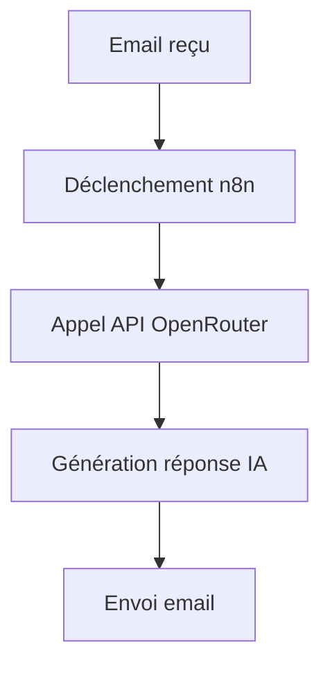

# 🤖 Intégration OpenRouter

## 1. Présentation

Ce guide détaille la configuration, l’utilisation et les bonnes pratiques pour l’intégration OpenRouter (API IA) dans l’écosystème Email Sender.

---

## 2. Configuration

- **Prérequis** : Compte OpenRouter, clé API valide, accès à la documentation officielle.
- **Étapes** :
  1. Créer un compte sur <https://openrouter.ai/>
  2. Générer une clé API dans le dashboard utilisateur
  3. Configurer la clé dans `.env` ou via l’interface n8n
  4. Vérifier les quotas et modèles disponibles

---

## 3. Utilisation

- **Fonctionnalités principales** :
  - Génération de texte IA (LLM)
  - Analyse et enrichissement de contenu
  - Automatisation de réponses ou de traitements avancés

- **Exemple de scénario** :
  - Génération automatique de réponses à des emails entrants

---

## 4. Exemples de scénarios



- **Logs d’exécution** :

  ```
  [2025-06-23 16:00:01] OpenRouter: Requête envoyée (model: deepseek-coder)
  [2025-06-23 16:00:02] OpenRouter: Réponse IA reçue (tokens: 512)
  [2025-06-23 16:00:03] Email: Réponse générée envoyée
  ```

---

## 5. Prérequis & Limitations

- API OpenRouter : quotas de tokens, limitations selon le modèle choisi
- Confidentialité : attention aux données sensibles transmises à l’API

---

## 6. Cas d’erreur courants

- **Erreur 401** : Clé API invalide ou expirée
- **Erreur 429** : Limite de tokens ou de requêtes atteinte
- **Erreur 500** : Erreur interne OpenRouter

---

## 7. FAQ

- **Q : Comment choisir le modèle IA à utiliser ?**
  - R : Se référer à la documentation OpenRouter et sélectionner le modèle selon le besoin (vitesse, coût, qualité).
- **Q : Où renseigner la clé API ?**
  - R : Dans le fichier `.env` ou via la configuration n8n.

---

## 8. Ressources

- [Documentation officielle OpenRouter](https://openrouter.ai/docs)
- [Exemples de workflows n8n](../workflows/PROSPECTION.md)
