# Structure Cible et Feuille de Route des Adaptations pour Gateway-Manager v77

Ce document décrit la structure cible du Gateway-Manager après la migration vers Go natif, ainsi que les étapes clés de la feuille de route pour atteindre cet objectif.

## 1. Structure cible du projet

Le Gateway-Manager sera réorganisé pour s'aligner sur les meilleures pratiques Go, en privilégiant la modularité, la clarté et la séparation des préoccupabilités.

```mermaid
graph TD
    A[Gateway-Manager] --> B(cmd/)
    A --> C(internal/)
    A --> D(pkg/)
    A --> E(api/)
    A --> F(configs/)
    A --> G(docs/)
    A --> H(tests/)

    B --> B1(gateway-manager-cli/)
    B1 --> B1_1(main.go)
    B --> B2(migration-tools/)
    B2 --> B2_1(auto-integrate-gateway/)
    B2_1 --> B2_1_1(main.go)
    B2 --> B2_2(rollback-gateway-migration/)
    B2_2 --> B2_2_1(main.go)

    C --> C1(core/)
    C1 --> C1_1(interfaces.go)
    C1 --> C1_2(models.go)
    C1 --> C1_3(logic.go)
    C --> C2(adapters/)
    C2 --> C2_1(cache/)
    C2 --> C2_2(lwm/)
    C2 --> C2_3(memorybank/)
    C2 --> C2_4(rag/)
    C --> C3(utils/)
    C3 --> C3_1(logging.go)
    C3 --> C3_2(monitoring.go)
    C3 --> C3_3(errors.go)

    D --> D1(handlers/)
    D1 --> D1_1(http_handlers.go)
    D1 --> D1_2(grpc_handlers.go)
    D --> D2(services/)
    D2 --> D2_1(gateway_service.go)
    D --> D3(middleware/)
    D3 --> D3_1(auth.go)
    D3 --> D3_2(logging.go)

    E --> E1(http/)
    E1 --> E1_1(routes.go)
    E1 --> E1_2(server.go)
    E --> E2(grpc/)
    E2 --> E2_1(grpc_server.go)
    E2 --> E2_2(gateway.proto)

    F --> F1(config.yaml)
    F --> F2(env.go)

    G --> G1(README.md)
    G --> G2(architecture.md)

    H --> H1(unit/)
    H1 --> H1_1(core_test.go)
    H --> H2(integration/)
    H2 --> H2_1(gateway_integration_test.go)
```

## 2. Conventions et Principes

- **Modularité**: Chaque composant (e.g., `cache`, `lwm`, `memorybank`) sera un module Go indépendant dans `internal/adapters/`.
- **Interfaces**: Définition claire des interfaces dans `internal/core/interfaces.go` pour promouvoir l'inversion de dépendance et la testabilité.
- **Microservices**: Conception orientée microservices, permettant un déploiement et une scalabilité indépendants.
- **Erreurs**: Gestion centralisée des erreurs via `internal/utils/errors.go`.
- **Configuration**: Utilisation de `configs/config.yaml` et variables d'environnement pour la configuration.
- **Tests**: Séparation claire entre tests unitaires (`tests/unit/`) et tests d'intégration (`tests/integration/`).

## 3. Feuille de route des adaptations (Détail)

### Phase 1: Préparation et Outils de Migration
- **Objectif**: Mettre en place l'environnement et les outils nécessaires à la migration.
- **Étapes**:
    - Finalisation des scripts `cmd/migration-tools/auto-integrate-gateway/main.go` et `cmd/migration-tools/rollback-gateway-migration/main.go`.
    - Création de `internal/tools/extract_endpoints.go` pour l'analyse des APIs existantes.

### Phase 2: Implémentation des Clients et Adapters
- **Objectif**: Développer les clients Go pour interagir avec les managers existants.
- **Étapes**:
    - Développement des clients Go pour Memory Bank (HTTP/JSON) dans `internal/adapters/memorybank/`.
    - Création des interfaces Go pour CacheManager, LWM, RAG dans `internal/core/interfaces.go`.
    - Implémentation des adapters Go pour CacheManager, LWM, RAG dans `internal/adapters/cache/`, `lwm/`, `rag/`.

### Phase 3: Refactoring du Gateway-Manager
- **Objectif**: Réécrire le cœur du Gateway-Manager en Go natif.
- **Étapes**:
    - Migration de la logique principale vers `internal/core/logic.go` et `pkg/services/gateway_service.go`.
    - Implémentation des handlers HTTP et gRPC dans `pkg/handlers/`.
    - Mise en place des routes et serveurs dans `api/http/` et `api/grpc/`.
    - Intégration des middlewares d'authentification et de logging dans `pkg/middleware/`.

### Phase 4: Tests, Qualité et Documentation
- **Objectif**: Assurer la qualité, la performance et la documentation complète du nouveau Gateway-Manager.
- **Étapes**:
    - Développement de tests unitaires et d'intégration complets (`tests/unit/`, `tests/integration/`).
    - Mise à jour de la documentation technique (`docs/`).
    - Intégration dans la CI/CD pour l'automatisation des builds, tests et déploiements.
    - Audit de sécurité et optimisation des performances.

## 4. Validation croisée avec `.clinerules/` et plans transversaux

- **Conformité des conventions**: Le code Go natif respectera les conventions de nommage (PascalCase, camelCase, snake_case) et les standards de code définis dans `.clinerules/custom_instructions.md`.
- **Encodage**: Tous les fichiers seront en UTF-8 avec BOM (si applicable pour PowerShell, mais Go n'en a pas besoin).
- **Documentation**: La documentation des intentions et de la logique sera intégrée directement dans le code (minimum 20% du code).
- **Complexité**: La complexité cyclomatique sera maintenue sous 10.
- **Gestion d'erreurs**: Utilisation systématique des exceptions/erreurs spécifiques de Go.
- **Organisation**: Structure modulaire respectant les principes SOLID, DRY, KISS, YAGNI.

## 5. Livrables clés

- Code source du Gateway-Manager 100% Go natif.
- Documentation technique et diagrammes d'architecture.
- Rapports de tests unitaires et d'intégration.
- Scripts de build et de déploiement CI/CD.
- Procédure de rollback documentée et automatisée.
