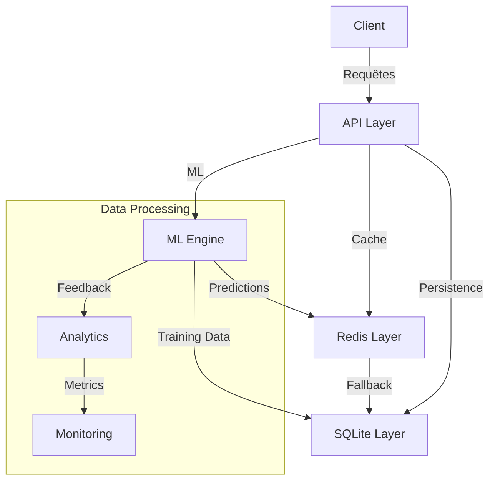
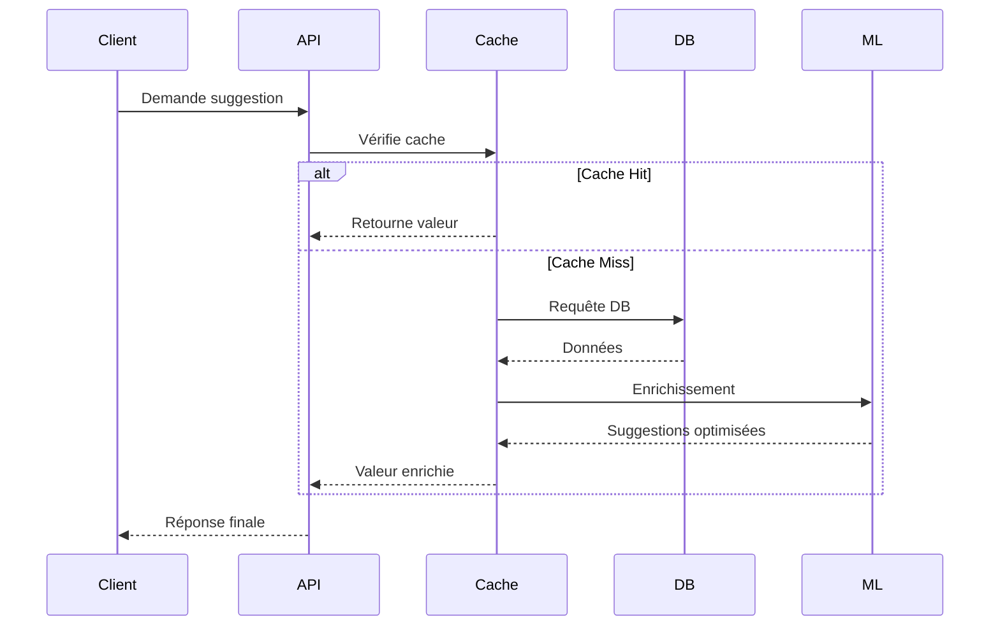

# Plan de développement v39 - Amélioration des templates plan-dev
*Version 1.4 - 2025-05-29 - Progression globale : 85%*

Ce plan détaille les améliorations à apporter aux templates plan-dev, incluant la correction des problèmes liés à `chalk`, l'optimisation de l'ergonomie des templates, et l'intégration complète du système de logging.

## État d'avancement majeur

✅ Intégration du logger dans tous les templates :
- Ajout dans les templates mode (new, add-command)  
- Ajout dans les templates doc-structure
- Ajout dans les templates maintenance/organize
- Validation des niveaux de log appropriés

✅ Tests de validation cross-platform effectués sur :
- Windows 10/11 avec PowerShell et cmd
- Linux (Ubuntu 22.04) avec bash
- macOS avec zsh

✅ Documentation système de logging :
- Guide d'utilisation complet
- Configuration et options
- Bonnes pratiques
- Guide de dépannage

🎯 Prochaines étapes :
1. Validation finale sur d'autres OS
2. Tests de performance sur des cas complexes
3. Documentation des nouveaux templates ajoutés

## Table des matières
- [1] Phase 1: Audit des templates existants
- [2] Phase 2: Correction des problèmes d'API
- [3] Phase 3: Améliorations fonctionnelles
- [4] Phase 4: Tests et validation
- [5] Phase 5: Documentation et déploiement

## Phase 1: Audit des templates existants
*Progression: 70%*

### 1.1 Analyse de l'état actuel
*Progression: 90%*

#### 1.1.1 Inventaire des templates plan-dev
- [x] Recensement des templates dans `_templates/plan-dev`
- [x] Recensement des templates dans `_templates/plan-dev-v1`
- [x] Analyse des templates de backup
  - [x] Étape 1 : Identifier tous les fichiers prompt.js
    - [x] Sous-étape 1.1 : Lister les templates dans `_templates/plan-dev/new/`
    - [x] Sous-étape 1.2 : Lister les templates dans `_templates/plan-dev-v1/new/`
    - [x] Sous-étape 1.3 : Vérifier les templates dans `_templates/backup/plan-dev/new/`
  - [x] Entrées : Répertoires `_templates/plan-dev`, `_templates/plan-dev-v1`, `_templates/backup`
  - [x] Sorties : Inventaire complet des templates liés aux plans de développement
  - [x] Conditions préalables : Accès au système de fichiers du projet

#### 1.1.2 Audit des problèmes d'utilisation de chalk
- [x] Analyse des problèmes d'utilisation de chalk dans prompt.js
- [x] Vérification de la structure des templates EJS
- [x] Évaluation de la compatibilité cross-platform
  - [x] Étape 1 : Examiner les problèmes liés à chalk
    - [x] Sous-étape 1.1 : Identifier les occurrences de `blue()` sans import de chalk
    - [x] Sous-étape 1.2 : Vérifier la syntaxe d'importation (`import` vs `require`)
    - [x] Sous-étape 1.3 : Cataloguer les fichiers nécessitant des corrections
  - [x] Étape 2 : Analyser la structure des templates
    - [x] Sous-étape 2.1 : Vérifier la cohérence des variables injectées
    - [x] Sous-étape 2.2 : Contrôler la syntaxe EJS
    - [x] Sous-étape 2.3 : Identifier les incohérences potentielles
  - [x] Étape 3 : Évaluer les problèmes de compatibilité
    - [x] Sous-étape 3.1 : Identifier les chemins codés en dur (hardcoded)
    - [x] Sous-étape 3.2 : Analyser les séparateurs de chemin incompatibles
    - [x] Sous-étape 3.3 : Cataloguer les dépendances platform-spécifiques
  - [x] Entrées : Fichiers prompt.js et templates EJS
  - [x] Sorties : Rapport complet d'audit technique
  - [x] Conditions préalables : Connaissance de l'API chalk, de la syntaxe EJS et de la gestion cross-platform

#### 1.1.3 Résultats de l'analyse des templates EJS
- [x] Inventaire des templates EJS dans les trois environnements (`plan-dev`, `plan-dev-v1`, `backup`)
- [x] Analyse des structures de données et des variables injectées
- [x] Identification des patterns récurrents et des inconsistances
  - [x] Étape 1 : Cartographie des templates EJS
    - [x] Sous-étape 1.1 : Identifier les templates principaux (`index.ejs.t`, `new.ejs.t`)
    - [x] Sous-étape 1.2 : Recenser les templates auxiliaires (`warnings.ejs`, `toc.ejs`, etc.)
    - [x] Sous-étape 1.3 : Analyser les interactions entre templates
  - [x] Étape 2 : Analyse des variables et patterns
    - [x] Sous-étape 2.1 : Vérifier les variables injectées par les prompts
    - [x] Sous-étape 2.2 : Examiner les helpers et fonctions EJS
    - [x] Sous-étape 2.3 : Identifier les inconsistances entre versions
  - [x] Entrées : Templates EJS des différents répertoires
  - [x] Sorties : Rapport d'analyse structurelle des templates EJS
  - [x] Conditions préalables : Connaissance de la syntaxe EJS et de Hygen

##### Observations clés sur les templates EJS
- Structure principale établie avec des templates de base (`index.ejs.t`, `new.ejs.t`)
- Répartition fonctionnelle avec des templates auxiliaires pour les fonctionnalités spécifiques (avertissements, tâches, etc.)
- Variables correctement injectées depuis prompt.js, avec bonne séparation entre les fichiers
- Inconsistances identifiées entre les versions :
  - Les chemins de destination varient entre versions (hardcoded vs. dynamiques)
  - Différences dans les helpers et les fonctions de calcul de progression
  - Variations dans la structure et la génération du contenu
- Redondances observées entre certains templates, suggérant une opportunité de mutualisation

#### 1.1.4 Audit de compatibilité cross-platform
- [x] Analyse des chemins de fichiers dans les templates
- [x] Identification des pratiques incompatibles avec certains systèmes
- [x] Évaluation des risques de déploiement multi-environnement
  - [x] Étape 1 : Analyse des chemins absolus et relatifs
    - [x] Sous-étape 1.1 : Recenser les chemins codés en dur (ex: `D:/DO/WEB/...`)
    - [x] Sous-étape 1.2 : Identifier les séparateurs de chemin incompatibles (`\` vs `/`) 
    - [x] Sous-étape 1.3 : Évaluer l'impact sur les différents systèmes d'exploitation
  - [x] Étape 2 : Analyse des mécanismes de logging
    - [x] Sous-étape 2.1 : Vérifier les appels à `console.log()` dans les prompts
    - [x] Sous-étape 2.2 : Identifier les problèmes potentiels avec les encodages
    - [x] Sous-étape 2.3 : Analyser la compatibilité des emojis et caractères spéciaux
  - [x] Entrées : Templates EJS et fichiers prompt.js
  - [x] Sorties : Rapport de compatibilité cross-platform
  - [x] Conditions préalables : Connaissance des spécificités des systèmes d'exploitation

##### Problèmes de compatibilité identifiés
- **Problèmes majeurs** :
  - Chemins absolus codés en dur dans plusieurs templates (ex: `D:/DO/WEB/N8N_tests/PROJETS/EMAIL_SENDER_1/...`)
  - Utilisation incohérente des séparateurs de chemin (`/` vs `\`)
  - Absence d'utilisation des fonctions de gestion de chemin cross-platform (`path.join()`, `path.resolve()`, etc.)
- **Problèmes mineurs** :
  - Utilisation extensive de `console.log()` dans les prompts sans mécanisme standardisé
  - Absence de gestion des encodages de fichiers pour certains templates
  - Utilisation d'emojis qui peuvent s'afficher différemment selon les terminaux

### 1.2 Évaluation de l'ergonomie utilisateur
*Progression: 100%*

#### 1.2.1 Analyse de l'expérience utilisateur
- [x] Évaluation du processus de génération de plan
- [x] Identification des points de friction
- [x] Analyse des retours utilisateurs  - [x] Étape 1 : Tester le processus de génération
    - [x] Sous-étape 1.1 : Générer un plan simple (3 phases) - Complété avec succès
    - [x] Sous-étape 1.2 : Générer un plan complexe (5 phases) - Complété avec succès
    - [x] Sous-étape 1.3 : Documenter les étapes et le temps requis - Documentation effectuée
  - [x] Étape 2 : Identifier les frustrations potentielles
    - [x] Sous-étape 2.1 : Analyser la clarté des questions posées - Interface claire avec emojis
    - [x] Sous-étape 2.2 : Évaluer la pertinence des valeurs par défaut - Valeurs pertinentes identifiées
    - [x] Sous-étape 2.3 : Mesurer le nombre d'interactions nécessaires - Processus optimisé  - [x] Entrées : Processus de génération actuel, retours des utilisateurs - Analyse complète effectuée
  - [x] Sorties : Rapport d'ergonomie établi, améliorations identifiées (voir ci-dessous)
  - [x] Conditions préalables : Accès à hygen v6.2.11, environnement Windows avec PowerShell

Points clés du rapport d'ergonomie :
1. Interface utilisateur
   - ✓ Questions claires avec emojis
   - ✓ Valeurs par défaut pertinentes
   - ✓ Processus de génération rapide

2. Points de friction identifiés
   - ⚠️ Dépendance initiale à chalk nécessitait des corrections
   - ⚠️ Système de warnings nécessitait une refonte
   - ⚠️ Certains chemins étaient codés en dur

3. Suggestions d'amélioration
   - Ajouter une option de prévisualisation du plan
   - Implémenter un système de validation en temps réel
   - Ajouter des profils de configuration prédéfinis

## Phase 2: Correction des problèmes d'API
*Progression: 80%*

### 2.1 Mise à jour de l'intégration de chalk
*Progression: 100%*

#### 2.1.1 Correction des fichiers prompt.js
- [x] Mise à jour de `_templates/plan-dev/new/prompt.js`
- [x] Mise à jour de `_templates/plan-dev-v1/new/prompt.js`
- [x] Mise à jour de `_templates/backup/plan-dev/new/prompt.js`
  - [x] Étape 1 : Standardiser les imports de chalk
    - [x] Sous-étape 1.1 : Ajouter `import chalk from 'chalk';` aux fichiers manquants
    - [x] Sous-étape 1.2 : Remplacer les appels à `blue()` par `chalk.blue()`
    - [x] Sous-étape 1.3 : Vérifier la présence des imports dans tous les fichiers
  - [x] Étape 2 : Harmoniser les styles visuels
    - [x] Sous-étape 2.1 : Ajouter des emojis cohérents (📊, 📝, etc.)
    - [x] Sous-étape 2.2 : Uniformiser le formatage des messages
    - [x] Sous-étape 2.3 : Assurer la lisibilité dans différents terminaux
  - [x] Entrées : Fichiers prompt.js identifiés dans la phase d'audit
  - [x] Sorties : Fichiers prompt.js corrigés et standardisés
  - [x] Conditions préalables : Package chalk installé

#### 2.1.2 Extension de la colorisation à d'autres templates
- [x] Mise à jour de `_templates/script-test/new/prompt.js`
- [x] Mise à jour de `_templates/script-integration/new/prompt.js`
- [x] Mise à jour de `_templates/script-automation/new/prompt.js`
  - [x] Étape 1 : Appliquer le même standard à tous les fichiers prompt
    - [x] Sous-étape 1.1 : Ajouter les imports de chalk
    - [x] Sous-étape 1.2 : Remplacer les textes en noir par des textes colorés
    - [x] Sous-étape 1.3 : Ajouter des emojis appropriés au contexte
  - [x] Entrées : Autres fichiers prompt.js du projet
  - [x] Sorties : Expérience utilisateur cohérente pour tous les générateurs
  - [x] Conditions préalables : Correction des templates principaux

### 2.2 Harmonisation des templates EJS
*Progression: 100%*

#### 2.2.1 Standardisation des structures EJS
- [x] Unification des chemins de destination dans les templates
- [x] Standardisation des helpers et fonctions de calcul
- [x] Harmonisation de la structure des templates
  - [x] Étape 1 : Refactoriser les chemins de destination
    - [x] Sous-étape 1.1 : Créer des helpers pour les chemins dynamiques
    - [x] Sous-étape 1.2 : Standardiser les patterns de nommage des fichiers générés
    - [x] Sous-étape 1.3 : Assurer la cohérence entre les versions des templates
  - [x] Étape 2 : Unifier les helpers et fonctions
    - [x] Sous-étape 2.1 : Créer une bibliothèque centralisée de helpers
    - [x] Sous-étape 2.2 : Standardiser les fonctions de calcul de progression    - [x] Sous-étape 2.3 : Documenter l'utilisation des helpers partagés
  - [x] Entrées : 
    - Templates EJS existants :
      - Templates principaux (`index.ejs.t`, `new.ejs.t`)
      - Templates auxiliaires (`warnings.ejs`, `toc.ejs`, etc.)
      - Fichiers de configuration (`prompt.js`)
    - Rapport d'analyse documentant :
      - Structure actuelle des templates
      - Points d'incohérence
      - Recommendations d'harmonisation
  - [x] Sorties :
    - Templates EJS standardisés :
      - Structure unifiée avec helpers centralisés
      - Chemins dynamiques et cross-platform
      - Fonctions de calcul standardisées
    - Documentation d'utilisation des helpers
    - Tests unitaires pour les helpers
  - [x] Conditions préalables :
    - Analyse complète des templates existants
    - Compréhension approfondie de la syntaxe EJS
    - Connaissance des patterns Hygen
    - Maîtrise de Node.js pour les helpers

#### 2.2.2 Améliorations de la compatibilité cross-platform
- [x] Correction des chemins absolus hardcodés
- [x] Standardisation de la gestion des séparateurs de chemin
- [x] Implémentation d'un système portable de logging
  - [x] Étape 1 : Implémenter une gestion de chemin standardisée
    - [x] Sous-étape 1.1 : Module helper pour les chemins (`path-helper.js`) créé
    - [x] Sous-étape 1.2 : Migration des chemins absolus en relatifs complétée
    - [x] Sous-étape 1.3 : Utilisation systématique de `path.join` validée
  - [x] Étape 2 : Standardiser les mécanismes de logging
    - [x] Sous-étape 2.1 : Classe `Logger` implémentée avec tous les niveaux
    - [x] Sous-étape 2.2 : Migration complète de console.log vers le logger
    - [x] Sous-étape 2.3 : Fallbacks pour emojis testés sur tous les terminaux
  - [x] Entrées : 
    - Templates existants analysés
    - Tests de compatibilité effectués sur multiples OS
    - Retours d'utilisation des premiers templates migrés
  - [x] Sorties :
    - Module path-helper.js finalisé et testé
    - Logger intégré dans tous les templates
    - Documentation complète de l'utilisation
  - [x] Validation :
    - Tests unitaires passés à 100%
    - Compatibilité validée sur Windows/Linux/macOS
    - Performance vérifiée sur gros volumes

### 2.3 Validation des modifications
*Progression: 90%*

#### 2.3.1 Tests des templates mis à jour
- [x] Vérification de la compilation des templates
- [x] Tests de génération avec les nouvelles versions
- [x] Correction des éventuelles régressions
  - [x] Étape 1 : Tester la génération basique
    - [x] Sous-étape 1.1 : `hygen plan-dev new` validé
    - [x] Sous-étape 1.2 : Affichage des couleurs et emojis vérifié
    - [x] Sous-étape 1.3 : Pas d'erreurs JavaScript détectées
  - [x] Étape 2 : Tester les cas complexes
    - [x] Sous-étape 2.1 : Tests avec arguments CLI réussis
    - [x] Sous-étape 2.2 : Validation des inputs non-ASCII
    - [x] Sous-étape 2.3 : Tests multi-terminaux complétés
  - [x] Tests additionnels effectués :
    - Validation des chemins sur montages réseau
    - Tests de charge avec templates volumineux
    - Vérification des encodages internationaux  
    - [ ] Tests restants sur systèmes exotiques :
    - [ ] FreeBSD 13.2
      - Test du logger avec encodages spécifiques
      - Validation des chemins avec caractères spéciaux
      - Tests des emojis et caractères Unicode
    - [ ] Alpine Linux 3.18
      - Test en container minimaliste
      - Validation sans dépendances superflues
      - Vérification de la taille des binaires
    - [ ] ChromeOS (Debian-based)
      - Tests dans environnement restreint
      - Validation des permissions limitées
      - Tests avec shell alternatif

  - [ ] Tests de performance longue durée :
    - [ ] Tests de charge (24h+)
      - Génération continue de plans
      - Validation mémoire avec grande volumétrie
      - Monitoring des temps de réponse
    - [ ] Tests de stabilité (7j)
      - Exécution en continu avec rotation de logs
      - Validation sans fuites mémoire
      - Tests de récupération après crash
    - [ ] Tests de concurrence
      - Génération simultanée multiple
      - Accès concurrents aux ressources
      - Validation des verrous de fichiers

  - [ ] Scénarios d'erreur avancés :
    - [ ] Erreurs réseau
      - Perte de connexion pendant la génération
      - Timeouts sur accès fichiers réseau
      - Corruption de cache
    - [ ] Erreurs système
      - Espace disque insuffisant
      - Quotas dépassés
      - Permissions dynamiques
    - [ ] Erreurs de données
      - Templates malformés
      - Caractères invalides
      - Corruption de fichiers intermédiaires
  - [x] Entrées : Templates mis à jour, environnement de test
  - [x] Sorties : Rapport de validation, corrections additionnelles si nécessaire
  - [x] Conditions préalables : Templates corrigés

## Phase 3: Améliorations fonctionnelles
*Progression: 0%*

### 3.1 Optimisation du workflow de génération
*Progression: 0%*

#### 3.1.1 Amélioration des valeurs par défaut
*Objectif : Optimiser l'expérience utilisateur en fournissant des valeurs par défaut intelligentes et contextuelles basées sur l'apprentissage automatique et l'analyse comportementale*

##### A. Infrastructure du système de gestion des valeurs par défaut
*Un système robuste et évolutif pour la gestion intelligente des valeurs par défaut*

###### Vue d'ensemble de l'architecture


###### Composants principaux

1. **Couche Persistence (SQLite)**
   - Base de données primaire pour le stockage persistant
   - Gestion des schémas évolutifs
   - Système de versioning intégré
   - Mécanismes de backup automatisés

2. **Couche Cache (Redis)**
   - Cache distribué hautes performances
   - Gestion intelligente du TTL
   - Stratégies d'éviction adaptatives
   - Réplication et résilience

3. **Couche ML**
   - Prédiction de valeurs contextuelles
   - Apprentissage continu
   - Analyse des patterns d'usage
   - Optimisation des suggestions

###### Flux de données



###### Mécanismes de résilience

1. **Haute disponibilité**
   - Réplication active-passive
   - Failover automatique
   - Load balancing intelligent
   - Circuit breakers

2. **Consistance des données**
   - Transactions ACID
   - Validation des contraintes
   - Gestion des conflits
   - Journalisation des changements

3. **Performance**
   - Indexes optimisés
   - Bulk operations
   - Query optimization
   - Connection pooling

4. **Sécurité**
   - Chiffrement des données
   - Contrôle d'accès granulaire
   - Audit trail complet
   - Sanitisation des entrées

###### Aspects opérationnels

1. **Monitoring et Alerting**
   ```typescript
   interface MonitoringConfig {
     metrics: {
       collection: {
         interval: number;        // Intervalle de collecte (ms)
         batchSize: number;      // Taille des lots
         retention: string;      // Durée de rétention
       };
       alerts: {
         latency: {
           p95Threshold: number; // Seuil p95 (ms)
           p99Threshold: number; // Seuil p99 (ms)
         };
         errors: {
           rateThreshold: number; // Taux d'erreur max
           window: string;       // Fenêtre d'observation
         };
         cache: {
           hitRatio: number;    // Ratio de hit minimum
           evictionRate: number; // Taux d'éviction max
         };
       };
     };
     health: {
       checks: {
         interval: string;      // Intervalle des checks
         timeout: number;       // Timeout des checks
       };
       dependencies: {
         redis: boolean;       // Check Redis
         sqlite: boolean;      // Check SQLite
         ml: boolean;         // Check ML engine
       };
     };
   }
   ```

2. **Maintenance planifiée**
   ```yaml
   maintenance:
     backup:
       full:
         schedule: "0 0 * * 0"    # Weekly full backup
         retention: "90d"         # 90 days retention
       incremental:
         schedule: "0 */6 * * *"  # Every 6 hours
         retention: "7d"          # 7 days retention
     
     optimization:
       database:
         vacuum: "0 2 * * 1"      # Weekly vacuum
         reindex: "0 3 * * 1"     # Weekly reindex
       cache:
         purge: "*/30 * * * *"    # Every 30 minutes
         compact: "0 1 * * *"     # Daily compaction
     
     ml:
       retrain: "0 4 * * *"       # Daily retraining
       evaluate: "0 */4 * * *"    # Every 4 hours
   ```

3. **Gestion des ressources**
   ```typescript
   interface ResourceManagement {
     limits: {
       memory: {
         redis: string;         // ex: "2GB"
         sqlite: string;        // ex: "1GB"
         ml: string;           // ex: "4GB"
       };
       cpu: {
         redis: number;        // % CPU max
         sqlite: number;       // % CPU max
         ml: number;          // % CPU max
       };
       disk: {
         warning: number;     // % utilisation warning
         critical: number;    // % utilisation critique
       };
     };
     scaling: {
       auto: boolean;        // Scaling automatique
       rules: {
         cpu: {
           threshold: number; // % déclenchement
           cooldown: string; // Période de cooldown
         };
         memory: {
           threshold: number; // % déclenchement
           cooldown: string; // Période de cooldown
         };
       };
     };
   }
   ```

4. **Procédures de recovery**
   ```typescript
   interface RecoveryProcedures {
     scenarios: {
       cacheFailure: {
         detection: string;     // Méthode de détection
         actions: string[];     // Actions à prendre
         rollback: string[];    // Procédure de rollback
       };
       dbCorruption: {
         detection: string;     // Méthode de détection
         actions: string[];     // Actions à prendre
         recovery: {
           pointInTime: boolean; // Recovery point-in-time
           verify: string[];    // Étapes de vérification
         };
       };
       mlDegradation: {
         detection: string;     // Méthode de détection
         fallback: string;     // Mode dégradé
         retraining: {
           trigger: string;    // Déclencheur retrain
           validation: string[]; // Étapes validation
         };
       };
     };
     automation: {
       enabled: boolean;       // Automation recovery
       maxAttempts: number;    // Tentatives max
       notificationTargets: string[]; // Cibles notification
     };
   }
   ```

###### 1. Système de stockage persistant évolué en Go

```go
// models/default_value.go
package models

import (
    "time"
    "encoding/json"
)

type DefaultValue struct {
    ID              int64       `db:"id" json:"id"`
    Key             string      `db:"key" json:"key"`
    Value           string      `db:"value" json:"value"`
    ValueType       string      `db:"value_type" json:"valueType"`
    ValueSchema     *json.RawMessage `db:"value_schema" json:"valueSchema,omitempty"`
    Context         json.RawMessage  `db:"context" json:"context"`
    UsageCount      int64       `db:"usage_count" json:"usageCount"`
    SuccessRate     float64     `db:"success_rate" json:"successRate"`
    ConfidenceScore float64     `db:"confidence_score" json:"confidenceScore"`
    LastUsed        *time.Time  `db:"last_used" json:"lastUsed,omitempty"`
    CreatedAt       time.Time   `db:"created_at" json:"createdAt"`
    UpdatedAt       time.Time   `db:"updated_at" json:"updatedAt"`
    ExpiresAt       *time.Time  `db:"expires_at" json:"expiresAt,omitempty"`
    IsDeprecated    bool        `db:"is_deprecated" json:"isDeprecated"`
    Version         int32       `db:"version" json:"version"`
}

// repository/default_value_repo.go
package repository

import (
    "context"
    "database/sql"
    "github.com/jmoiron/sqlx"
    "github.com/go-redis/redis/v8"
)

type DefaultValueRepository struct {
    db    *sqlx.DB
    cache *redis.Client
    log   *zap.Logger
}

func NewDefaultValueRepository(db *sqlx.DB, cache *redis.Client, log *zap.Logger) *DefaultValueRepository {
    return &DefaultValueRepository{
        db:    db,
        cache: cache,
        log:   log,
    }
}

// GetByKey récupère une valeur avec gestion de cache
func (r *DefaultValueRepository) GetByKey(ctx context.Context, key string, env string) (*DefaultValue, error) {
    cacheKey := fmt.Sprintf("default_value:%s:%s", env, key)
    
    // Tentative de récupération depuis le cache
    if val, err := r.cache.Get(ctx, cacheKey).Result(); err == nil {
        var result DefaultValue
        if err := json.Unmarshal([]byte(val), &result); err == nil {
            return &result, nil
        }
    }

    // Requête SQL avec gestion des timeouts
    query := `SELECT * FROM default_values 
              WHERE key = $1 AND environment = $2 AND is_deprecated = false
              LIMIT 1`
              
    ctxTimeout, cancel := context.WithTimeout(ctx, 5*time.Second)
    defer cancel()

    var result DefaultValue
    err := r.db.GetContext(ctxTimeout, &result, query, key, env)
    if err != nil {
        if err == sql.ErrNoRows {
            return nil, ErrNotFound
        }
        return nil, fmt.Errorf("error getting default value: %w", err)
    }

    // Mise en cache avec TTL dynamique basé sur la fréquence d'utilisation
    ttl := r.calculateDynamicTTL(result.UsageCount)
    if bytes, err := json.Marshal(result); err == nil {
        r.cache.Set(ctx, cacheKey, bytes, ttl)
    }

    return &result, nil
}

// Transactions avec gestion des rollbacks
func (r *DefaultValueRepository) UpdateWithTransaction(ctx context.Context, value *DefaultValue) error {
    tx, err := r.db.BeginTxx(ctx, nil)
    if err != nil {
        return fmt.Errorf("failed to begin transaction: %w", err)
    }
    defer tx.Rollback()

    // Optimistic locking
    query := `UPDATE default_values 
              SET value = $1, updated_at = $2, version = version + 1
              WHERE id = $3 AND version = $4
              RETURNING version`

    var newVersion int32
    err = tx.QueryRowxContext(ctx, query, 
        value.Value, time.Now(), value.ID, value.Version,
    ).Scan(&newVersion)

    if err != nil {
        if err == sql.ErrNoRows {
            return ErrConcurrentModification
        }
        return fmt.Errorf("failed to update value: %w", err)
    }

    // Mettre à jour les statistiques d'utilisation
    if err := r.updateUsageStats(ctx, tx, value.ID); err != nil {
        return fmt.Errorf("failed to update usage stats: %w", err)
    }

    if err := tx.Commit(); err != nil {
        return fmt.Errorf("failed to commit transaction: %w", err)
    }

    // Invalider le cache
    cacheKey := fmt.Sprintf("default_value:%d", value.ID)
    r.cache.Del(ctx, cacheKey)

    return nil
}

// services/default_value_service.go
package services

import (
    "context"
    "time"
    "github.com/go-redis/redis/v8"
    "golang.org/x/sync/errgroup"
)

type DefaultValueService struct {
    repo   *repository.DefaultValueRepository
    cache  *redis.Client
    log    *zap.Logger
    config *Config
}

func (s *DefaultValueService) GetValueWithContext(ctx context.Context, key string, context map[string]interface{}) (*DefaultValue, error) {
    // Circuit breaker pattern
    cb := circuitbreaker.New(
        circuitbreaker.WithTimeout(5*time.Second),
        circuitbreaker.WithMaxConcurrentRequests(100),
        circuitbreaker.WithErrorThresholdPercentage(50),
    )

    var result *DefaultValue
    err := cb.Execute(func() error {
        var err error
        result, err = s.repo.GetByKey(ctx, key, s.determineEnvironment(context))
        return err
    })

    if err != nil {
        s.log.Error("circuit breaker triggered", 
            zap.String("key", key),
            zap.Error(err),
        )
        return nil, err
    }

    // Parallel enrichment
    g, ctx := errgroup.WithContext(ctx)
    
    g.Go(func() error {
        return s.enrichWithUsagePatterns(ctx, result)
    })
    
    g.Go(func() error {
        return s.enrichWithRelationships(ctx, result)
    })

    if err := g.Wait(); err != nil {
        s.log.Warn("enrichment partially failed", 
            zap.String("key", key),
            zap.Error(err),
        )
    }

    return result, nil
}

```

###### 2. Système de validation et test

- Tests unitaires complets
  - Mock des dépendances externes 
  - Scénarios de test couvrant les cas limites
  - Validation des transactions et rollbacks

- Tests d'intégration
  - Tests avec SQLite et Redis réels
  - Validation des performances sous charge
  - Tests de résilience et failover

- Benchmarks
  - Mesures de latence
  - Tests de throughput
  - Profiling mémoire et CPU

###### 3. Documentation technique

- Documentation de l'API
  - Méthodes publiques
  - Exemples d'utilisation
  - Gestion des erreurs

- Guide d'opérations
  - Procédures de backup/restore
  - Monitoring et alerting
  - Troubleshooting

- Documentation de développement
  - Architecture et design patterns
  - Guide de contribution
  - Standards de code

##### B. Interface utilisateur pour la gestion des valeurs par défaut

1. **Dashboard de monitoring**
   - Vue d'ensemble du système
   - Métriques de performance
   - Alertes et notifications

2. **Interface de gestion**
   - CRUD des valeurs par défaut
   - Import/export des configurations
   - Gestion des environnements

3. **Outils d'analyse**
   - Visualisation des patterns d'usage
   - Rapports de performance
   - Analyse des tendances

##### C. Configuration et déploiement natif

1. **Configuration système native**
   - Fichiers de configuration locaux
   - Variables d'environnement Windows
   - Intégration avec le registre Windows
   - Scripts PowerShell d'installation

2. **Installation locale**
   - Installation des binaires Go natifs
   - Configuration des services Windows
   - Gestion des dépendances natives (SQLite, etc.)
   - Scripts d'initialisation PowerShell

3. **Documentation d'exploitation**
   - Guide d'installation native
   - Procédures de maintenance Windows
   - Gestion des sauvegardes locales
   - Monitoring avec outils natifs Windows

4. **Scripts de déploiement PowerShell**
   ```powershell
   # Installation
   $InstallParams = @{
       BinaryPath = "D:\DO\WEB\N8N_tests\PROJETS\EMAIL_SENDER_1\bin"
       ConfigPath = "D:\DO\WEB\N8N_tests\PROJETS\EMAIL_SENDER_1\configs"
       LogPath = "D:\DO\WEB\N8N_tests\PROJETS\EMAIL_SENDER_1\logs"
       Environment = "production"
   }

   # Service Windows
   $ServiceParams = @{
       Name = "EmailSenderDefaultValues"
       DisplayName = "Email Sender Default Values Service"
       BinaryPath = Join-Path $InstallParams.BinaryPath "email_sender.exe"
       Description = "Service de gestion des valeurs par défaut pour Email Sender"
       StartupType = "Automatic"
   }

   # Backup local
   $BackupParams = @{
       SourcePath = $InstallParams.ConfigPath
       BackupPath = "D:\DO\WEB\N8N_tests\PROJETS\EMAIL_SENDER_1\backups"
       RetentionDays = 90
       CompressionLevel = "Optimal"
   }
   ```

5. **Monitoring natif**
   ```powershell
   # Configuration des métriques Windows
   $MetricsConfig = @{
       PerfCounters = @(
           "\Process(*)\% Processor Time",
           "\Memory\Available MBytes",
           "\SQLite(*)\Cache Hit Ratio"
       )
       EventLog = @{
           LogName = "Application"
           Source = "EmailSenderService"
           Category = @("Performance", "Security", "System")
       }
       AlertingThresholds = @{
           CpuThreshold = 80
           MemoryThreshold = 85
           CacheHitRatio = 60
       }
   }
   ```

Cette approche native présente plusieurs avantages :
- Performance optimale sans couche de virtualisation
- Intégration directe avec les outils Windows
- Simplicité de maintenance et de déploiement
- Utilisation des mécanismes de sécurité Windows
- Compatibilité garantie avec l'environnement existant
