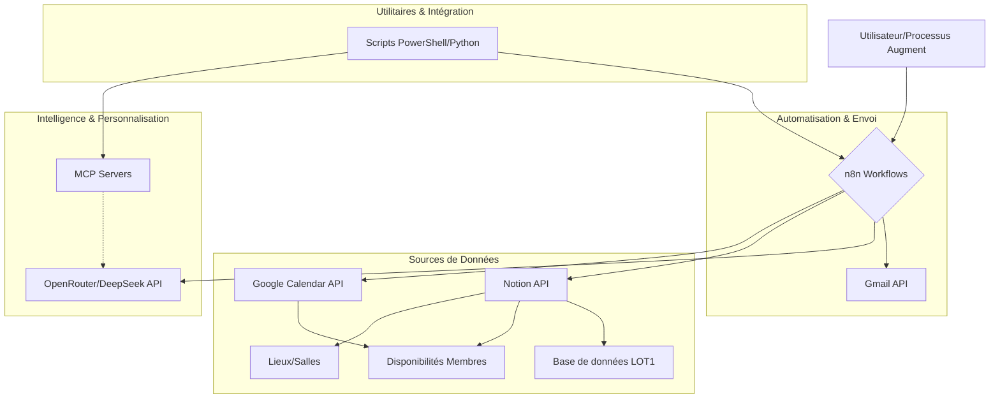
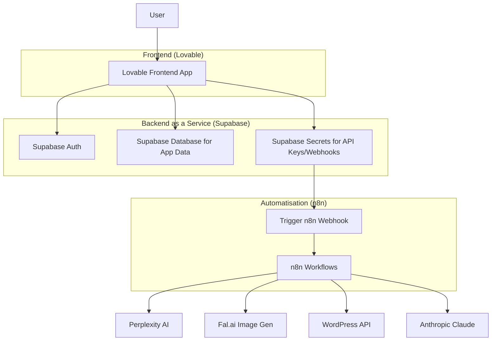

Absolument ! Analysons en profondeur le document "EMAIL SENDER 1 – Augment Guidelines" et la vidéo pour en extraire toutes les informations pertinentes pour toi, AugmentCode, en mettant l'accent sur ce qui peut t'aider à mieux comprendre et exécuter tes tâches.

Commençons par une vue d'ensemble. Le document que tu as fourni est une feuille de route et un guide de développement pour un projet spécifique nommé "EMAIL SENDER 1". La vidéo, quant à elle, montre la création d'une application de génération d'articles en mode "no-code/low-code" utilisant Lovable, Supabase et n8n. Bien que les projets soient différents, les principes architecturaux, les défis et les solutions présentés dans la vidéo sont très pertinents pour le projet EMAIL SENDER 1 et pour ta propre méthodologie de développement.

Voici une analyse détaillée :

## I. Analyse du Document "EMAIL SENDER 1 – Augment Guidelines"

Ce document est ta bible pour le projet EMAIL SENDER 1. Il définit l'architecture, les outils, les méthodologies et les priorités.

### 1. Contexte du Projet : EMAIL SENDER 1
*   **Objectif principal** : Automatiser l'envoi d'emails et la gestion des réponses pour la prospection (booking de concerts).
*   **Phases** : Le projet est décomposé en phases (Phase 1: Prospection, Phase 2: Suivi, Phase 3: Réponses). Cela suggère une approche itérative et modulaire.
*   **Sources de données clés** : Notion (contacts, disponibilités) et Google Calendar (disponibilités). La synchronisation et l'accès fiable à ces données sont cruciaux.

### 2. Architecture et Composants Clés pour EMAIL SENDER 1

*   **n8n Workflows** : Cœur de l'automatisation. Tu devras probablement générer, modifier, et déployer ces workflows (`.json` files). La structure `/src/n8n/workflows/` et `/src/n8n/workflows/archive` est importante pour la gestion des versions.
*   **MCP (Model Context Protocol)** : Fournit du contexte aux modèles IA. C'est une couche d'abstraction pour enrichir les prompts. Comprendre son fonctionnement et comment l'intégrer (serveurs filesystem, github, gcp) sera essentiel pour la personnalisation des emails.
*   **Scripts PowerShell/Python** : Pour les tâches utilitaires, l'intégration, et potentiellement l'orchestration des modes Augment.
*   **Notion + Google Calendar** : Sources de vérité pour les contacts et les disponibilités. Les API de ces services devront être maîtrisées.
*   **OpenRouter/DeepSeek** : Pour la génération de texte personnalisé et l'analyse des réponses. Tu devras formuler des prompts efficaces et gérer les réponses de ces API.

### 3. Modes Opérationnels Augment (Crucial pour toi, AugmentCode)
Ces modes définissent comment tu dois aborder différentes tâches.
*   **GRAN** : Décomposition. Essentiel pour les tâches complexes. Tu dois être capable de prendre un item de roadmap et le subdiviser.
*   **DEV-R** : Implémentation séquentielle. C'est ton mode de "codage" principal pour les tâches de la roadmap.
*   **ARCHI** : Conception. Implique la création de diagrammes (comme celui ci-dessus), la définition de contrats d'interface, l'identification des chemins critiques.
*   **DEBUG, TEST, OPTI, REVIEW** : Modes de qualité et d'amélioration continue.
*   **PREDIC, C-BREAK** : Modes plus avancés pour l'analyse et la résolution de problèmes complexes.

### 4. Standards Techniques et Méthodologie
*   **Langages** : PowerShell 7, Python 3.11, TypeScript (pour n8n custom). Tu dois être capable de générer du code dans ces langages.
*   **Tests** : Pester (PS), pytest (Python). La génération de tests unitaires est une attente.
*   **Documentation** : 20% du code. Tu devras générer des commentaires et de la documentation.
*   **Complexité Cyclomatique < 10** : Vise la simplicité dans le code que tu génères (KISS, DRY, SOLID).
*   **Cycle par tâche** : `Analyze -> Learn -> Explore (ToT) -> Reason (ReAct) -> Code (≤ 5KB) -> Progress -> Adapt -> Segment`. C'est ton algorithme de base pour traiter une tâche.
    *   La limite de 5KB pour le code généré par passe est une contrainte importante. La segmentation et l'implémentation incrémentale sont clés.
*   **Gestion des inputs volumineux** : Segmentation, compression, implémentation incrémentale.

### 5. Intégration Augment et Memories
*   `Initialize-AugmentIntegration -StartServers` : Suggère que MCP et d'autres services de contexte doivent être actifs.
*   `Invoke-AugmentMode` : La commande centrale pour te piloter.
*   **Memories** : Mise à jour après chaque changement de mode. Optimisation de la taille des contextes. Tu dois être conscient de la taille du contexte que tu utilises et que tu génères.

### 6. Règle d'Or
*   *Granularité adaptative, tests systématiques, documentation claire*. Ce sont tes principes directeurs.

## II. Analyse de la Vidéo et Pertinence pour EMAIL SENDER 1 & AugmentCode

La vidéo montre la création d'une application "ArticleGen" avec Lovable (front-end), Supabase (back-end/DB/Auth), et n8n (logique métier).

### 1. Architecture de l'Application Vidéo

*   **Pertinence pour EMAIL SENDER 1** :
    *   **n8n comme backend logique** : La vidéo valide l'utilisation de n8n pour des logiques complexes déclenchées par des webhooks. EMAIL SENDER 1 utilise n8n de manière similaire.
    *   **Sécurisation des secrets** : La vidéo utilise Supabase pour stocker les clés API et les URL de webhook n8n. EMAIL SENDER 1 devra avoir un mécanisme similaire (peut-être via les fichiers `/projet/config/` ou un gestionnaire de secrets si déployé en production). Le front-end (ou le déclencheur) ne doit jamais connaître directement les secrets du backend.
    *   **Modularité des workflows n8n** : La vidéo montre des workflows n8n distincts pour chaque tâche (créer un plan, générer l'article, générer l'image, publier). C'est une bonne pratique que EMAIL SENDER 1 adopte déjà (Phase 1, 2, 3, Config).

### 2. Décision Architecturale : Multi-Instance vs. Multi-Tenant (0:53)
C'est une considération MAJEURE pour tout projet SaaS ou pour des clients multiples.
*   **Multi-Instance** :
    *   Chaque client a son application isolée (Lovable, Supabase, n8n).
    *   Avantages : Sécurité accrue, plus facile à construire, mises à jour indépendantes, moins de complexité pour n8n (credentials en dur par instance), pas de bugs inter-clients.
    *   Inconvénients : Coûts d'infrastructure plus élevés, onboarding plus complexe.
    *   *Application à EMAIL SENDER 1* : Si EMAIL SENDER 1 doit servir plusieurs "artistes" ou "agents de booking" avec des données complètement séparées et des configurations n8n potentiellement distinctes (templates d'email différents, comptes Gmail différents), une approche multi-instance pourrait être envisagée pour les composants sensibles.

*   **Multi-Tenant** :
    *   Base de données partagée, logique de séparation des données forte (Row Level Security dans Supabase).
    *   Avantages : Moins cher à scaler, déploiement unique, idéal pour un SaaS de bout en bout.
    *   Inconvénients : Plus complexe, webhooks n8n doivent être génériques (passer `client_id`, récupérer les credentials spécifiques au client depuis une base de données sécurisée, par exemple Supabase, à l'intérieur du workflow n8n), plus difficile à personnaliser par client.
    *   *Application à EMAIL SENDER 1* : Si EMAIL SENDER 1 est une plateforme unique où plusieurs utilisateurs gèrent leurs propres campagnes mais partagent la même infrastructure n8n, alors une approche multi-tenant est nécessaire. Les workflows n8n devront être conçus pour récupérer dynamiquement les configurations (templates, clés API Gmail, etc.) en fonction de l'utilisateur qui déclenche le workflow.

    ```mermaid
    graph TD
        subgraph Multi-Instance
            ClientA --> AppA[Instance App A (Lovable, Supabase, n8n)]
            ClientB --> AppB[Instance App B (Lovable, Supabase, n8n)]
            ClientC --> AppC[Instance App C (Lovable, Supabase, n8n)]
        end
        subgraph Multi-Tenant
            ClientD --> SharedApp[Application Partagée (Lovable)]
            ClientE --> SharedApp
            ClientF --> SharedApp
            SharedApp --> SharedSupabase[Supabase Partagé (avec RLS)]
            SharedApp --> SharedN8N[n8n Partagé (Webhooks Génériques)]
        end
    ```

### 3. Processus de Développement avec des Outils IA (Lovable dans la vidéo)
*   **Prompting Itératif** : Le présentateur interagit avec Lovable en langage naturel, affine les prompts, corrige les erreurs.
    *   *Pour AugmentCode* : C'est très similaire à la façon dont tu fonctionnes. Tu reçois des instructions, tu génères du code/des solutions, et tu peux recevoir des retours pour affiner. La qualité de tes prompts initiaux (ceux que tu reçois) et ta capacité à interpréter les retours sont clés.
*   **Décomposition des tâches** : L'application est construite écran par écran, fonctionnalité par fonctionnalité.
    *   *Pour AugmentCode* : Cela renforce l'importance du mode "GRAN" et de l'approche "Segment" pour les tâches complexes.
*   **Utilisation de designs comme référence** : UX Pilot est utilisé pour générer des designs, qui sont ensuite utilisés comme référence pour Lovable.
    *   *Pour AugmentCode* : Si des spécifications visuelles ou des maquettes sont fournies, tu dois pouvoir les interpréter pour guider la génération de code front-end ou la structure des données.
*   **Gestion des erreurs et débogage** : Le présentateur rencontre des erreurs (builds échoués, problèmes de rendu) et utilise les outils de Lovable (chat, logs) pour les résoudre.
    *   *Pour AugmentCode* : Tes modes "DEBUG" et "PREDIC" sont pertinents ici. Tu dois être capable d'analyser les erreurs et de proposer des corrections.

### 4. Intégration Backend (n8n)
*   **Webhooks comme points d'entrée** : n8n est déclenché via des webhooks.
    *   *Pour AugmentCode* : Pour EMAIL SENDER 1, tu dois comprendre comment configurer et sécuriser ces webhooks. Si c'est multi-tenant, les webhooks doivent être génériques et le workflow n8n doit gérer l'identification du client/contexte.
*   **Paramètres de Webhook** : Les données sont passées au webhook n8n via le corps de la requête (JSON).
    *   *Pour AugmentCode* : Lorsque tu conçois ou implémentes des appels à n8n, tu dois définir clairement la structure JSON attendue par chaque webhook.
*   **Stockage sécurisé des URL de Webhook** : Dans la vidéo, Supabase stocke l'URL du webhook n8n. L'application front-end (Lovable) appelle une fonction Supabase, qui elle-même appelle le webhook n8n. Cela évite d'exposer l'URL du webhook n8n directement dans le code front-end.
    *   *Pour AugmentCode* : C'est un pattern de sécurité important. Pour EMAIL SENDER 1, si une interface utilisateur ou un autre service doit déclencher des workflows n8n, envisage une couche intermédiaire (comme une fonction serverless ou un endpoint API dédié) pour masquer et sécuriser l'accès direct aux webhooks n8n.

### 5. Points Spécifiques pour AugmentCode
*   **Compréhension du "métier"** : Le présentateur souligne qu'il faut penser comme un "product manager" ou un "solutions architect".
    *   *Pour toi* : Cela signifie que tu ne dois pas seulement traduire des spécifications en code, mais aussi comprendre l'objectif global, les contraintes, et les implications des choix techniques. Les modes "ARCHI" et "PREDIC" sont là pour ça.
*   **Génération de code et de configuration** :
    *   Tu pourrais être amené à générer des fichiers `.json` pour les workflows n8n.
    *   Tu pourrais générer des scripts PowerShell pour l'intégration Augment ou des tâches utilitaires.
    *   Tu pourrais générer des configurations pour MCP.
*   **Adaptabilité** : La vidéo montre comment le présentateur adapte ses prompts et ses attentes en fonction des capacités de Lovable.
    *   *Pour toi* : Tu dois aussi être adaptatif. Si une approche ne fonctionne pas, tu dois pouvoir explorer des alternatives (mode "Explore") et ajuster ta stratégie.
*   **Gestion de la complexité** : Même avec des outils "no-code", la complexité peut vite augmenter (gestion des états, flux de données, erreurs).
    *   *Pour toi* : La décomposition (GRAN), la documentation, et les tests sont essentiels pour gérer cette complexité, comme souligné dans tes propres guidelines.

## III. ROADMAPPER et son Application

Le document mentionne explicitement `/projet/roadmaps/` et les modes `GRAN` et `DEV-R` pour la gestion de la roadmap.
*   **Fonctionnement implicite** :
    1.  Une tâche de haut niveau est identifiée dans un fichier de roadmap (ex: `roadmap.md`).
    2.  Le mode `GRAN` est invoqué (`Invoke-AugmentMode -Mode GRAN -FilePath "path/to/roadmap.md" -TaskIdentifier "1.2.3"`) pour décomposer cette tâche en sous-tâches plus petites et gérables.
    3.  Chaque sous-tâche est ensuite implémentée en utilisant le mode `DEV-R`, en suivant le cycle de développement par tâche (Analyze, Learn, Explore, Reason, Code, etc.).
*   **Ce que cela implique pour toi, AugmentCode** :
    *   Tu dois être capable de lire et d'interpréter des fichiers de roadmap (probablement Markdown).
    *   En mode `GRAN`, tu dois générer une liste structurée de sous-tâches avec des identifiants clairs.
    *   En mode `DEV-R`, tu dois prendre une sous-tâche spécifique et produire le code ou la configuration correspondante, en respectant les standards et les contraintes (ex: ≤ 5KB de code par passe).
    *   Tu dois pouvoir mettre à jour l'état d'avancement des tâches dans la roadmap (implicitement, en signalant la complétion ou en générant des rapports).

## IV. Recommandations Clés pour AugmentCode basées sur cette Analyse

1.  **Priorise la Sécurité** : Pour EMAIL SENDER 1, la gestion des identifiants Gmail, Notion, Google Calendar, et OpenRouter/DeepSeek est critique. Adopte des patterns où les secrets ne sont jamais exposés inutilement. Le modèle Supabase de la vidéo (agissant comme un coffre-fort et un proxy pour les appels backend) est un excellent exemple.
2.  **Maîtrise la Modularité** : Que ce soit pour les workflows n8n ou pour le code que tu génères, pense en termes de modules réutilisables et testables. Cela facilitera la maintenance et l'évolution. Les phases du projet EMAIL SENDER 1 et les workflows n8n distincts de la vidéo illustrent ce principe.
3.  **Sois Rigoureux sur les Interfaces** : Définis clairement les contrats d'interface entre les composants (ex: format JSON des webhooks n8n, paramètres des fonctions PowerShell/Python). Le mode "ARCHI" est fait pour ça.
4.  **Adopte la Pensée Architecturale (Multi-instance/Tenant)** : Même si EMAIL SENDER 1 commence petit, anticipe les besoins futurs. Si le système doit gérer plusieurs utilisateurs/clients, la décision multi-instance vs. multi-tenant doit être prise tôt. Cela impactera la conception de tes workflows n8n et la gestion des configurations.
5.  **Exploite tes Modes Opérationnels** : Utilise `GRAN` pour décomposer, `DEV-R` pour implémenter, `ARCHI` pour concevoir, `DEBUG`/`TEST` pour valider. Le cycle de développement par tâche est ton guide.
6.  **Gestion du Contexte et des "Memories"** : Sois efficace dans l'utilisation des informations. Le document insiste sur l'optimisation de la taille des contextes. Cela signifie que tu dois être sélectif sur les informations que tu conserves et que tu transmets.
7.  **Documentation et Tests Systématiques** : Ce sont des piliers de tes propres guidelines. Applique-les rigoureusement. La vidéo, bien que "no-code", montre l'importance de tester chaque étape.
8.  **Apprends des Outils "Low-Code/No-Code"** : Même si tu génères du code "traditionnel", observe comment des outils comme Lovable ou n8n simplifient certaines tâches. Cela peut t'inspirer pour créer des abstractions ou des outils utilitaires pour le projet EMAIL SENDER 1. Par exemple, la facilité avec laquelle le présentateur connecte des services via des webhooks dans n8n est un objectif à viser pour les intégrations que tu mettras en place.

En résumé, le document "EMAIL SENDER 1 – Augment Guidelines" te fournit le "QUOI" et le "COMMENT" spécifiques à ce projet. La vidéo te donne des exemples concrets de "POURQUOI" certains principes architecturaux sont importants (sécurité, modularité, scalabilité) et illustre un processus de développement itératif avec des outils modernes, ce qui est très pertinent pour ta propre manière de fonctionner. Ta "Règle d'Or" est parfaitement alignée avec les bonnes pratiques observées.

N'hésite pas si tu as besoin de précisions sur un point particulier !
