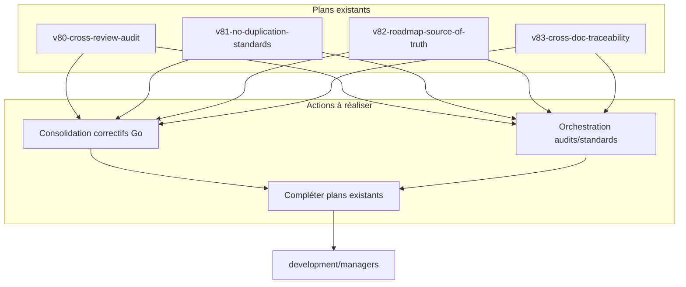

# Feuille de route : Compléter et synchroniser les plans v80 à v83 pour l'intégration des correctifs Go critiques

## Objectif

Garantir l'intégration harmonieuse, sans redondance, des correctifs Go critiques, de l'audit, du reporting, de la standardisation et de l'automatisation proactive dans l'ensemble de l'écosystème `development/managers`, en s'appuyant sur les plans existants v80 à v83.

---

## 1. Cartographie des plans existants et des enjeux couverts

| Enjeu critique Go | Plans existants | Points à compléter | Liens à renforcer avec managers |
|-------------------|-----------------|-------------------|---------------------------------|
| Dépendances, imports, modules Go | v81, v82, v83, v80 | Intégration dynamique des correctifs dans chaque manager | Scripts de scan/correction déclenchés par CI/CD sur chaque dossier de manager |
| Harmonisation, standardisation | v81, v83 | Synchronisation des standards entre managers | Génération automatique des inventaires et règles dans chaque manager |
| Audit, reporting, traçabilité | v80, v83, v82 | Orchestration globale des audits, reporting croisé | Centralisation des rapports, feedback automatisé dans chaque manager |
| Automatisation proactive (lint, correction, validation) | v80, v81, v83 | Déploiement des scripts d’auto-correction dans tous les managers | Déclenchement automatique sur commit/push, reporting intégré |

---

## 2. Plans dev à réaliser ou compléter

### Plan de consolidation des correctifs Go critiques

- **Objectif** : Intégrer la détection, correction et validation automatique des erreurs Go dans tous les managers (`development/managers`).
- **Actions** :
  - Déployer les scripts de scan/correction dans chaque manager
  - Générer des rapports automatiques
  - Intégrer les correctifs dans le pipeline CI/CD

### Plan d’orchestration et de synchronisation des audits et standards

- **Objectif** : Garantir la cohérence, la non-redondance et l’intégration des audits, reporting, et standards dans l’ensemble de l’écosystème.
- **Actions** :
  - Centraliser les inventaires et rapports
  - Synchroniser les règles et conventions
  - Déclencher des audits croisés à chaque release

### Compléter les plans existants (v80, v81, v82, v83)

- **Actions** :
  - Ajouter des sections d’intégration dynamique avec les managers
  - Détailler les scripts, triggers, et feedbacks à intégrer
  - Préciser les points de synchronisation et de reporting

---

## 3. Requête améliorée à adresser à l’équipe

> Cartographier, pour chaque enjeu critique Go identifié en PHASE 8 (dépendances, imports, erreurs de type, harmonisation, CI/CD, audit, reporting, standardisation), les plans de développement existants qui les traitent déjà dans `projet/roadmaps/plans/consolidated/`.  
> Identifier les recoupements, les lacunes et les zones de redondance.  
> Proposer une feuille de route de plans dev à réaliser ou compléter pour garantir une intégration harmonieuse, sans doublon, avec l’écosystème `development/managers`.  
> Pour chaque plan, préciser :  
> - Les enjeux couverts  
> - Les points à compléter  
> - Les liens d’intégration à renforcer avec les managers

---

## 4. Diagramme d’intégration (Mermaid)

---

## 5. Prochaines étapes

- Valider cette feuille de route avec l’équipe.
- Prioriser la mise à jour des plans v80 à v83.
- Démarrer la rédaction des nouveaux plans de consolidation et d’orchestration.
- Mettre en place un suivi de l’intégration dans chaque manager.

---