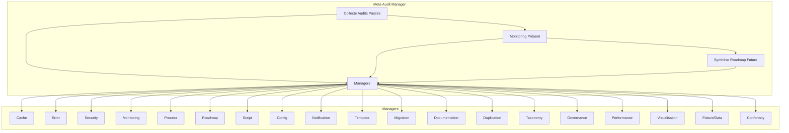

# Rapport d’état de l’art – Meta Audit Manager

---

## 1. Vision et rôle central

Le **Meta Audit Manager** est le chef d’orchestre transversal du projet, articulant les audits passés, le monitoring présent et la planification future.  
Il s’appuie sur l’ensemble des managers de l’écosystème, la documentation centralisée `.github/docs`, les rapports d’audit, et la stack Go native pour garantir robustesse, traçabilité, conformité et innovation.

---

## 2. Arborescence et relations croisées

### 2.1. Arborescence fonctionnelle

- **Meta Audit Manager**
  - Collecte & indexation des audits (passé)
  - Monitoring & supervision (présent)
  - Synthèse & projection roadmap (futur)
  - Orchestration des validations croisées
  - Auto-remédiation & feedback loop

### 2.2. Relations croisées avec les managers

| Manager                | Rôle dans la méta-audit | Type de relation | Exemples de capacités analytiques |
|------------------------|------------------------|------------------|-----------------------------------|
| Cache Manager          | Logs, contextes, traçabilité | Agrégation, audit | Analyse des logs, détection d’anomalies |
| Error Manager          | Erreurs, exceptions, reporting | Audit, suggestion | Statistiques d’erreurs, auto-remédiation |
| Security Manager       | Secrets, permissions, conformité | Audit, alertes | Audit RGPD, détection de failles |
| Monitoring Manager     | Métriques, états, alertes | Agrégation, dashboard | Tendances, alertes proactives |
| Process Manager        | Workflows, dépendances | Orchestration, audit | Analyse des workflows, détection de blocages |
| Roadmap Manager        | Plans, synchronisation | Synthèse, projection | Harmonisation des roadmaps, simulation d’impacts |
| Script Manager         | Scripts, exécution, inventaire | Audit, reporting | Validation des scripts, détection de doublons |
| Config Manager         | Configs, versionning | Audit, suggestion | Analyse des changements, détection d’incohérences |
| Notification Manager   | Alertes, feedbacks | Orchestration, reporting | Suivi des notifications, analyse de réactivité |
| Template Manager       | Templates, artefacts | Audit, validation | Vérification des conventions, suggestion de modèles |
| Migration Manager      | Migrations, rollback | Audit, orchestration | Suivi des migrations, analyse des impacts |
| Documentation Manager  | Docs, guides, FAQ | Audit, synchronisation | Couverture documentaire, suggestions d’amélioration |
| Duplication Manager    | Doublons, conflits | Audit, fusion | Détection de duplications, fusion intelligente |
| Taxonomy Manager       | Nommage, registry | Audit, validation | Détection de conflits, harmonisation du nommage |
| Governance Manager     | Règles métier, workflow | Audit, orchestration | Validation croisée, gestion des exceptions |
| Performance Manager    | Benchmarks, optimisation | Audit, reporting | Analyse de performance, suggestions d’optimisation |
| Visualisation Manager  | Dashboards, graphes | Audit, visualisation | Cartographie interactive, analyse des flux |
| Fixture/Data Manager   | Jeux de données, mocks | Audit, validation | Vérification des fixtures, suggestion de jeux de test |
| Conformity Manager     | Standards, licences, RGPD | Audit, reporting | Vérification conformité, alertes réglementaires |

---

## 3. Capacités analytiques et déductions

- **Agrégation intelligente** : fusion des métriques, logs, rapports, feedbacks de tous les managers.
- **Détection proactive** : identification des lacunes, conflits, duplications, régressions, failles, incohérences.
- **Synthèse dynamique** : génération automatique de la future-roadmap, priorisation des axes d’amélioration.
- **Projection et simulation** : modélisation des impacts des migrations, refactorings, ajouts de managers.
- **Auto-remédiation** : déclenchement de tâches correctives, suggestions automatisées.
- **Feedback loop** : boucle de rétroaction entre audits passés, monitoring présent, planification future.
- **Reporting et visualisation** : dashboards, graphes, timelines, rapports synthétiques.

---

## 4. Schéma des relations (Mermaid)

---

## 5. Conformité et harmonisation

- **Conformité à l’écosystème de managers** : interfaces standardisées, hooks, reporting, validation croisée.
- **Harmonie avec la documentation** : intégration avec `.github/docs`, guides, FAQ, schémas, conventions.
- **Lien avec les plans consolidés** : synchronisation avec `projet/roadmaps/plans/consolidated`, reporting des migrations, harmonisation des roadmaps.
- **Respect de la stack Go native** : scripts, orchestrateurs, tests, reporting automatisé.
- **Traçabilité et versionning** : archivage des audits, logs, rapports, historiques.

---

## 6. Références croisées

- `.github/docs/BONNES-PRATIQUES.md`, `CONTRIBUTING.md`, `tools-reference.md`
- `plan-dev-v104-automatisation-proactive-autonome-projet.md`, `2025-0712-taxonomy-manager.md`, `2025-0701-future-roadmap.md`
- `.github/docs/MANAGERS/`, `development/managers/`
- Scripts de génération, reporting, validation, migration, dashboard

---

**Synthèse**  
Le Meta Audit Manager, en orchestrant et en interfaçant tous les managers critiques, devient le pivot de la supervision, de la traçabilité et de l’innovation du projet.  
Il permet une analyse holistique, une projection stratégique et une amélioration continue, en harmonie avec l’écosystème, la documentation et la stack technique.

---