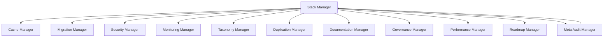

# Rapport d’état de l’art – Stack Manager

---

## 1. Vision stratégique

Le **Stack Manager** est le garant de la cohérence, de la robustesse et de l’évolutivité technique du projet.  
Il orchestre la sélection, l’usage, la migration et l’optimisation de toutes les technologies (bases de données, frameworks, outils, langages), en alignement avec les objectifs métier, les audits, la documentation et l’écosystème de managers.

---

## 2. Arborescence et relations croisées

### 2.1. Arborescence fonctionnelle

- **Stack Manager**
  - Inventaire dynamique des technologies
  - Gouvernance des choix techniques
  - Simulation et projection d’impacts
  - Orchestration des migrations et évolutions
  - Documentation et reporting automatisés

### 2.2. Relations croisées avec les managers

| Manager                | Rôle dans la gouvernance technique | Type de relation | Capacités analytiques |
|------------------------|------------------------------------|------------------|----------------------|
| Cache Manager          | Choix/optimisation des backends    | Audit, orchestration | Analyse des flux, optimisation |
| Migration Manager      | Orchestration des migrations       | Coordination, reporting | Suivi des migrations, analyse d’impact |
| Security Manager       | Audit sécurité, validation         | Audit, alertes | Vérification des flux, conformité |
| Monitoring Manager     | Suivi des performances             | Agrégation, dashboard | Tendances, alertes techniques |
| Taxonomy Manager       | Harmonisation des conventions      | Validation, mapping | Détection de conflits, normalisation |
| Duplication Manager    | Détection/fusion des redondances   | Audit, fusion | Optimisation, consolidation |
| Documentation Manager  | Guides, schémas, inventaires       | Synchronisation, reporting | Couverture documentaire, schémas techniques |
| Governance Manager     | Application des règles métier      | Validation, orchestration | Cohérence métier/technique |
| Performance Manager    | Benchmarks, optimisation           | Audit, reporting | Analyse de performance, suggestions |
| Roadmap Manager        | Synchronisation avec les plans      | Reporting, projection | Harmonisation des roadmaps, simulation |
| Meta Audit Manager     | Boucle de feedback                 | Audit, reporting | Agrégation des audits, synthèse stratégique |

---

## 3. Capacités analytiques et déductions

- **Inventaire dynamique** : scan automatique du dépôt, recensement des bases, frameworks, outils, langages, versions.
- **Cartographie interactive** : schémas Mermaid/Graphviz des flux, dépendances, usages, points critiques.
- **Gouvernance proactive** : définition de règles d’usage, critères de sélection, politiques de migration/intégration.
- **Simulation d’impacts** : modélisation des conséquences d’un changement de stack (performance, sécurité, coût, conformité).
- **Auto-suggestion** : recommandations automatisées d’optimisation, consolidation, migration, refactoring.
- **Orchestration automatisée** : supervision des migrations, évolutions, benchmarks, tests de compatibilité.
- **Documentation vivante** : génération automatique de guides, schémas, dashboards, inventaires techniques.
- **Reporting dynamique** : rapports sur l’état, l’évolution, la conformité de la stack.

---

## 4. Schéma des relations (Mermaid)

---

## 5. Harmonisation et conformité

- **Alignement sur la stack Go native** : scripts, orchestrateurs, tests, reporting automatisé.
- **Intégration avec la documentation** : guides, conventions, inventaires techniques dans `.github/docs`.
- **Lien avec les plans consolidés et audits** : synchronisation des choix techniques, reporting des migrations, harmonisation des roadmaps.
- **Traçabilité et versionning** : archivage des audits, logs, rapports, historiques techniques.
- **Interopérabilité** : compatibilité avec les outils externes, les standards, les pipelines CI/CD.

---

## 6. Références croisées

- `.github/docs/BONNES-PRATIQUES.md`, `CONTRIBUTING.md`, `tools-reference.md`
- `plan-dev-v104-automatisation-proactive-autonome-projet.md`, `2025-0712-taxonomy-manager.md`, `2025-0712-meta-audit-manager.md`, `2025-0701-future-roadmap.md`
- `.github/docs/MANAGERS/`, `development/managers/`
- Scripts de génération, reporting, validation, migration, dashboard

---

**Synthèse**  
Le Stack Manager est le pivot technique du projet, garantissant la cohérence, la performance, la sécurité et l’évolutivité de l’ensemble du système.  
Il transforme les audits techniques en plans actionnables, optimise l’usage des technologies, et assure une gouvernance proactive, en synergie avec tous les managers et la documentation du projet.

---