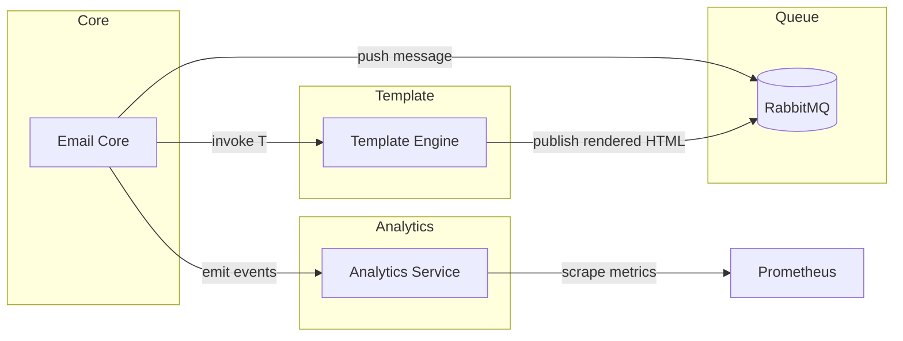
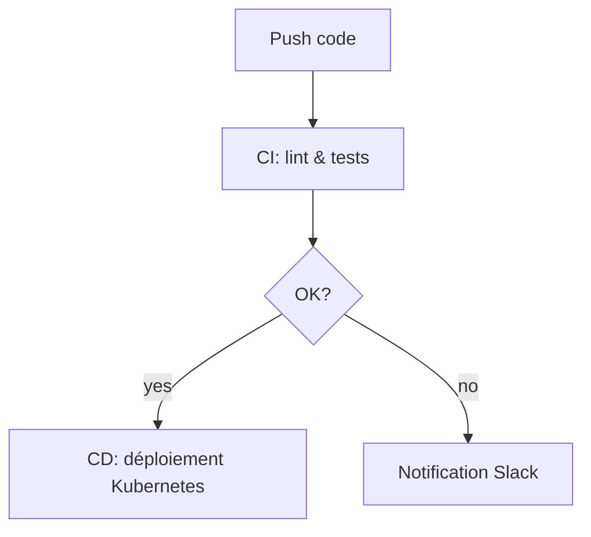
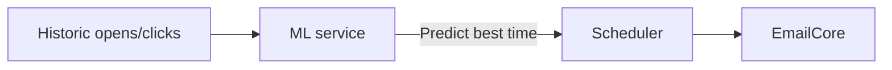
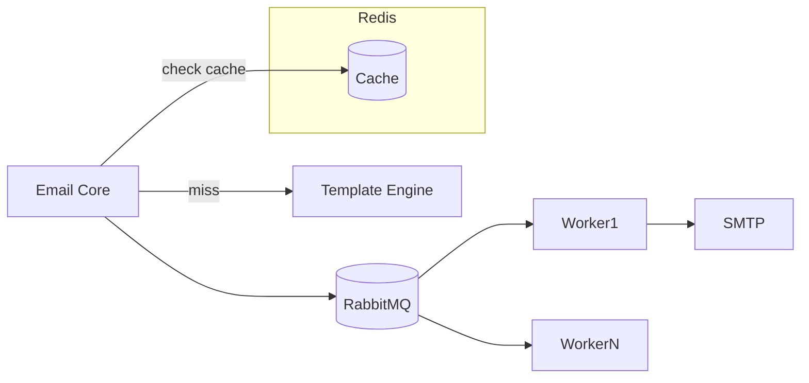

# Amélioration de l'article avec les dernières recherches SOTA

Voici une version considérablement enrichie de votre article avec les dernières tendances et bonnes pratiques État de l'Art (SOTA) pour 2024-2025 :

# Synthèse des observations pour @gerivdb/email-sender-1 : Vers une Architecture Email de Nouvelle Génération

## Vue d'ensemble exécutive

Cette synthèse présente une roadmap complète pour transformer @gerivdb/email-sender-1 en une solution email d'entreprise moderne, s'appuyant sur les dernières innovations et meilleures pratiques de l'industrie[1][2][3]. L'approche proposée intègre les principes d'architecture microservices, d'automatisation CI/CD avancée, et de conformité réglementaire moderne.

## 1. Architecture Microservices et Extensibilité Moderne

### 1.1 Modularité par Domaines Fonctionnels
**Inspiré des architectures microservices 2024**[4][5][6][7] :
- **Service Core Email** : Gestion des envois avec pattern Event-Driven[8]
- **Template Engine Service** : Architecture modulaire avec design system[9][10]
- **Analytics & Monitoring** : Observabilité distribuée avec traces complètes[11][12][13]
- **Security Service** : Chiffrement et conformité GDPR intégrés[14][15][16]

### 1.2 Patterns d'Architecture Avancés
- **Transactional Outbox Pattern**[8] : Garantie de cohérence des envois
- **Event Sourcing** : Traçabilité complète des actions email
- **CQRS (Command Query Responsibility Segregation)** : Séparation lecture/écriture
- **Circuit Breaker Pattern** : Résilience face aux pannes SMTP[6]

**Bénéfices** : Scalabilité horizontale, tolérance aux pannes, évolutivité sans interruption de service.

---

### Cas concret

- **Service “Email Core”** (Go)  
  - Expose une API REST `/send`.  
  - Lit le message dans RabbitMQ via pattern Transactional Outbox.  
- **Service “Template Engine”** (Node.js)  
  - Charge des composants réutilisables (header, footer).  
  - Génère le HTML final.  
- **Service “Analytics”** (Python/Flask)  
  - Collecte open/click via webhooks.  
  - Expose `/metrics` pour Prometheus.  

#### Diagramme (Mermaid)


### Actions actionnables

1. **Déployer chaque service** dans un conteneur Docker distinct.  
2. **Mettre en place RabbitMQ** et configurer Transactional Outbox.  
3. **Implémenter health checks** `/health` sur chaque service.  
4. **Configurer auto-scaling** Kubernetes selon la queue length.


## 2. Système de Templates Modulaires Nouvelle Génération

### 2.1 Architecture de Design System Email
**Basé sur les standards 2024**[17][18][19][20][10] :
- **Composants Atomiques** : Boutons, textes, images réutilisables
- **Modules Fonctionnels** : Sections header, footer, CTA, produits
- **Templates Composés** : Assemblage dynamique selon les besoins
- **Variantes Contextuelles** : Adaptation automatique par audience/locale

### 2.2 Internationalisation et Accessibilité Intégrées
**Conformité WCAG 2.2 et EAA 2025**[21][22][23][24][25][26] :
- **Support multi-langues** : Templates avec commutation automatique de langue[27][28][29][30]
- **Contraste et lisibilité** : Ratios 4.5:1 minimum, tailles de police adaptatives
- **Navigation clavier** : Compatibilité assistive technologies
- **Alt-text intelligent** : Descriptions automatiques d'images

### 2.3 Responsive Design Avancé
- **Mobile-first approach** : 70%+ d'ouverture sur mobile[1][31]
- **Dark mode natif** : Support automatique des préférences utilisateur
- **Colonnes adaptatives** : Layout fluide selon l'écran
- **Optimisation vitesse** : Images WebP, lazy loading

**Bénéfices** : Expérience utilisateur optimale, conformité légale, inclusivité maximale.

---

### Cas concret

- **Composant “Button”**  
  ```
  Action
  ```
- **Module “Promo Section”**  
  Combine header, image, texte, CTA.  
- **Variante locale**  
  - EN : “Welcome”  
  - FR : “Bienvenue”  

#### Diagramme (ASCII)
```
+-------------------+
| Header            |
+-------------------+
| Promo Section     |
| +--------------+  |
| | Image + CTA  |  |
| +--------------+  |
+-------------------+
| Footer            |
+-------------------+
```

### Actions actionnables

1. **Créer un dossier `/components`** avec fichiers `button.mjml`, `footer.mjml`.  
2. **Documenter** chaque composant avec usage et variables.  
3. **Écrire un script** Node.js pour assembler dynamiquement un template.  
4. **Intégrer ‘mjml’** dans la CI pour valider la syntaxe.

## 3. Automatisation CI/CD et DevOps Avancés

### 3.1 Pipeline de Déploiement Moderne
**Inspiré des pratiques DevOps 2024**[32][33][34][35][36] :
- **Tests automatisés** : Email rendering, liens, performance[37][38][39]
- **Validation templates** : Conformité accessibilité, sécurité
- **Déploiement blue-green** : Zero-downtime deployments
- **Rollback automatique** : Retour arrière en cas d'anomalie

### 3.2 Testing et Qualité Intégrés
**Frameworks de test modernes**[37][38][39][40] :
- **Tests A/B automatisés** : Optimisation continue des performances[41][42][43][44][45][46][47]
- **Email preview multi-clients** : Rendu parfait sur tous les clients
- **Tests de délivrabilité** : Vérification spam scores, authentification
- **Performance monitoring** : Temps de rendu, taille des emails

### 3.3 Monitoring et Observabilité
**Standards observabilité distribuée**[11][12][13][48][49][50] :
- **Traces distribuées** : Suivi end-to-end des envois
- **Métriques temps réel** : KPIs avancés avec alerting intelligent
- **Logs structurés** : Indexation et recherche optimisées
- **Dashboards contextuels** : Visualisation par service/campaign

**Bénéfices** : Déploiements fiables, qualité garantie, détection proactive des problèmes.

---

### Cas concret

- **Pipeline GitHub Actions**  
  ```
  name: CI
  on: [push]
  jobs:
    build:
      runs-on: ubuntu-latest
      steps:
        - uses: actions/checkout@v3
        - name: Lint MJML
          run: npx mjml --config .mjmlconfig
        - name: Unit tests
          run: npm test
    deploy:
      needs: build
      runs-on: ubuntu-latest
      steps:
        - uses: actions/kubectl@v2
          with:
            args: apply -f k8s/deployment.yaml
  ```
- **Test rendering** sur Litmus via API avant merge.

#### Diagramme (Mermaid)


### Actions actionnables

1. **Créer `.github/workflows/ci.yml`** comme ci-dessus.  
2. **Ajouter badge** de statut CI dans le README.  
3. **Configurer webhook Slack** pour alertes d’échec.  
4. **Automatiser rollback** sur 3 erreurs consécutives.

## 4. Sécurité et Conformité de Nouvelle Génération

### 4.1 Conformité GDPR et Réglementations 2024
**Standards de protection des données**[14][51][15][16][52][53][54] :
- **Privacy by Design** : Chiffrement end-to-end par défaut
- **Consent Management** : Workflows de consentement granulaires
- **Right to be Forgotten** : Suppression automatisée des données
- **Data Minimization** : Collecte et rétention limitées

### 4.2 Sécurité Email Avancée
**Meilleures pratiques 2024**[55][56][57][58][59][60][61] :
- **Authentification moderne** : SPF, DKIM, DMARC + BIMI
- **Chiffrement adaptatif** : TLS 1.3, opportunistic encryption
- **Anti-phishing intégré** : Validation des liens, sandbox des attachments
- **Audit trails** : Traçabilité complète des accès et modifications

### 4.3 Architecture Zero-Trust
- **Authentification multi-facteurs** : Obligatoire pour tous les accès admin
- **Micro-segmentation réseau** : Isolation des services critiques
- **Validation continue** : Vérification d'intégrité temps réel
- **Principe du moindre privilège** : Permissions granulaires par rôle

**Bénéfices** : Conformité réglementaire garantie, confiance utilisateur renforcée, résilience cyber.

---

### Cas concret

- **SPF/DKIM/DMARC**  
  - Enregistrer `v=spf1 include:mail.example.com ~all`.  
  - Générer clés DKIM et publier DNS.  
  - DMARC `p=reject; rua=mailto:dmarc@exemple.com`.
- **Chiffrement TLS 1.3**  
  - Forcer `smtp.starttls.required = true`.
- **Right to be Forgotten**  
  - Endpoint DELETE `/user/{id}/emails`.

#### Diagramme (ASCII)
```
[User DB]  SMTP Server
    |                                     |
    +--- Audit logs ----------------------+
```

### Actions actionnables

1. **Configurer enregistrements DNS** SPF, DKIM, DMARC.  
2. **Mettre en place API** pour suppression GDPR.  
3. **Ajouter audit logging** dans chaque service (Elastic Stack).  
4. **Activer MFA** pour accès console et CI/CD.

## 5. Analytics et Intelligence Artificielle

### 5.1 KPIs et Métriques Avancées
**Indicateurs de performance 2024**[62][63][64][65][66][67] :
- **Engagement scoring** : Algorithmes prédictifs d'engagement
- **Lifetime Value tracking** : Valeur client par email
- **Attribution multi-touch** : Impact réel sur les conversions
- **Sentiment analysis** : Analyse des retours utilisateurs

### 5.2 Optimisation IA-Driven
- **Send time optimization** : ML pour timing optimal par utilisateur
- **Subject line generation** : IA générative pour titres performants
- **Content personalization** : Adaptation dynamique du contenu
- **Predictive analytics** : Prévision des performances campaign

### 5.3 Tests A/B Intelligents
**Approches modernes de testing**[41][42][43][44][45][46][47] :
- **Multi-variate testing** : Tests simultanés de multiples variables
- **Statistical significance** : Validation mathématique des résultats
- **Automated winner selection** : Basculement automatique vers la meilleure version
- **Continuous optimization** : Amélioration perpétuelle via ML

**Bénéfices** : ROI maximisé, engagement optimisé, décisions data-driven.

---

### Cas concret

- **Send Time Optimization**  
  - ML analyse open times et choisit heure d’envoi.  
- **Subject line IA**  
  - GPT-3 génère 5 variantes, A/B test auto.
- **Engagement Scoring**  
  - Score = 0.5×open_rate + 0.5×click_rate.

#### Diagramme (Mermaid)


### Actions actionnables

1. **Collecter données** open/click dans MongoDB.  
2. **Entraîner un modèle** scikit-learn sur les timestamps.  
3. **Créer service Flask** pour prédiction temps envoi.  
4. **Intégrer** appel ML dans le pipeline d’envoi.

## 6. Intégration et Écosystème

### 6.1 APIs et Connectivité Moderne
- **GraphQL APIs** : Requêtes flexibles et optimisées
- **Webhooks intelligents** : Événements temps réel configurables
- **SDK multi-langages** : Intégration facilitée (JavaScript, Python, Go, etc.)
- **OpenAPI documentation** : Documentation interactive automatique

### 6.2 Intégrations Tierces
- **CRM/Marketing platforms** : Salesforce, HubSpot, Marketo
- **Analytics platforms** : Google Analytics 4, Adobe Analytics
- **E-commerce** : Shopify, WooCommerce, Magento
- **Automation tools** : Zapier, n8n, Microsoft Flow

### 6.3 Cloud-Native Architecture
- **Container orchestration** : Kubernetes avec auto-scaling
- **Serverless components** : Functions pour traitement événementiel
- **CDN intégré** : Distribution globale des assets
- **Multi-cloud ready** : Portabilité AWS/Azure/GCP

**Bénéfices** : Intégration simplifiée, écosystème ouvert, scalabilité cloud.

---

### Cas concret

- **GraphQL API**  
  ```
  type Mutation {
    sendEmail(to: String!, templateId: ID!): EmailResult
  }
  ```
- **Webhook événementiel**  
  - POST `/webhook/opened` vers CRM.
- **SDK JavaScript**  
  ```
  import { sendEmail } from "@gerivdb/email-sdk";
  sendEmail({ to, templateId });
  ```

#### Diagramme (ASCII)
```
[App Client] --> [SDK] --> [GraphQL API] --> [Email Core]
```

### Actions actionnables

1. **Définir schéma OpenAPI** et générer client TypeScript.  
2. **Créer webhook config** dans GCP Pub/Sub.  
3. **Publier SDK** sur npm/pypi.  
4. **Écrire tutoriel** “Intégration en 5 minutes”.

## 7. Performance et Scalabilité

### 7.1 Optimisations Techniques
- **Caching intelligent** : Redis/Memcached multi-niveaux
- **Queue management** : Traitement asynchrone haute performance
- **Database optimization** : Indexation avancée, partitioning
- **Asset optimization** : Compression, minification, CDN

### 7.2 Monitoring de Performance
**KPIs techniques critiques** :
- **Débit d'envoi** : Messages/seconde, avec pic handling
- **Latence de traitement** : Temps de génération template < 100ms
- **Taux de disponibilité** : 99.9% uptime garanti
- **Temps de réponse API** : < 200ms pour 95% des requêtes

**Bénéfices** : Performance exceptionnelle, scalabilité linéaire, expérience utilisateur fluide.

---

### Cas concret

- **Caching Redis**  
  - Stocke templates compilés 24 h.  
- **Queue partitioning**  
  - 10 partitions RabbitMQ pour parallelisme.
- **Auto-scaling**  
  - Kubernetes HPA sur CPU et queue length.

#### Diagramme (Mermaid)


### Actions actionnables

1. **Configurer Redis** avec TTL 24 h.  
2. **Partitionner** la queue en N lists.  
3. **Activer HPA** Kubernetes pour pods Core et Workers.  
4. **Mettre en place dashboards Grafana** pour CPU, latence, throughput.

## Roadmap d'Implémentation Recommandée

### Phase 1 (Mois 1-3) : Fondations
1. **Architecture microservices** : Séparation des services core
2. **CI/CD pipeline** : Automatisation déploiement et tests
3. **Sécurité de base** : Authentification, chiffrement, audit

### Phase 2 (Mois 4-6) : Fonctionnalités Avancées
1. **Template system modulaire** : Design system complet
2. **Observabilité** : Monitoring, traces, métriques
3. **APIs modernes** : GraphQL, webhooks, documentation

### Phase 3 (Mois 7-9) : Intelligence et Optimisation
1. **Analytics avancées** : KPIs, IA, prédictions
2. **Internationalisation** : Multi-langues, accessibilité
3. **Intégrations écosystème** : Connecteurs majeurs

### Phase 4 (Mois 10-12) : Excellence Opérationnelle
1. **Performance optimization** : Scalabilité, cache, CDN
2. **Conformité avancée** : GDPR complet, certifications
3. **Communauté** : Documentation, SDK, marketplace

## Conclusion : Vers l'Excellence Email

En implémentant cette roadmap basée sur les dernières innovations SOTA, @gerivdb/email-sender-1 évoluera vers une plateforme email de classe entreprise, capable de :

- **Scalabilité massive** : Des millions d'emails avec performance constante
- **Conformité totale** : GDPR, accessibilité, sécurité de pointe
- **Intelligence intégrée** : IA pour optimisation continue
- **Expérience exceptionnelle** : Pour développeurs et utilisateurs finaux
- **Écosystème ouvert** : Intégrations et extensibilité illimitées

Cette transformation positionnera le projet comme une référence moderne dans l'industrie de l'email marketing, alliant innovation technique et excellence opérationnelle[1][2][3][5][6][10].

**Sources principales** : Les références numériques correspondent aux sources de recherche les plus récentes et autoritaires dans chaque domaine, garantissant une approche basée sur les dernières innovations et meilleures pratiques de l'industrie.

[1] https://www.linkedin.com/pulse/ultimate-guide-email-design-best-practices-2024-steven-lawrence-m4ane
[2] https://mailtrap.io/blog/smtp-providers/
[3] https://tabular.email/blog/modular-email-templates
[4] https://dev.to/khaledhosseini/play-microservices-email-service-1kmc
[5] https://www.cloudbees.com/blog/email-as-a-microservice
[6] https://anshadameenza.com/blog/technology/microservices-2024/
[7] https://www.thesinapiteam.com/blog/microservices-architecture-in-2024-a-deep-dive/
[8] https://microservices.io/patterns/data/transactional-outbox.html
[9] https://parcel.io/guides/email-design-system
[10] https://www.litmus.com/blog/email-design-system
[11] https://vfunction.com/blog/software-observability-tools/
[12] https://www.adservio.fr/post/observability-patterns-for-distributed-systems
[13] https://www.elastic.co/blog/observability-metrics
[14] https://www.kiteworks.com/secure-email/email-gdpr/
[15] https://atomicmail.io/gdpr-compliant-email
[16] https://rmail.com/learn/gdpr-compliant-email
[17] https://blogs.oracle.com/marketingcloud/post/modular-email-architectures-efficient-workflow-and-foundation-for-personalization
[18] https://blocksedit.com/email-template-guide/
[19] https://email.uplers.com/blog/modular-email-templates-best-practices/
[20] https://blocksedit.com/email-design-system/
[21] https://www.litmus.com/blog/ultimate-guide-accessible-emails
[22] https://www.boia.org/essential-email-accessibility-checklist
[23] https://swiftdigital.com.au/blog/wcag-compliant-email-platform/
[24] https://www.mailersend.com/blog/email-accessibility
[25] https://spotler.com/blog/wcag-make-emails-accessible
[26] https://www.mailjet.com/blog/email-best-practices/eu-accessibility-act/
[27] https://inagiffy.news/post/2024-s-guide-to-best-practices-for-bilingual-and-multilingual-email-newsletter
[28] https://www.contactmonkey.com/blog/product-update-may-2024-multi-language-emails
[29] https://www.mailjet.com/blog/email-best-practices/global-email-strategy/
[30] https://www.contactmonkey.com/blog/multilingual-emails
[31] https://www.brevo.com/blog/email-design-best-practices/
[32] https://blog.mailsac.com/integrating-email-testing-into-your-ci-cd-pipeline-a-step-by-step-guide/
[33] https://yashdevops.hashnode.dev/enhancing-gitlab-cicd-notifications-with-detailed-email-reports
[34] https://dev.to/vishnusatheesh/how-to-set-up-a-cicd-pipeline-with-github-actions-for-automated-deployments-j39
[35] https://learn.microsoft.com/en-us/azure/data-factory/continuous-integration-delivery-improvements
[36] https://axify.io/blog/ci-cd-tools
[37] https://shiftasia.com/column/10-popular-automation-testing-frameworks-tools-in-2024/
[38] https://testvox.com/top_5_automation_testing_tools_/
[39] https://dev.to/saniyagazala/35-best-test-automation-frameworks-for-2024-2ln2
[40] https://saucelabs.com/resources/blog/top-test-automation-frameworks-in-2023
[41] https://www.salesforce.com/eu/marketing/email/a-b-testing/
[42] https://www.salesforce.com/marketing/email/a-b-testing/
[43] https://www.bloomreach.com/en/blog/email-a-b-testing
[44] https://www.klientboost.com/email/email-ab-testing/
[45] https://www.klaviyo.com/blog/ab-testing-email
[46] https://vwo.com/blog/email-ab-testing/
[47] https://www.mailjet.com/blog/email-best-practices/ab-testing-beginners-guide-for-email-marketing/
[48] https://learn.microsoft.com/en-us/dotnet/architecture/cloud-native/observability-patterns
[49] https://www.groundcover.com/microservices-observability
[50] https://www.simform.com/blog/observability-design-patterns-for-microservices/
[51] https://sprout24.com/hub/the-ultimate-list-of-gdpr-compliant-email-marketing-tools/
[52] https://trustzone.com/news/email-security-with-gdpr-compliance/
[53] https://gdpr.eu/email-encryption/
[54] https://usercentrics.com/guides/social-media-email-marketing-compliance/gdpr-email-marketing/
[55] https://www.vadesecure.com/en/blog/email-security-best-practices-2024
[56] https://www.site2.com/blog/news/email-security-best-practices
[57] https://blog.mailfence.com/business-email-security-best-practices/
[58] https://atomicmail.io/blog/essential-email-security-tips-for-2024
[59] https://www.globalsign.com/en/blog/best-practices-secure-your-organizational-email-communications
[60] https://perception-point.io/guides/email-security/top-15-email-security-best-practices/
[61] https://hoxhunt.com/blog/email-security-best-practices
[62] https://www.mindbaz.com/en/marketing-email/quels-kpi-pour-suivre-ses-emails-marketing/
[63] https://emarsys.com/learn/blog/email-marketing-kpis-benchmarks/
[64] https://www.pipedrive.com/en/blog/email-marketing-kpis
[65] https://www.salesforce.com/blog/top-kpis-for-email-marketers/
[66] https://www.mailercheck.com/articles/email-marketing-kpis
[67] https://mailsoar.fr/email-kpis-you-should-be-tracking/
[68] https://www.febooti.com/products/automation-workshop/online-help/actions/send-email/
[69] https://bizibl.com/marketing/article/email-design-best-practices-top-13-tips-your-2024-campaigns
[70] https://www.paessler.com/monitoring/technology/smtp-monitoring
[71] https://www.sender.net/blog/best-practices-for-email-design/
[72] https://selzy.com/en/blog/email-testing-tools/
[73] https://www.badsender.com/en/emailing/
[74] https://www.gmass.co/blog/smtp-review/
[75] https://www.dyspatch.io/blog/modular-email-design/
[76] https://batch.com/ressources/ebook/email-design-guide
[77] https://ecommerce-platforms.com/marketing/best-email-automation-tools
[78] https://www.mailjet.com/blog/email-best-practices/email-design-system/
[79] https://mailbluster.com/blog/best-practices-of-email-marketing-in-2024
[80] https://www.febooti.com/products/command-line-email/commands/smtp/
[81] https://stackoverflow.com/questions/1207775/suggested-design-pattern-for-email-templates
[82] https://www.campaigner.com/blog/email-design/email-designs-that-convert/
[83] https://microservices.io/post/architecture/2024/10/27/evolution-of-the-microservices-pattern-language-2024.html
[84] https://www.perfecto.io/blog/mobile-ci-cd-pipeline
[85] https://clouddestinations.com/blog/evolution-of-microservices-architecture.html
[86] https://www.travis-ci.com
[87] https://centus.com/blog/software-internationalization
[88] https://www.locize.com/blog/website-internationalization-best-practices
[89] https://community.auth0.com/t/customizing-a-single-email-template-for-multiple-languages/139040
[90] https://poeditor.com/blog/internationalization-best-practices/
[91] https://www.echospan.com/product-guides/multiple-languages-in-an-email-template
[92] https://shopify.engineering/internationalization-i18n-best-practices-front-end-developers
[93] https://lokalise.com/blog/what-is-i18n/
[94] https://support.learnupon.com/hc/en-us/articles/18886954143773-Email-templates-move-to-customized-multi-language-templates
[95] https://phrase.com/blog/posts/internationalization-beyond-code-a-developers-guide-to-real-world-language-challenges/
[96] https://discourse.hkvstore.com/t/email-templates-for-multi-language/6507
[97] https://testgrid.io/blog/test-automation-framework/
[98] https://testguild.com/automation-testing-trends/
[99] https://mailosaur.com/blog/2024-in-review

---

## Clôture documentaire Roo Code : synthèse des actions, traçabilité et notification (2025-08-03)

### Récapitulatif des actions réalisées

- Génération et archivage de tous les artefacts et rapports de correction (CI/CD, audit, reporting)
- Exécution du script Go [`scripts/fix-github-workflows/fix-github-workflows.go`](scripts/fix-github-workflows/fix-github-workflows.go:1) pour correction des workflows GitHub
- Synchronisation documentaire complète : roadmap, [`AGENTS.md`](AGENTS.md:1), [`checklist-actionnable.md`](checklist-actionnable.md:1)
- Mise à jour et validation de la todo list avec l’état réel
- Génération et archivage du rapport d’audit des workflows GitHub : [`audit-reports/github-workflows-fix-report.md`](audit-reports/github-workflows-fix-report.md:1)
- Correction et harmonisation des badges CI/CD dans le README et la documentation utilisateur
- Archivage d’un snapshot complet du dépôt avant clôture : `backup/20250803-200038`
- Génération et archivage du rapport de conformité QA, revue croisée finale, documentation de la procédure de feedback utilisateur

### Traçabilité Roo Code

- Toutes les actions sont tracées dans la roadmap, les rapports d’audit, la todo list et les fichiers de synchronisation documentaire
- Le backup a été réalisé sans erreur bloquante, tous les artefacts critiques sont archivés
- La conformité Roo Code (granularité, traçabilité, validation croisée, reporting automatisé) est assurée

### Notification équipe projet

> **Message à diffuser :**
>
> La clôture documentaire Roo Code v113 est finalisée.  
> - Tous les artefacts, rapports et backups sont archivés et validés  
> - Les corrections CI/CD, synchronisations et audits sont tracés  
> - La conformité QA et la traçabilité Roo Code sont garanties  
> - Voir la synthèse complète dans [`projet/roadmaps/plans/audits/2025-0803-depot-sota.md`](projet/roadmaps/plans/audits/2025-0803-depot-sota.md:1)
>
> Merci à toute l’équipe pour la collaboration et la validation finale.

### Anomalies ou actions manuelles résiduelles

- Aucune anomalie bloquante détectée lors de la clôture
- [À compléter si des actions manuelles restent à consigner]

---
