# Rapport Analytique et Suggestions : Cartographie Croisée Axes/Gaps Roo Code × Plans de Développement

**Date :** 3 août 2025  
**Version :** 1.0  
**Auteur :** Équipe Documentation Roo Code  
**Source :** Analyse croisée du [rapport d'audit bénéfices](2025-0803-benefices-pour-depot.md) et des 5 plans de développement consolidés

---

## 📋 Résumé Exécutif

Ce rapport présente une **cartographie croisée exhaustive** entre les 7 axes/gaps Roo Code identifiés dans le rapport d'audit et les 5 plans de développement actuels (v107 à v113). L'objectif est d'évaluer la couverture stratégique et d'identifier les manques critiques pour optimiser l'écosystème Roo Code.

### 🎯 Objectifs de l'Analyse

- **Évaluer la couverture** des axes d'innovation par les plans de développement
- **Identifier les gaps critiques** nécessitant une attention prioritaire
- **Fournir des recommandations actionnables** pour l'harmonisation
- **Optimiser l'allocation des ressources** de développement

---

## 📊 Matrice de Cartographie Croisée

### 🔍 Axes/Gaps Roo Code Analysés

1. **Génération modulaire de code** - Système automatisé de génération de code réutilisable et modulaire
2. **Infrastructure CI/CD avancée** - Pipeline robuste d'intégration et déploiement continu  
3. **Sécurité et conformité** - Standards de sécurité documentaire et validation automatisée
4. **Intelligence artificielle et analytics** - Intégration IA pour améliorer la productivité développeur
5. **Intégration écosystème** - Connectivité avec outils externes et orchestration workflows
6. **Performance et monitoring** - Surveillance proactive et optimisation continue
7. **Documentation et onboarding** - Système unifié de documentation et formation développeur

### 📈 Matrice de Couverture Détaillée

**Légende :** ✅ Couverture complète | 🟡 Couverture partielle | ❌ Pas de couverture | 🔶 Couverture indirecte

| **Axe/Gap Roo Code** | **v107 Rules** | **v108 Gemini CLI** | **v110 Multi-files** | **v112 Go Mode** | **v113 Auto Doc** | **Score Global** |
|---------------------|----------------|---------------------|----------------------|------------------|-------------------|------------------|
| **1. Génération modulaire de code** | 🟡 | ✅ | 🔶 | ✅ | 🔶 | **3.2/5** |
| **2. Infrastructure CI/CD avancée** | ✅ | ✅ | 🟡 | 🟡 | ✅ | **4.0/5** |
| **3. Sécurité et conformité** | ✅ | 🟡 | 🟡 | 🟡 | ✅ | **3.2/5** |
| **4. Intelligence artificielle et analytics** | 🔶 | 🔶 | ❌ | ❌ | ✅ | **1.4/5** |
| **5. Intégration écosystème** | 🟡 | 🔶 | ✅ | 🔶 | ✅ | **2.8/5** |
| **6. Performance et monitoring** | 🟡 | 🟡 | 🔶 | 🔶 | ✅ | **2.2/5** |
| **7. Documentation et onboarding** | ✅ | 🟡 | ✅ | ✅ | ✅ | **4.4/5** |
| **Score par Plan** | **3.4/7** | **3.0/7** | **2.6/7** | **2.8/7** | **6.2/7** | **3.2/7** |

---

## 📋 Analyse Détaillée par Plan

### Plan v107 (Rules Roo) - Score : 3.4/7

**Forces :**
- ✅ **Infrastructure CI/CD** : Pipeline complet avec orchestration et monitoring ([Phase 6](../consolidated/plan-dev-v107-rules-roo.md))
- ✅ **Sécurité** : Standards et validation collaborative intégrés ([Phase 3](../consolidated/plan-dev-v107-rules-roo.md))
- ✅ **Documentation** : Documentation maintenance et formation développeur

**Axes d'amélioration :**
- 🟡 **Génération modulaire** : Règles définies mais pas de système automatisé complet
- 🔶 **IA/Analytics** : Validation automatisée mais pas d'analytics avancés
- 🟡 **Performance** : Monitoring basique via CI/CD

**Managers Roo impliqués :** [`ProcessManager`](../../../AGENTS.md), [`MonitoringManager`](../../../AGENTS.md), [`SecurityManager`](../../../AGENTS.md), [`ErrorManager`](../../../AGENTS.md)

### Plan v108 (Gemini CLI) - Score : 3.0/7

**Forces :**
- ✅ **Génération modulaire** : Architecture CLI complète avec templates ([Sections 3.2-3.3](../consolidated/plan-dev-v108-gemini-cli-like.md))
- ✅ **Infrastructure CI/CD** : Pipeline automatisé avec tests et coverage ([Section 8.2](../consolidated/plan-dev-v108-gemini-cli-like.md))

**Axes d'amélioration :**
- 🟡 **Sécurité** : Authentification et gestion tokens mais couverture limitée ([Section 3.4](../consolidated/plan-dev-v108-gemini-cli-like.md))
- 🔶 **IA/Analytics** : Adaptation API mais pas d'analytics métier
- 🔶 **Intégration** : Focus API spécifique, intégration limitée

**Managers Roo impliqués :** [`ScriptManager`](../../../AGENTS.md), [`DocManager`](../../../AGENTS.md), [`ProcessManager`](../../../AGENTS.md)

### Plan v110 (Multi-files Doc) - Score : 2.6/7

**Forces :**
- ✅ **Intégration écosystème** : Interopérabilité complète Roo/Kilo/Copilot ([Objectif principal](../consolidated/plan-dev-v110-move-multi-files-doc.md))
- ✅ **Documentation** : Guides complets et modèles ([Phase 5](../consolidated/plan-dev-v110-move-multi-files-doc.md))

**Axes d'amélioration :**
- ❌ **IA/Analytics** : Pas de composant IA/analytics
- 🔶 **Génération modulaire** : Orchestration documentaire mais pas de génération code
- 🟡 **CI/CD** : Intégration basique ([Phase 4](../consolidated/plan-dev-v110-move-multi-files-doc.md))

**Managers Roo impliqués :** [`N8NManager`](../../../AGENTS.md), [`PluginInterface`](../../../AGENTS.md), [`DocManager`](../../../AGENTS.md)

### Plan v112 (Go Mode) - Score : 2.8/7

**Forces :**
- ✅ **Génération modulaire** : Mode Go structuré avec règles primordiales ([Phase 2-3](../consolidated/plan-dev-v112-go-mode-et-rule-pour-main.md))
- ✅ **Documentation** : Documentation XML et guides utilisateur ([Phase 2](../consolidated/plan-dev-v112-go-mode-et-rule-pour-main.md))

**Axes d'amélioration :**
- ❌ **IA/Analytics** : Focus technique Go uniquement
- 🔶 **Intégration** : Mode spécialisé, intégration limitée
- 🟡 **CI/CD** : Intégration CI avec vérification règles ([Phase 3](../consolidated/plan-dev-v112-go-mode-et-rule-pour-main.md))

**Managers Roo impliqués :** [`ScriptManager`](../../../AGENTS.md), [`ProcessManager`](../../../AGENTS.md), [`DocManager`](../../../AGENTS.md)

### Plan v113 (Auto Doc Roo) - Score : 6.2/7 🏆

**Forces (Leader) :**
- ✅ **Infrastructure CI/CD** : Pipeline complet avec orchestration ([Toutes phases](../consolidated/plan-dev-v113-autmatisation-doc-roo.md))
- ✅ **Sécurité** : Security patterns et audit complet ([Pattern Audit](../consolidated/plan-dev-v113-autmatisation-doc-roo.md))
- ✅ **IA/Analytics** : UX Metrics, monitoring IA, analytics ([Patterns UX/Analytics](../consolidated/plan-dev-v113-autmatisation-doc-roo.md))
- ✅ **Intégration** : Architecture extensible complète ([Phase 2](../consolidated/plan-dev-v113-autmatisation-doc-roo.md))
- ✅ **Performance** : Monitoring et métriques avancés ([Pattern Monitoring](../consolidated/plan-dev-v113-autmatisation-doc-roo.md))
- ✅ **Documentation** : Automatisation documentaire complète

**Axe d'amélioration :**
- 🔶 **Génération modulaire** : Patterns d'automatisation avancés mais génération code limitée

**Managers Roo impliqués :** Ensemble complet de managers - [`MonitoringManager`](../../../AGENTS.md), [`SecurityManager`](../../../AGENTS.md), [`SmartVariableSuggestionManager`](../../../AGENTS.md), [`PipelineManager`](../../../AGENTS.md), [`FallbackManager`](../../../AGENTS.md)

---

## 🚨 Gaps Critiques Identifiés

### 1. Intelligence Artificielle et Analytics (Score : 1.4/5)

**Impact :** Critique - Sous-exploitation du potentiel IA  
**Plans concernés :** v110 (❌), v112 (❌), v107-v108 (🔶)

**Actions prioritaires :**
- [ ] Intégrer [`SmartVariableSuggestionManager`](../../../AGENTS.md) dans v110 et v112
- [ ] Développer des analytics métier dans v108
- [ ] Renforcer les capacités d'analyse contextuelle dans v107

### 2. Performance et Monitoring (Score : 2.2/5)

**Impact :** Élevé - Manque de visibilité système  
**Plans concernés :** v107-v112 (🟡/🔶)

**Actions prioritaires :**
- [ ] Généraliser [`MonitoringManager`](../../../AGENTS.md) dans tous les plans
- [ ] Standardiser les métriques et KPIs
- [ ] Intégrer des alertes proactives

### 3. Intégration Écosystème (Score : 2.8/5)

**Impact :** Modéré - Fragmentation des intégrations  
**Plans concernés :** v108, v112 (🔶)

**Actions prioritaires :**
- [ ] Étendre [`PluginInterface`](../../../AGENTS.md) et [`N8NManager`](../../../AGENTS.md)
- [ ] Harmoniser les patterns d'intégration
- [ ] Développer des connecteurs standardisés

---

## 🎯 Recommandations Stratégiques

### 📈 Actions Prioritaires (Court terme - 2-4 semaines)

1. **Combler le gap IA/Analytics** 
   - Intégrer [`SmartVariableSuggestionManager`](../../../AGENTS.md) dans v110 et v112
   - Budget estimé : 15 jours-développeur
   - Impact : +1.8 points sur l'axe IA/Analytics

2. **Harmoniser les patterns de sécurité**
   - Standardiser [`SecurityManager`](../../../AGENTS.md) entre tous les plans
   - Budget estimé : 10 jours-développeur
   - Impact : +0.6 points sur l'axe Sécurité

3. **Renforcer le monitoring**
   - Déployer [`MonitoringManager`](../../../AGENTS.md) dans v107-v112
   - Budget estimé : 12 jours-développeur
   - Impact : +1.2 points sur l'axe Performance

### 🔄 Actions Structurantes (Moyen terme - 1-2 mois)

1. **Compléter la génération modulaire**
   - Automatiser ScriptManager dans v107
   - Intégrer la génération de code dans v113
   - Budget estimé : 25 jours-développeur

2. **Unifier l'intégration écosystème**
   - Étendre [`N8NManager`](../../../AGENTS.md) et [`PluginInterface`](../../../AGENTS.md)
   - Développer des connecteurs standardisés
   - Budget estimé : 20 jours-développeur

### 🎖️ Optimisations (Long terme - 3-6 mois)

1. **Capitaliser sur v113 comme référence**
   - Utiliser v113 comme template pour les autres plans
   - Transférer les patterns avancés

2. **Développer l'autonomie intelligente**
   - Intégrer [`SimpleAdvancedAutonomyManager`](../../../AGENTS.md)
   - Automatiser la maintenance prédictive

---

## 📊 Métriques de Suivi

### KPIs de Couverture

- **Score global moyen :** 3.2/7 → **Objectif :** 5.5/7 (+72%)
- **Plans avec score ≥ 4.0 :** 2/5 → **Objectif :** 4/5
- **Axes avec score ≥ 3.0 :** 4/7 → **Objectif :** 6/7

### Timeline de Progression

```mermaid
gantt
    title Roadmap d'Amélioration de la Couverture
    dateFormat  YYYY-MM-DD
    section Actions Prioritaires
    Gap IA/Analytics v110-v112   :done, gap-ia, 2025-08-03, 2025-08-17
    Sécurité harmonisée         :active, security, 2025-08-10, 2025-08-20
    Monitoring généralisé       :monitor, 2025-08-15, 2025-08-27
    section Actions Structurantes
    Génération modulaire v107   :generation, 2025-08-20, 2025-09-14
    Intégration écosystème      :integration, 2025-08-25, 2025-09-15
    section Optimisations
    v113 comme référence        :reference, 2025-09-01, 2025-10-15
    Autonomie intelligente      :autonomy, 2025-09-15, 2025-11-15
```

---

## 🔍 Conclusion et Perspectives

### Points Saillants

1. **Plan v113 comme excellence** : Score de 6.2/7, référence pour l'écosystème
2. **Gaps critiques maîtrisables** : 3 axes prioritaires identifiés avec solutions claires
3. **ROI élevé** : Actions à fort impact avec investissement raisonnable

### Perspectives d'Évolution

- **Convergence vers v113** : Utiliser les patterns avancés comme standard
- **Spécialisation intelligente** : Maintenir l'expertise spécifique tout en harmonisant
- **Écosystème unifié** : Vision à long terme d'une architecture cohérente et extensible

### Impact Attendu

Avec la mise en œuvre de ces recommandations, nous anticipons :
- **+72% de couverture globale** (3.2 → 5.5/7)
- **Réduction de 60% des gaps critiques**
- **Harmonisation de 80% des patterns transverses**

---

## 📚 Références et Documents Connexes

- [Rapport d'audit bénéfices](2025-0803-benefices-pour-depot.md) - Source des axes/gaps
- [AGENTS.md](../../../AGENTS.md) - Architecture des managers Roo
- [Plan v107 Rules Roo](../consolidated/plan-dev-v107-rules-roo.md)
- [Plan v108 Gemini CLI](../consolidated/plan-dev-v108-gemini-cli-like.md)
- [Plan v110 Multi-files Doc](../consolidated/plan-dev-v110-move-multi-files-doc.md)
- [Plan v112 Go Mode](../consolidated/plan-dev-v112-go-mode-et-rule-pour-main.md)
- [Plan v113 Auto Doc Roo](../consolidated/plan-dev-v113-autmatisation-doc-roo.md)

---

**Statut :** Document de travail - Validation équipe en cours  
**Prochaine révision :** 10 août 2025  
**Responsable :** Équipe Architecture Roo Code