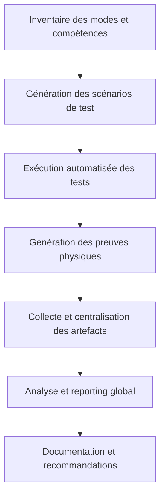

Merci pour ce feedback très clair et ambitieux. Voici une proposition de plan d’automatisation SOTA (state-of-the-art) pour tester, prouver et tracer systématiquement les capacités réelles de chaque mode Roo-Code et de chaque compétence (browse, mcp, etc.), avec génération de preuves physiques pour chaque exécution.

---

## Plan d’automatisation SOTA : Validation croisée des modes et compétences Roo-Code

### 1. Objectif

- Automatiser l’enchaînement des tests de capacités (création, modification, suppression, navigation, appel API, etc.) pour **chaque mode** répertorié dans l’inventaire Roo-Code.
- Générer systématiquement une **preuve physique** (fichier, log, artefact) pour chaque test exécuté, horodatée et traçable.
- Mesurer et documenter la **capacité réelle** de chaque mode et compétence, y compris les limitations ou exceptions.
- Centraliser les résultats dans un rapport synthétique et des logs exploitables.

---

### 2. Étapes détaillées (todo list)

1. **Inventaire dynamique des modes et compétences**
   - Extraire la liste des modes Roo-Code depuis la documentation centrale (rules.md, workflows-matrix.md, etc.).
   - Pour chaque mode, inventorier les compétences/outils associés (write_file, browser_action, API, CLI, etc.).

2. **Définition des scénarios de test SOTA**
   - Pour chaque mode, définir un scénario de test minimal et actionnable pour chaque compétence :
     - Fichier : création, modification, suppression
     - Navigation web (browse) : récupération d’une page, génération d’un log
     - Appel API/CLI : exécution d’une commande simple, génération d’un log
     - Extension/plugin : activation/désactivation, preuve de fonctionnement
   - Préciser les cas limites et les exceptions attendues (ex : mode ask ne peut pas écrire de fichier).

3. **Automatisation de l’exécution des tests**
   - Générer un script ou une matrice de tâches qui lance chaque test dans le mode et la compétence correspondants.
   - Pour chaque test, générer une **preuve physique** :
     - Fichier de log ou artefact Markdown dans un dossier dédié (.roo/tests/proofs/[mode]/[compétence]-[timestamp].md)
     - Contenu : résultat, horodatage, contexte, éventuelle erreur ou limitation détectée

4. **Collecte et centralisation des preuves**
   - Rassembler tous les artefacts générés dans une structure standardisée.
   - Générer un rapport synthétique (Markdown ou JSON) listant :
     - Les modes testés
     - Les compétences testées
     - Le résultat (succès, échec, limitation)
     - Le chemin de la preuve physique associée

5. **Analyse et reporting SOTA**
   - Générer un rapport global de couverture des capacités Roo-Code (tableau, heatmap, etc.).
   - Identifier automatiquement les modes ou compétences non fonctionnelles ou partiellement supportées.
   - Proposer des recommandations d’amélioration ou de documentation.

6. **Documentation et traçabilité**
   - Documenter la procédure d’automatisation dans la doc centrale (README, rules-maintenance.md, etc.).
   - Ajouter un workflow Mermaid pour visualiser l’enchaînement des tests et la collecte des preuves.

---

### 3. Diagramme Mermaid (workflow SOTA)

---

### 4. Questions de clarification

- Souhaitez-vous que l’automatisation soit pilotée par un script unique (ex : PowerShell, Node.js, Go) ou par des tâches orchestrées via Roo-Code lui-même ?
- Faut-il prévoir une intégration CI/CD pour relancer ces tests à chaque évolution du code ou de la configuration des modes ?
- Y a-t-il des modes ou compétences à exclure explicitement (ex : modes expérimentaux, accès restreint) ?
- Format préféré pour les rapports de synthèse : Markdown, JSON, CSV, autre ?

---

### 5. Prochaine étape

Merci de valider ou d’ajuster ce plan.  
Dès validation, je pourrai détailler la todo list exécutable et proposer la structure des scripts/tests à générer.

Souhaitez-vous ajouter ou modifier des points avant de passer à la todo list actionnable ?