# Spécifications Détaillées des Nouveaux Managers Multi-Cluster

## 📋 Vue d'ensemble

Ce document fournit les spécifications techniques complètes des 4 nouveaux managers Roo-Code pour l'architecture multi-cluster Qdrant "Library of Libraries". Chaque manager est entièrement conforme aux standards Roo et s'intègre parfaitement avec les 210 interfaces existantes.

## 🏗️ Architecture générale

### Hiérarchie des managers

```mermaid
graph TD
    A[DomainDiscoveryManager] --> B[ClusterSpecializationManager]
    B --> C[DomainLibraryOrchestrator]
    C --> D[AdaptiveRebalancingEngine]
    
    A --> |Découverte| E[Domaines détectés]
    B --> |Spécialisation| F[Clusters optimisés]
    C --> |Orchestration| G[Requêtes cross-cluster]
    D --> |Rebalancing| H[Équilibrage adaptatif]
    
    subgraph "Managers Existants"
        I[QdrantManager]
        J[VectorOperationsManager]
        K[MonitoringManager]
        L[ErrorManager]
    end
    
    A -.-> I
    B -.-> J
    C -.-> K
    D -.-> L
```



## 1. DomainDiscoveryManager

### 🎯 Objectif
Analyser automatiquement les vecteurs entrants pour identifier les domaines sémantiques et établir une cartographie intelligente pour la spécialisation des clusters.

### 📖 Interface complète

```go
package managers

import (
    "context"
    "time"
    
    "github.com/roo-code/core/interfaces"
)

// DomainDiscoveryManager - Découverte automatique de domaines sémantiques
type DomainDiscoveryManager interface {
    // ManagerInterface standard Roo-Code
    interfaces.ManagerInterface
    
    // === Méthodes principales ===
    
    // AnalyzeDomains analyse un batch de vecteurs pour identifier les domaines
    AnalyzeDomains(ctx context.Context, vectors []Vector) (*DomainMap, error)
    
    // DiscoverPatterns découvre des patterns sur une période donnée
    DiscoverPatterns(ctx context.Context, timeRange time.Duration) (*DomainPatterns, error)
    
    // ValidateDomainMapping valide un mapping de domaine proposé
    ValidateDomainMapping(ctx context.Context, mapping *DomainMapping) (*ValidationReport, error)
    
    // GetDomainStatistics retourne les statistiques des domaines
    GetDomainStatistics(ctx context.Context) (*DomainStats, error)
    
    // UpdateDomainThresholds met à jour les seuils de détection
    UpdateDomainThresholds(ctx context.Context, thresholds *DomainThresholds) error
    
    // === Méthodes de configuration ===
    
    // SetAnalysisStrategy définit la stratégie d'analyse
    SetAnalysisStrategy(strategy AnalysisStrategy) error
    
    // GetSupportedStrategies retourne les stratégies supportées
    GetSupportedStrategies() []AnalysisStrategyInfo
    
    // === Méthodes de monitoring ===
    
    // GetAnalysisHistory retourne l'historique d'analyse
    GetAnalysisHistory(ctx context.Context, limit int) ([]*AnalysisResult, error)
    
    // GetPerformanceMetrics retourne les métriques de performance
    GetPerformanceMetrics() *PerformanceMetrics
}

// === Types de données ===

type Vector struct {
    ID          string                 `json:"id"`
    Data        []float32             `json:"data"`
    Metadata    map[string]interface{} `json:"metadata"`
    Timestamp   time.Time             `json:"timestamp"`
}

type DomainMap struct {
    Domains          map[string]*Domain    `json:"domains"`
    ClusterMappings  map[string]string     `json:"cluster_mappings"`
    Confidence       float64               `json:"confidence"`
    CreatedAt        time.Time             `json:"created_at"`
    Version          string                `json:"version"`
}

type Domain struct {
    ID              string            `json:"id"`
    Name            string            `json:"name"`
    Description     string            `json:"description"`
    Centroid        []float32         `json:"centroid"`
    VectorCount     int               `json:"vector_count"`
    Similarity      float64           `json:"similarity"`
    Keywords        []string          `json:"keywords"`
    Metadata        map[string]interface{} `json:"metadata"`
    CreatedAt       time.Time         `json:"created_at"`
    UpdatedAt       time.Time         `json:"updated_at"`
}

type DomainPatterns struct {
    TemporalPatterns    []*TemporalPattern    `json:"temporal_patterns"`
    SemanticPatterns    []*SemanticPattern    `json:"semantic_patterns"`
    UsagePatterns       []*UsagePattern       `json:"usage_patterns"`
    AnalyzedPeriod      time.Duration         `json:"analyzed_period"`
    PatternConfidence   float64               `json:"pattern_confidence"`
}

type AnalysisStrategy string

const (
    StrategyKMeans          AnalysisStrategy = "kmeans"
    StrategyDBSCAN          AnalysisStrategy = "dbscan"
    StrategyHierarchical    AnalysisStrategy = "hierarchical"
    StrategySemanticFlow    AnalysisStrategy = "semantic_flow"
    StrategyHybrid          AnalysisStrategy = "hybrid"
)

type ValidationReport struct {
    IsValid         bool                    `json:"is_valid"`
    ValidationScore float64                 `json:"validation_score"`
    Issues          []*ValidationIssue     `json:"issues"`
    Recommendations []*Recommendation       `json:"recommendations"`
    Timestamp       time.Time               `json:"timestamp"`
}
```

### 🔧 Implémentation détaillée

```go
package managers

import (
    "context"
    "fmt"
    "sync"
    "time"
    
    "github.com/roo-code/core/interfaces"
)

// DomainDiscoveryManagerImpl implémentation du DomainDiscoveryManager
type DomainDiscoveryManagerImpl struct {
    // Managers Roo injectés
    errorManager     interfaces.ErrorManager
    monitoringManager interfaces.MonitoringManager
    storageManager   interfaces.StorageManager
    qdrantManager    interfaces.QdrantManager
    vectorOpsManager interfaces.VectorOperationsManager
    
    // Configuration
    config           *DomainDiscoveryConfig
    strategy         AnalysisStrategy
    thresholds       *DomainThresholds
    
    // État interne
    domains          map[string]*Domain
    patterns         *DomainPatterns
    history          []*AnalysisResult
    metrics          *PerformanceMetrics
    
    // Synchronisation
    mu               sync.RWMutex
    
    // État du manager
    id               string
    name             string
    version          string
    status           interfaces.ManagerStatus
    healthy          bool
    startTime        time.Time
}

// NewDomainDiscoveryManager crée une nouvelle instance
func NewDomainDiscoveryManager(
    errorManager interfaces.ErrorManager,
    monitoringManager interfaces.MonitoringManager,
    storageManager interfaces.StorageManager,
    qdrantManager interfaces.QdrantManager,
    vectorOpsManager interfaces.VectorOperationsManager,
) *DomainDiscoveryManagerImpl {
    return &DomainDiscoveryManagerImpl{
        errorManager:     errorManager,
        monitoringManager: monitoringManager,
        storageManager:   storageManager,
        qdrantManager:    qdrantManager,
        vectorOpsManager: vectorOpsManager,
        
        id:              "domain-discovery-manager",
        name:            "Domain Discovery Manager",
        version:         "1.0.0",
        status:          interfaces.ManagerStatusStopped,
        
        domains:         make(map[string]*Domain),
        history:         make([]*AnalysisResult, 0),
        metrics:         &PerformanceMetrics{},
        strategy:        StrategyHybrid,
        thresholds:      getDefaultThresholds(),
    }
}

// === Implémentation ManagerInterface ===

func (m *DomainDiscoveryManagerImpl) Initialize(ctx context.Context) error {
    m.mu.Lock()
    defer m.mu.Unlock()
    
    if m.status != interfaces.ManagerStatusStopped {
        return fmt.Errorf("manager already initialized")
    }
    
    // Chargement de la configuration
    if err := m.loadConfiguration(ctx); err != nil {
        return m.errorManager.ProcessError(ctx, err, "DomainDiscoveryManager", "Initialize", nil)
    }
    
    // Chargement des domaines existants
    if err := m.loadExistingDomains(ctx); err != nil {
        return m.errorManager.ProcessError(ctx, err, "DomainDiscoveryManager", "Initialize", nil)
    }
    
    m.status = interfaces.ManagerStatusRunning
    m.healthy = true
    m.startTime = time.Now()
    
    // Démarrage du monitoring
    m.monitoringManager.StartOperationMonitoring(ctx, "domain-discovery-lifecycle")
    
    return nil
}

func (m *DomainDiscoveryManagerImpl) Shutdown(ctx context.Context) error {
    m.mu.Lock()
    defer m.mu.Unlock()
    
    if m.status == interfaces.ManagerStatusStopped {
        return nil
    }
    
    // Sauvegarde de l'état
    if err := m.saveState(ctx); err != nil {
        m.errorManager.ProcessError(ctx, err, "DomainDiscoveryManager", "Shutdown", nil)
    }
    
    m.status = interfaces.ManagerStatusStopped
    m.healthy = false
    
    return nil
}

func (m *DomainDiscoveryManagerImpl) GetID() string     { return m.id }
func (m *DomainDiscoveryManagerImpl) GetName() string   { return m.name }
func (m *DomainDiscoveryManagerImpl) GetVersion() string { return m.version }
func (m *DomainDiscoveryManagerImpl) GetStatus() interfaces.ManagerStatus { return m.status }

func (m *DomainDiscoveryManagerImpl) IsHealthy(ctx context.Context) bool {
    m.mu.RLock()
    defer m.mu.RUnlock()
    return m.healthy
}

func (m *DomainDiscoveryManagerImpl) GetMetrics() map[string]interface{} {
    m.mu.RLock()
    defer m.mu.RUnlock()
    
    return map[string]interface{}{
        "domains_count":       len(m.domains),
        "analysis_count":      len(m.history),
        "uptime_seconds":      time.Since(m.startTime).Seconds(),
        "performance_metrics": m.metrics,
        "strategy":           string(m.strategy),
    }
}

// === Implémentation méthodes principales ===

func (m *DomainDiscoveryManagerImpl) AnalyzeDomains(ctx context.Context, vectors []Vector) (*DomainMap, error) {
    if !m.IsHealthy(ctx) {
        return nil, fmt.Errorf("manager not healthy")
    }
    
    startTime := time.Now()
    defer func() {
        m.metrics.AnalysisLatency = time.Since(startTime)
        m.metrics.AnalysisCount++
    }()
    
    // Validation des entrées
    if len(vectors) == 0 {
        return nil, fmt.Errorf("no vectors provided for analysis")
    }
    
    // Analyse selon la stratégie choisie
    domains, err := m.performDomainAnalysis(ctx, vectors)
    if err != nil {
        return nil, m.errorManager.ProcessError(ctx, err, "DomainDiscoveryManager", "AnalyzeDomains", nil)
    }
    
    // Création de la carte des domaines
    domainMap := &DomainMap{
        Domains:         domains,
        ClusterMappings: m.generateClusterMappings(domains),
        Confidence:      m.calculateConfidence(domains),
        CreatedAt:       time.Now(),
        Version:         m.version,
    }
    
    // Sauvegarde du résultat
    if err := m.saveDomainMap(ctx, domainMap); err != nil {
        m.errorManager.ProcessError(ctx, err, "DomainDiscoveryManager", "AnalyzeDomains", nil)
    }
    
    // Mise à jour de l'historique
    m.updateHistory(&AnalysisResult{
        DomainMap:    domainMap,
        VectorCount:  len(vectors),
        Strategy:     m.strategy,
        Duration:     time.Since(startTime),
        Timestamp:    time.Now(),
    })
    
    return domainMap, nil
}

func (m *DomainDiscoveryManagerImpl) DiscoverPatterns(ctx context.Context, timeRange time.Duration) (*DomainPatterns, error) {
    // Récupération des données historiques
    historicalData, err := m.getHistoricalData(ctx, timeRange)
    if err != nil {
        return nil, m.errorManager.ProcessError(ctx, err, "DomainDiscoveryManager", "DiscoverPatterns", nil)
    }
    
    // Analyse des patterns temporels
    temporalPatterns := m.analyzeTemporalPatterns(historicalData)
    
    // Analyse des patterns sémantiques
    semanticPatterns := m.analyzeSemanticPatterns(historicalData)
    
    // Analyse des patterns d'usage
    usagePatterns := m.analyzeUsagePatterns(historicalData)
    
    patterns := &DomainPatterns{
        TemporalPatterns:  temporalPatterns,
        SemanticPatterns:  semanticPatterns,
        UsagePatterns:     usagePatterns,
        AnalyzedPeriod:    timeRange,
        PatternConfidence: m.calculatePatternConfidence(temporalPatterns, semanticPatterns, usagePatterns),
    }
    
    m.mu.Lock()
    m.patterns = patterns
    m.mu.Unlock()
    
    return patterns, nil
}

// === Méthodes privées ===

func (m *DomainDiscoveryManagerImpl) performDomainAnalysis(ctx context.Context, vectors []Vector) (map[string]*Domain, error) {
    switch m.strategy {
    case StrategyKMeans:
        return m.performKMeansAnalysis(ctx, vectors)
    case StrategyDBSCAN:
        return m.performDBSCANAnalysis(ctx, vectors)
    case StrategyHierarchical:
        return m.performHierarchicalAnalysis(ctx, vectors)
    case StrategySemanticFlow:
        return m.performSemanticFlowAnalysis(ctx, vectors)
    case StrategyHybrid:
        return m.performHybridAnalysis(ctx, vectors)
    default:
        return nil, fmt.Errorf("unsupported analysis strategy: %s", m.strategy)
    }
}

func (m *DomainDiscoveryManagerImpl) performHybridAnalysis(ctx context.Context, vectors []Vector) (map[string]*Domain, error) {
    // Combinaison de plusieurs stratégies pour une analyse robuste
    
    // 1. Pré-clustering avec K-means pour identifier les zones denses
    kmeansResults, err := m.performKMeansAnalysis(ctx, vectors)
    if err != nil {
        return nil, fmt.Errorf("kmeans pre-clustering failed: %w", err)
    }
    
    // 2. Raffinement avec DBSCAN pour éliminer les outliers
    dbscanResults, err := m.performDBSCANAnalysis(ctx, vectors)
    if err != nil {
        return nil, fmt.Errorf("dbscan refinement failed: %w", err)
    }
    
    // 3. Validation sémantique
    finalDomains := m.mergeDomainResults(kmeansResults, dbscanResults)
    
    // 4. Ajout de métadonnées sémantiques
    for _, domain := range finalDomains {
        if err := m.enrichDomainMetadata(ctx, domain, vectors); err != nil {
            m.errorManager.ProcessError(ctx, err, "DomainDiscoveryManager", "enrichDomainMetadata", nil)
        }
    }
    
    return finalDomains, nil
}

func (m *DomainDiscoveryManagerImpl) generateClusterMappings(domains map[string]*Domain) map[string]string {
    mappings := make(map[string]string)
    
    // Algorithme d'affectation basé sur la charge et la spécialisation
    clusters := m.getAvailableClusters()
    
    for domainID, domain := range domains {
        bestCluster := m.findBestClusterForDomain(domain, clusters)
        mappings[domainID] = bestCluster
    }
    
    return mappings
}
```

## 2. ClusterSpecializationManager

### 🎯 Objectif
Optimiser et spécialiser les clusters Qdrant en fonction des domaines découverts, gérant la configuration, l'indexation et les performances de chaque cluster spécialisé.

### 📖 Interface complète

```go
// ClusterSpecializationManager - Spécialisation des clusters par domaine
type ClusterSpecializationManager interface {
    // ManagerInterface standard Roo-Code
    interfaces.ManagerInterface
    
    // === Méthodes principales ===
    
    // SpecializeCluster spécialise un cluster pour un domaine donné
    SpecializeCluster(ctx context.Context, clusterID, domain string) error
    
    // OptimizeClusterConfig optimise la configuration d'un cluster
    OptimizeClusterConfig(ctx context.Context, clusterID string) (*OptimizationResult, error)
    
    // GetSpecializationStatus retourne le statut de spécialisation
    GetSpecializationStatus(ctx context.Context, clusterID string) (*SpecializationStatus, error)
    
    // MigrateToSpecialization migre des données vers un cluster spécialisé
    MigrateToSpecialization(ctx context.Context, migration *SpecializationMigration) error
    
    // ValidateSpecialization valide une spécialisation
    ValidateSpecialization(ctx context.Context, clusterID string) (*ValidationResult, error)
    
    // === Méthodes de configuration ===
    
    // SetOptimizationStrategy définit la stratégie d'optimisation
    SetOptimizationStrategy(strategy OptimizationStrategy) error
    
    // UpdateClusterConfiguration met à jour la configuration d'un cluster
    UpdateClusterConfiguration(ctx context.Context, clusterID string, config *ClusterConfig) error
    
    // === Méthodes de monitoring ===
    
    // GetClusterPerformanceMetrics retourne les métriques de performance
    GetClusterPerformanceMetrics(ctx context.Context, clusterID string) (*ClusterMetrics, error)
    
    // GetSpecializationHistory retourne l'historique de spécialisations
    GetSpecializationHistory(ctx context.Context) ([]*SpecializationEvent, error)
}

// === Types de données ===

type SpecializationStatus struct {
    ClusterID           string                 `json:"cluster_id"`
    Domain              string                 `json:"domain"`
    Status              SpecializationState    `json:"status"`
    Progress            float64                `json:"progress"`
    OptimizationLevel   OptimizationLevel      `json:"optimization_level"`
    PerformanceGains    *PerformanceGains      `json:"performance_gains"`
    Configuration       *ClusterConfig         `json:"configuration"`
    LastOptimized       time.Time              `json:"last_optimized"`
    NextOptimization    time.Time              `json:"next_optimization"`
}

type OptimizationStrategy string

const (
    OptimizationStrategyLatency     OptimizationStrategy = "latency"
    OptimizationStrategyThroughput  OptimizationStrategy = "throughput"
    OptimizationStrategyAccuracy    OptimizationStrategy = "accuracy"
    OptimizationStrategyBalanced    OptimizationStrategy = "balanced"
    OptimizationStrategyCustom      OptimizationStrategy = "custom"
)

type ClusterConfig struct {
    IndexType           string                 `json:"index_type"`
    IndexParameters     map[string]interface{} `json:"index_parameters"`
    VectorSize          int                    `json:"vector_size"`
    DistanceMetric      string                 `json:"distance_metric"`
    MemoryMapping       bool                   `json:"memory_mapping"`
    ReplicationFactor   int                    `json:"replication_factor"`
    ShardNumber         int                    `json:"shard_number"`
    OptimizationParams  *OptimizationParams    `json:"optimization_params"`
}

type SpecializationMigration struct {
    SourceCluster       string            `json:"source_cluster"`
    TargetCluster       string            `json:"target_cluster"`
    VectorFilter        *VectorFilter     `json:"vector_filter"`
    BatchSize           int               `json:"batch_size"`
    ParallelWorkers     int               `json:"parallel_workers"`
    VerifyMigration     bool              `json:"verify_migration"`
    CleanupSource       bool              `json:"cleanup_source"`
}
```

### 🔧 Implémentation détaillée

```go
// ClusterSpecializationManagerImpl implémentation
type ClusterSpecializationManagerImpl struct {
    // Managers Roo injectés
    errorManager      interfaces.ErrorManager
    migrationManager  interfaces.MigrationManager
    monitoringManager interfaces.MonitoringManager
    securityManager   interfaces.SecurityManager
    processManager    interfaces.ProcessManager
    
    // État des clusters
    clusters          map[string]*SpecializationStatus
    optimizationQueue chan *OptimizationRequest
    
    // Configuration
    strategy          OptimizationStrategy
    
    // Synchronisation
    mu                sync.RWMutex
    
    // État du manager
    id                string
    name              string
    version           string
    status            interfaces.ManagerStatus
    healthy           bool
}

func (m *ClusterSpecializationManagerImpl) SpecializeCluster(ctx context.Context, clusterID, domain string) error {
    m.mu.Lock()
    defer m.mu.Unlock()
    
    // Validation des paramètres
    if clusterID == "" || domain == "" {
        return fmt.Errorf("cluster ID and domain are required")
    }
    
    // Vérification de l'état du cluster
    if status, exists := m.clusters[clusterID]; exists && status.Status == SpecializationStateInProgress {
        return fmt.Errorf("cluster %s is already being specialized", clusterID)
    }
    
    // Création du statut de spécialisation
    status := &SpecializationStatus{
        ClusterID:         clusterID,
        Domain:            domain,
        Status:            SpecializationStateInProgress,
        Progress:          0.0,
        OptimizationLevel: OptimizationLevelNone,
        LastOptimized:     time.Now(),
    }
    
    m.clusters[clusterID] = status
    
    // Démarrage de la spécialisation en arrière-plan
    go m.performSpecialization(ctx, clusterID, domain)
    
    return nil
}

func (m *ClusterSpecializationManagerImpl) performSpecialization(ctx context.Context, clusterID, domain string) {
    defer func() {
        if r := recover(); r != nil {
            m.errorManager.ProcessError(ctx, fmt.Errorf("specialization panic: %v", r), "ClusterSpecializationManager", "performSpecialization", nil)
        }
    }()
    
    // Phase 1: Analyse du domaine
    if err := m.analyzeDomainRequirements(ctx, clusterID, domain); err != nil {
        m.markSpecializationFailed(clusterID, err)
        return
    }
    m.updateProgress(clusterID, 25.0)
    
    // Phase 2: Configuration optimisée
    if err := m.configureClusterForDomain(ctx, clusterID, domain); err != nil {
        m.markSpecializationFailed(clusterID, err)
        return
    }
    m.updateProgress(clusterID, 50.0)
    
    // Phase 3: Migration des données
    if err := m.migrateRelevantData(ctx, clusterID, domain); err != nil {
        m.markSpecializationFailed(clusterID, err)
        return
    }
    m.updateProgress(clusterID, 75.0)
    
    // Phase 4: Optimisation finale
    if err := m.finalizeOptimization(ctx, clusterID); err != nil {
        m.markSpecializationFailed(clusterID, err)
        return
    }
    m.updateProgress(clusterID, 100.0)
    
    // Marquer comme complété
    m.markSpecializationCompleted(clusterID)
}
```

## 3. DomainLibraryOrchestrator

### 🎯 Objectif
Orchestrer les requêtes cross-cluster, fusionner les résultats de recherche et implémenter le routage intelligent pour l'architecture "Library of Libraries".

### 📖 Interface complète

```go
// DomainLibraryOrchestrator - Orchestration cross-cluster
type DomainLibraryOrchestrator interface {
    // ManagerInterface standard Roo-Code
    interfaces.ManagerInterface
    
    // === Méthodes principales ===
    
    // ExecuteCrossClusterQuery exécute une requête sur plusieurs clusters
    ExecuteCrossClusterQuery(ctx context.Context, request *CrossClusterRequest) (*CrossClusterResponse, error)
    
    // OrchestrateDomainSearch orchestre une recherche par domaine
    OrchestrateDomainSearch(ctx context.Context, query *DomainQuery) (*DomainSearchResult, error)
    
    // FuseResults fusionne les résultats de plusieurs clusters
    FuseResults(ctx context.Context, results []*ClusterResult) (*FusedResult, error)
    
    // RouteQuery route une requête vers le meilleur cluster
    RouteQuery(ctx context.Context, query *Query) (*RoutingDecision, error)
    
    // GetLibraryStatus retourne le statut de la librairie globale
    GetLibraryStatus(ctx context.Context) (*LibraryStatus, error)
    
    // === Méthodes de configuration ===
    
    // SetRoutingStrategy définit la stratégie de routage
    SetRoutingStrategy(strategy RoutingStrategy) error
    
    // SetFusionAlgorithm définit l'algorithme de fusion
    SetFusionAlgorithm(algorithm FusionAlgorithm) error
    
    // === Méthodes avancées ===
    
    // PredictOptimalClusters prédit les meilleurs clusters pour une requête
    PredictOptimalClusters(ctx context.Context, query *Query) ([]*ClusterPrediction, error)
    
    // GetCrossClusterMetrics retourne les métriques cross-cluster
    GetCrossClusterMetrics(ctx context.Context) (*CrossClusterMetrics, error)
}

// === Types de données ===

type CrossClusterRequest struct {
    Query           *Query               `json:"query"`
    TargetClusters  []string            `json:"target_clusters"`
    MaxResults      int                 `json:"max_results"`
    Timeout         time.Duration       `json:"timeout"`
    FusionStrategy  FusionStrategy      `json:"fusion_strategy"`
    Preferences     *SearchPreferences  `json:"preferences"`
}

type DomainQuery struct {
    Vector          []float32           `json:"vector"`
    Domains         []string            `json:"domains"`
    Query           string              `json:"query"`
    Filters         map[string]interface{} `json:"filters"`
    Limit           int                 `json:"limit"`
    IncludeMetadata bool                `json:"include_metadata"`
}

type RoutingStrategy string

const (
    RoutingStrategyDomainAffinity    RoutingStrategy = "domain_affinity"
    RoutingStrategyLoadBalancing     RoutingStrategy = "load_balancing"
    RoutingStrategyLatencyOptimized  RoutingStrategy = "latency_optimized"
    RoutingStrategyAccuracyFirst     RoutingStrategy = "accuracy_first"
    RoutingStrategyHybrid           RoutingStrategy = "hybrid"
)

type FusionAlgorithm string

const (
    FusionAlgorithmWeightedScore    FusionAlgorithm = "weighted_score"
    FusionAlgorithmRankedFusion     FusionAlgorithm = "ranked_fusion"
    FusionAlgorithmSemanticMerge    FusionAlgorithm = "semantic_merge"
    FusionAlgorithmMLBased          FusionAlgorithm = "ml_based"
)
```

## 4. AdaptiveRebalancingEngine

### 🎯 Objectif
Surveiller les performances des clusters et déclencher automatiquement des rééquilibrages adaptatifs pour maintenir des performances optimales.

### 📖 Interface complète

```go
// AdaptiveRebalancingEngine - Rebalancing adaptatif
type AdaptiveRebalancingEngine interface {
    // ManagerInterface standard Roo-Code
    interfaces.ManagerInterface
    
    // === Méthodes principales ===
    
    // AnalyzeLoadDistribution analyse la distribution de charge
    AnalyzeLoadDistribution(ctx context.Context) (*LoadAnalysis, error)
    
    // TriggerRebalancing déclenche un rebalancing avec une stratégie
    TriggerRebalancing(ctx context.Context, strategy *RebalancingStrategy) (*RebalancingResult, error)
    
    // PredictRebalancingNeeds prédit les besoins de rebalancing
    PredictRebalancingNeeds(ctx context.Context, timeHorizon time.Duration) (*RebalancingPrediction, error)
    
    // ExecuteAdaptiveMigration exécute une migration adaptative
    ExecuteAdaptiveMigration(ctx context.Context, migration *AdaptiveMigration) error
    
    // GetRebalancingHistory retourne l'historique des rebalancements
    GetRebalancingHistory(ctx context.Context) (*RebalancingHistory, error)
    
    // === Méthodes de configuration ===
    
    // SetRebalancingThresholds définit les seuils de déclenchement
    SetRebalancingThresholds(thresholds *RebalancingThresholds) error
    
    // EnableAutoRebalancing active/désactive le rebalancing automatique
    EnableAutoRebalancing(enabled bool) error
    
    // === Méthodes de monitoring ===
    
    // GetRebalancingMetrics retourne les métriques de rebalancing
    GetRebalancingMetrics(ctx context.Context) (*RebalancingMetrics, error)
    
    // GetPredictionAccuracy retourne la précision des prédictions
    GetPredictionAccuracy(ctx context.Context) (*PredictionAccuracy, error)
}

// === Types de données ===

type LoadAnalysis struct {
    ClusterLoads      map[string]*ClusterLoad  `json:"cluster_loads"`
    GlobalMetrics     *GlobalLoadMetrics       `json:"global_metrics"`
    Imbalances        []*LoadImbalance         `json:"imbalances"`
    Recommendations   []*RebalancingRecommendation `json:"recommendations"`
    AnalysisTimestamp time.Time                `json:"analysis_timestamp"`
}

type RebalancingStrategy struct {
    Type            RebalancingType     `json:"type"`
    Priority        RebalancingPriority `json:"priority"`
    Constraints     *RebalancingConstraints `json:"constraints"`
    TargetMetrics   *TargetMetrics      `json:"target_metrics"`
    Timeline        time.Duration       `json:"timeline"`
}

type RebalancingType string

const (
    RebalancingTypeLoadBased        RebalancingType = "load_based"
    RebalancingTypeLatencyBased     RebalancingType = "latency_based"
    RebalancingTypeCapacityBased    RebalancingType = "capacity_based"
    RebalancingTypeDomainBased      RebalancingType = "domain_based"
    RebalancingTypeHybrid          RebalancingType = "hybrid"
)
```

## 🔧 Configuration et intégration

### Configuration globale des managers

```yaml
# config/multi-cluster-managers.yaml
multi_cluster_managers:
  domain_discovery:
    enabled: true
    strategy: "hybrid"
    analysis_interval: "5m"
    batch_size: 1000
    confidence_threshold: 0.8
    storage:
      persist_domains: true
      cache_ttl: "1h"
    
  cluster_specialization:
    enabled: true
    optimization_strategy: "balanced"
    auto_optimize: true
    optimization_interval: "24h"
    migration:
      batch_size: 1000
      parallel_workers: 4
      verify_migration: true
    
  domain_library_orchestrator:
    enabled: true
    routing_strategy: "hybrid"
    fusion_algorithm: "semantic_merge"
    timeout: "30s"
    caching:
      enable_result_cache: true
      cache_ttl: "10m"
    
  adaptive_rebalancing:
    enabled: true
    auto_trigger: true
    analysis_interval: "15m"
    thresholds:
      load_imbalance: 0.3
      latency_degradation: "100ms"
      accuracy_drop: 0.1
    prediction:
      enable_ml_predictions: true
      model_update_interval: "7d"
```

### Intégration avec les managers existants

```go
// Container d'intégration
type MultiClusterContainer struct {
    // Managers existants
    QdrantManager            interfaces.QdrantManager
    VectorOperationsManager  interfaces.VectorOperationsManager
    ErrorManager             interfaces.ErrorManager
    MonitoringManager        interfaces.MonitoringManager
    
    // Nouveaux managers
    DomainDiscovery          DomainDiscoveryManager
    ClusterSpecialization    ClusterSpecializationManager
    DomainLibraryOrchestrator DomainLibraryOrchestrator
    AdaptiveRebalancing      AdaptiveRebalancingEngine
}

// Initialisation intégrée
func (c *MultiClusterContainer) Initialize(ctx context.Context) error {
    // 1. Initialisation des managers existants
    managers := []interfaces.ManagerInterface{
        c.ErrorManager,
        c.MonitoringManager,
        c.QdrantManager,
        c.VectorOperationsManager,
    }
    
    for _, manager := range managers {
        if err := manager.Initialize(ctx); err != nil {
            return fmt.Errorf("failed to initialize existing manager: %w", err)
        }
    }
    
    // 2. Initialisation des nouveaux managers (avec dépendances)
    newManagers := []interfaces.ManagerInterface{
        c.DomainDiscovery,
        c.ClusterSpecialization,
        c.DomainLibraryOrchestrator,
        c.AdaptiveRebalancing,
    }
    
    for _, manager := range newManagers {
        if err := manager.Initialize(ctx); err != nil {
            return fmt.Errorf("failed to initialize new manager: %w", err)
        }
    }
    
    return nil
}
```

## 📊 Métriques et monitoring

### Métriques de performance

```go
// Métriques spécialisées pour chaque manager
type MultiClusterMetrics struct {
    DomainDiscovery    *DomainDiscoveryMetrics    `json:"domain_discovery"`
    Specialization     *SpecializationMetrics     `json:"specialization"`
    Orchestration      *OrchestrationMetrics      `json:"orchestration"`
    Rebalancing        *RebalancingMetrics        `json:"rebalancing"`
    Global             *GlobalMetrics             `json:"global"`
}

type DomainDiscoveryMetrics struct {
    DomainsDiscovered     int           `json:"domains_discovered"`
    AnalysisLatency       time.Duration `json:"analysis_latency"`
    AnalysisAccuracy      float64       `json:"analysis_accuracy"`
    VectorsProcessed      int64         `json:"vectors_processed"`
    PatternsDetected      int           `json:"patterns_detected"`
}

type SpecializationMetrics struct {
    SpecializedClusters   int           `json:"specialized_clusters"`
    OptimizationGains     float64       `json:"optimization_gains"`
    MigrationLatency      time.Duration `json:"migration_latency"`
    ConfigurationChanges  int           `json:"configuration_changes"`
    PerformanceImprovements float64     `json:"performance_improvements"`
}

type OrchestrationMetrics struct {
    CrossClusterQueries   int64         `json:"cross_cluster_queries"`
    AverageLatency        time.Duration `json:"average_latency"`
    FusionAccuracy        float64       `json:"fusion_accuracy"`
    RoutingEfficiency     float64       `json:"routing_efficiency"`
    CacheHitRate          float64       `json:"cache_hit_rate"`
}
```

---

**Conclusion** : Ces 4 nouveaux managers forment un écosystème cohérent et entièrement intégré à l'architecture Roo-Code existante, permettant de transformer Qdrant en véritable "Library of Libraries" auto-adaptative et hautement performante.

---

*Document généré le 2025-08-05*  
*Version 1.0.0 - Spécifications techniques complètes*