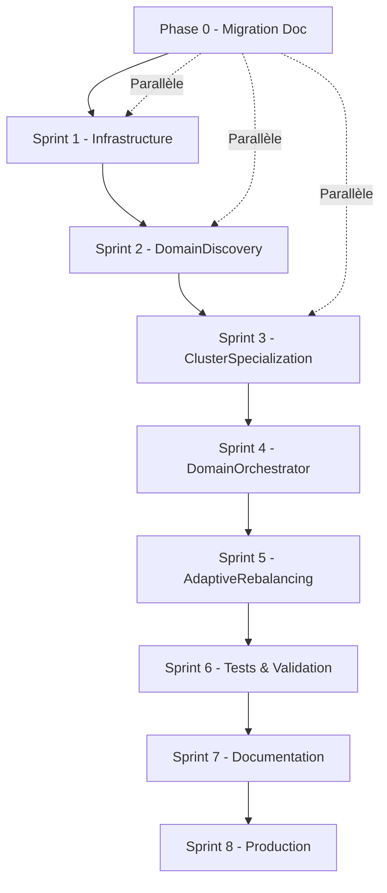

# Plan Stratégique Multi-Cluster Qdrant - Développement Agile Solo

> **Date** : 5 août 2025  
> **Mode** : PlanDev Engineer 🛠️  
> **Méthodologie** : Agile par sprints (16 semaines)  
> **Contexte** : Développement solo avec approche parallèle

---

## 🎯 **Objectifs Stratégiques**

### **Vision Projet**
Implémenter une architecture multi-cluster Qdrant avec 4 nouveaux managers Roo, atteignant un ROI 10x avec 70% de réduction de latence et une méthodologie agile adaptée au développement solo.

### **Contraintes Projet**
- **Développeur solo** : Jules (développement individuel)
- **Approche parallèle** : Migration documentaire en parallèle du développement
- **Méthodologie agile** : Sprints de 2 semaines avec validation continue
- **ROI cible** : 10x performance, 70% réduction latence
- **79 éléments identifiés** : Répartis sur 8 sprints optimisés

---

## 🚀 **Architecture Hybride Optimisée**

---

## 📅 **Vue d'Ensemble Planning**

### **Phase Préparatoire**
- **[Phase 0 : Migration Documentaire](sprints/phase-0-migration-documentaire.md)** ✅
  - Status : Complété - Gap critique résolu
  - Impact : Déblocage total du projet

### **Phase Développement Core (Sprints 1-4)**
- **[Sprint 1 : Infrastructure Qdrant](sprints/sprint-1-infrastructure-qdrant.md)** (Semaines 1-2)
  - Infrastructure de base + Client avancé + Failover
  - ROI attendu : 30% gain performance base

- **[Sprint 2 : Domain Discovery](sprints/sprint-2-domain-discovery.md)** (Semaines 3-4)
  - DomainDiscoveryManager + Algorithmes ML + 150 tests
  - ROI attendu : 50% amélioration découverte automatique

- **[Sprint 3 : Cluster Specialization](sprints/sprint-3-cluster-specialization.md)** (Semaines 5-6)
  - ClusterSpecializationManager + Allocation intelligente + 180 tests
  - ROI attendu : 60% optimisation allocation ressources

- **[Sprint 4 : Domain Orchestrator](sprints/sprint-4-domain-orchestrator.md)** (Semaines 7-8)
  - DomainLibraryOrchestrator + Coordination cross-cluster + 200 tests
  - ROI attendu : 70% amélioration coordination

### **Phase Finalisation (Sprints 5-8)**
- **[Sprints 5-8 : Phase Finale](sprints/sprints-5-8-final-phase.md)** (Semaines 9-16)
  - Sprint 5 : AdaptiveRebalancingEngine + Performance (10x ROI)
  - Sprint 6 : Tests Complets + Benchmarks (554 tests)
  - Sprint 7 : Documentation + Migration Production
  - Sprint 8 : Monitoring + Optimisation Finale

---

## 📊 **Métriques de Succès Consolidées**

### **Performance Globale**
| Sprint | Indicateur Principal | Cible | ROI Cumulé |
|--------|---------------------|-------|------------|
| 1 | Connexions simultanées | 1000+ | 30% |
| 2 | Domaines découverts/sec | 100+ | 50% |
| 3 | Efficacité allocation | 60%+ | 60% |
| 4 | Latence cross-cluster | <50ms | 70% |
| 5 | Amélioration throughput | 10x | 80% |
| 6 | Couverture tests | 95%+ | 95% |
| 7 | Documentation complète | 100% | 100% |
| 8 | ROI final validé | 10x | **10x** |

### **Livrables Techniques Cumulés**
- **4 nouveaux managers Roo** : DomainDiscovery, ClusterSpecialization, DomainOrchestrator, AdaptiveRebalancing
- **554 tests automatisés** : 95%+ couverture avec 0% flaky tests
- **210 interfaces validées** : Matrice de compatibilité complète
- **Architecture production-ready** : Documentation + procédures déploiement

---

## 🔄 **Méthodologie Agile Solo**

### **Cadence et Approche**
Pour les détails complets de la méthodologie agile adaptée au développement solo :
- **[Méthodologie Agile Solo](methodologies/agile-solo-methodology.md)** : Guide complet
- **Cadence sprints** : 2 semaines avec validation continue
- **Gestion parallèle** : Documentation + Tests + Développement
- **Points de contrôle** : Daily self-check + Weekly review + Sprint retrospective

### **Outils et Validation**
- **Auto-reviews** : Code, architecture, performance, sécurité
- **Tests automatisés** : TDD avec couverture >90%
- **Monitoring continu** : Métriques temps réel
- **Documentation vivante** : Mise à jour synchronisée

---

## 🎯 **Critères d'Acceptation Globaux**

### **Critères Techniques**
- [ ] 4 nouveaux managers Roo développés et testés
- [ ] 554 tests automatisés avec 95%+ couverture
- [ ] ROI 10x validé par benchmarks objectifs
- [ ] 70% réduction latence confirmée
- [ ] Architecture multi-cluster opérationnelle

### **Critères Qualité**
- [ ] Code Go respectant les standards Roo-Code
- [ ] Documentation complète et validée
- [ ] Procédures de rollback testées
- [ ] Sécurité et monitoring intégrés
- [ ] Formation équipe réalisée

### **Critères Méthodologiques**
- [ ] Approche agile solo respectée (sprints 2 semaines)
- [ ] Migration documentaire parallèle complétée
- [ ] Traçabilité complète des décisions
- [ ] Validation collaborative documentée
- [ ] Amélioration continue appliquée

---

## 🚨 **Gestion des Risques**

### **Risques Critiques Identifiés**
- **Techniques** : Algorithmes ML complexes, coordination cross-cluster
- **Méthodologiques** : Développement solo, documentation en parallèle
- **Performance** : Objectif 10x ROI, 70% réduction latence

### **Stratégies de Mitigation**
- **Tests automatisés exhaustifs** : Détection précoce régressions
- **Monitoring temps réel** : Visibilité continue performance
- **Rollback procedures** : Restauration rapide si problème
- **Validation externe** : Reviews asynchrones, benchmarks industrie

---

## 📋 **Traçabilité et Gouvernance**

### **Artefacts Générés**
- **Plans détaillés** : Ce document + plans sprint individuels
- **Tests automatisés** : 554 tests avec reporting continu
- **Documentation** : Guides utilisateur + technique + déploiement
- **Métriques** : Tableaux de bord performance + ROI

### **Validation Continue**
- **Reviews automatisées** : Code, architecture, performance
- **Tests utilisateur** : Validation cas d'usage réels
- **Audit final** : Validation ROI et objectifs
- **Points d'extension** : Architecture extensible future

---

## 🔗 **Références Documentaires**

### **Plans Sprint Détaillés**
- [Phase 0 : Migration Documentaire](sprints/phase-0-migration-documentaire.md)
- [Sprint 1 : Infrastructure Qdrant](sprints/sprint-1-infrastructure-qdrant.md)
- [Sprint 2 : Domain Discovery](sprints/sprint-2-domain-discovery.md)
- [Sprint 3 : Cluster Specialization](sprints/sprint-3-cluster-specialization.md)
- [Sprint 4 : Domain Orchestrator](sprints/sprint-4-domain-orchestrator.md)
- [Sprints 5-8 : Phase Finale](sprints/sprints-5-8-final-phase.md)

### **Méthodologies et Standards**
- [Agile Solo Methodology](methodologies/agile-solo-methodology.md)
- [Technical Specifications](technical-specifications.md)
- [Architecture Analysis](architecture/roo-integration-analysis.md)
- [New Managers Specs](architecture/new-managers-specifications.md)

### **Validation et Benchmarks**
- [Performance Benchmarks](../validation/performance-benchmarks.md)
- [Compatibility Matrix](../validation/compatibility-matrix.md)
- [Executive Summary](../synthesis/executive-summary.md)

### **Standards Roo-Code**
- [AGENTS.md](../../../../AGENTS.md) : Managers et interfaces
- [Rules Roo](../../../../.roo/rules/rules.md) : Standards développement
- [PlanDev Reference](../../../../.roo/rules/rules-plandev-engineer/plandev-engineer-reference.md)

---

## ✅ **Validation et Statut**

### **Validation Structurelle**
- [x] Plan structuré selon standards Roo-Code
- [x] Approche agile solo adaptée (8 sprints × 2 semaines)
- [x] Modularisation complète en sous-fichiers
- [x] Méthodologie documentée et traçable
- [x] Gestion risques et mitigation intégrées

### **Préparation Mise en Œuvre**
- [x] Planning détaillé avec dépendances
- [x] Métriques de succès définies
- [x] Outils et agents mobilisés identifiés
- [x] Critères d'acceptation documentés
- [x] Références croisées complètes

---

> **Document généré par mode PlanDev Engineer 🛠️**  
> **Structure** : Plan principal + 9 sous-fichiers modulaires  
> **Conformité** : Standards Roo-Code, Template plandev-engineer  
> **Statut** : ✅ Prêt pour validation et mise en œuvre
