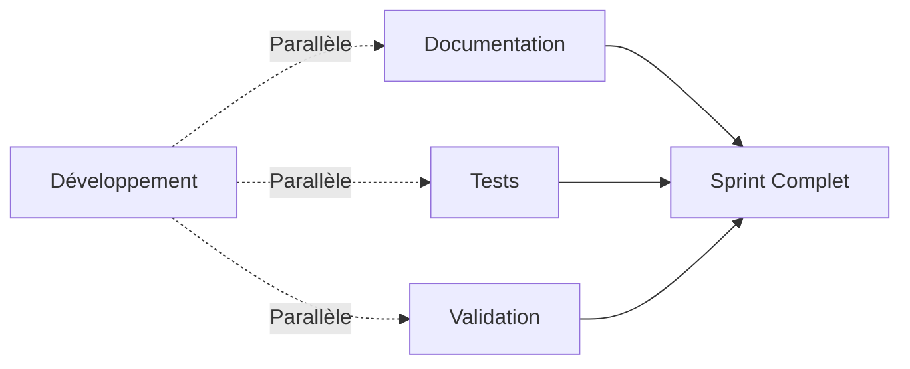

# Méthodologie Agile Solo Adaptée

> **Contexte** : Développement individuel avec approche parallèle  
> **Cadence** : Sprints de 2 semaines (14 jours)  
> **Objectif** : Optimisation pour développeur unique

---

## 🔄 **Cadence Sprint (2 semaines)**

### **Structure Type Sprint**
- **Jour 1-2** : Planification détaillée, analyse des dépendances, conception
- **Jour 3-8** : Développement intensif avec tests en parallèle
- **Jour 9-10** : Tests, validation, documentation, préparation sprint suivant

### **Répartition Temporelle Optimisée**
```
Semaine 1:
├── Lundi-Mardi: Conception et planification (20%)
├── Mercredi-Vendredi: Développement core (60%)

Semaine 2:
├── Lundi-Mercredi: Finalisation développement (15%)
├── Jeudi-Vendredi: Tests et validation (5%)
```

---

## 🎯 **Gestion Parallèle Optimisée**

### **Approches Simultanées**
- **Documentation continue** : Mise à jour en parallèle du développement
- **Tests TDD** : Écriture des tests avant/pendant le développement
- **Validation incrémentale** : Validation continue à chaque commit majeur

### **Flux de Travail Parallèle**


### **Synchronisation Points**
- **Daily sync interne** : 15 min auto-review quotidien
- **Weekly checkpoint** : Bilan hebdomadaire et ajustements
- **Sprint boundary** : Transition et préparation sprint suivant

---

## 📅 **Points de Contrôle Agiles**

### **Daily Self-Check (15 min/jour)**
```yaml
daily_routine:
  morning:
    - Review objectifs jour
    - Check dépendances bloquantes
    - Plan tâches prioritaires
  evening:
    - Bilan réalisations
    - Update documentation
    - Prep jour suivant
```

### **Weekly Sprint Review (30 min)**
- **Bilan quantitatif** : Métriques et KPIs atteints
- **Bilan qualitatif** : Qualité code et architecture
- **Ajustements** : Corrections de trajectoire
- **Planning** : Préparation semaine suivante

### **Sprint Retrospective (45 min)**
- **Ce qui a bien fonctionné** : Pratiques à conserver
- **Défis rencontrés** : Points d'amélioration
- **Leçons apprises** : Capitalisation expérience
- **Améliorations pour sprint suivant** : Actions concrètes

---

## 🛠️ **Outils et Techniques Solo**

### **Auto-Management**
- **Kanban personnel** : Board simple (Todo, Doing, Done)
- **Time-boxing** : Pomodoro adapté (45min focus + 15min break)
- **Context switching** : Limitation à 3 tâches max/jour
- **Deep work** : Blocs 2-3h sans interruption

### **Quality Gates Automatisés**
```bash
# Pre-commit hooks
- go fmt
- go vet
- go test -race
- golangci-lint

# Daily automation
- Coverage report
- Performance benchmarks
- Documentation sync
```

### **Tracking et Métriques**
- **Velocity tracking** : Points story par sprint
- **Quality metrics** : Couverture tests, complexité
- **Performance metrics** : Benchmarks, profiling
- **Documentation metrics** : Complétude, fraîcheur

---

## 🔍 **Validation Continue**

### **Auto-Reviews Techniques**
- **Code review** : Checklist standards Roo
- **Architecture review** : Cohérence design patterns
- **Performance review** : Benchmarks et profiling
- **Security review** : Scan vulnérabilités automatique

### **Validation Fonctionnelle**
- **Unit tests** : TDD avec couverture >90%
- **Integration tests** : Validation inter-composants
- **End-to-end tests** : Scenarios utilisateur complets
- **Performance tests** : Validation non-régression

### **Validation Documentaire**
- **Code documentation** : GoDoc complet
- **Architecture documentation** : Diagrammes à jour
- **User documentation** : Guides d'utilisation
- **Process documentation** : Runbooks et procedures

---

## 🚨 **Gestion Risques Solo**

### **Risques Spécifiques Solo**
| Risque | Impact | Mitigation |
|--------|--------|------------|
| Isolation technique | Élevé | Auto-reviews, validation externe |
| Surcharge cognitive | Moyen | Time-boxing, prioritisation |
| Manque perspective | Moyen | Documentation externe, benchmarks |
| Burn-out | Élevé | Cadence soutenable, pauses régulières |

### **Stratégies Préventives**
- **Validation externe** : Review par pairs (asynchrone)
- **Benchmarking** : Comparaison standards industrie
- **Documentation proactive** : Capture décisions et rationale
- **Breaks réguliers** : Respect cycles naturels attention

---

## 📊 **Métriques Succès Solo**

### **Métriques Productivité**
- **Velocity** : Points story/sprint (stabilité)
- **Throughput** : Features livrées/sprint
- **Quality** : Défauts/feature (tendance baisse)
- **Efficiency** : Temps développement/complexité

### **Métriques Qualité**
- **Test coverage** : >90% code critique
- **Code complexity** : Cyclomatique <10
- **Documentation ratio** : 20%+ code documenté
- **Performance** : Benchmarks non-régression

### **Métriques Bien-être**
- **Sustainable pace** : <40h/semaine moyenne
- **Context switching** : <3 tâches/jour
- **Deep work ratio** : >60% temps productif
- **Learning time** : >10% temps formation/veille

---

## 🔄 **Amélioration Continue**

### **Feedback Loops**
- **Sprint retrospective** : Amélioration process
- **Technical debt review** : Réduction dette technique
- **Performance review** : Optimisations continues
- **Learning review** : Montée compétences

### **Adaptation Process**
- **Process tuning** : Ajustement méthodologie
- **Tool optimization** : Amélioration outillage
- **Skill development** : Formation ciblée
- **Knowledge sharing** : Documentation partagée

### **Innovation Time**
- **20% time** : Exploration nouvelles approches
- **Spike stories** : Investigation techniques
- **Proof of concepts** : Validation idées
- **Technology watch** : Veille technologique

---

## 📚 **Templates et Checklists**

### **Sprint Planning Template**
```markdown
## Sprint [N] - [Nom]
**Objectif**: [Objectif principal]
**Durée**: [Date début] → [Date fin]

### Sprint Backlog
- [ ] [Tâche 1] - [Estimation] - [Priorité]
- [ ] [Tâche 2] - [Estimation] - [Priorité]

### Definition of Done
- [ ] Code développé et testé
- [ ] Documentation mise à jour
- [ ] Tests automatisés passent
- [ ] Review technique effectuée
```

### **Daily Self-Check Template**
```markdown
## Daily Check - [Date]
**Objectif jour**: [Focus principal]

### Réalisé
- [x] [Tâche complétée]

### En cours
- [ ] [Tâche en progress]

### Blockers
- [Problème rencontré] → [Action mitigation]

### Tomorrow
- [ ] [Priorité jour suivant]
```

### **Sprint Retrospective Template**
```markdown
## Sprint [N] Retrospective

### 😊 What went well
- [Point positif 1]
- [Point positif 2]

### 😞 What didn't go well
- [Point amélioration 1]
- [Point amélioration 2]

### 💡 Action items
- [ ] [Action 1] - [Responsable] - [Échéance]
- [ ] [Action 2] - [Responsable] - [Échéance]
```

---

## 🎯 **Adaptation au Contexte Multi-Cluster**

### **Spécificités Techniques**
- **Tests distribués** : Validation multi-cluster
- **Monitoring complexe** : Métriques agrégées
- **Deployment coordination** : Orchestration releases
- **Debugging distribué** : Tracing cross-cluster

### **Challenges Solo Spécifiques**
- **Complexité architecture** : Simplification nécessaire
- **Test environments** : Simulation multi-cluster
- **Documentation critique** : Capture expertise unique
- **Knowledge transfer** : Préparation handover

---

> **Principe Fondamental** : Méthodologie agile adaptée au contexte solo  
> **Objectif** : Maintenir vélocité et qualité en développement individuel  
> **Success Factor** : Discipline personnelle et automation intelligente
