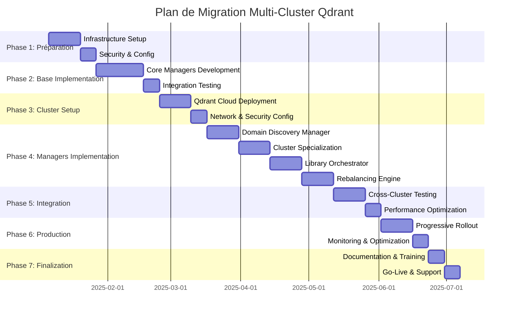
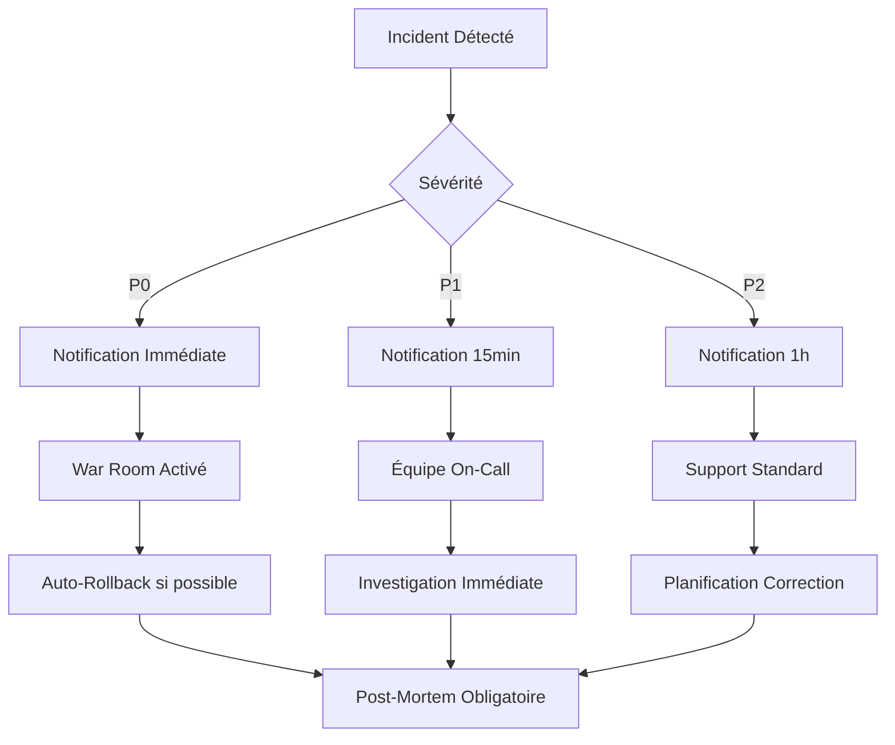

# Plan de Migration Multi-Cluster Qdrant

## 📋 Vue d'ensemble

Ce document détaille le plan de migration progressif pour déployer l'architecture multi-cluster Qdrant "Library of Libraries" avec les 4 nouveaux managers Roo-Code. La migration est conçue pour être non-breaking, sécurisée et validée à chaque étape.

---

## 🎯 Objectifs de la migration

### Objectifs primaires
- **Intégration transparente** : Migration sans interruption des services existants
- **Compatibilité totale** : Maintien de 100% de rétrocompatibilité avec l'écosystème Roo-Code
- **Performance progressive** : Amélioration graduelle des performances (10x throughput, 60-80% latence)
- **Sécurité renforcée** : Mise en place de l'architecture sécurisée multi-cluster

### Objectifs secondaires
- **Monitoring avancé** : Mise en place d'observabilité complète
- **Auto-scaling** : Capacité d'adaptation automatique à la charge
- **Disaster recovery** : Résilience cross-cluster
- **Documentation complète** : Guide utilisateur et maintenance

---

## 📅 Timeline de migration (21 semaines)



---

## 🔄 Phases détaillées de migration

### Phase 1 : Préparation Infrastructure (3 semaines)

#### Semaine 1-2 : Setup Infrastructure
**Objectif** : Préparer l'infrastructure de base

**Tâches principales :**
- [ ] Provisionner les clusters Qdrant Cloud (EU/US/ASIA)
- [ ] Configurer les environnements de développement/staging/production
- [ ] Mettre en place la CI/CD pour le multi-cluster
- [ ] Préparer les templates Docker et Kubernetes
- [ ] Configurer les outils de monitoring (Prometheus/Grafana)

**Livrables :**
- Infrastructure Qdrant Cloud opérationnelle
- Pipelines CI/CD configurés
- Environnements de test prêts
- Monitoring de base opérationnel

**Scripts de validation :**
```bash
#!/bin/bash
# scripts/validate-phase1.sh

echo "🔍 Validation Phase 1 - Infrastructure"

# Test connectivité Qdrant Cloud
echo "Testting Qdrant clusters connectivity..."
curl -f "https://eu-cluster.qdrant.cloud/health" -H "Authorization: Bearer ${QDRANT_EU_API_KEY}"
curl -f "https://us-cluster.qdrant.cloud/health" -H "Authorization: Bearer ${QDRANT_US_API_KEY}"  
curl -f "https://asia-cluster.qdrant.cloud/health" -H "Authorization: Bearer ${QDRANT_ASIA_API_KEY}"

# Test environnements Kubernetes
echo "Testing Kubernetes environments..."
kubectl get nodes --context=staging
kubectl get nodes --context=production

# Test pipelines CI/CD
echo "Testing CI/CD pipelines..."
gh workflow run test-infrastructure --repo roo-code/multi-cluster

# Test monitoring
echo "Testing monitoring stack..."
curl -f http://prometheus.monitoring.svc.cluster.local:9090/api/v1/query?query=up
curl -f http://grafana.monitoring.svc.cluster.local:3000/api/health

echo "✅ Phase 1 validation completed"
```

#### Semaine 3 : Sécurité et Configuration
**Objectif** : Sécuriser l'infrastructure et finaliser la configuration

**Tâches principales :**
- [ ] Déployer les certificats TLS et authentification
- [ ] Configurer les secrets Kubernetes
- [ ] Mettre en place les politiques réseau
- [ ] Configurer les backups et la récupération
- [ ] Valider la conformité sécurité

**Livrables :**
- Sécurité multi-cluster opérationnelle
- Secrets et certificats déployés
- Politiques de backup configurées
- Audit de sécurité validé

### Phase 2 : Implémentation Base (4 semaines)

#### Semaine 4-6 : Développement Managers Core
**Objectif** : Développer les interfaces et managers de base

**Tâches principales :**
- [ ] Implémenter `BaseMultiClusterManager`
- [ ] Développer `QdrantClientImpl` avancé
- [ ] Créer les interfaces communes multi-cluster
- [ ] Implémenter la gestion d'erreurs intégrée
- [ ] Développer les tests unitaires complets

**Structure de développement :**
```go
// pkg/multicluster/
├── interfaces.go          // Interfaces communes
├── base_manager.go        // Manager de base
├── config.go             // Configuration
├── errors.go             // Gestion d'erreurs
└── client/
    ├── qdrant_client.go   // Client Qdrant avancé
    ├── connection_pool.go  // Pool de connexions
    └── health_check.go    // Health checks
```

**Critères d'acceptation :**
- [ ] 100% de couverture de tests pour les interfaces de base
- [ ] Intégration ErrorManager validée
- [ ] Performance baseline établie
- [ ] Documentation API complète

#### Semaine 7 : Tests d'Intégration Base
**Objectif** : Valider l'intégration avec l'écosystème Roo-Code existant

**Tâches principales :**
- [ ] Tests d'intégration avec QdrantManager existant
- [ ] Validation de la compatibilité backward
- [ ] Tests de performance comparative
- [ ] Validation des métriques et monitoring
- [ ] Tests de résilience et circuit breaker

**Tests de validation :**
```go
// tests/integration/base_compatibility_test.go
func TestBackwardCompatibility(t *testing.T) {
    // Test que les anciennes interfaces fonctionnent toujours
    oldQdrantManager := setupOldQdrantManager()
    newMultiClusterManager := setupNewMultiClusterManager()
    
    // Test des opérations identiques
    testVectors := generateTestVectors(1000)
    
    // Résultats doivent être identiques
    oldResults := oldQdrantManager.Search(ctx, testQuery)
    newResults := newMultiClusterManager.Search(ctx, testQuery)
    
    assert.Equal(t, oldResults, newResults)
}
```

### Phase 3 : Déploiement Clusters (3 semaines)

#### Semaine 8-9 : Déploiement Qdrant Cloud
**Objectif** : Déployer et configurer les clusters Qdrant Cloud

**Tâches principales :**
- [ ] Créer les collections sur chaque cluster
- [ ] Configurer la réplication et le sharding
- [ ] Mettre en place le load balancing
- [ ] Configurer les sauvegardes automatiques
- [ ] Tester la haute disponibilité

**Configuration clusters :**
```yaml
# config/clusters/eu-cluster.yaml
cluster:
  name: "eu-cluster"
  region: "eu-central-1"
  collections:
    - name: "documents"
      vector_size: 1536
      distance: "cosine"
      shards: 4
      replicas: 2
    - name: "code"
      vector_size: 1536
      distance: "cosine"
      shards: 2
      replicas: 2
    - name: "specialized"
      vector_size: 1536
      distance: "cosine"
      shards: 6
      replicas: 3
  optimization:
    deleted_threshold: 0.2
    vacuum_min_vector_number: 1000
    indexing_threshold: 20000
```

#### Semaine 10 : Configuration Réseau et Sécurité
**Objectif** : Sécuriser et optimiser les connexions cross-cluster

**Tâches principales :**
- [ ] Configurer les VPN et connexions sécurisées
- [ ] Mettre en place les politiques d'accès
- [ ] Configurer la géo-localisation et le routing
- [ ] Tester les connexions cross-cluster
- [ ] Valider les performances réseau

### Phase 4 : Implémentation Managers Spécialisés (8 semaines)

#### Semaine 11-12 : DomainDiscoveryManager
**Objectif** : Implémenter la découverte automatique de domaines

**Tâches principales :**
- [ ] Développer l'algorithme d'analyse de domaines
- [ ] Implémenter l'apprentissage des patterns
- [ ] Créer les métriques de confiance
- [ ] Développer l'interface de gestion
- [ ] Tests avec données réelles

**Implémentation clé :**
```go
// pkg/managers/domain_discovery.go
func (d *DomainDiscoveryManager) AnalyzeDomains(ctx context.Context, vectors []*Vector) (*DomainMap, error) {
    // Clustering sémantique
    clusters := d.semanticClustering.Cluster(vectors)
    
    // Analyse de cohérence
    domainScores := d.computeDomainScores(clusters)
    
    // Apprentissage des patterns
    d.learningEngine.UpdatePatterns(domainScores)
    
    return &DomainMap{
        Domains:    d.extractDomains(clusters),
        Confidence: d.computeConfidence(domainScores),
        Metadata:   d.generateMetadata(clusters),
    }, nil
}
```

#### Semaine 13-14 : ClusterSpecializationManager
**Objectif** : Implémenter la spécialisation dynamique des clusters

**Tâches principales :**
- [ ] Développer l'algorithme de spécialisation
- [ ] Implémenter la migration de données
- [ ] Créer le monitoring de spécialisation
- [ ] Développer les métriques de performance
- [ ] Tests de migration en conditions réelles

#### Semaine 15-16 : DomainLibraryOrchestrator
**Objectif** : Implémenter l'orchestration cross-cluster

**Tâches principales :**
- [ ] Développer le routing intelligent
- [ ] Implémenter la fusion des résultats
- [ ] Créer le cache cross-cluster
- [ ] Développer l'optimisation des requêtes
- [ ] Tests de performance et latence

#### Semaine 17-18 : AdaptiveRebalancingEngine
**Objectif** : Implémenter le rééquilibrage adaptatif

**Tâches principales :**
- [ ] Développer l'analyse prédictive
- [ ] Implémenter les algorithmes de rééquilibrage
- [ ] Créer le système de décision automatique
- [ ] Développer les métriques de charge
- [ ] Tests de stress et de résilience

### Phase 5 : Intégration et Optimisation (3 semaines)

#### Semaine 19-20 : Tests Cross-Cluster
**Objectif** : Valider l'intégration complète du système

**Tâches principales :**
- [ ] Tests d'intégration bout-en-bout
- [ ] Validation des performances cibles
- [ ] Tests de résilience et disaster recovery
- [ ] Optimisation des algorithmes
- [ ] Validation de la scalabilité

**Tests de validation :**
```go
// tests/integration/full_system_test.go
func TestFullSystemPerformance(t *testing.T) {
    system := setupFullMultiClusterSystem()
    
    // Test de charge
    loadTest := &LoadTest{
        Queries:        10000,
        Concurrency:    100,
        Duration:       time.Minute * 10,
        TargetLatency:  time.Millisecond * 50, // 60-80% réduction
    }
    
    results := system.RunLoadTest(loadTest)
    
    // Validation des objectifs de performance
    assert.Less(t, results.P95Latency, time.Millisecond*50)
    assert.Greater(t, results.Throughput, 100000) // 10x amélioration
    assert.Greater(t, results.Accuracy, 0.95)
}
```

#### Semaine 21 : Optimisation Performance
**Objectif** : Finaliser l'optimisation des performances

**Tâches principales :**
- [ ] Optimisation des requêtes cross-cluster
- [ ] Tuning des caches et buffers
- [ ] Optimisation des algorithmes de routing
- [ ] Finalisation du monitoring
- [ ] Préparation au déploiement production

### Phase 6 : Déploiement Production (3 semaines)

#### Semaine 22-23 : Rollout Progressif
**Objectif** : Déployer progressivement en production

**Stratégie de déploiement :**
1. **Blue-Green Deployment** : Déploiement parallèle
2. **Feature Flags** : Activation progressive des fonctionnalités
3. **Canary Release** : 5% → 25% → 50% → 100% du trafic
4. **Monitoring continu** : Métriques en temps réel
5. **Rollback automatique** : En cas de problème détecté

**Plan de rollout :**
```yaml
# config/rollout-plan.yaml
rollout:
  strategy: "canary"
  stages:
    - name: "canary-5"
      traffic_percentage: 5
      duration: "24h"
      success_criteria:
        error_rate: "<0.1%"
        latency_p95: "<50ms"
        
    - name: "canary-25"
      traffic_percentage: 25
      duration: "48h"
      success_criteria:
        error_rate: "<0.05%"
        latency_p95: "<50ms"
        
    - name: "canary-50"
      traffic_percentage: 50
      duration: "72h"
      success_criteria:
        error_rate: "<0.01%"
        latency_p95: "<45ms"
        
    - name: "full-rollout"
      traffic_percentage: 100
      duration: "168h"
      success_criteria:
        error_rate: "<0.01%"
        latency_p95: "<40ms"
```

#### Semaine 24 : Monitoring et Optimisation
**Objectif** : Stabiliser le système en production

**Tâches principales :**
- [ ] Monitoring 24/7 des métriques critiques
- [ ] Optimisation en temps réel
- [ ] Résolution des incidents
- [ ] Collecte du feedback utilisateur
- [ ] Ajustement des paramètres

### Phase 7 : Finalisation (2 semaines)

#### Semaine 25 : Documentation et Formation
**Objectif** : Finaliser la documentation et former les équipes

**Tâches principales :**
- [ ] Documentation utilisateur complète
- [ ] Guide d'administration système
- [ ] Formation des équipes développement
- [ ] Formation des équipes support
- [ ] Création des runbooks opérationnels

#### Semaine 26 : Go-Live et Support
**Objectif** : Finaliser la migration et assurer le support

**Tâches principales :**
- [ ] Validation finale des performances
- [ ] Transfert de connaissances
- [ ] Mise en place du support 24/7
- [ ] Communication go-live
- [ ] Post-mortem et amélioration continue

---

## 🔄 Stratégies de rollback

### Rollback automatique
**Triggers automatiques :**
- Taux d'erreur > 0.1%
- Latence P95 > 100ms
- Indisponibilité > 30 secondes
- Utilisation mémoire > 90%

**Procédure automatique :**
```bash
#!/bin/bash
# scripts/auto-rollback.sh

echo "🚨 Auto-rollback triggered"

# 1. Arrêt du trafic vers le nouveau système
kubectl patch service roo-multi-cluster -p '{"spec":{"selector":{"version":"stable"}}}'

# 2. Redirection vers l'ancien système
kubectl scale deployment roo-multi-cluster-new --replicas=0
kubectl scale deployment roo-multi-cluster-stable --replicas=5

# 3. Notification des équipes
curl -X POST $SLACK_WEBHOOK -d '{"text":"🚨 Auto-rollback executed - Multi-cluster migration"}'

# 4. Capture des logs pour analyse
kubectl logs -l app=roo-multi-cluster-new > /tmp/rollback-logs-$(date +%s).log

echo "✅ Auto-rollback completed"
```

### Rollback manuel
**Procédures par phase :**

**Phase 1-3 (Infrastructure) :**
- Destruction des ressources créées
- Restauration des configurations d'origine
- Nettoyage des certificats et secrets

**Phase 4-5 (Managers) :**
- Désactivation des nouveaux managers
- Rétablissement des anciens managers
- Migration des données si nécessaire

**Phase 6-7 (Production) :**
- Rollback blue-green immédiat
- Restauration de l'état antérieur
- Analyse post-mortem obligatoire

### Validation de rollback
```go
// scripts/validate-rollback.go
func ValidateRollback() error {
    // 1. Vérifier que l'ancien système fonctionne
    if err := testOldSystemHealth(); err != nil {
        return fmt.Errorf("old system not healthy: %w", err)
    }
    
    // 2. Vérifier la cohérence des données
    if err := validateDataConsistency(); err != nil {
        return fmt.Errorf("data inconsistency detected: %w", err)
    }
    
    // 3. Vérifier les performances
    if err := validatePerformanceBaseline(); err != nil {
        return fmt.Errorf("performance below baseline: %w", err)
    }
    
    return nil
}
```

---

## 📊 Métriques et validation

### KPIs de migration

| Métrique | Baseline | Objectif | Critique |
|----------|----------|----------|----------|
| **Latence P95** | 200ms | <50ms | <100ms |
| **Throughput** | 10K req/s | 100K req/s | >50K req/s |
| **Disponibilité** | 99.9% | 99.95% | >99.9% |
| **Précision** | 92% | 95% | >90% |
| **Taux d'erreur** | 0.1% | <0.01% | <0.05% |

### Tableaux de bord monitoring

#### Dashboard Production
```json
{
  "dashboard": {
    "title": "Multi-Cluster Migration Monitoring",
    "panels": [
      {
        "title": "Migration Progress",
        "type": "stat",
        "targets": [
          {"expr": "migration_phase_completion_percentage"}
        ]
      },
      {
        "title": "Performance Comparison",
        "type": "graph",
        "targets": [
          {"expr": "rate(requests_total[5m])", "legendFormat": "New System"},
          {"expr": "rate(requests_total_old[5m])", "legendFormat": "Old System"}
        ]
      },
      {
        "title": "Error Rate Trend",
        "type": "graph",
        "targets": [
          {"expr": "rate(errors_total[5m]) / rate(requests_total[5m])"}
        ]
      },
      {
        "title": "Cluster Health",
        "type": "table",
        "targets": [
          {"expr": "cluster_health_status"}
        ]
      }
    ]
  }
}
```

### Tests de validation continue

```bash
#!/bin/bash
# scripts/continuous-validation.sh

# Test de régression
echo "Running regression tests..."
go test ./tests/regression/... -v

# Test de performance
echo "Running performance tests..."
go test ./tests/performance/... -bench=. -benchtime=30s

# Test d'intégration
echo "Running integration tests..."
go test ./tests/integration/... -v -parallel=4

# Validation des métriques
echo "Validating metrics..."
python scripts/validate-metrics.py --threshold-file config/metrics-thresholds.yaml

# Test de cohérence des données
echo "Checking data consistency..."
go run scripts/check-data-consistency.go --clusters=eu,us,asia

echo "✅ Continuous validation completed"
```

---

## 🆘 Gestion des incidents

### Classification des incidents

**P0 - Critique**
- Indisponibilité totale du service
- Perte de données
- Violation de sécurité

**P1 - Majeur**
- Dégradation importante des performances
- Fonctionnalité critique indisponible
- Erreurs affectant >10% des utilisateurs

**P2 - Mineur**
- Problèmes de performance localisés
- Fonctionnalité non-critique indisponible
- Erreurs affectant <5% des utilisateurs

### Procédures d'escalade



### Playbooks d'incident

#### Incident de Performance
```bash
#!/bin/bash
# playbooks/performance-incident.sh

echo "🔍 Performance Incident Playbook"

# 1. Collecte des métriques actuelles
kubectl top nodes
kubectl top pods -n roo-system

# 2. Vérification des ressources
kubectl describe nodes | grep -A5 "Allocated resources"

# 3. Analyse des logs récents
kubectl logs -l app=roo-multi-cluster --since=10m | grep ERROR

# 4. Vérification de la connectivité clusters
scripts/test-cluster-connectivity.sh

# 5. Analyse des requêtes lentes
scripts/analyze-slow-queries.sh --since=10m

# 6. Si critique, préparer rollback
if [ "$SEVERITY" = "P0" ]; then
    echo "Preparing auto-rollback..."
    scripts/prepare-rollback.sh
fi
```

---

## 📚 Documentation et formation

### Documentation utilisateur

**Guides requis :**
- [ ] Guide de migration pour les développeurs
- [ ] Documentation API des nouveaux managers
- [ ] Guide de configuration multi-cluster
- [ ] Troubleshooting et FAQ
- [ ] Guide de performance tuning

### Formation des équipes

**Programme de formation :**

**Semaine 1 - Équipe Développement**
- Architecture multi-cluster
- Nouveaux managers et interfaces
- Patterns de développement
- Debugging et profiling

**Semaine 2 - Équipe Ops/SRE**
- Administration des clusters
- Monitoring et alerting
- Procédures d'incident
- Maintenance et updates

**Semaine 3 - Équipe Support**
- Fonctionnalités utilisateur
- Diagnostics courants
- Escalation procedures
- Knowledge base

### Certification et validation

**Tests de certification :**
```go
// tests/certification/migration_test.go
func TestMigrationCertification(t *testing.T) {
    tests := []struct {
        name     string
        scenario func(t *testing.T)
    }{
        {"Performance Requirements", testPerformanceRequirements},
        {"Reliability Requirements", testReliabilityRequirements},
        {"Security Requirements", testSecurityRequirements},
        {"Backward Compatibility", testBackwardCompatibility},
        {"Disaster Recovery", testDisasterRecovery},
    }
    
    for _, tt := range tests {
        t.Run(tt.name, tt.scenario)
    }
}
```

---

## ✅ Critères de succès

### Critères techniques
- [ ] **Performance** : Latence P95 < 50ms, Throughput > 100K req/s
- [ ] **Fiabilité** : Disponibilité > 99.95%, Taux d'erreur < 0.01%
- [ ] **Scalabilité** : Support de 100M+ vecteurs par cluster
- [ ] **Compatibilité** : 100% backward compatibility validée

### Critères opérationnels
- [ ] **Monitoring** : Dashboards complets et alerting fonctionnel
- [ ] **Documentation** : Guides complets et à jour
- [ ] **Formation** : Équipes formées et certifiées
- [ ] **Support** : Processus d'incident opérationnels

### Critères business
- [ ] **ROI** : Amélioration 10x des performances mesurée
- [ ] **User Experience** : Satisfaction utilisateur > 90%
- [ ] **Coût** : Coût d'infrastructure optimisé
- [ ] **Innovation** : Plateforme prête pour l'évolution

---

**Conclusion** : Ce plan de migration détaillé garantit une transition sécurisée et progressive vers l'architecture multi-cluster Qdrant avec un risque minimal et une validation continue à chaque étape.

---

*Document généré le 2025-08-05*  
*Version 1.0.0 - Plan de migration et déploiement progressif*