# Spécifications Techniques d'Implémentation Multi-Cluster

## 📋 Vue d'ensemble

Ce document fournit les spécifications techniques complètes pour l'implémentation de l'architecture multi-cluster Qdrant "Library of Libraries" avec les 4 nouveaux managers Roo-Code. Il détaille l'infrastructure, les patterns d'implémentation, la configuration et les procédures de déploiement.

---

## 🏗️ Architecture technique globale

### Infrastructure multi-cluster

```mermaid
graph TB
    subgraph "Load Balancer Layer"
        LB[Qdrant Cloud Load Balancer]
    end
    
    subgraph "EU Cluster (Frankfurt)"
        EU_M[EU Master Node]
        EU_S1[EU Slave 1]
        EU_S2[EU Slave 2]
        EU_VEC[EU Vector Store]
    end
    
    subgraph "US Cluster (Virginia)"
        US_M[US Master Node]
        US_S1[US Slave 1]
        US_S2[US Slave 2]
        US_VEC[US Vector Store]
    end
    
    subgraph "ASIA Cluster (Tokyo)"
        ASIA_M[ASIA Master Node]
        ASIA_S1[ASIA Slave 1]
        ASIA_S2[ASIA Slave 2]
        ASIA_VEC[ASIA Vector Store]
    end
    
    subgraph "Roo-Code Application Layer"
        subgraph "Core Managers"
            QM[QdrantManager]
            VM[VectorOperationsManager]
            EM[ErrorManager]
            MM[MonitoringManager]
        end
        
        subgraph "New Multi-Cluster Managers"
            DDM[DomainDiscoveryManager]
            CSM[ClusterSpecializationManager]
            DLO[DomainLibraryOrchestrator]
            ARE[AdaptiveRebalancingEngine]
        end
    end
    
    subgraph "Application Interface"
        API[REST API Gateway]
        SDK[Go SDK]
        CLI[CLI Tools]
    end
    
    LB --> EU_M
    LB --> US_M
    LB --> ASIA_M
    
    EU_M --> EU_S1
    EU_M --> EU_S2
    EU_M --> EU_VEC
    
    US_M --> US_S1
    US_M --> US_S2
    US_M --> US_VEC
    
    ASIA_M --> ASIA_S1
    ASIA_M --> ASIA_S2
    ASIA_M --> ASIA_VEC
    
    API --> DDM
    SDK --> CSM
    CLI --> DLO
    
    DDM --> QM
    CSM --> VM
    DLO --> EM
    ARE --> MM
```



---

## 🔧 Spécifications techniques détaillées

### 1. Configuration Infrastructure

#### Qdrant Cloud Configuration

```yaml
# config/qdrant-cloud.yaml
qdrant_cloud:
  clusters:
    eu-cluster:
      region: "eu-central-1"
      endpoint: "https://eu-cluster.qdrant.cloud"
      api_key: "${QDRANT_EU_API_KEY}"
      nodes: 3
      replicas: 2
      shards: 4
      vector_size: 1536
      distance: "cosine"
      storage_type: "disk"
      memory_mapping: true
      wal_capacity: 32000000
      optimization:
        deleted_threshold: 0.2
        vacuum_min_vector_number: 1000
        default_segment_number: 2
      resources:
        cpu: "4 cores"
        memory: "16GB"
        storage: "500GB SSD"
      
    us-cluster:
      region: "us-east-1"
      endpoint: "https://us-cluster.qdrant.cloud"
      api_key: "${QDRANT_US_API_KEY}"
      nodes: 3
      replicas: 2
      shards: 4
      vector_size: 1536
      distance: "cosine"
      storage_type: "disk"
      memory_mapping: true
      wal_capacity: 32000000
      optimization:
        deleted_threshold: 0.2
        vacuum_min_vector_number: 1000
        default_segment_number: 2
      resources:
        cpu: "4 cores"
        memory: "16GB"
        storage: "500GB SSD"
        
    asia-cluster:
      region: "ap-northeast-1"
      endpoint: "https://asia-cluster.qdrant.cloud"
      api_key: "${QDRANT_ASIA_API_KEY}"
      nodes: 3
      replicas: 2
      shards: 4
      vector_size: 1536
      distance: "cosine"
      storage_type: "disk"
      memory_mapping: true
      wal_capacity: 32000000
      optimization:
        deleted_threshold: 0.2
        vacuum_min_vector_number: 1000
        default_segment_number: 2
      resources:
        cpu: "4 cores"
        memory: "16GB"
        storage: "500GB SSD"

  load_balancer:
    strategy: "geographic_routing"
    health_check_interval: "30s"
    failover_timeout: "10s"
    max_retries: 3
    circuit_breaker:
      failure_threshold: 5
      timeout: "60s"
      max_requests: 10

  monitoring:
    metrics_endpoint: "https://metrics.qdrant.cloud"
    prometheus_export: true
    grafana_dashboard: true
    alert_endpoints:
      - "https://alerts.roo-code.com/webhook"
      - "slack://roo-team-alerts"
```

#### Application Configuration

```yaml
# config/multi-cluster-app.yaml
application:
  name: "roo-multi-cluster"
  version: "1.0.0"
  environment: "production"
  
  database:
    postgres:
      host: "postgres.roo-internal.com"
      port: 5432
      database: "roo_multi_cluster"
      username: "${POSTGRES_USER}"
      password: "${POSTGRES_PASSWORD}"
      ssl_mode: "require"
      max_connections: 20
      connection_timeout: "30s"
      
  cache:
    redis:
      endpoints:
        - "redis-eu.roo-internal.com:6379"
        - "redis-us.roo-internal.com:6379"
        - "redis-asia.roo-internal.com:6379"
      password: "${REDIS_PASSWORD}"
      db: 0
      pool_size: 10
      timeout: "5s"
      
  logging:
    level: "info"
    format: "json"
    outputs:
      - "stdout"
      - "file:///var/log/roo-multi-cluster.log"
    rotation:
      max_size: "100MB"
      max_files: 10
      max_age: "7d"
      
  security:
    api_keys:
      admin: "${ADMIN_API_KEY}"
      service: "${SERVICE_API_KEY}"
    encryption:
      algorithm: "AES-256-GCM"
      key: "${ENCRYPTION_KEY}"
    tls:
      cert_file: "/etc/ssl/certs/roo-multi-cluster.crt"
      key_file: "/etc/ssl/private/roo-multi-cluster.key"
      
  performance:
    max_concurrent_requests: 1000
    request_timeout: "60s"
    batch_size: 100
    worker_pools:
      domain_discovery: 4
      cluster_specialization: 2
      orchestration: 8
      rebalancing: 1
```

### 2. Implémentation Go des interfaces

#### Interface Manager Multi-Cluster

```go
// pkg/multicluster/interfaces.go
package multicluster

import (
    "context"
    "time"
    
    "github.com/roo-code/core/interfaces"
)

// MultiClusterManagerInterface interface commune pour tous les managers multi-cluster
type MultiClusterManagerInterface interface {
    interfaces.ManagerInterface
    
    // Configuration multi-cluster
    SetClusterConfig(config *ClusterConfig) error
    GetClusterConfig() *ClusterConfig
    
    // Health check cross-cluster
    HealthCheckClusters(ctx context.Context) (*MultiClusterHealth, error)
    
    // Métriques globales
    GetGlobalMetrics(ctx context.Context) (*GlobalMetrics, error)
    
    // Synchronisation cross-cluster
    SyncAcrossClusters(ctx context.Context) error
}

// ClusterConfig configuration globale des clusters
type ClusterConfig struct {
    Clusters map[string]*SingleClusterConfig `json:"clusters"`
    Global   *GlobalConfig                   `json:"global"`
}

type SingleClusterConfig struct {
    Name           string                 `json:"name"`
    Region         string                 `json:"region"`
    Endpoint       string                 `json:"endpoint"`
    APIKey         string                 `json:"api_key"`
    Specialization *SpecializationConfig  `json:"specialization"`
    Resources      *ResourceConfig        `json:"resources"`
}

type GlobalConfig struct {
    LoadBalancing    *LoadBalancingConfig    `json:"load_balancing"`
    Replication      *ReplicationConfig      `json:"replication"`
    Monitoring       *MonitoringConfig       `json:"monitoring"`
    Security         *SecurityConfig         `json:"security"`
}

type MultiClusterHealth struct {
    OverallStatus   HealthStatus                    `json:"overall_status"`
    ClusterHealth   map[string]*ClusterHealthInfo   `json:"cluster_health"`
    LastChecked     time.Time                       `json:"last_checked"`
    Issues          []*HealthIssue                  `json:"issues"`
}
```

#### Implémentation Base Manager

```go
// pkg/multicluster/base_manager.go
package multicluster

import (
    "context"
    "sync"
    "time"
    
    "github.com/roo-code/core/interfaces"
    "github.com/roo-code/core/logging"
)

// BaseMultiClusterManager implémentation de base pour tous les managers multi-cluster
type BaseMultiClusterManager struct {
    // Configuration
    config           *ClusterConfig
    
    // Managers Roo injectés
    errorManager     interfaces.ErrorManager
    monitoringManager interfaces.MonitoringManager
    securityManager  interfaces.SecurityManager
    
    // Clients Qdrant par cluster
    qdrantClients    map[string]QdrantClient
    
    // État du manager
    id               string
    name             string
    version          string
    status           interfaces.ManagerStatus
    healthy          bool
    startTime        time.Time
    
    // Synchronisation
    mu               sync.RWMutex
    
    // Logging
    logger           logging.Logger
}

// NewBaseMultiClusterManager crée une nouvelle instance de base
func NewBaseMultiClusterManager(
    id, name, version string,
    errorManager interfaces.ErrorManager,
    monitoringManager interfaces.MonitoringManager,
    securityManager interfaces.SecurityManager,
) *BaseMultiClusterManager {
    return &BaseMultiClusterManager{
        id:                id,
        name:              name,
        version:           version,
        status:            interfaces.ManagerStatusStopped,
        errorManager:      errorManager,
        monitoringManager: monitoringManager,
        securityManager:   securityManager,
        qdrantClients:     make(map[string]QdrantClient),
        logger:            logging.GetLogger(id),
    }
}

// Initialize implémente ManagerInterface.Initialize
func (m *BaseMultiClusterManager) Initialize(ctx context.Context) error {
    m.mu.Lock()
    defer m.mu.Unlock()
    
    if m.status != interfaces.ManagerStatusStopped {
        return ErrAlreadyInitialized
    }
    
    // Initialisation des clients Qdrant
    if err := m.initializeQdrantClients(ctx); err != nil {
        return m.errorManager.ProcessError(ctx, err, m.id, "Initialize", nil)
    }
    
    // Test de connectivité
    if err := m.testConnectivity(ctx); err != nil {
        return m.errorManager.ProcessError(ctx, err, m.id, "Initialize", nil)
    }
    
    m.status = interfaces.ManagerStatusRunning
    m.healthy = true
    m.startTime = time.Now()
    
    m.logger.Info("Manager initialized successfully", 
        "manager_id", m.id,
        "clusters_count", len(m.qdrantClients))
    
    return nil
}

// Shutdown implémente ManagerInterface.Shutdown
func (m *BaseMultiClusterManager) Shutdown(ctx context.Context) error {
    m.mu.Lock()
    defer m.mu.Unlock()
    
    if m.status == interfaces.ManagerStatusStopped {
        return nil
    }
    
    // Fermeture des connexions Qdrant
    for clusterName, client := range m.qdrantClients {
        if err := client.Close(); err != nil {
            m.logger.Error("Failed to close Qdrant client", 
                "cluster", clusterName, 
                "error", err)
        }
    }
    
    m.status = interfaces.ManagerStatusStopped
    m.healthy = false
    
    m.logger.Info("Manager shutdown completed", "manager_id", m.id)
    
    return nil
}

// Getters pour ManagerInterface
func (m *BaseMultiClusterManager) GetID() string     { return m.id }
func (m *BaseMultiClusterManager) GetName() string   { return m.name }
func (m *BaseMultiClusterManager) GetVersion() string { return m.version }
func (m *BaseMultiClusterManager) GetStatus() interfaces.ManagerStatus { 
    m.mu.RLock()
    defer m.mu.RUnlock()
    return m.status 
}

func (m *BaseMultiClusterManager) IsHealthy(ctx context.Context) bool {
    m.mu.RLock()
    defer m.mu.RUnlock()
    return m.healthy
}

func (m *BaseMultiClusterManager) GetMetrics() map[string]interface{} {
    m.mu.RLock()
    defer m.mu.RUnlock()
    
    return map[string]interface{}{
        "uptime_seconds":    time.Since(m.startTime).Seconds(),
        "clusters_count":    len(m.qdrantClients),
        "status":            string(m.status),
        "healthy":           m.healthy,
        "memory_usage":      m.getMemoryUsage(),
        "active_connections": m.getActiveConnections(),
    }
}

// SetClusterConfig implémente MultiClusterManagerInterface.SetClusterConfig
func (m *BaseMultiClusterManager) SetClusterConfig(config *ClusterConfig) error {
    m.mu.Lock()
    defer m.mu.Unlock()
    
    if err := m.validateClusterConfig(config); err != nil {
        return err
    }
    
    m.config = config
    return nil
}

// GetClusterConfig implémente MultiClusterManagerInterface.GetClusterConfig
func (m *BaseMultiClusterManager) GetClusterConfig() *ClusterConfig {
    m.mu.RLock()
    defer m.mu.RUnlock()
    return m.config
}

// HealthCheckClusters implémente MultiClusterManagerInterface.HealthCheckClusters
func (m *BaseMultiClusterManager) HealthCheckClusters(ctx context.Context) (*MultiClusterHealth, error) {
    m.mu.RLock()
    defer m.mu.RUnlock()
    
    health := &MultiClusterHealth{
        ClusterHealth: make(map[string]*ClusterHealthInfo),
        LastChecked:   time.Now(),
        Issues:        make([]*HealthIssue, 0),
    }
    
    overallHealthy := true
    
    // Check chaque cluster
    for clusterName, client := range m.qdrantClients {
        clusterHealth, err := m.checkClusterHealth(ctx, clusterName, client)
        if err != nil {
            health.Issues = append(health.Issues, &HealthIssue{
                Cluster:     clusterName,
                Severity:    SeverityError,
                Message:     fmt.Sprintf("Health check failed: %v", err),
                Timestamp:   time.Now(),
            })
            overallHealthy = false
        }
        
        health.ClusterHealth[clusterName] = clusterHealth
        
        if clusterHealth.Status != HealthStatusHealthy {
            overallHealthy = false
        }
    }
    
    if overallHealthy {
        health.OverallStatus = HealthStatusHealthy
    } else {
        health.OverallStatus = HealthStatusDegraded
    }
    
    return health, nil
}

// Méthodes privées

func (m *BaseMultiClusterManager) initializeQdrantClients(ctx context.Context) error {
    if m.config == nil {
        return ErrNoClusterConfig
    }
    
    for clusterName, clusterConfig := range m.config.Clusters {
        client, err := NewQdrantClient(clusterConfig)
        if err != nil {
            return fmt.Errorf("failed to create Qdrant client for cluster %s: %w", clusterName, err)
        }
        
        m.qdrantClients[clusterName] = client
    }
    
    return nil
}

func (m *BaseMultiClusterManager) testConnectivity(ctx context.Context) error {
    for clusterName, client := range m.qdrantClients {
        if err := client.Ping(ctx); err != nil {
            return fmt.Errorf("connectivity test failed for cluster %s: %w", clusterName, err)
        }
    }
    return nil
}

func (m *BaseMultiClusterManager) checkClusterHealth(ctx context.Context, clusterName string, client QdrantClient) (*ClusterHealthInfo, error) {
    startTime := time.Now()
    
    // Test de latence
    if err := client.Ping(ctx); err != nil {
        return &ClusterHealthInfo{
            Status:    HealthStatusDown,
            Latency:   0,
            LastCheck: time.Now(),
            Error:     err.Error(),
        }, err
    }
    
    latency := time.Since(startTime)
    
    // Récupération des métriques
    metrics, err := client.GetClusterMetrics(ctx)
    if err != nil {
        return &ClusterHealthInfo{
            Status:    HealthStatusDegraded,
            Latency:   latency,
            LastCheck: time.Now(),
            Error:     err.Error(),
        }, err
    }
    
    // Évaluation du statut
    status := HealthStatusHealthy
    if latency > 100*time.Millisecond {
        status = HealthStatusDegraded
    }
    if metrics.MemoryUsage > 0.9 {
        status = HealthStatusDegraded
    }
    
    return &ClusterHealthInfo{
        Status:      status,
        Latency:     latency,
        LastCheck:   time.Now(),
        Metrics:     metrics,
        Error:       "",
    }, nil
}
```

### 3. Client Qdrant avancé

```go
// pkg/qdrant/client.go
package qdrant

import (
    "context"
    "fmt"
    "time"
    
    "github.com/qdrant/go-client/qdrant"
    "google.golang.org/grpc"
    "google.golang.org/grpc/credentials"
)

// QdrantClient interface pour les opérations Qdrant
type QdrantClient interface {
    // Connectivité
    Ping(ctx context.Context) error
    Close() error
    
    // Collections
    CreateCollection(ctx context.Context, name string, config *CollectionConfig) error
    DeleteCollection(ctx context.Context, name string) error
    GetCollections(ctx context.Context) ([]*CollectionInfo, error)
    
    // Vecteurs
    UpsertVectors(ctx context.Context, collectionName string, vectors []*Vector) error
    SearchVectors(ctx context.Context, req *SearchRequest) (*SearchResponse, error)
    DeleteVectors(ctx context.Context, collectionName string, ids []string) error
    
    // Métriques
    GetClusterMetrics(ctx context.Context) (*ClusterMetrics, error)
    GetCollectionMetrics(ctx context.Context, collectionName string) (*CollectionMetrics, error)
    
    // Administration
    CreateSnapshot(ctx context.Context, collectionName string) (*SnapshotInfo, error)
    RestoreSnapshot(ctx context.Context, snapshotPath string) error
    OptimizeCollection(ctx context.Context, collectionName string) error
}

// QdrantClientImpl implémentation du client Qdrant
type QdrantClientImpl struct {
    config     *ClientConfig
    conn       *grpc.ClientConn
    client     qdrant.QdrantClient
    pointsClient qdrant.PointsClient
    collectionsClient qdrant.CollectionsClient
    snapshotsClient qdrant.SnapshotsClient
}

// NewQdrantClient crée un nouveau client Qdrant
func NewQdrantClient(config *SingleClusterConfig) (QdrantClient, error) {
    // Configuration TLS
    creds := credentials.NewTLS(&tls.Config{
        ServerName: extractServerName(config.Endpoint),
    })
    
    // Options de connexion
    opts := []grpc.DialOption{
        grpc.WithTransportCredentials(creds),
        grpc.WithUnaryInterceptor(authInterceptor(config.APIKey)),
        grpc.WithKeepaliveParams(keepalive.ClientParameters{
            Time:                10 * time.Second,
            Timeout:             5 * time.Second,
            PermitWithoutStream: true,
        }),
    }
    
    // Établissement de la connexion
    conn, err := grpc.Dial(config.Endpoint, opts...)
    if err != nil {
        return nil, fmt.Errorf("failed to connect to Qdrant: %w", err)
    }
    
    return &QdrantClientImpl{
        config:            convertConfig(config),
        conn:              conn,
        client:            qdrant.NewQdrantClient(conn),
        pointsClient:      qdrant.NewPointsClient(conn),
        collectionsClient: qdrant.NewCollectionsClient(conn),
        snapshotsClient:   qdrant.NewSnapshotsClient(conn),
    }, nil
}

// Ping teste la connectivité
func (c *QdrantClientImpl) Ping(ctx context.Context) error {
    _, err := c.client.HealthCheck(ctx, &qdrant.HealthCheckRequest{})
    return err
}

// CreateCollection crée une nouvelle collection
func (c *QdrantClientImpl) CreateCollection(ctx context.Context, name string, config *CollectionConfig) error {
    req := &qdrant.CreateCollection{
        CollectionName: name,
        VectorsConfig: &qdrant.VectorsConfig{
            Config: &qdrant.VectorsConfig_Params{
                Params: &qdrant.VectorParams{
                    Size:     uint64(config.VectorSize),
                    Distance: convertDistance(config.Distance),
                },
            },
        },
        ShardNumber:       &config.ShardNumber,
        ReplicationFactor: &config.ReplicationFactor,
        WriteConsistencyFactor: &config.WriteConsistencyFactor,
        OnDiskPayload:     &config.OnDiskPayload,
        HnswConfig: &qdrant.HnswConfigDiff{
            M:                     &config.HnswConfig.M,
            EfConstruct:           &config.HnswConfig.EfConstruct,
            FullScanThreshold:     &config.HnswConfig.FullScanThreshold,
            MaxIndexingThreads:    &config.HnswConfig.MaxIndexingThreads,
            OnDisk:                &config.HnswConfig.OnDisk,
            PayloadM:              &config.HnswConfig.PayloadM,
        },
        WalConfig: &qdrant.WalConfigDiff{
            WalCapacityMb:     &config.WalConfig.WalCapacityMb,
            WalSegmentsAhead:  &config.WalConfig.WalSegmentsAhead,
        },
        OptimizersConfig: &qdrant.OptimizersConfigDiff{
            DeletedThreshold:         &config.OptimizersConfig.DeletedThreshold,
            VacuumMinVectorNumber:    &config.OptimizersConfig.VacuumMinVectorNumber,
            DefaultSegmentNumber:     &config.OptimizersConfig.DefaultSegmentNumber,
            MaxSegmentSize:           &config.OptimizersConfig.MaxSegmentSize,
            MemmapThreshold:          &config.OptimizersConfig.MemmapThreshold,
            IndexingThreshold:        &config.OptimizersConfig.IndexingThreshold,
            FlushIntervalSec:         &config.OptimizersConfig.FlushIntervalSec,
            MaxOptimizationThreads:   &config.OptimizersConfig.MaxOptimizationThreads,
        },
    }
    
    _, err := c.collectionsClient.Create(ctx, req)
    return err
}

// UpsertVectors insère ou met à jour des vecteurs
func (c *QdrantClientImpl) UpsertVectors(ctx context.Context, collectionName string, vectors []*Vector) error {
    points := make([]*qdrant.PointStruct, len(vectors))
    
    for i, vector := range vectors {
        points[i] = &qdrant.PointStruct{
            Id: &qdrant.PointId{
                PointIdOptions: &qdrant.PointId_Uuid{
                    Uuid: vector.ID,
                },
            },
            Vectors: &qdrant.Vectors{
                VectorsOptions: &qdrant.Vectors_Vector{
                    Vector: &qdrant.Vector{
                        Data: vector.Data,
                    },
                },
            },
            Payload: convertPayload(vector.Payload),
        }
    }
    
    req := &qdrant.UpsertPoints{
        CollectionName: collectionName,
        Points:         points,
        Wait:           &[]bool{true}[0],
    }
    
    _, err := c.pointsClient.Upsert(ctx, req)
    return err
}

// SearchVectors effectue une recherche vectorielle
func (c *QdrantClientImpl) SearchVectors(ctx context.Context, req *SearchRequest) (*SearchResponse, error) {
    searchReq := &qdrant.SearchPoints{
        CollectionName: req.CollectionName,
        Vector:         req.Vector,
        Limit:          uint64(req.Limit),
        WithPayload:    &qdrant.WithPayloadSelector{
            SelectorOptions: &qdrant.WithPayloadSelector_Enable{
                Enable: req.WithPayload,
            },
        },
        WithVectors: &qdrant.WithVectorsSelector{
            SelectorOptions: &qdrant.WithVectorsSelector_Enable{
                Enable: req.WithVectors,
            },
        },
        ScoreThreshold: req.ScoreThreshold,
        Offset:         req.Offset,
        Filter:         convertFilter(req.Filter),
    }
    
    resp, err := c.pointsClient.Search(ctx, searchReq)
    if err != nil {
        return nil, err
    }
    
    return convertSearchResponse(resp), nil
}

// GetClusterMetrics récupère les métriques du cluster
func (c *QdrantClientImpl) GetClusterMetrics(ctx context.Context) (*ClusterMetrics, error) {
    // Implémentation de récupération des métriques
    // Note: Cette méthode nécessite l'API de métriques de Qdrant
    
    collections, err := c.GetCollections(ctx)
    if err != nil {
        return nil, err
    }
    
    var totalVectors uint64
    var totalSize uint64
    
    for _, collection := range collections {
        info, err := c.collectionsClient.Get(ctx, &qdrant.GetCollectionInfoRequest{
            CollectionName: collection.Name,
        })
        if err != nil {
            continue // Skip errors pour les métriques
        }
        
        if info.Result != nil {
            totalVectors += info.Result.VectorsCount
            // totalSize += info.Result.PayloadSizeBytes // Dépend de l'API Qdrant
        }
    }
    
    return &ClusterMetrics{
        VectorCount:   totalVectors,
        StorageSize:   totalSize,
        MemoryUsage:   0.0, // À implémenter selon l'API disponible
        CPUUsage:      0.0, // À implémenter selon l'API disponible
        RequestsPerSec: 0,   // À implémenter avec monitoring
        AvgLatency:    0,    // À implémenter avec monitoring
    }, nil
}
```

### 4. Configuration Docker et Kubernetes

#### Dockerfile

```dockerfile
# Dockerfile
FROM golang:1.21-alpine AS builder

WORKDIR /app

# Installation des dépendances
COPY go.mod go.sum ./
RUN go mod download

# Copie du code source
COPY . .

# Compilation
RUN CGO_ENABLED=0 GOOS=linux go build -a -installsuffix cgo -o main ./cmd/multi-cluster

FROM alpine:latest

# Installation des certificats et outils de base
RUN apk --no-cache add ca-certificates tzdata
WORKDIR /root/

# Copie de l'exécutable
COPY --from=builder /app/main .

# Configuration
COPY --from=builder /app/config ./config

# Exposition du port
EXPOSE 8080

# Commande de démarrage
CMD ["./main"]
```

#### Kubernetes Deployment

```yaml
# k8s/deployment.yaml
apiVersion: apps/v1
kind: Deployment
metadata:
  name: roo-multi-cluster
  namespace: roo-system
  labels:
    app: roo-multi-cluster
    version: v1.0.0
spec:
  replicas: 3
  strategy:
    type: RollingUpdate
    rollingUpdate:
      maxUnavailable: 1
      maxSurge: 1
  selector:
    matchLabels:
      app: roo-multi-cluster
  template:
    metadata:
      labels:
        app: roo-multi-cluster
        version: v1.0.0
    spec:
      containers:
      - name: roo-multi-cluster
        image: roo/multi-cluster:v1.0.0
        ports:
        - containerPort: 8080
          name: http
        - containerPort: 9090
          name: metrics
        env:
        - name: QDRANT_EU_API_KEY
          valueFrom:
            secretKeyRef:
              name: qdrant-credentials
              key: eu-api-key
        - name: QDRANT_US_API_KEY
          valueFrom:
            secretKeyRef:
              name: qdrant-credentials
              key: us-api-key
        - name: QDRANT_ASIA_API_KEY
          valueFrom:
            secretKeyRef:
              name: qdrant-credentials
              key: asia-api-key
        - name: POSTGRES_USER
          valueFrom:
            secretKeyRef:
              name: postgres-credentials
              key: username
        - name: POSTGRES_PASSWORD
          valueFrom:
            secretKeyRef:
              name: postgres-credentials
              key: password
        - name: REDIS_PASSWORD
          valueFrom:
            secretKeyRef:
              name: redis-credentials
              key: password
        - name: ENCRYPTION_KEY
          valueFrom:
            secretKeyRef:
              name: app-secrets
              key: encryption-key
        resources:
          requests:
            cpu: 100m
            memory: 256Mi
          limits:
            cpu: 500m
            memory: 1Gi
        livenessProbe:
          httpGet:
            path: /health
            port: 8080
          initialDelaySeconds: 30
          periodSeconds: 10
          timeoutSeconds: 5
          failureThreshold: 3
        readinessProbe:
          httpGet:
            path: /ready
            port: 8080
          initialDelaySeconds: 5
          periodSeconds: 5
          timeoutSeconds: 3
          failureThreshold: 3
        volumeMounts:
        - name: config
          mountPath: /root/config
          readOnly: true
        - name: tls-certs
          mountPath: /etc/ssl/certs
          readOnly: true
      volumes:
      - name: config
        configMap:
          name: roo-multi-cluster-config
      - name: tls-certs
        secret:
          secretName: roo-tls-certs
      serviceAccountName: roo-multi-cluster
      securityContext:
        runAsNonRoot: true
        runAsUser: 1000
        fsGroup: 2000

---
apiVersion: v1
kind: Service
metadata:
  name: roo-multi-cluster-service
  namespace: roo-system
  labels:
    app: roo-multi-cluster
spec:
  type: ClusterIP
  ports:
  - port: 80
    targetPort: 8080
    protocol: TCP
    name: http
  - port: 9090
    targetPort: 9090
    protocol: TCP
    name: metrics
  selector:
    app: roo-multi-cluster

---
apiVersion: v1
kind: ServiceAccount
metadata:
  name: roo-multi-cluster
  namespace: roo-system

---
apiVersion: networking.k8s.io/v1
kind: Ingress
metadata:
  name: roo-multi-cluster-ingress
  namespace: roo-system
  annotations:
    kubernetes.io/ingress.class: nginx
    cert-manager.io/cluster-issuer: letsencrypt-prod
    nginx.ingress.kubernetes.io/ssl-redirect: "true"
    nginx.ingress.kubernetes.io/rate-limit: "100"
spec:
  tls:
  - hosts:
    - api.roo-multi-cluster.com
    secretName: roo-multi-cluster-tls
  rules:
  - host: api.roo-multi-cluster.com
    http:
      paths:
      - path: /
        pathType: Prefix
        backend:
          service:
            name: roo-multi-cluster-service
            port:
              number: 80
```

### 5. Monitoring et Observabilité

#### Prometheus Configuration

```yaml
# monitoring/prometheus.yaml
global:
  scrape_interval: 15s
  evaluation_interval: 15s

rule_files:
  - "rules/*.yml"

scrape_configs:
  - job_name: 'roo-multi-cluster'
    static_configs:
      - targets: ['roo-multi-cluster-service:9090']
    metrics_path: /metrics
    scrape_interval: 10s
    scrape_timeout: 10s
    
  - job_name: 'qdrant-eu'
    static_configs:
      - targets: ['eu-cluster.qdrant.cloud:443']
    scheme: https
    bearer_token_file: /etc/secrets/qdrant-eu-token
    
  - job_name: 'qdrant-us'
    static_configs:
      - targets: ['us-cluster.qdrant.cloud:443']
    scheme: https
    bearer_token_file: /etc/secrets/qdrant-us-token
    
  - job_name: 'qdrant-asia'
    static_configs:
      - targets: ['asia-cluster.qdrant.cloud:443']
    scheme: https
    bearer_token_file: /etc/secrets/qdrant-asia-token

alerting:
  alertmanagers:
    - static_configs:
        - targets:
          - alertmanager:9093
```

#### Grafana Dashboard

```json
{
  "dashboard": {
    "id": null,
    "title": "Roo Multi-Cluster Qdrant Dashboard",
    "tags": ["roo", "qdrant", "multi-cluster"],
    "timezone": "browser",
    "panels": [
      {
        "id": 1,
        "title": "Cluster Health Overview",
        "type": "stat",
        "targets": [
          {
            "expr": "roo_cluster_health_status",
            "legendFormat": "{{cluster}}"
          }
        ],
        "fieldConfig": {
          "defaults": {
            "mappings": [
              {"value": 1, "text": "Healthy", "color": "green"},
              {"value": 0.5, "text": "Degraded", "color": "yellow"},
              {"value": 0, "text": "Down", "color": "red"}
            ]
          }
        }
      },
      {
        "id": 2,
        "title": "Vector Operations Rate",
        "type": "graph",
        "targets": [
          {
            "expr": "rate(roo_vector_operations_total[5m])",
            "legendFormat": "{{cluster}} - {{operation}}"
          }
        ]
      },
      {
        "id": 3,
        "title": "Cross-Cluster Query Latency",
        "type": "graph",
        "targets": [
          {
            "expr": "histogram_quantile(0.95, rate(roo_cross_cluster_query_duration_seconds_bucket[5m]))",
            "legendFormat": "95th percentile"
          },
          {
            "expr": "histogram_quantile(0.50, rate(roo_cross_cluster_query_duration_seconds_bucket[5m]))",
            "legendFormat": "50th percentile"
          }
        ]
      },
      {
        "id": 4,
        "title": "Domain Discovery Rate",
        "type": "graph",
        "targets": [
          {
            "expr": "rate(roo_domains_discovered_total[5m])",
            "legendFormat": "Domains per second"
          }
        ]
      },
      {
        "id": 5,
        "title": "Rebalancing Events",
        "type": "table",
        "targets": [
          {
            "expr": "roo_rebalancing_events_total",
            "legendFormat": "{{cluster}} - {{type}}"
          }
        ]
      }
    ],
    "time": {
      "from": "now-1h",
      "to": "now"
    },
    "refresh": "5s"
  }
}
```

---

## 🚀 Procédures de déploiement

### 1. Déploiement des secrets

```bash
#!/bin/bash
# scripts/deploy-secrets.sh

# Création du namespace
kubectl create namespace roo-system

# Secrets Qdrant
kubectl create secret generic qdrant-credentials \
  --from-literal=eu-api-key="${QDRANT_EU_API_KEY}" \
  --from-literal=us-api-key="${QDRANT_US_API_KEY}" \
  --from-literal=asia-api-key="${QDRANT_ASIA_API_KEY}" \
  -n roo-system

# Secrets PostgreSQL
kubectl create secret generic postgres-credentials \
  --from-literal=username="${POSTGRES_USER}" \
  --from-literal=password="${POSTGRES_PASSWORD}" \
  -n roo-system

# Secrets Redis
kubectl create secret generic redis-credentials \
  --from-literal=password="${REDIS_PASSWORD}" \
  -n roo-system

# Secrets Application
kubectl create secret generic app-secrets \
  --from-literal=encryption-key="${ENCRYPTION_KEY}" \
  --from-literal=admin-api-key="${ADMIN_API_KEY}" \
  --from-literal=service-api-key="${SERVICE_API_KEY}" \
  -n roo-system

# Certificats TLS
kubectl create secret tls roo-tls-certs \
  --cert=certs/tls.crt \
  --key=certs/tls.key \
  -n roo-system
```

### 2. Configuration des clusters Qdrant

```bash
#!/bin/bash
# scripts/setup-qdrant-clusters.sh

echo "🚀 Setting up Qdrant Cloud clusters..."

# Configuration EU Cluster
echo "📍 Configuring EU cluster..."
curl -X POST "https://eu-cluster.qdrant.cloud/collections/documents" \
  -H "Authorization: Bearer ${QDRANT_EU_API_KEY}" \
  -H "Content-Type: application/json" \
  -d '{
    "vectors": {
      "size": 1536,
      "distance": "Cosine"
    },
    "shard_number": 4,
    "replication_factor": 2,
    "write_consistency_factor": 1,
    "on_disk_payload": true
  }'

# Configuration US Cluster
echo "📍 Configuring US cluster..."
curl -X POST "https://us-cluster.qdrant.cloud/collections/documents" \
  -H "Authorization: Bearer ${QDRANT_US_API_KEY}" \
  -H "Content-Type: application/json" \
  -d '{
    "vectors": {
      "size": 1536,
      "distance": "Cosine"
    },
    "shard_number": 4,
    "replication_factor": 2,
    "write_consistency_factor": 1,
    "on_disk_payload": true
  }'

# Configuration ASIA Cluster
echo "📍 Configuring ASIA cluster..."
curl -X POST "https://asia-cluster.qdrant.cloud/collections/documents" \
  -H "Authorization: Bearer ${QDRANT_ASIA_API_KEY}" \
  -H "Content-Type: application/json" \
  -d '{
    "vectors": {
      "size": 1536,
      "distance": "Cosine"
    },
    "shard_number": 4,
    "replication_factor": 2,
    "write_consistency_factor": 1,
    "on_disk_payload": true
  }'

echo "✅ Qdrant clusters configured successfully"
```

### 3. Tests d'intégration

```go
// tests/integration_test.go
package tests

import (
    "context"
    "testing"
    "time"
    
    "github.com/stretchr/testify/assert"
    "github.com/stretchr/testify/require"
    
    "github.com/roo-code/multi-cluster/pkg/multicluster"
)

func TestMultiClusterIntegration(t *testing.T) {
    ctx := context.Background()
    
    // Configuration de test
    config := &multicluster.ClusterConfig{
        Clusters: map[string]*multicluster.SingleClusterConfig{
            "eu": {
                Name:     "eu-test",
                Region:   "eu-central-1",
                Endpoint: "https://eu-cluster.qdrant.cloud",
                APIKey:   os.Getenv("QDRANT_EU_API_KEY"),
            },
            "us": {
                Name:     "us-test", 
                Region:   "us-east-1",
                Endpoint: "https://us-cluster.qdrant.cloud",
                APIKey:   os.Getenv("QDRANT_US_API_KEY"),
            },
        },
    }
    
    // Test DomainDiscoveryManager
    t.Run("DomainDiscoveryManager", func(t *testing.T) {
        manager := setupDomainDiscoveryManager(t, config)
        defer manager.Shutdown(ctx)
        
        // Test d'analyse de domaines
        vectors := generateTestVectors(100)
        domainMap, err := manager.AnalyzeDomains(ctx, vectors)
        
        require.NoError(t, err)
        assert.NotNil(t, domainMap)
        assert.Greater(t, len(domainMap.Domains), 0)
        assert.Greater(t, domainMap.Confidence, 0.5)
    })
    
    // Test ClusterSpecializationManager
    t.Run("ClusterSpecializationManager", func(t *testing.T) {
        manager := setupClusterSpecializationManager(t, config)
        defer manager.Shutdown(ctx)
        
        // Test de spécialisation
        err := manager.SpecializeCluster(ctx, "eu", "technology")
        require.NoError(t, err)
        
        // Attendre la completion
        time.Sleep(5 * time.Second)
        
        status, err := manager.GetSpecializationStatus(ctx, "eu")
        require.NoError(t, err)
        assert.Equal(t, multicluster.SpecializationStateCompleted, status.Status)
    })
    
    // Test DomainLibraryOrchestrator
    t.Run("DomainLibraryOrchestrator", func(t *testing.T) {
        orchestrator := setupDomainLibraryOrchestrator(t, config)
        defer orchestrator.Shutdown(ctx)
        
        // Test de requête cross-cluster
        request := &multicluster.CrossClusterRequest{
            Query: &multicluster.Query{
                Vector: generateRandomVector(1536),
                Text:   "test query",
            },
            TargetClusters: []string{"eu", "us"},
            MaxResults:     10,
            Timeout:        30 * time.Second,
        }
        
        response, err := orchestrator.ExecuteCrossClusterQuery(ctx, request)
        require.NoError(t, err)
        assert.NotNil(t, response)
        assert.Greater(t, len(response.Results), 0)
    })
    
    // Test AdaptiveRebalancingEngine
    t.Run("AdaptiveRebalancingEngine", func(t *testing.T) {
        engine := setupAdaptiveRebalancingEngine(t, config)
        defer engine.Shutdown(ctx)
        
        // Test d'analyse de charge
        analysis, err := engine.AnalyzeLoadDistribution(ctx)
        require.NoError(t, err)
        assert.NotNil(t, analysis)
        assert.Greater(t, len(analysis.ClusterLoads), 0)
        
        // Test de prédiction
        prediction, err := engine.PredictRebalancingNeeds(ctx, 24*time.Hour)
        require.NoError(t, err)
        assert.NotNil(t, prediction)
    })
}

// Benchmarks de performance
func BenchmarkCrossClusterQuery(b *testing.B) {
    ctx := context.Background()
    orchestrator := setupDomainLibraryOrchestrator(b, getTestConfig())
    defer orchestrator.Shutdown(ctx)
    
    request := &multicluster.CrossClusterRequest{
        Query: &multicluster.Query{
            Vector: generateRandomVector(1536),
        },
        TargetClusters: []string{"eu", "us"},
        MaxResults:     10,
        Timeout:        5 * time.Second,
    }
    
    b.ResetTimer()
    
    for i := 0; i < b.N; i++ {
        _, err := orchestrator.ExecuteCrossClusterQuery(ctx, request)
        if err != nil {
            b.Fatal(err)
        }
    }
}
```

---

**Conclusion** : Ces spécifications techniques fournissent une base solide pour l'implémentation complète de l'architecture multi-cluster Qdrant avec intégration Roo-Code. L'approche modulaire et les patterns d'injection de dépendances garantissent la maintenabilité et la testabilité du système.

---

*Document généré le 2025-08-05*  
*Version 1.0.0 - Spécifications techniques d'implémentation*