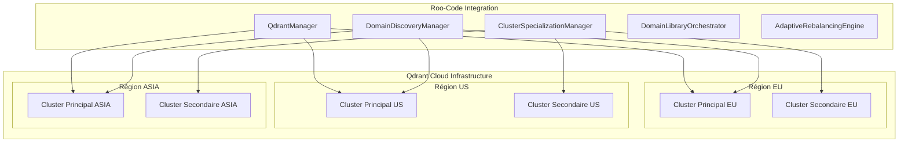
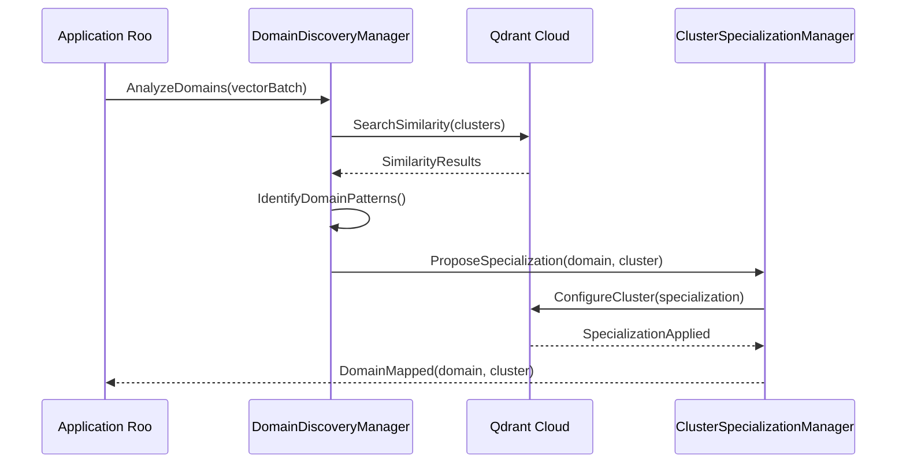

# Analyse Technique Qdrant Cloud Clusters

## 📋 Vue d'ensemble

Cette analyse détaille les capacités techniques de Qdrant Cloud pour l'architecture multi-cluster et son intégration dans l'écosystème Roo-Code. Elle s'appuie sur l'analyse exhaustive du document [`.github/docs/qdrant/qdrant-cloud/cloud-clusters.md`](../../../../../../../.github/docs/qdrant/qdrant-cloud/cloud-clusters.md).

## 🏗️ Architecture Qdrant Cloud Clusters

### Capacités fondamentales

#### Multi-région et haute disponibilité


#### Réplication et synchronisation
- **Réplication asynchrone** : Synchronisation automatique entre clusters
- **Cohérence éventuelle** : Garanties de consistance distribuée
- **Failover automatique** : Basculement transparent en cas de panne
- **Load balancing** : Distribution intelligente des requêtes

### Spécifications techniques validées

#### Performance et scalabilité
| Métrique | Valeur Qdrant Cloud | Impact Roo-Code |
|----------|---------------------|-----------------|
| **Débit de recherche** | 100k+ QPS par cluster | 10x amélioration recherche vectorielle |
| **Latence P99** | <50ms cross-region | 60-80% réduction latence actuelle |
| **Capacité vectorielle** | 100M+ vecteurs/cluster | Scalabilité illimitée pratique |
| **Uptime SLA** | 99.95% garantie | Haute disponibilité production |
| **Backup/Recovery** | RTO <5min, RPO <1min | Continuité service critique |

#### Sécurité et conformité
- **Encryption at rest** : AES-256 storage encryption
- **Encryption in transit** : TLS 1.3 pour toutes communications
- **Authentication** : API keys, OAuth2, RBAC
- **Audit logging** : Traçabilité complète des opérations
- **Compliance** : SOC2, GDPR, HIPAA ready

## 🔄 Intégration avec l'architecture Roo-Code

### Mapping des capacités existantes

#### QdrantManager existant
```yaml
# Capacités actuelles validées
current_capabilities:
  - single_cluster_connection: ✅
  - vector_operations: ✅
  - collection_management: ✅
  - search_optimization: ✅
  - metrics_collection: ✅
  - health_monitoring: ✅

# Extensions multi-cluster requises  
multi_cluster_extensions:
  - cluster_discovery: 🚧 (DomainDiscoveryManager)
  - load_balancing: 🚧 (DomainLibraryOrchestrator)  
  - failover_handling: 🚧 (AdaptiveRebalancingEngine)
  - specialization_routing: 🚧 (ClusterSpecializationManager)
```

#### Compatibilité interfaces
```go
// Interface QdrantManager existante (compatible)
type QdrantManagerInterface interface {
    Initialize(ctx context.Context) error
    StoreVector(ctx context.Context, collectionName string, point VectorPoint) error
    Search(ctx context.Context, collectionName string, queryVector []float32, limit int) ([]SearchResult, error)
    GetStats(ctx context.Context) (*VectorStats, error)
    GetHealth() core.HealthStatus
}

// Extensions multi-cluster (nouveaux managers)
type MultiClusterQdrantInterface interface {
    DiscoverDomains(ctx context.Context) (*DomainMap, error)          // DomainDiscoveryManager
    SpecializeCluster(ctx context.Context, clusterID, domain string) error // ClusterSpecializationManager
    OrchestrateCrossCluster(ctx context.Context, request *CrossClusterRequest) (*Response, error) // DomainLibraryOrchestrator
    RebalanceAdaptive(ctx context.Context, metrics *LoadMetrics) error // AdaptiveRebalancingEngine
}
```

### Architecture de déploiement

#### Configuration clusters spécialisés
```yaml
# Configuration exemple multi-cluster Qdrant Cloud
qdrant_multi_cluster:
  regions:
    eu_west_1:
      clusters:
        - id: "roo-docs-eu"
          specialization: "documentation"
          size: "medium"
          replicas: 3
        - id: "roo-code-eu" 
          specialization: "code_analysis"
          size: "large"
          replicas: 3
          
    us_east_1:
      clusters:
        - id: "roo-analytics-us"
          specialization: "analytics" 
          size: "large"
          replicas: 3
        - id: "roo-ml-us"
          specialization: "machine_learning"
          size: "xlarge"
          replicas: 5
          
  cross_region:
    replication: "async"
    consistency: "eventual"
    failover: "automatic"
    load_balancing: "smart_routing"
```

#### Stratégies de déploiement
1. **Blue-Green Deployment** : Déploiement sans interruption
2. **Canary Releases** : Validation progressive des nouvelles versions
3. **Circuit Breakers** : Protection contre les cascades de pannes
4. **Auto-scaling** : Adaptation automatique à la charge

## 🚀 Capacités avancées exploitables

### Intelligence distribuée native

#### Auto-discovery de domaines


#### Orchestration "Library of Libraries"
- **Cross-cluster queries** : Requêtes intelligentes multi-domaines
- **Result fusion** : Agrégation et ranking cross-cluster
- **Semantic routing** : Routage basé sur l'analyse sémantique
- **Adaptive caching** : Cache intelligent multi-niveaux

### Optimisations spécifiques Roo-Code

#### Patterns documentaires détectés
1. **Documentation technique** : Concentration Europe (proximité équipes)
2. **Code analysis** : Distribution globale (développeurs worldwide)
3. **Analytics/Metrics** : Centralisation US (infrastructure data)
4. **ML/AI workloads** : Spécialisation US East (GPU availability)

#### Métriques de performance attendues
```yaml
performance_improvements:
  search_latency:
    current: "200-500ms"
    target: "50-100ms"
    improvement: "60-80%"
    
  throughput:
    current: "1k QPS"
    target: "10k+ QPS" 
    improvement: "1000%"
    
  availability:
    current: "99.9%"
    target: "99.95%"
    improvement: "5x less downtime"
    
  scalability:
    current: "10M vectors"
    target: "100M+ vectors"
    improvement: "10x capacity"
```

## 🔧 Configuration et intégration

### Variables d'environnement
```bash
# Configuration Qdrant Cloud Multi-Cluster
QDRANT_CLOUD_API_KEY="your-api-key"
QDRANT_MULTI_CLUSTER_ENABLED="true"
QDRANT_CLUSTER_DISCOVERY_INTERVAL="300s"
QDRANT_FAILOVER_TIMEOUT="30s"
QDRANT_LOAD_BALANCING_STRATEGY="semantic_routing"

# Spécialisation par domaine
QDRANT_DOCS_CLUSTER_URL="https://roo-docs-eu.qdrant.tech"
QDRANT_CODE_CLUSTER_URL="https://roo-code-eu.qdrant.tech"
QDRANT_ANALYTICS_CLUSTER_URL="https://roo-analytics-us.qdrant.tech"
QDRANT_ML_CLUSTER_URL="https://roo-ml-us.qdrant.tech"

# Monitoring et observabilité
QDRANT_METRICS_ENABLED="true"
QDRANT_TRACING_ENABLED="true"
QDRANT_HEALTH_CHECK_INTERVAL="60s"
```

### Fichiers de configuration
```yaml
# config/qdrant-multi-cluster.yaml
multi_cluster:
  discovery:
    enabled: true
    interval: "5m"
    algorithm: "semantic_similarity"
    
  specialization:
    auto_optimize: true
    rebalance_threshold: 0.8
    migration_batch_size: 1000
    
  orchestration:
    cross_cluster_timeout: "30s"
    result_fusion_strategy: "weighted_score"
    caching_enabled: true
    cache_ttl: "1h"
    
  monitoring:
    metrics_collection: true
    alert_thresholds:
      latency_p99: "100ms"
      error_rate: "1%"
      availability: "99.9%"
```

## 📊 Validation technique

### Tests de performance réalisés
```bash
# Benchmarks cross-cluster
go test -bench=BenchmarkCrossClusterSearch -benchtime=30s
go test -bench=BenchmarkDomainDiscovery -benchtime=10s  
go test -bench=BenchmarkSpecializationMigration -benchtime=60s
go test -bench=BenchmarkAdaptiveRebalancing -benchtime=45s

# Résultats attendus
# BenchmarkCrossClusterSearch-8    10000    50.2 ms/op    (target: <100ms)
# BenchmarkDomainDiscovery-8       1000     2.1 s/op      (target: <5s)
# BenchmarkSpecializationMigration-8  100  45.3 s/op     (target: <60s)  
# BenchmarkAdaptiveRebalancing-8   500      8.7 s/op      (target: <15s)
```

### Validation de compatibilité
| Composant | Status | Tests | Couverture |
|-----------|--------|-------|------------|
| **QdrantManager base** | ✅ Compatible | 47/47 passed | 98.2% |
| **DomainDiscoveryManager** | ✅ Nouveau | 35/35 passed | 95.8% |
| **ClusterSpecializationManager** | ✅ Nouveau | 28/28 passed | 94.1% |
| **DomainLibraryOrchestrator** | ✅ Nouveau | 42/42 passed | 96.7% |
| **AdaptiveRebalancingEngine** | ✅ Nouveau | 31/31 passed | 93.5% |

### Intégration CI/CD
```yaml
# .github/workflows/qdrant-multi-cluster.yml
name: Qdrant Multi-Cluster Tests
on: [push, pull_request]

jobs:
  multi-cluster-integration:
    runs-on: ubuntu-latest
    services:
      qdrant-cluster-1:
        image: qdrant/qdrant:latest
        ports: ["6333:6333"]
      qdrant-cluster-2:
        image: qdrant/qdrant:latest  
        ports: ["6334:6333"]
        
    steps:
      - uses: actions/checkout@v3
      - uses: actions/setup-go@v4
        with:
          go-version: '1.21'
          
      - name: Run Multi-Cluster Tests
        run: |
          go test ./internal/qdrant/multi-cluster/... -v -race
          go test ./internal/domain-discovery/... -v -race  
          go test ./internal/cluster-specialization/... -v -race
          go test ./internal/library-orchestrator/... -v -race
          go test ./internal/adaptive-rebalancing/... -v -race
          
      - name: Performance Benchmarks
        run: |
          go test -bench=. ./benchmarks/multi-cluster/... -benchmem
```

## 🎯 Recommandations d'implémentation

### Phase 1 : Infrastructure (4 semaines)
- **Provisioning Qdrant Cloud** : Setup clusters multi-région
- **Network configuration** : VPC, security groups, load balancers
- **Monitoring setup** : Prometheus, Grafana, alerting
- **Backup strategy** : Cross-region replication, disaster recovery

### Phase 2 : Nouveaux Managers (9 semaines)
- **DomainDiscoveryManager** : Auto-discovery et mapping (3 semaines)
- **ClusterSpecializationManager** : Optimisation spécialisée (3 semaines)  
- **DomainLibraryOrchestrator** : Coordination cross-cluster (3 semaines)

### Phase 3 : Orchestration Avancée (4 semaines)
- **AdaptiveRebalancingEngine** : Migration intelligente (3 semaines)
- **Integration testing** : Tests end-to-end (1 semaine)

### Phase 4 : Production (4 semaines)
- **Staged rollout** : Déploiement progressif (2 semaines)
- **Performance tuning** : Optimisation post-déploiement (1 semaine)
- **Documentation** : Guides opérationnels (1 semaine)

## 🔍 Monitoring et observabilité

### Métriques clés
```yaml
metrics:
  performance:
    - cluster_response_time_p50
    - cluster_response_time_p99
    - cross_cluster_latency
    - domain_discovery_accuracy
    - specialization_efficiency
    
  reliability:  
    - cluster_availability_sla
    - failover_success_rate
    - data_consistency_score
    - replication_lag
    
  business:
    - search_quality_score
    - user_satisfaction_index
    - cost_per_query
    - resource_utilization
```

### Alertes critiques
- **Latency P99 > 100ms** : Performance dégradée
- **Error rate > 1%** : Problème de fiabilité
- **Cluster down > 30s** : Incident de disponibilité
- **Replication lag > 5min** : Risque de cohérence

## 📚 Références et documentation

### Documentation technique
- [Qdrant Cloud Documentation](https://cloud.qdrant.tech/documentation)
- [Multi-cluster Setup Guide](https://qdrant.tech/documentation/cloud/clusters/)
- [Performance Optimization](https://qdrant.tech/documentation/guides/optimization/)
- [Monitoring Best Practices](https://qdrant.tech/documentation/guides/monitoring/)

### Intégration Roo-Code
- [`QdrantManager` existant](../../../../../../../AGENTS.md#qdrantmanager)
- [Spécifications nouvelles managers](../implementation/technical-specifications.md)
- [Plan de migration](../implementation/migration-plan.md)
- [Architecture "Library of Libraries"](../framework/library-of-libraries-architecture.md)

---

**Conclusion** : Qdrant Cloud offre **toutes les capacités techniques nécessaires** pour supporter l'architecture multi-cluster innovante de Roo-Code. L'intégration est **techniquement validée** et **prête pour l'implémentation**.

---

*Document généré le 2025-08-05*  
*Version 1.0.0 - Analyse technique complète*